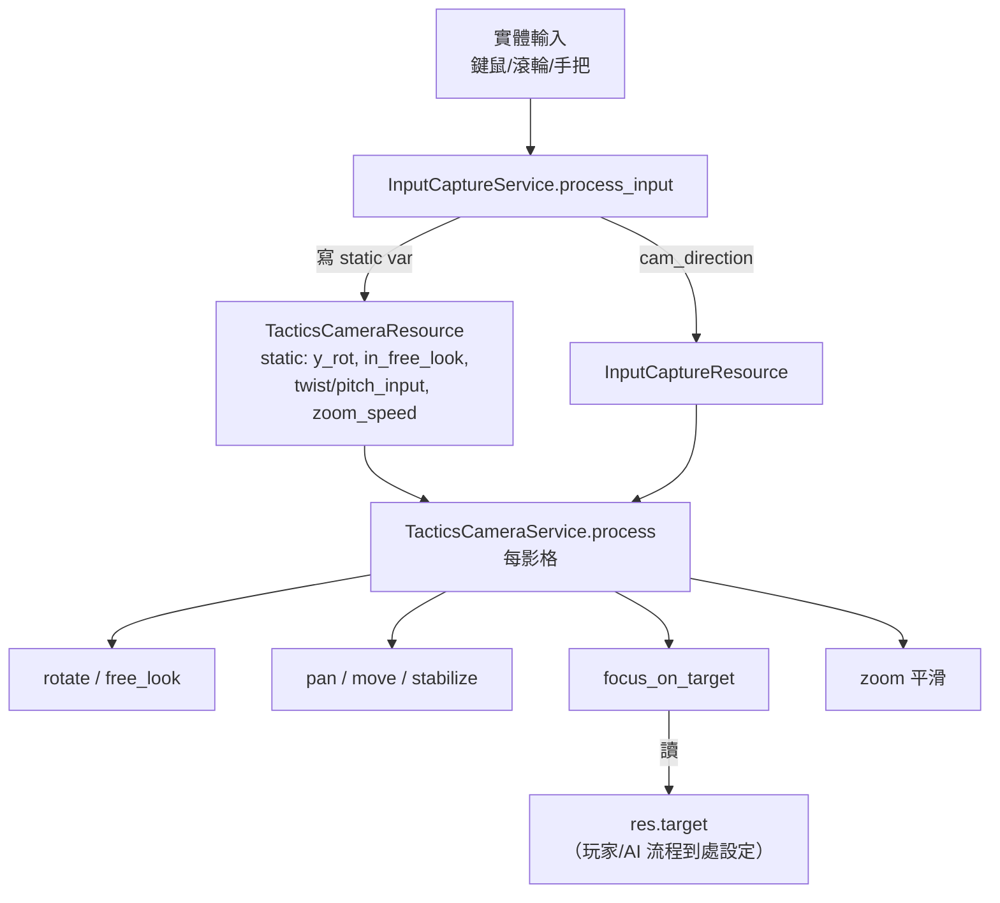

# Level 3 — 攝影機系統與輸入處理

> 路徑相對於 `projects/godot-tactical-rpg/`。攝影機是本範本最完整、最「成品級」的子系統（README 特別強調 advanced camera）。

攝影機支援五種行為：**平移（WASD）、邊緣捲動（滑鼠貼邊）、自由視角（中鍵/右搖桿）、定點旋轉（Q/E 或方塊鍵）、縮放（滾輪）**，外加程式觸發的**聚焦目標（follow）**。全部支援鍵鼠與手把雙模式。

---

## 1. 攝影機節點結構與三軸樞紐

`TacticsCamera extends CharacterBody3D`（`data/modules/tactics/camera/camera.gd`）。節點層級（`camera.gd:22-26`）：

```
TacticsCamera (CharacterBody3D)        ← 平移在這層（move_and_slide）
└── TwistPivot (Node3D)                ← 水平旋轉（yaw，繞 Y）
    └── PitchPivot (Node3D)            ← 俯仰（pitch，繞 X）
        └── Camera3D                   ← 縮放在這層（改 fov）
```

把「平移 / 水平轉 / 俯仰 / 縮放」分到不同節點，各自獨立互不干擾，是這套相機乾淨的關鍵。

`TacticsCameraService.process`（`service/t_cam_serv.gd:38-59`）每影格依序處理：旋轉/自由視角 → 平移（WASD / 邊緣 / 穩定） → 速度歸零 → 聚焦目標 → 縮放平滑。

---

## 2. 五種攝影機行為

| 行為 | 觸發 | service | 機制重點 |
|---|---|---|---|
| **WASD 平移** | 鍵盤 WASD / 左搖桿 | `pan.wasd_pan` → `move.move_camera` | 依當前 yaw 旋轉方向向量，速度 lerp 平滑（`service/movement.gd:22`） |
| **邊緣捲動** | 滑鼠貼近視窗邊緣 | `pan.edge_pan` | 檢測滑鼠座標是否在 `border_pan_px_threshold` 內（`service/panning.gd:63-76`），有 `PANNING_DELAY` 防誤觸 |
| **定點旋轉** | Q/E 或手把 LB/RB | `rotate.add_angle_to_horiz_rotation` + `rotate_camera` | yaw 每次 ±90°（`input/capture/service/service.gd:41-44`），用 Quaternion `slerp` 平滑轉到目標角（`service/rotation.gd:30-45`） |
| **自由視角** | 中鍵按住 / 右搖桿 | `rotate.free_look` | 滑鼠/搖桿相對量直接轉 pivot；pitch clamp 在 `[-45°, +20°]`（`service/rotation.gd:112-115`） |
| **縮放** | 滾輪 | `zoom.zoom_camera` | 改 `Camera3D.fov`（非位移），目標 fov clamp 在 `[min_zoom, max_zoom]`，lerp 平滑（`service/zoom.gd:15-23`） |
| **聚焦目標** | 程式設 `res.target` | `move.focus_on_target` | 每影格把相機推向 target，抵達(<0.25)後自動清 target（`service/movement.gd:52-74`） |

### 自由視角結束時的「象限吸附」
放開中鍵時 `deactivate_free_look`（`rotation.gd:66`）會呼叫 `snap_to_nearest_quadrant`（`rotation.gd:132`）：用 Tween 把 yaw 平滑吸附到最近的 45°/135°/225°/315° 之一，避免相機停在歪斜角度。這是讓「自由轉完仍維持等角視角」的細節。

### 平移邊界（boundary）
相機被限制在以 `boundary_center` 為圓心、`boundary_radius` 為半徑的球內（`service/movement.gd:42-46`、`focus_on_target` 同理）。半徑由 `TacticsLevel.camera_boundary_radius`（預設 10）在 `_ready` 時寫入 camera resource（`tactics_level.gd:44-45`）。`boundary_center` 初始化為相機起始位置（`camera.gd:32`）。

---

## 3. 輸入捕捉與裝置分流

### 滑鼠座標 → 3D 物件：射線投影
拾取 tile/pawn 的核心是 `InputCaptureService.project_mouse_position`（`data/models/view/control/input/capture/service/service.gd:95-111`）：
```gdscript
var from = camera.project_ray_origin(滑鼠座標)
var to   = from + camera.project_ray_normal(滑鼠座標) * RAY_LENGTH
var collider = world_3d.direct_space_state.intersect_ray(query, mask).collider
```
`collision_mask` 區分要打中誰：`1` = tile、`2` = pawn（見 `selection.gd:49-50`）。手把模式下射線從**畫面中央**發射（`service.gd:100`），所以手把是「準星固定在中央、移動相機來瞄」。

### 鍵鼠 vs 手把切換
`TacticsControlsInputService.handle_input`（`control/tactics/service/input.gd:23-24`）監看每個事件：只要收到 `InputEventJoypadButton/Motion` 就把 `controls.is_joystick = true`，收到鍵鼠則回 false。據此：
- 切換游標可見性：`update_mouse_mode`（`input.gd:18`，手把模式隱藏滑鼠）。
- 切換控制提示圖：`update_controller_hints`（`ui.gd:15-19`，Xbox 圖 vs PC 圖）。
- 自由視角輸入來源、平移來源都據此分流。

### 攝影機輸入事件處理
鍵鼠/滾輪/搖桿事件集中在 `InputCaptureService.process_input`（`capture/service/service.gd:13-89`）：
- 滾輪 → `TacticsCamera.serv.zoom.zoom_camera(±zoom_speed)`。
- Q/E（`camera_rotate_left/right`）→ `TacticsCameraResource.y_rot += ±90`。
- 中鍵（`camera_free_look`）→ 設 `in_free_look`。
- 中鍵自由視角時的滑鼠相對位移 → 寫 `twist_input` / `pitch_input`。
- WASD（`CAMERA_PAN_KEYS`）→ `Input.get_vector(...)` 算出 `cam_direction`。
- 左搖桿 → `cam_direction`；右搖桿 → `right_stick_x/y`（自由視角）。

> 注意大量攝影機狀態是 **`static var`**（`t_cam_res.gd` 的 `rot_speed`、`x_rot`、`y_rot`、`in_free_look`、`is_rotating`、`twist_input`…），讓 `InputCapture`、`TacticsCamera`、各 service 不必互相持有參照即可共享相機輸入狀態。代價是全域唯一、不利多相機。

---

## 4. Input Map（`project.godot:48-158`）

| 動作 | 鍵盤 | 手把 |
|---|---|---|
| 平移 | W/A/S/D（camera_forward/backwards/left/right） | 左搖桿 |
| 旋轉 | Q（左）/ E（右） | LB / RB（button 9/10） |
| 自由視角 | 滑鼠中鍵 | 右搖桿 |
| 縮放 | 滾輪 | — |
| 確認/選擇 | Space / 滑鼠左鍵（ui_accept） | A（button 0） |
| 取消 | Esc（ui_cancel） | B（button 1） |
| 控制提示 | — | button 4（controller_hints） |

`look_*`（右搖桿軸 2/3）對應自由視角；deadzone 多設 0.2~0.5。

---

## 5. 攝影機資料流



聚焦目標（`res.target`）是攝影機與遊戲流程唯一的耦合點：回合開始看當前 pawn（`turn.gd:33`）、選棋看選中 pawn（`selection.gd:41`）、選落點看目標格（`selection.gd:69`）、攻擊看攻擊者/目標（`combat.gd:40`、`opponent_service/service.gd:93`）。

---

## 6. 設計總結

- **職責分樞紐節點**：平移/yaw/pitch/zoom 分到 CharacterBody3D / TwistPivot / PitchPivot / Camera3D 四層，互不干擾。
- **五個獨立子 service**：move / pan / rotate / zoom 各管一塊，`t_cam_serv.process` 當編排者。
- **static var 當輕量全域狀態匯流排**：相機輸入跨 InputCapture / Camera / service 共享，省去參照傳遞。
- **鍵鼠/手把全程雙模**：靠 `is_joystick` 一個旗標在游標、提示圖、射線起點、輸入來源四處分流。
- **象限吸附 + fov 縮放 + 球形邊界**是讓它「像成品」而非陽春相機的三個收尾細節。
