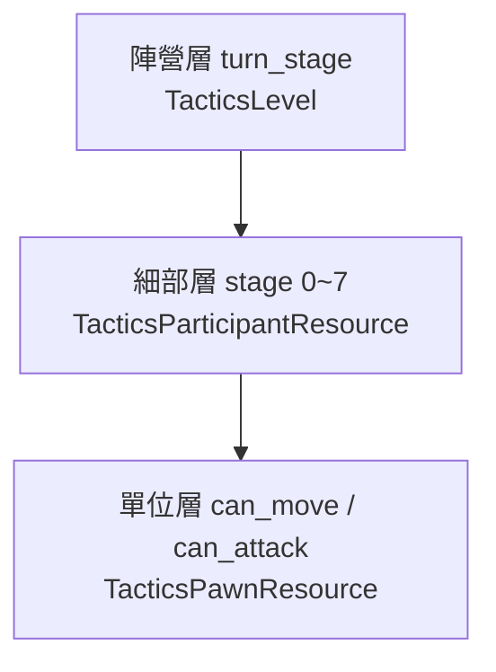
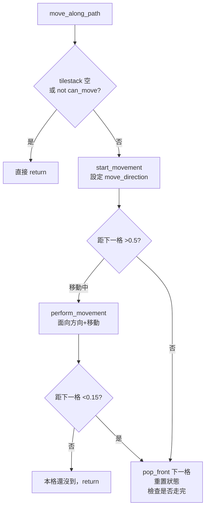
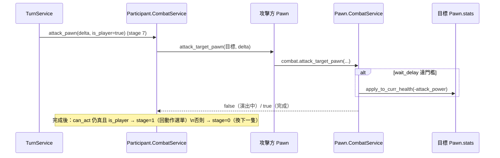

# Level 3 — 回合制流程、移動物理與戰鬥判定

> 路徑相對於 `projects/godot-tactical-rpg/`。前置：`level2_core_modules.md` 第 2、3 節（stage 機）。

本篇深入三件事：(1) 回合如何在 stage 之間推進與重置；(2) pawn 怎麼「沿路徑」實際移動（含跳躍/落下物理）；(3) 攻擊傷害如何結算。

---

## 1. 回合的三個層次

戰棋的回合在本專案被切成三個嵌套層次：



| 層 | 變數 | 位置 | 語意 |
|---|---|---|---|
| 陣營層 | `turn_stage`（0/1） | `tactics_level.gd:24` | 初始化 vs 處理；處理中決定「現在輪到玩家還是對手」 |
| 細部層 | `stage`（0~7） | `particpt_res.gd:28` | 當前這一方正在做的具體動作步驟 |
| 單位層 | `can_move`/`can_attack` | `pawn_res.gd:24-25` | 每隻 pawn 本回合是否還能移動/攻擊 |

### 一個完整回合的生命週期

1. **判斷輪到誰**（`tactics_level.gd::_handle_turn:60`）：
   - `participant.can_act(player)` 為真（玩家還有 pawn 能動）→ 玩家行動。
   - 否則 `can_act(opponent)` 為真 → 對手行動。
   - 兩者皆否 → `player.reset_turn()` + `opponent.reset_turn()`，所有 pawn 恢復 `can_move=can_attack=true`（`turn.gd::reset_turn:83`），新回合開始。
2. `can_act(parent)`（`turn.gd:73`）= 該陣營任一 pawn `can_act()` 為真。
3. 單位耗盡行動：`end_pawn_turn`（`pawn_res.gd:51`）把 `can_move=can_attack=false` 並 emit `turn_ended`。

> 這是**「整隊行動制」**：玩家一隻一隻操作完所有 pawn（每隻可移動＋攻擊各一次），再換 AI 把它的 pawn 全部跑完。沒有速度/敏捷決定的個別行動順序。

---

## 2. 玩家側 stage 推進細節

玩家的 stage 由「玩家輸入」與「動作完成」共同推進。關鍵跳轉散落在 `selection.gd`：

| 觸發 | 程式位置 | stage 變化 |
|---|---|---|
| 滑鼠點選自己能動的 pawn | `selection.gd::select_pawn:44` | 0 → 1 |
| 按「Move」按鈕 | `selection.gd::player_wants_to_move:90` | 1 → 2 |
| 點選 reachable 落點 | `selection.gd::select_new_location:67` | 3 → 4（寫入 tilestack） |
| 移動完成（tilestack 空） | `player_service/service.gd::move_pawn:97` | 4 → 1（還能攻擊）或 0 |
| 按「Attack」按鈕 | `selection.gd::player_wants_to_attack:119` | → 5 |
| 點選 attackable 目標 | `selection.gd::select_pawn_to_attack:84` | 6 → 7 |
| 攻擊結算完成 | `combat.gd::attack_pawn:49` | 7 → 1（還能動）或 0 |
| 按「Wait」 | `selection.gd::player_wants_to_wait:104` | end_pawn_turn → 0 |
| 按「Cancel」 | `selection.gd::player_wants_to_cancel:97` | 倒退一階 |
| 按「Skip turn」 | `turn.gd::skip_turn:92` | 全隊 end_pawn_turn → 0 |

動作選單（Move/Attack 按鈕）的可用性由 `set_actions_menu_visibility`（`ui.gd:23-34`）依 `p.res.can_move` / `p.res.can_attack` 動態 enable/disable，所以「已移動過就不能再移動，但還能攻擊」這種規則是天然成立的。

> stage 2 與 4 是玩家流程中的「等待態」：stage 2 標完藍格後立刻把 stage 設成 3（`player_service/service.gd:75`）等玩家點；stage 4 反覆檢查 tilestack 是否清空。

---

## 3. pawn 沿路徑移動：含跳躍與落下的物理

**核心**：`TacticsPawnMovementService.move_along_path`（`data/models/world/combat/participant/pawn/service/movement.gd:21-36`）

每物理影格做一次（由 `pawn_serv.process` → `movement.move_along_path` 呼叫）：



子步驟：
- **方向計算** `start_movement`（`movement.gd:42`）：`move_direction = 下一格座標 - 當前座標`。
- **轉向** `look_at_direction`（`movement.gd:10`）：把方向「貼齊四方向之一」（取 x、z 較大者）再算出朝向角，因此 pawn 只面向上下左右四向。
- **速度與跳躍** `calculate_velocity` / `calculate_speed`（`movement.gd:67-92`）：
  - 一般水平移動：速度 = `walk_speed`（預設 8，`tactics_config.gd:29`）。
  - **往上跳**（`move_direction.y > MIN_HEIGHT_TO_JUMP`，即上一格比較高）：速度依高度差放大 `clamp(abs(Δy)*2.3, 3, INF)`，並設 `is_jumping=true`（觸發 JUMP 動畫）。
  - **往下落**（`move_direction.y < -MIN_HEIGHT_TO_JUMP`）：靠近落點水平位置後，累加重力 `gravity += DOWN * delta * GRAVITY_STRENGTH`（強度 6）讓 pawn 自然墜落。
- **抵達判定**：與下一格水平距離 < 0.15 視為到位，`pop_front` 取下一格；tilestack 清空後 `check_movement_completion`（`movement.gd:108`）把 pawn 對齊到 tile 正中心（`adjust_to_center`）。

常數來源：`TacticsPawnResource`（`pawn_res.gd:13-19`）的 `MIN_HEIGHT_TO_JUMP=1`、`GRAVITY_STRENGTH=6`、`MIN_TIME_FOR_ATTACK=1.0`。其中 `GRAVITY_STRENGTH=6` 是 commit `0b88379 fix: set GRAVITY_STRENGTH = 6` 為了修「unit falls through tile」（commit `9c4689b`）而調整的。

---

## 4. 攻擊與傷害結算

**核心**：`TacticsPawnCombatService.attack_target_pawn`（`data/models/world/combat/participant/pawn/service/combat.gd:12-35`）

```gdscript
func attack_target_pawn(pawn, target_pawn, delta):
    pawn.serv.movement.look_at_direction(pawn, 目標方向)         # 面向目標
    if pawn.res.can_attack and pawn.res.wait_delay > MIN_TIME_FOR_ATTACK/4.0:
        target_pawn.stats.apply_to_curr_health(-pawn.stats.attack_power)  # ← 傷害公式
        pawn.res.set_attacking(false)                            # 標記攻擊已出手
    if pawn.res.wait_delay < MIN_TIME_FOR_ATTACK:
        pawn.res.wait_delay += delta
        return false                                             # 攻擊動畫仍進行中
    pawn.res.wait_delay = 0.0
    return true                                                  # 攻擊完成
```

- **傷害公式極簡**：`目標 curr_health += (-攻擊者 attack_power)`，無防禦、無命中率、無暴擊、無屬性克制（`Stats.apply_to_curr_health:50`，clamp 在 0~max_health）。
  - 因為是 `apply_to_curr_health`，傳正數即治療、負數即傷害——同一函式兼做傷害與補血。
- **時序**：`wait_delay` 計時器讓攻擊有一段「演出延遲」——在 `MIN_TIME_FOR_ATTACK/4`（=0.25s）時真正扣血，累計到 `MIN_TIME_FOR_ATTACK`（=1s）才回傳 `true` 結束 stage 7。回傳 false 時上層（`combat.gd::attack_pawn` participant 版）會 `return` 等下一影格再來。
- **無可攻擊目標**：`participant 的 combat.gd::attack_pawn:32` 若 `attackable_pawn` 為 null，直接把 `curr_pawn.res.can_attack=false`（視為放棄攻擊）。

### 死亡處理（隱含）
本範本**沒有顯式的 pawn 死亡/移除流程**。`is_alive()`（`pawn.gd:61`）= `curr_health > 0`；血量歸零的 pawn 只是 `can_act()` 變 false（不再被選中行動），並由 HUD service 把它**灰階**顯示，但節點仍留在場上、仍可能擋路（`is_taken()` 仍為真）。沒有勝負判定。

---

## 5. 攻擊結算的呼叫鏈（玩家 stage 7）



---

## 6. 設計總結

- **stage 整數 = 隱式狀態機**：沒有用 Godot 的狀態機節點，整局靠 `participant.stage` 一個 int 在 service 間傳遞推進。
- **玩家/AI 共用同一套 stage、不同 handler**：`handle_player_turn` 走 0~7 由輸入驅動；`handle_opponent_turn` 走 0~4 自動完成（見 `level3_enemy_ai.md`）。
- **移動是「逐格趨近 + 物理 move_and_slide」**，不是瞬移或 tween；跳躍/落下用真實重力，因此地形高低差有實感。
- **戰鬥刻意極簡**（單一傷害值、無死亡移除、無勝負），是讓使用者自行擴充的留白點。
