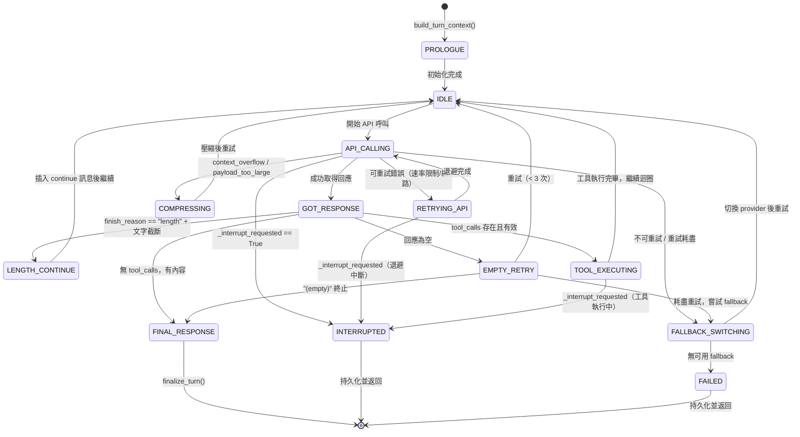

# SDK 設計角度深度剖析 hermes-agent 對話迴圈

> 核對於 2026-06-12，基於原始碼直接讀取。

本文以「想從零打造自己的 AI agent SDK」的**建造者視角**分析 hermes-agent 的對話迴圈設計，重點在於可複製的設計模式、必要抽象，以及非顯而易見的決策。

---

## 1. 最小狀態機設計

### 迴圈狀態集合

`run_conversation` 並非顯式狀態機（沒有枚舉態），但透過一系列 **局部旗標** 隱式表達狀態。下列是還原出的狀態分類：

**必要狀態（任何 agent SDK 都需要）：**
- `IDLE`：等待 API 回應
- `TOOL_EXECUTING`：正在執行工具
- `FINAL_RESPONSE`：收到無 tool_calls 的回應，準備退出
- `INTERRUPTED`：收到外部中斷訊號
- `FAILED`：不可恢復的錯誤

**hermes-agent 特有的過渡狀態：**
- `LENGTH_CONTINUE`：回應被截斷（finish\_reason = "length"），需要繼續請求
- `RETRYING_API`：API 暫時失敗（速率限制、網路錯誤），正在退避
- `COMPRESSING`：上下文超長，觸發歷史壓縮
- `FALLBACK_SWITCHING`：切換到備用 provider

### Mermaid 狀態圖



### 哪些狀態是必要的、哪些是特有的？

**最小必要集合（4 個）：** `IDLE`、`TOOL_EXECUTING`、`FINAL_RESPONSE`、`INTERRUPTED/FAILED`。

**hermes-agent 額外引入的（出於生產健壯性）：** `LENGTH_CONTINUE`、`RETRYING_API`、`COMPRESSING`、`FALLBACK_SWITCHING`、`EMPTY_RETRY`。這些都可以省略，但缺少後果是：在截斷、速率限制、上下文超限時直接失敗而非自癒。

---

## 2. Tool Call Loop 的核心不變量

### 不變量 1：每個 tool\_call\_id 必須對應恰好一個 tool role 訊息

若 LLM 回傳 N 個 tool\_calls，則 messages 中必須有 N 個 `role=tool` 訊息，且 `tool_call_id` 一一對應。hermes-agent 在三個地方強制此不變量：

1. **中斷時的 stub 填充**（`tool_executor.py:785-789`）：
   ```python
   for skipped_tc in remaining_calls:
       messages.append(make_tool_result_message(
           skipped_name,
           f"[Tool execution cancelled — {skipped_name} was skipped due to user interrupt]",
           skipped_tc.id,
       ))
   ```

2. **外層 except 的孤兒填充**（`conversation_loop.py:4184-4205`）：當迴圈崩潰時，掃描最後一個帶 tool\_calls 的 assistant 訊息，為尚未回答的 tool\_call\_id 補入錯誤結果。

3. **`_sanitize_api_messages` 預發送清洗**（`conversation_loop.py:696`）：每次 API 呼叫前，移除孤兒 tool result 或為缺少 result 的 tool\_call 補入 stub。

**SDK 建議：** 這個不變量是最容易在邊角情況下被破壞的。必須在三個地方防守：中斷路徑、例外路徑、以及每次 API 呼叫前的預發送清洗。

### 不變量 2：role 序列不可連續出現同 role

`user → user` 或 `tool → user` 序列會讓多數 provider 拒絕請求。hermes-agent 透過 `_repair_message_sequence`（`conversation_loop.py:598-604`）在每次 API 呼叫前自動修復。

### 不變量 3：system prompt 在整個 session 內 byte-stable

為了讓 Anthropic 等 provider 的 KV cache 命中，system prompt **在一個 session 內必須逐字節相同**。hermes-agent 以 `_cached_system_prompt` 快取並在 session DB 中持久化（`conversation_loop.py:274-337`）。Plugin 上下文注入到 **user 訊息**，而非 system prompt，就是這個原因。

### 不變量 4：截斷的 tool\_call arguments 不能被執行

當 finish\_reason = "length" 且有 tool\_calls 時，arguments JSON 可能不完整。hermes-agent 以兩種方式檢測：
- `finish_reason == "length" + tool_calls` → 直接重試（`conversation_loop.py:1471-1534`）
- Arguments 字串不以 `}` 或 `]` 結尾 → 視為截斷，拒絕執行（`conversation_loop.py:3586-3608`）

---

## 3. 串流（Streaming）與中斷（Interrupt）的整合點

### 串流接入點

hermes-agent 始終優先使用串流路徑，即使沒有顯示消費者（`conversation_loop.py:958-999`）：

```python
# Always prefer the streaming path — even without stream consumers.
# Streaming gives us fine-grained health checking (90s stale-stream detection,
# 60s read timeout) that the non-streaming path lacks.
_use_streaming = True
```

串流 API 呼叫由 `_interruptible_streaming_api_call` 處理。`stream_callback` 是外部消費者接入點（TTS 等），透過 `run_conversation` 的參數傳入（`conversation_loop.py:371-397`）。中斷到達時，串流呼叫透過 `InterruptedError` 例外路徑乾淨地退出（`conversation_loop.py:1723-1734`）。

### 中斷機制設計

中斷是**多層次的**，需要同時打到多個執行緒：

```
agent.interrupt(message)
  ├── 設置 agent._interrupt_requested = True     (主迴圈檢查)
  ├── _set_interrupt(True, execution_thread_id)   (工具內部的 is_interrupted() 輪詢)
  └── for worker_tid in _tool_worker_threads:     (並行工具的 worker thread)
        _set_interrupt(True, worker_tid)
```

（`run_agent.py:2302-2342`）

中斷的**清潔停止保證**：
1. 迴圈頂部在每次迭代開始前檢查 `_interrupt_requested`（`conversation_loop.py:467-471`）
2. 退避等待中每 0.2 秒輪詢一次（`conversation_loop.py:3243-3255`）
3. 並行工具等待中每 5 秒輪詢一次，並對未啟動的 future 呼叫 `f.cancel()`（`tool_executor.py:591-604`）
4. Worker thread 在 `finally` 中清理自己的 interrupt 位元（`tool_executor.py:535-543`），確保 thread pool 的下一個任務取得乾淨狀態

**資源洩漏防護：** 即使中斷發生，也必須為所有 tool\_call\_id 填入 cancelled stub（`tool_executor.py:253-261`），否則違反不變量 1，下一個繼續會話的 API 呼叫會收到序列錯誤。

---

## 4. 錯誤分類與退避策略

### 分類器架構

`error_classifier.py` 是集中式分類器，輸入例外物件，輸出 `ClassifiedError` dataclass（含 `reason: FailoverReason` 和三個布林恢復提示）：

```python
@dataclass
class ClassifiedError:
    reason: FailoverReason
    retryable: bool          # 是否值得用同一 provider 重試
    should_compress: bool    # 是否需要壓縮上下文
    should_rotate_credential: bool  # 是否輪換憑證
    should_fallback: bool    # 是否切換 provider
```

（`error_classifier.py:69-89`）

### 分類優先級管道（8 層）

```
1. 特定模式優先（content_policy、thinking signature、llama.cpp grammar）
2. HTTP 狀態碼分類
3. 結構化 error_code 分類
4. 訊息字串 pattern matching
5. SSL/TLS 暫態模式
6. server disconnect + 大 session → context_overflow
7. 傳輸層例外類型
8. unknown（預設可重試）
```

（`error_classifier.py:441-741`）

### 可重試 vs 致命錯誤

| 情況 | FailoverReason | retryable | 行為 |
|------|----------------|-----------|------|
| HTTP 429 速率限制 | `rate_limit` | True | 指數退避 + 嘗試 fallback |
| HTTP 402 計費耗盡（確定） | `billing` | False | 立即 fallback 或終止 |
| HTTP 401/403 認證 | `auth` | False | 嘗試憑證刷新，否則終止 |
| 上下文超長 | `context_overflow` | True | 壓縮歷史後重試 |
| 內容政策封鎖 | `content_policy_blocked` | False | fallback 或終止（每次相同） |
| 網路逾時 | `timeout` | True | 重試 |
| 未知錯誤 | `unknown` | True | 退避重試 |

**關鍵設計決策**：HTTP 402 的辨義（`error_classifier.py:902-928`）——「有 usage\_limit 且有 try\_again 訊號」視為暫態速率限制，否則視為計費耗盡。這個細節如果不做，會在計費耗盡時無謂重試三次浪費錢。

### 退避邏輯

**成功路徑退避**（速率限制）：
```python
wait_time = _retry_after if _retry_after else jittered_backoff(retry_count, base_delay=2.0, max_delay=60.0)
```

**無效回應退避**（空/格式錯誤）：
```python
wait_time = jittered_backoff(retry_count, base_delay=5.0, max_delay=120.0)
```

（`conversation_loop.py:1248`、`conversation_loop.py:3226`）

兩套退避基礎延遲不同（2s vs 5s），因為空回應通常是短暫的 provider 問題，需要更長的等待。

### SDK 設計：這一層多早引入？

**答案是「第一天」**，但可以從最小版本開始：
- 最小版：retryable=True/False 的二元分類 + 指數退避
- 生產版：再加 context\_overflow 分類 + 壓縮觸發

---

## 5. SDK 最小核心建議

### 必要抽象（5 個）

**1. 迴圈骨架（`ConversationLoop`）**
```python
while api_call_count < max_iterations:
    check_interrupt()
    response = call_api(messages)          # 含 retry
    if response.tool_calls:
        execute_tools(response, messages)   # 填入 tool results
        continue                            # 再次 LLM
    else:
        return response.content             # 最終回應
```

**2. 中斷協定（`InterruptController`）**
- `interrupt()`：設旗標 + 打 worker thread interrupt 位元
- 所有等待路徑（退避、工具等待）必須輪詢此旗標

**3. 工具分派層（`ToolExecutor`）**
- 維護 tool\_call\_id → result 的映射
- 保證每個 id 恰好對應一個 result，即使中斷或崩潰也要填 stub

**4. 錯誤分類器（`ErrorClassifier`）**
- 集中化。**不要**在迴圈 body 裡散落 `if "rate limit" in str(e):`
- 最小版：retryable=True/False，可加 should\_compress、should\_fallback

**5. 訊息清洗層（`MessageSanitizer`）**
- API 呼叫前執行：修復 role 序列、補孤兒 tool result stub、正規化 JSON

### 可省略的部分（hermes-agent 有但最小 SDK 不需要）

- **Provider 備援鏈（Fallback chain）**：可以後加
- **上下文壓縮**：初期可以直接截斷歷史
- **Prompt caching 控制**：依賴 provider 自動 cache
- **Steer injection（`/steer` 指令）**：hermes-agent 特有的使用者即時引導功能
- **Budget grace call**：允許最後一次超額 API 呼叫的細粒度預算控制

---

## 6. 坑點與非顯而易見的設計決策

### 坑 1：思維塊（Thinking Block）簽章失效

Anthropic 對每個 thinking block 進行簽章，簽章基礎是「完整的 turn 內容」。任何修改——包括 context compression、session 截斷——都會讓簽章失效，返回 HTTP 400。

**hermes-agent 的解法**：在 `api_messages`（API 呼叫副本）上移除 `reasoning_details`，而非在 `messages`（canonical store）上修改（`conversation_loop.py:2252-2273`）。以前的程式碼修改 `messages`，導致持久化後每次都 400，最終進入無限壓縮-400 迴圈。

**SDK 建議**：任何需要在傳送前修改歷史的操作，都應在 `messages` 的淺複製上進行，而非 in-place 修改 canonical store。

### 坑 2：空回應（Empty Response）需要多重恢復路徑

模型回傳空內容可能有三種原因，需要不同恢復策略：

| 情況 | 原因 | 恢復 |
|------|------|------|
| 工具執行後空回應 | 弱模型（GLM-5 等）不繼續 | 注入 nudge 使用者訊息（`conversation_loop.py:3941-3958`）|
| 僅有 thinking 無文字 | 模型將思考作為 prefill | 將 assistant 訊息加入歷史後繼續（`conversation_loop.py:3975-3992`）|
| 真正空 | Provider 問題 | 直接重試 3 次，再嘗試 fallback（`conversation_loop.py:4010-4051`）|

若三種路徑混用，或順序錯誤，模型會陷入無限空回應迴圈。

### 坑 3：串流永遠優先，即使沒消費者

直覺上以為「沒有串流消費者就不需要串流」。但 hermes-agent 的邏輯是反的（`conversation_loop.py:958-966`）：

> 非串流路徑缺少「90 秒 stale-stream 偵測」和「60 秒 read timeout」。Provider 可以用 SSE 心跳保持連接存活，但永遠不發送真實內容，導致 subagent 無限 hang。

**SDK 建議**：即使沒有串流消費者，也應使用串流模式 + 健康檢查超時，而非非串流 API。

### 坑 4：`reasoning_content` 與 `reasoning` 是兩個不同的欄位

- `reasoning`：內部儲存欄位（trajectory DB）
- `reasoning_content`：API 傳送欄位（Moonshot 等 provider 要求）

hermes-agent 在建構 `api_messages` 時（`conversation_loop.py:630-635`）：
```python
agent._copy_reasoning_content_for_api(msg, api_msg)
if "reasoning" in api_msg:
    api_msg.pop("reasoning")
```

若這兩個欄位混淆，會導致 reasoning 上下文在多輪對話中遺失。

### 坑 5：工具 scope 闡明必須在 bridge unwrap 後發生

hermes-agent 有一個「Tool Search bridge」機制，允許模型透過單一工具呼叫其他工具。Scope 驗證（此 session 是否有權使用某工具）**必須在** unwrap 之後執行，否則可以透過 bridge 繞過 scope 限制（`tool_executor.py:282-313`）。

### 坑 6：退避等待不能用單一 `time.sleep(wait_time)`

hermes-agent 把退避拆成 0.2 秒小段（`conversation_loop.py:3241-3262`）：

```python
while time.time() < sleep_end:
    if agent._interrupt_requested:
        return interrupted_result
    time.sleep(0.2)
```

原因：如果使用者在退避期間送出新訊息（中斷），需要在 200 毫秒內響應。單次 `time.sleep(120)` 會讓使用者覺得系統凍結。

### 坑 7：Budget Grace Call 的語意

`_budget_grace_call` 是一個「最後機會」旗標（`conversation_loop.py:479-486`）。當 iteration budget 耗盡時，若模型此時持有未完成的工具呼叫，允許多一次 API 呼叫讓它傳回最終文字回應，而非突然截斷。不設此機制，使用者會看到工具都執行完了但沒有最終總結。

---

## 附：關鍵引用位置索引

| 主題 | 檔案 | 行範圍 |
|------|------|--------|
| 迴圈主體 while 條件 | `agent/conversation_loop.py` | L461 |
| 中斷檢查（迴圈頂） | `agent/conversation_loop.py` | L467-471 |
| API 呼叫（串流優先） | `agent/conversation_loop.py` | L958-1006 |
| finish\_reason 長度處理 | `agent/conversation_loop.py` | L1315-1564 |
| 錯誤分類呼叫點 | `agent/conversation_loop.py` | L1999-2012 |
| thinking 簽章恢復 | `agent/conversation_loop.py` | L2252-2273 |
| Tool calls 驗證與執行 | `agent/conversation_loop.py` | L3499-3731 |
| 空回應多重恢復 | `agent/conversation_loop.py` | L3842-4098 |
| 迴圈終止與收尾 | `agent/conversation_loop.py` | L4223-4241 |
| 分類器主入口 | `agent/error_classifier.py` | L441-741 |
| FailoverReason 枚舉 | `agent/error_classifier.py` | L24-64 |
| 402 辨義邏輯 | `agent/error_classifier.py` | L902-928 |
| 並行工具執行 | `agent/tool_executor.py` | L243-767 |
| interrupt() 多 thread 打 | `run_agent.py` | L2302-2342 |
| system prompt 快取恢復 | `agent/conversation_loop.py` | L225-337 |
