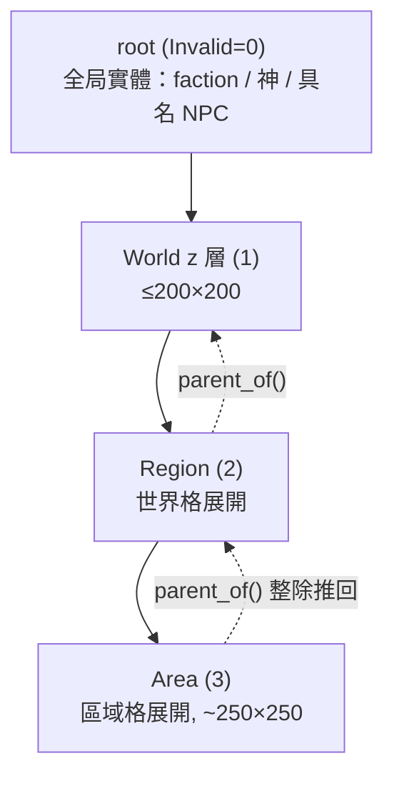

# medps — Level 2：核心設計模式

> 分析於 2026-06-01。本篇拆解 medps 核心 `gcore/` 的六個關鍵設計模式。這些正是 `derived/opennefia-cpp/` 要借鏡的「不靠反射的 C++ ECS 核心」做法。

---

## 模式一：多 registry —— 一個 zone 一個 `entt::registry`

medps 不用單一全域 registry，而是**每個 zone（地圖單位）各自一個 `entt::registry`**：

```cpp
// medps/src/gcore/global_manager.h:23
class GlobalManager {
public:
    entt::registry root;   // ZONE_ROOT，全局實體（faction / 神祇 / 具名 NPC），永遠存活
private:
    std::unordered_map<ZoneKey, std::unique_ptr<entt::registry>> loaded_;  // 已載入的 zones
};
```

- `root` 放**不屬於任何地圖**的全局實體；其餘每個載入的 zone 是 `loaded_` 裡一個獨立 registry。
- **好處**：entity id 命名空間天然隔離（zone A 的 `entity(5)` 與 zone B 的 `entity(5)` 互不干涉）；卸載一個 zone = 直接 erase 一個 `unique_ptr`，乾淨俐落。
- **代價**：跨 zone 參照不能用裸 `entt::entity`，需 `CrossZoneRef`（見模式五）。
- 此決策的取捨記於 `work/design/zone_layers.md:163`（方案 B：不合併 registry，改在儲存層合併檔案）。

---

## 模式二：`ZoneKey` —— 64-bit 自定址，parent 由整除推回

世界結構是嚴格三層巢狀（World ⊃ Region ⊃ Area）+ 一個非地圖的 root。每個 zone 用一個 64-bit key 唯一定址：

```cpp
// medps/src/gcore/zone_key.h:42-51
using ZoneKey = uint64_t;          // bits: ZoneType:16 | x:16 | y:16 | z:16
inline ZoneKey make_zone_key(ZoneType type, int16_t x, int16_t y, int16_t z);
```

- **ZoneType 兼當樹深度**（`zone_key.h:8`）：`World=1 / Region=2 / Area=3`，`Invalid=0` 即 root。一看 type 就知道它在第幾層。
- **parent 由整除推回**，不必另存（`zone_key.h:84` `parent_of`）：Area 的全局座標 ÷ `REGION_DIM` 就是它的 Region。
- **z 軸 = 垂直層**（地下 / 地面 / 天空，`zone_key.h:18`），每個 z 是獨立 zone；跨 z 走 `CrossZoneRef`，不走 parent 鏈。
- **尺度常數集中**於 `zone_scale` namespace（`zone_key.h:27`），並用 `static_assert` 保證 `WORLD_DIM·REGION_DIM < 32767` 不溢位（`zone_key.h:37`）——座標換算一律引用常數，不散落硬編碼。



---

## 模式三：序列化 —— `type_list` 單一來源 + fold expression（取代 C# 反射）

這是「沒有反射怎麼存檔」的核心答案，也是 OpenNefia C++ 重寫最該抄的一段。

**單一真實來源**：所有要存的 component 型別收成一張清單：

```cpp
// medps/src/gcore/serialize/all_components.h:13
using AllComponents = entt::type_list<
    ZoneMeta, ChildZoneSummary, CrossZoneRef,
    Position, Velocity, AreaTerrain, Blocking
>;
```

**存 / 讀**：對清單做 C++17 fold expression，配 EnTT 的 snapshot：

```cpp
// medps/src/gcore/serialize/zone_io.h:14
template<typename... Cs>
void save_impl(entt::registry& reg, output_archive& out, entt::type_list<Cs...>) {
    auto snap = entt::snapshot{reg};
    snap.get<entt::entity>(out);
    (snap.get<Cs>(out), ...);          // ← 對每個型別各存一次
}
```

讀檔對稱（`zone_io.h:20`），最後 `loader.orphans()` 清掉無 component 的孤兒實體——所以**每個 zone 都保證有一個帶 `ZoneMeta` 的 placeholder 實體**（`global_manager.cpp:45`），否則整個 zone 會被 orphans 清空。

**EnTT↔cereal 轉接**：`entt::entity` 是強型別 enum，cereal 不認得，於是有個極薄的 adapter 把它轉成底層整數：

```cpp
// medps/src/gcore/serialize/entt_cereal_archive.h:8
struct output_archive {
    cereal::PortableBinaryOutputArchive& ar;
    void operator()(entt::entity e) { ar(static_cast<entt_id_t>(e)); }
    // ...
};
```

> **與反射的對應**：C# 反射在**執行期**遍歷型別欄位；medps 改成**編譯期**遍歷型別清單。代價只是「新增 component 要在 `all_components.h` 補一行」，換來零反射、零 RTTI、可攜二進位、編譯期型別檢查。

---

## 模式四：系統 —— 自由函式 `void(registry&)` + 明確註冊（取代 Assembly 掃描）

medps 沒有 `System` 基底類別、沒有繼承、沒有自動發現。一個系統就是一個簽名固定的自由函式：

```cpp
// medps/src/gcore/systems/movement.h:11
namespace systems {
inline void movement(entt::registry& reg) {
    reg.view<Position, Velocity>().each([](Position& p, Velocity& v) {
        p.x += v.dx;  p.y += v.dy;
    });
}}
```

`GlobalManager` 用 `std::function` 收一串系統，`tick()` 對**每個載入的 zone** 依**註冊順序**跑：

```cpp
// medps/src/gcore/global_manager.h:69 / .cpp:130
using ZoneSystem = std::function<void(entt::registry&)>;
void add_zone_system(ZoneSystem sys);   // 明確註冊；順序即執行序
void tick() {                           // .cpp:130
    for (auto& [key, reg] : loaded_)
        for (auto& sys : zone_systems_) sys(*reg);
}
```

- 無反射、無自註冊宏、無依賴圖排序——執行順序就是呼叫 `add_zone_system` 的順序。
- 系統**無狀態**（只吃 `registry&`），因此 medps **完全不需要 DI 容器**——這是它繞過「C# 反射注入」難題的方式。
- 「查詢」不需自製 API：`registry.view<Position, Velocity>()` 本身就是 lister（對應 Rimworld「別掃全圖、用 lister」，`work/design/zone_layers.md:139`）。

---

## 模式五：跨 zone 參照 —— `CrossZoneRef` + `resolve()`

多 registry 的代價是裸 entity 不能跨 zone。解法是一個帶 zone 座標的弱參照：

```cpp
// medps/src/gcore/components/cross_zone_ref.h:5
struct CrossZoneRef {
    ZoneKey      zone{ZONE_ROOT};
    entt::entity local_entity{entt::null};
    // 存檔時 entt::entity 手動轉底層整數（save/load 拆開，因存讀不對稱）
};
```

解析時回報三態（`global_manager.h:15` `ZoneResolution`、`.cpp:19`）：
- `reg == nullptr`：目標 zone 沒載入。
- `reg != nullptr && !valid`：zone 載入了但 entity 已失效。
- `valid()`：可用。

`resolve()` **只查已載入的 zone，不做磁碟 IO**——載入與否是 streaming 的職責（模式六）。這對應 t-engine 的 `change_zone`（`work/design/zone_layers.md:102`）。

---

## 模式六：持久化與 streaming —— ZoneStore 抽象 + 滾動視窗

### 6.1 ZoneStore：把「registry↔bytes」與「bytes↔儲存」分離

```cpp
// medps/src/gcore/serialize/zone_store.h:15
struct ZoneStore {
    virtual void                       write(ZoneKey, const std::string&) = 0;
    virtual std::optional<std::string> read(ZoneKey) = 0;
    virtual bool                       has(ZoneKey) = 0;
    virtual void flush() {}
    virtual std::vector<ZoneKey> group_of(ZoneKey);   // 同 chunk 的 keys（預取單位）
};
```

- `zone_io` 管 registry↔bytes；`ZoneStore` 管 bytes↔儲存後端。兩者正交，可換後端。
- `FolderZoneStore`（`zone_store.h:37`）：一 zone 一檔，檔名由 key 的 16 進位推出。
- `ChunkedFolderZoneStore`（`chunked_zone_store.h:26`，**預設**）：一個 chunk 檔 = cereal `map<ZoneKey, blob>`，把多個 zone 的 blob 打包成一檔（Region 5×5÷25 減檔案數），write-through、帶記憶體快取。chunk 歸屬由整除推導（`chunk_key.h:19` `chunk_key_of`）。

### 6.2 GlobalManager 生命週期（`global_manager.cpp`）

| 方法 | 行為 |
|---|---|
| `create(key, parent)` | 新建 zone，種一個帶 `ZoneMeta` 的 placeholder，並在 parent 登記 `ChildZoneSummary` stub（冪等，`.cpp:41`） |
| `load(key)` | 從 store 讀 bytes → `zone_io::load` 還原 registry；已載入則回傳既有（`.cpp:53`） |
| `unload(key)` | `zone_io::save` 寫回 store 後從記憶體移除（`.cpp:64`） |
| `prefetch(key)` | 暖整個 storage chunk：`store_->group_of(key)` 全部 load（`.cpp:71`） |
| `stream_around(center, radius)` | 上古卷軸式 (2r+1)² 滾動視窗：載入窗內存在於磁碟的、卸載滾出窗的同層 zone（`.cpp:76`） |
| `save_all()` / `load_root()` | 整局存檔（root + 所有載入 zone）/ 開局只載 root（`.cpp:112` / `:119`） |

### 6.3 規模哲學：絕不全載

World 200×200 → 最多約 900 萬個 Area，**永遠不可能全載**。三層持久化（`work/design/zone_layers.md:115`）：

| 狀態 | 載體 | 用途 |
|---|---|---|
| 已載入 | 完整 `entt::registry` | 玩家當前 / 需精細模擬的少數 zone |
| 已卸載但存檔 | 磁碟 zone blob | 去過、可原貌還原 |
| 僅摘要 | parent 內的 `ChildZoneSummary` stub | 上百萬沒去過的 zone，跑廉價聚合模擬 |

---

## 附：組件設計慣例

- **POD aggregate + cereal 成員函式**，無基底類別、無註冊宏：對稱用 `serialize()`（`components/position.h:11`），不對稱拆 `save()/load()`（`cross_zone_ref.h`）。
- **稠密地格不要一格一 entity**：`AreaTerrain { tdarray<Tile> }` 是掛在單例「map」entity 上的 component（`components/area_terrain.h:23`），走正常 snapshot 存檔路徑。**切勿放 `registry.ctx()`**——zone_io 用 snapshot 遍歷 component，ctx 不會被帶走。
- `Tile` 快取可走 / 擋視線 flags（`area_terrain.h:8`），讓 FOV / pathing 不必每格查 terrain def。
- 會動的離散物件（actor / item / building）才是 entity；`Blocking` 做逐 entity 阻擋。

> 這套「稠密網格當 component / 動態物件當 entity」對應 Rimworld 的 grid + Things 模型（`work/design/zone_layers.md:131`），OpenNefia 的 Tile 地圖移植到 EnTT 時應照辦。

---

## 小結：medps 給 OpenNefia C++ 核心的六條藍本

1. **多 registry**：地圖單位各一 registry，id 隔離、卸載乾淨。
2. **整數 key 自定址**：parent 由運算推回，不存全域清單。
3. **序列化 = type_list + fold + cereal**：取代 `[DataField]` 反射。
4. **系統 = 自由函式 + 明確註冊**：取代 Assembly 掃描；無狀態即免 DI。
5. **跨單位參照用弱 ref + resolve 三態**：別跨 registry 存裸 entity。
6. **儲存後端可抽換 + streaming**：核心不綁死「地圖怎麼存」。
</content>
