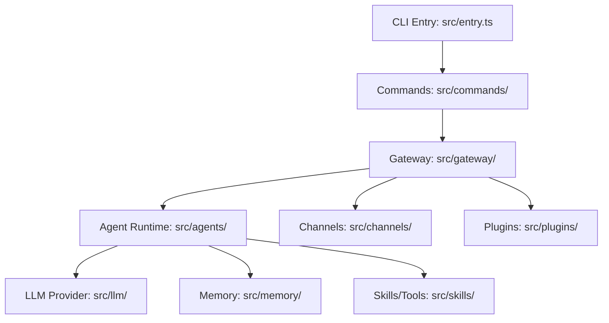

# Level 2: OpenClaw 核心模組職責分析

## 1. 系統架構圖 (Mermaid)

## 2. 核心模組權責說明

### 2.1 閘道層 (Gateway - `src/gateway/`)
- **伺服器實作 (`server.impl.ts`)**: 維護 Gateway 的長效運行，處理 WebSocket 連線與訊息路由。
- **會話維護 (`session-*.ts`)**: 管理使用者會話的生命週期，包含會話壓縮 (Compaction) 與歷史紀錄持久化。
- **多平台接入**: 透過 `src/channels/` 適配不同的通訊協議，並在 Gateway 層級統一轉換為內部訊息格式。

### 2.2 Agent 執行層 (`src/agents/` & `packages/agent-core`)
- **Agent 管理**: 負責實例化 AIAgent，載入使用者 Profile。
- **執行引擎**: 調度 LLM 回傳的 Tool Calls，並執行對應的 Skills。

### 2.3 LLM 適配層 (`src/llm/` & `packages/llm-core`)
- **模型適配**: 支援 OpenAI, Anthropic, Gemini 等多種模型供應商。
- **Token 統計**: 精確計算每個 Request/Response 的 Token 消耗。

### 2.4 擴充體系 (`src/skills/` & `src/plugins/`)
- **Skills**: 原子級的功能單元（如搜尋 Web、讀取檔案）。
- **Plugins**: 系統級的行為干預，可攔截 Gateway 訊息或修改 Agent 行為。

## 3. 技術亮點 (初步觀察)
- **高度測試覆蓋**: 每個核心模組都配備了大量的 `.test.ts` 與 `.e2e.test.ts`，這是一個極度穩定的工業級專案。
- **會話壓縮機制**: 與 `hermes-agent` 相似，透過 Checkpoints 實現長會話管理，防止 Context Window 溢出。
- **MCP 整合**: 積極支援 Model Context Protocol，增強與外部工具的互操作性。

## 4. 下一步深挖 (Level 3)
- **`src/gateway/server.impl.ts`**: 解構訊息從進入 Gateway 到分派給 Agent 的完整生命週期。
- **`src/agents/run-agent.ts`** (如果存在): 尋找對應的 Agent 運行主邏輯。
- **插件鉤子機制**: 分析 Gateway 如何透過 Hooks 允許第三方代碼介入流程。
