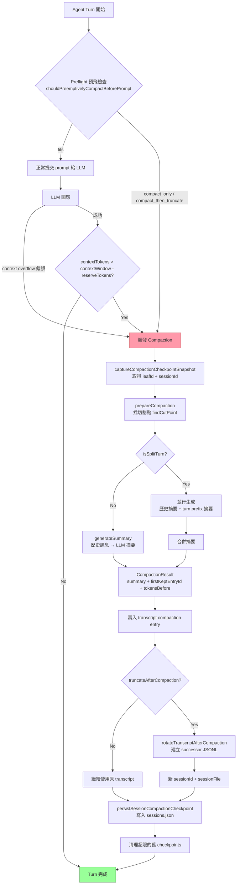

# OpenClaw SDK 會話壓縮（Compaction）機制深度剖析

> 以 SDK 建造者視角，從零理解如何複製 OpenClaw 的 Checkpoint / Compaction 系統。
>
> 核對日期：2026-06-12，基於 `C:\code\mine\pas\projects\openclaw\` 源碼。

---

## 1. Checkpoint 資料結構

### 1.1 核心型別

Checkpoint 的完整型別定義在 `src/config/sessions/types.ts:60-85`：

```typescript
// src/config/sessions/types.ts:60
export type SessionCompactionCheckpointReason =
  | "manual"          // 使用者手動 /compact
  | "auto-threshold"  // token 超過閾值，正常觸發
  | "overflow-retry"  // 模型回傳 context overflow 錯誤後觸發
  | "timeout-retry";  // 壓縮超時後重試

// src/config/sessions/types.ts:66
export type SessionCompactionTranscriptReference = {
  sessionId: string;      // 所指向的 transcript 的 session UUID
  sessionFile?: string;   // JSONL 檔案路徑（可選）
  leafId?: string;        // transcript 中最後一個 entry 的 UUID
  entryId?: string;       // 替代 leafId 的 entry UUID（舊格式相容）
};

// src/config/sessions/types.ts:73
export type SessionCompactionCheckpoint = {
  checkpointId: string;                           // 此 checkpoint 的 UUID
  sessionKey: string;                             // 會話的路由鍵（如 "agent:main:main"）
  sessionId: string;                              // 壓縮後新 session 的 UUID
  createdAt: number;                              // 建立時間（epoch ms）
  reason: SessionCompactionCheckpointReason;      // 觸發原因
  tokensBefore?: number;                          // 壓縮前估算 token 數
  tokensAfter?: number;                           // 壓縮後估算 token 數
  summary?: string;                               // 壓縮摘要文字（可選）
  firstKeptEntryId?: string;                      // 保留歷史的起始 entry UUID
  preCompaction: SessionCompactionTranscriptReference;   // 指向壓縮前 transcript
  postCompaction: SessionCompactionTranscriptReference;  // 指向壓縮後 transcript
};
```

### 1.2 一個 Checkpoint 究竟儲存什麼

一個 Checkpoint 是「壓縮事件的元資料記錄」，**不是** transcript 的完整備份。它儲存：

| 欄位 | 作用 |
|---|---|
| `checkpointId` | 用於按 ID 查找此次壓縮紀錄 |
| `preCompaction.sessionId` | 壓縮前 transcript 的 session UUID |
| `preCompaction.leafId` | 壓縮前 transcript 最後一個有效 entry 的 UUID（用於 fork 截止點） |
| `preCompaction.sessionFile` | 壓縮前 transcript 檔案路徑（舊版格式；新版改用 leafId 指向主 transcript） |
| `postCompaction.sessionId` | 壓縮後 successor transcript 的 session UUID |
| `postCompaction.sessionFile` | 壓縮後 successor transcript 的檔案路徑 |
| `firstKeptEntryId` | transcript 中從這個 entry 開始的訊息「被保留未壓縮」 |
| `tokensBefore` | 壓縮前 context 大小，用於診斷 |
| `summary` | 壓縮摘要（通常存在 transcript 本身而非此處） |

Checkpoint 的完整陣列存在 `sessions.json` 的 `SessionEntry.compactionCheckpoints` 欄位，每個 session key 最多保留 25 筆。

```
~/.openclaw/agents/<agentId>/sessions/sessions.json
{
  "agent:main:main": {
    "sessionId": "...",
    "compactionCheckpoints": [ ...SessionCompactionCheckpoint[] ]
  }
}
```

---

## 2. Compaction 觸發條件

### 2.1 核心閾值公式

閾值定義在 `packages/agent-core/src/harness/compaction/compaction.ts:236-244`：

```typescript
// packages/agent-core/src/harness/compaction/compaction.ts:236
export function shouldCompact(
  contextTokens: number,
  contextWindow: number,
  settings: CompactionSettings,
): boolean {
  if (!settings.enabled) {
    return false;
  }
  return contextTokens > contextWindow - settings.reserveTokens;
}
```

**觸發公式：`contextTokens > contextWindow - reserveTokens`**

預設設定（`packages/agent-core/src/harness/compaction/compaction.ts:142-146`）：

```typescript
export const DEFAULT_COMPACTION_SETTINGS: CompactionSettings = {
  enabled: true,
  reserveTokens: 16384,   // 為摘要提示和輸出保留的 token 空間
  keepRecentTokens: 20000, // 壓縮後要保留的最近 token 數量
};
```

對於 embedded run，`reserveTokens` 有一個安全下限 20000（可用 `agents.defaults.compaction.reserveTokensFloor: 0` 關閉）。

### 2.2 兩條觸發路徑

#### 路徑一：正常閾值觸發（成功 turn 後）

在每次 agent turn 成功後，runtime 比較 `contextTokens` 與 `contextWindow - reserveTokens`，若超過則觸發。

#### 路徑二：Overflow 錯誤觸發

當模型回傳以下錯誤模式時（`docs/reference/session-management-compaction.md:275`）：

- `request_too_large`
- `context length exceeded`
- `input exceeds the maximum number of tokens`
- `input token count exceeds the maximum number of input tokens`
- `input is too long for the model`
- `ollama error: context length exceeded`

OpenClaw 捕捉這類錯誤，壓縮後重試。

### 2.3 Preflight Compaction（Turn 前預飛檢查）

這是「在開始新 turn 前先做壓縮」的核心機制，實作在 `src/agents/embedded-agent-runner/run/preemptive-compaction.ts`。

**決策函數：`shouldPreemptivelyCompactBeforePrompt()`**（`:263`）

在 agent turn 開始、提交 prompt 給 LLM **之前**，執行以下估算：

1. **估算 prompt 壓力**：遍歷所有訊息，計算 token 估算值（字元數 / 4，加 CJK 修正）
2. **計算有效預算**：`promptBudgetBeforeReserve = contextTokenBudget - effectiveReserveTokens`
3. **計算 overflow 量**：`overflowTokens = estimatedPromptTokens - promptBudgetBeforeReserve`
4. **路由決策**：

```typescript
// src/agents/embedded-agent-runner/run/preemptive-compaction.ts:323-333
let route: PreemptiveCompactionRoute = "fits";
if (overflowTokens > 0) {
  if (toolResultReducibleChars <= 0) {
    route = "compact_only";                     // 只能壓縮
  } else if (toolResultReducibleChars >= truncateOnlyThresholdChars) {
    route = "truncate_tool_results_only";       // 只截斷工具結果就夠
  } else {
    route = "compact_then_truncate";            // 先壓縮再截斷
  }
}
```

回傳的 `PreemptiveCompactionDecision.shouldCompact` 為 `true` 時，壓縮在 prompt 提交前完成。

### 2.4 可選的位元組大小守衛（Preflight by transcript size）

當設定 `agents.defaults.compaction.maxActiveTranscriptBytes` 時，在 turn 開始前還會檢查 transcript JSONL 的實際檔案大小。若超過，觸發正常語意壓縮（**需同時啟用 `truncateAfterCompaction`**）。

---

## 3. 壓縮演算法

### 3.1 完整流程

壓縮的核心邏輯分散於 `packages/agent-core/src/harness/compaction/compaction.ts`（`prepareCompaction` 和 `compact` 函數），以及 `src/agents/compaction.ts`（orchestration layer）。

#### 步驟 1：準備（`prepareCompaction`，`:630`）

```
輸入：pathEntries（當前 session tree 的所有 entry）+ CompactionSettings

1. 找到上一次壓縮的位置（prevCompactionIndex）
2. 從上次壓縮的 firstKeptEntryId 確定 boundaryStart
3. 估算目前 contextTokens（使用最後一個 assistant.usage 加上尾部估算）
4. 呼叫 findCutPoint() 找出切割點，保留最近 keepRecentTokens 的訊息
5. 若切割點落在 turn 中間（isSplitTurn），分離 turnPrefixMessages
6. 收集 messagesToSummarize（切割點之前的訊息）
7. 提取 fileOps（讀/寫的檔案清單）
```

#### 步驟 2：找切割點（`findCutPoint`，`:385`）

```
從 transcript 尾部往前累積 token，找到使保留量 >= keepRecentTokens 的最早 entry。
切割點必須是有效的（user/assistant/bash/branch_summary 等），不能切在 toolResult 中間。
若切在 turn 中間，記錄 turnStartIndex（isSplitTurn = true）。
```

#### 步驟 3：生成摘要（`generateSummary`，`:545`）

```
系統提示：你是 context summarization assistant，只輸出結構化摘要。

使用者提示：
<conversation>
  ...序列化的歷史訊息...
</conversation>
[若有前一次摘要則加入 <previous-summary> 標籤]

[SUMMARIZATION_PROMPT / UPDATE_SUMMARIZATION_PROMPT]
  要求輸出格式：
  ## Goal / Constraints & Preferences / Progress / Key Decisions / Next Steps / Critical Context
```

`reserveTokens * 0.8` 作為 maxTokens 上限。

#### 步驟 4：處理 split turn（`:759-793`）

若 `isSplitTurn`，**並行**生成兩份摘要：
- `messagesToSummarize` → 歷史摘要
- `turnPrefixMessages` → 本次 turn 的前半部摘要（用不同的 TURN_PREFIX_SUMMARIZATION_PROMPT）

最終合併：`"${historySummary}\n\n---\n\n**Turn Context (split turn):**\n\n${prefixSummary}"`

#### 步驟 5：附加檔案操作清單（`:815`）

在摘要末尾附加「讀取了哪些檔案、修改了哪些檔案」，供後續 agent 恢復工作脈絡。

#### 步驟 6：寫入 compaction entry

```
回傳 CompactionResult：
{
  summary: string,          // 完整摘要文字
  firstKeptEntryId: string, // 保留歷史的起始 entry UUID
  tokensBefore: number,     // 壓縮前 token 數
  details: { readFiles, modifiedFiles }
}
```

此結果由呼叫方寫入 transcript 作為 `type: "compaction"` entry。

### 3.2 分塊壓縮策略（`summarizeInStages`）

對於非常長的歷史，`src/agents/compaction.ts` 提供多段壓縮：

```
1. buildStageSplitPlan() 判斷是否需要分段（tokens > maxChunkTokens）
2. 若需分段（mode: "split"），依 splitMessagesByTokenShare() 切成均等 token 份的 chunks
3. 對每個 chunk 分別呼叫 summarizeWithFallback()
4. 最後再對所有 partial summaries 執行一次合併（MERGE_SUMMARIES_INSTRUCTIONS）
```

Chunk ratio：`BASE_CHUNK_RATIO = 0.4`（context window 的 40%），最低 `MIN_CHUNK_RATIO = 0.15`（`:13-14`）。

### 3.3 工具結果配對保護

切割 transcript 時，`splitMessagesByTokenShare()` 確保 assistant 的 tool call 和對應的 toolResult 不被分到不同 chunk（`:src/agents/compaction-planning.ts:117-181`）。若切割點落在 tool pair 中間，邊界向前移動到 tool call 開始處。

### 3.4 Successor Transcript 輪換（truncateAfterCompaction）

當 `agents.defaults.compaction.truncateAfterCompaction: true` 時，壓縮後執行 transcript 輪換（`src/agents/embedded-agent-runner/compaction-successor-transcript.ts`）：

```
1. 找到最新的 compaction entry
2. 建立新的 sessionId（UUID）
3. 建立新的 JSONL 檔案路徑（時間戳記_UUID.jsonl）
4. buildSuccessorEntries()：
   - 移除已被壓縮的 message entries（summarizedBranchIds）
   - 保留 compaction entry 本身
   - 保留未被壓縮的 message entries（firstKeptEntryId 之後）
   - 移除重複的狀態 entries（只保留最新的 model_change/thinking_level_change/session_info）
   - 移除重複的 long user turns（防止 retry storm）
   - 對「壓縮前保留的」message strips thinking signatures（避免 Anthropic "Invalid signature"）
5. 寫入新 JSONL（header + entries），atomically
6. 回傳 CompactionTranscriptRotation（包含新 sessionId、sessionFile、leafId）
```

---

## 4. Checkpoint 恢復流程

### 4.1 Checkpoint 的捕獲（壓縮前）

壓縮觸發後、實際壓縮前，會先捕獲當前狀態快照（`src/gateway/session-compaction-checkpoints.ts:400`）：

```typescript
// src/gateway/session-compaction-checkpoints.ts:400
export async function captureCompactionCheckpointSnapshotAsync(params: {
  sessionManager?: Pick<SessionManager, "getLeafId">;
  sessionFile: string;
  maxBytes?: number;
}): Promise<CapturedCompactionCheckpointSnapshot | null>
```

這個函數：
1. 從 SessionManager 取得目前 live leafId（transcript 最新 entry UUID）
2. 或從 transcript 檔案尾部掃描讀取 leafId（最多讀 64 MB）
3. 讀取 transcript 首行取得 sessionId
4. 回傳 `{ sessionId, leafId }`（**不複製 transcript 檔案**）

### 4.2 Checkpoint 的持久化（壓縮後）

壓縮完成後，呼叫 `persistSessionCompactionCheckpoint()`（`:476`）：

```typescript
const checkpoint: SessionCompactionCheckpoint = {
  checkpointId: randomUUID(),
  sessionKey: target.canonicalKey,
  sessionId: params.sessionId,           // 壓縮後的 session UUID
  createdAt,
  reason: params.reason,
  tokensBefore,
  tokensAfter,
  preCompaction: {
    sessionId: snapshot.sessionId,        // 壓縮前的 session UUID
    sessionFile: snapshot.sessionFile,    // 壓縮前 transcript（舊格式可有）
    leafId: snapshot.leafId,             // 壓縮前最後 entry UUID
  },
  postCompaction: {
    sessionId: params.sessionId,
    sessionFile: postSessionFile,         // 壓縮後 successor transcript
    leafId: postLeafId,
  },
};
```

然後透過 `updateSessionStore()` append 到 `sessions.json` 的 `compactionCheckpoints` 陣列。

### 4.3 從 Checkpoint 恢復（fork 流程）

恢復時使用 `forkCompactionCheckpointTranscriptAsync()`（`:333`）：

```typescript
export async function forkCompactionCheckpointTranscriptAsync(params: {
  sourceFile: string;   // 壓縮前 transcript 路徑
  sourceLeafId?: string; // 截止點 entry UUID
  targetCwd?: string;
  sessionDir?: string;
}): Promise<ForkedCompactionCheckpointTranscript | null>
```

步驟：
1. 讀取 source transcript header（驗證 sessionId 和 cwd）
2. 讀取所有 entries，**遇到 sourceLeafId 後停止**
3. 執行 `migrateSessionEntries()`（版本升遷）
4. 用 `trimTranscriptEntriesThroughLeaf()` 截取到 leafId 為止的 entries
5. 生成新的 sessionId 和 timestamp，建立新的 header（帶 `parentSession` 反向指標）
6. 寫入新 JSONL 檔案
7. 回傳 `{ sessionId, sessionFile }`

### 4.4 Checkpoint 的保留與清理

- **數量上限**：每個 sessionKey 最多保留 25 筆（`MAX_COMPACTION_CHECKPOINTS_PER_SESSION = 25`，`:25`）
- **位元組上限**：每個 sessionKey 的 checkpoint snapshot 檔案合計不超過 128 MB（`MAX_COMPACTION_CHECKPOINT_RETAINED_BYTES_PER_SESSION = 128 * 1024 * 1024`，`:27`）
- **保留策略**：超過上限時從最舊的開始刪，最新的一筆永遠保留
- **觸發清理**：每次 `persistSessionCompactionCheckpoint()` 呼叫時，重新計算並刪除超限的舊 checkpoints（包含其 snapshot 檔案）

---

## 5. 與 hermes-agent 壓縮策略比較

| 面向 | openclaw checkpoint 機制 | hermes-agent LLM 摘要方式 |
|---|---|---|
| **壓縮前備份** | 捕獲 `leafId`（transcript entry UUID），不複製檔案 | 不保留備份，直接在記憶體中截斷 |
| **摘要生成** | 呼叫 LLM（同一個 agent 的 model 或指定的 compaction model）| 同樣呼叫 LLM 生成摘要 |
| **恢復能力** | 可透過 fork 回到壓縮前任何一個 checkpoint 的狀態 | 無法恢復，壓縮是單向的 |
| **transcript 結構** | JSONL 樹狀結構，entry 有 `id`/`parentId` | 線性 JSON 陣列 |
| **壓縮後** | 可選 successor transcript（新 JSONL），或 in-place append compaction entry | 在現有 context 中替換舊訊息 |
| **工具結果配對** | 嚴格保護 tool call / toolResult 不被分隔 | 需要自行處理 |
| **複雜度** | 高（多層 gateway/runtime/harness 分工，checkpoint store 管理）| 低（單純截斷+摘要） |
| **磁碟用量** | 較高（多個 JSONL 檔案、checkpoint 元資料） | 低（only memory/in-session） |
| **Branch/Restore** | 原生支援（從任一 checkpoint 建立 fork） | 不支援 |
| **Silent memory flush** | 壓縮前自動執行 memory 寫入 turn | 無此機制 |

**openclaw 優點**：可逆、可分支、診斷友善、支援 preflight 預測。
**openclaw 缺點**：磁碟佔用較大，實作複雜度高，需要管理 checkpoint 元資料和 transcript 輪換。

**hermes-agent 優點**：簡單，不佔額外磁碟，適合無需回溯的場景。
**hermes-agent 缺點**：壓縮後無法恢復，無 branch/restore 功能。

---

## 6. Mermaid 流程圖：Compaction 完整流程



---

## 7. SDK 最小實作建議

若要複製 openclaw 的 checkpoint compaction 機制，最小需要以下元件：

### 7.1 資料層（必要）

```typescript
// 1. Transcript 格式：JSONL，每行一個 JSON entry
// 第一行：header
type SessionHeader = {
  type: "session";
  version: number;
  id: string;        // session UUID
  timestamp: string;
  cwd: string;
  parentSession?: string;  // fork 來源
};

// 後續行：entry（需有 id/parentId 建立樹狀結構）
type SessionEntry =
  | { type: "message"; id: string; parentId: string; message: AgentMessage }
  | { type: "compaction"; id: string; parentId: string; summary: string; firstKeptEntryId: string; tokensBefore: number };

// 2. Session store：JSON，追蹤 active session 和 checkpoints
type SessionStoreEntry = {
  sessionId: string;
  sessionFile?: string;
  compactionCheckpoints?: SessionCompactionCheckpoint[];
};
```

### 7.2 核心邏輯（必要）

```typescript
// 3. Token 估算器（輕量版，不需 tokenizer）
function estimateTokens(message: AgentMessage): number {
  // 基於字元數 / 4，注意 CJK 字元寬度
  return Math.ceil(charCount / 4);
}

// 4. 觸發判斷
function shouldCompact(contextTokens: number, contextWindow: number, reserveTokens: number): boolean {
  return contextTokens > contextWindow - reserveTokens;
}

// 5. 切割點計算（保留最近 N token）
function findCutPoint(entries: SessionEntry[], keepRecentTokens: number): string;

// 6. LLM 摘要呼叫
async function generateSummary(messages: AgentMessage[], model: Model): Promise<string>;

// 7. Checkpoint 捕獲（壓縮前）
function captureLeafId(entries: SessionEntry[]): string;

// 8. Checkpoint 持久化（壓縮後）
function persistCheckpoint(store: SessionStore, checkpoint: SessionCompactionCheckpoint): void;
```

### 7.3 可選但重要

- **Successor transcript 輪換**：讓壓縮後 transcript 變小（需要 `truncateAfterCompaction`）
- **Fork/Restore**：從 checkpoint 重建舊 transcript（需要 `forkCompactionCheckpointTranscriptAsync`）
- **Memory flush**：壓縮前先靜默寫入重要資訊到磁碟
- **分塊壓縮**：對超長歷史分段生成再合併（`summarizeInStages`）
- **Pluggable provider**：讓第三方提供自定義摘要邏輯

---

## 8. 坑點：容易出錯的邊界條件

### 8.1 Tool call / toolResult 配對問題

**坑**：若切割點落在 assistant 的 tool call 和對應 toolResult 之間，會導致 Anthropic API 報錯「unexpected tool_use_id」。

**解法**：`splitMessagesByTokenShare()` 追蹤 `pendingToolCallIds`，若有未配對的 toolResult 則延後切割（`src/agents/compaction-planning.ts:111-181`）。

### 8.2 Thinking Signature 失效

**坑**：Claude extended thinking 模式中，thinking block 含有 `signature` 欄位，與 context prefix 綁定。Successor transcript 切換了 context prefix，舊的 signature 會讓 Anthropic 報錯「Invalid signature in thinking block」。

**解法**：`buildSuccessorEntries()` 對「壓縮前保留的」entries 呼叫 `stripThinkingSignaturesFromMessage()`（`src/agents/embedded-agent-runner/compaction-successor-transcript.ts:191`）。

### 8.3 Token 估算不準確（SAFETY_MARGIN）

**坑**：字元數 / 4 的估算對 CJK 字元、程式碼 token、特殊 token 等誤差很大，可能導致誤以為能 fit 而實際 overflow。

**解法**：所有估算都乘以 `SAFETY_MARGIN = 1.2`（`src/agents/compaction-planning.ts:17`）。Preflight 也使用相同 margin（`src/agents/embedded-agent-runner/run/preemptive-compaction.ts:212`）。

### 8.4 Compaction 後立刻再次壓縮（Loop Guard）

**坑**：壓縮後，如果新的 context（compaction summary + 保留訊息）仍超過閾值，可能立刻觸發下一次壓縮，形成無限迴圈。

**解法**：`post-compaction-loop-guard`（`src/agents/embedded-agent-runner/post-compaction-loop-guard.ts`）在壓縮完成後設置保護，避免立即再次觸發。另外 `keepRecentTokens` 保留量設計上要顯著小於 `contextWindow - reserveTokens`。

### 8.5 LeafId 掃描失敗（大型 transcript）

**坑**：從 transcript 尾部掃描 leafId 時，若 transcript 非常大且最後幾個 entry 本身很大（如長 tool output），可能需要讀取很多位元組才能找到有效 entry。

**解法**：`MAX_COMPACTION_CHECKPOINT_LEAF_SCAN_BYTES = 64 * 1024 * 1024`（64 MB 上限），且採用指數倍增策略（先讀 64 KB，不夠再讀 128 KB，以此類推）（`src/gateway/session-compaction-checkpoints.ts:291-318`）。

### 8.6 重複 User Message（Retry Storm）

**坑**：Channel bot 在 retry 場景下可能重複發送相同 user message，這些重複訊息若被帶入 successor transcript 會造成 LLM 困惑。

**解法**：`collectDuplicateUserMessageEntryIdsForCompaction()` 在建立 successor transcript 時，移除短時間窗口內完全相同的 long user turns（`src/agents/embedded-agent-runner/compaction-duplicate-user-messages.ts`）。

### 8.7 Checkpoint 磁碟預算超限

**坑**：若持續壓縮且未配置 `truncateAfterCompaction`，每次壓縮都可能新增 snapshot 檔案，最終超過磁碟預算。

**解法**：`trimSessionCheckpoints()` 在每次 persist 時計算目前所有 snapshot 的磁碟大小，超過 128 MB 上限的舊 checkpoint 及其實體檔案會被刪除（`src/gateway/session-compaction-checkpoints.ts:56-93`）。

### 8.8 孤兒 ToolResult（Repair 需求）

**坑**：`pruneHistoryForContextShare()` 在刪除歷史 chunk 時，可能產生 toolResult 的 tool_use 被刪、但 toolResult 本身還在的情況（孤兒 toolResult）。

**解法**：每次刪除 chunk 後呼叫 `repairToolUseResultPairing()` 移除孤兒 toolResult（`src/agents/compaction-planning.ts:382`）。

---

## 關鍵檔案索引

| 檔案 | 職責 |
|---|---|
| `packages/agent-core/src/harness/compaction/compaction.ts` | 核心演算法：`shouldCompact`、`findCutPoint`、`prepareCompaction`、`compact`、`generateSummary`、DEFAULT_COMPACTION_SETTINGS |
| `src/config/sessions/types.ts:60-85` | `SessionCompactionCheckpoint` 型別定義 |
| `src/gateway/session-compaction-checkpoints.ts` | Checkpoint 的捕獲、持久化、fork、清理 |
| `src/agents/embedded-agent-runner/run/preemptive-compaction.ts` | Preflight 預飛檢查：token 壓力估算、路由決策 |
| `src/agents/embedded-agent-runner/compaction-successor-transcript.ts` | Successor transcript 輪換（truncateAfterCompaction） |
| `src/agents/compaction.ts` | 分塊壓縮策略：`summarizeInStages`、`summarizeWithFallback` |
| `src/agents/compaction-planning.ts` | Token 估算、chunk 切割、tool pair 保護、history prune |
| `src/agents/harness/compaction.ts` | Harness 分派層：路由到 plugin harness 或 native compaction |
| `src/agents/sessions/compaction/compaction.ts` | 本地 bridge，銜接 agent-core API 與舊有 session API |
| `docs/reference/session-management-compaction.md` | 完整設定文件（reserveTokens、keepRecentTokens、memoryFlush 等） |
| `docs/concepts/compaction.md` | 使用者面向概述 |
