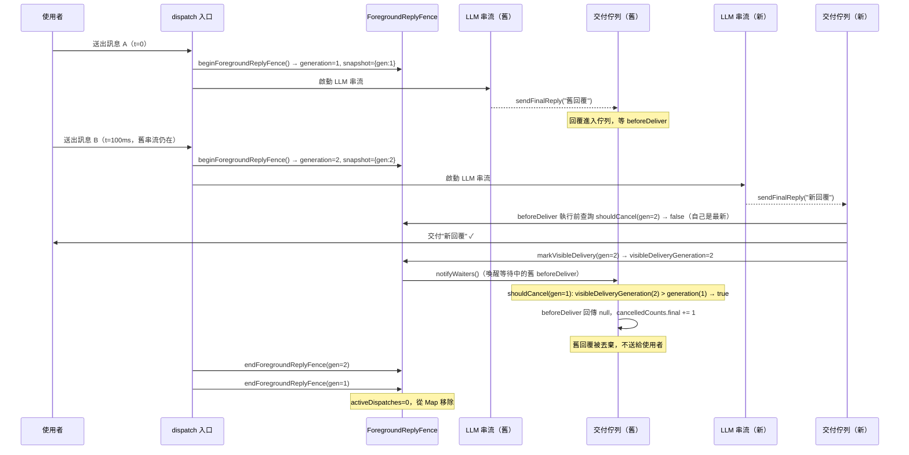

# ForegroundReplyFence（世代圍欄）深度剖析：SDK 建造者視角

> 核對於 2026-06-12，源碼版本：openclaw main branch

---

## 1. ForegroundReplyFence 核心設計

### 1.1 問題陳述

在 messaging bot（WhatsApp、Telegram 等）的情境下，使用者可能在舊的 LLM 串流還在生成回覆時就送出新訊息。這時系統有兩種選擇：
- **讓兩個回覆都送出**：使用者看到針對舊意圖的回覆，接著才是新意圖的回覆，造成混淆。
- **抑制舊回覆**：只讓最新世代的回覆被使用者看到。

`ForegroundReplyFence` 實作的是第二種策略，且不使用 `AbortController`——它採用**世代計數（generation counter）+ 遞延交付攔截（beforeDeliver hook）**的組合。

### 1.2 型別結構

`src/auto-reply/dispatch.ts:41-47`：

```typescript
type ForegroundReplyFenceState = {
  generation: number;           // 目前最大世代號（number，從 0 起算，每次 beginForegroundReplyFence 遞增 1）
  visibleDeliveryGeneration: number;  // 目前已成功送出可見回覆的最高世代號
  activeDispatches: number;     // 目前仍在執行中的 dispatch 數量
  activeGenerations: Map<number, number>;  // 世代號 -> 活躍 dispatch 數量
  waiters: Set<() => void>;     // 等待世代結算的 Promise resolve 函數集合
};

type ForegroundReplyFenceSnapshot = {
  key: string;       // 複合圍欄鍵（JSON 字串，見下方）
  generation: number; // 此次 dispatch 的世代號快照
};
```

### 1.3 圍欄鍵（Fence Key）的組成

`src/auto-reply/dispatch.ts:78-103`：

```typescript
return JSON.stringify([
  "foreground",
  channel,          // OriginatingChannel ?? Surface ?? Provider
  accountId ?? "default",
  sessionKey,       // SessionKey（必填）
  chatType ?? "unknown",
  target,           // OriginatingTo ?? NativeChannelId ?? From ?? To
]);
```

圍欄的隔離粒度是「**同一個頻道上的同一個對話目標**」——相同 session 但不同 target（例如群組中的不同使用者）會得到獨立的圍欄，不會互相抑制（`dispatch.freshness.test.ts:613-669` 有測試覆蓋）。

### 1.4 世代遞增邏輯

`src/auto-reply/dispatch.ts:105-131`：

```typescript
function beginForegroundReplyFence(finalized: FinalizedMsgContext): ForegroundReplyFenceSnapshot | undefined {
  const state = foregroundReplyFenceByKey.get(key) ?? { generation: 0, ... };
  state.generation += 1;          // 無條件遞增，新請求一定比舊請求世代號大
  state.activeDispatches += 1;
  state.activeGenerations.set(state.generation, (state.activeGenerations.get(state.generation) ?? 0) + 1);
  foregroundReplyFenceByKey.set(key, state);
  return { key, generation: state.generation };  // 回傳快照（閉包捕捉的世代號）
}
```

世代號是 **`number` 型別**，從 0 開始，每次新請求進來就 `+= 1`。返回的 `ForegroundReplyFenceSnapshot` 是不可變的快照，整個 dispatch 生命週期內不會改變，用於後續的「我是不是過時了？」判斷。

全域 Map 儲存於模組層級變數：`src/auto-reply/dispatch.ts:54`：

```typescript
const foregroundReplyFenceByKey = new Map<string, ForegroundReplyFenceState>();
```

### 1.5 競爭抑制的觸發條件

取消判斷發生於兩個時間點（都是在 `beforeDeliver` hook 內），`src/auto-reply/dispatch.ts:554-572`：

1. **hook 執行之前**：`await shouldCancelForegroundReplyDelivery(foregroundReplyFence)`
2. **hook 執行之後**：再次呼叫 `await shouldCancelForegroundReplyDelivery(foregroundReplyFence)`

這是因為 `beforeDeliver` 本身可能是非同步的（例如呼叫外部 API 轉換訊息），在等待期間可能又有更新的請求完成了可見交付。「前後都查」確保最高精確度。

---

## 2. 中止傳播鏈

openclaw 的 `ForegroundReplyFence` **不使用 `AbortController`**。它的「中止」是在**交付佇列（delivery queue）**這一層發生的，而不是在 LLM 串流層。傳播鏈如下：

```
[新請求進來]
     │
     ▼
beginForegroundReplyFence()     ← 舊 dispatch 的 snapshot.generation < 新 state.generation
     │
     ▼
新請求的 LLM 串流完成，送出可見回覆
     │
     ▼
markForegroundReplyFenceVisibleDelivery()
     │  state.visibleDeliveryGeneration = max(current, snapshot.generation)
     │  notifyForegroundReplyFenceWaiters()   ← 喚醒所有在等待的舊 dispatch
     │
     ▼
舊 dispatch 的 beforeDeliver hook 被喚醒（原本在 await Promise）
     │
     ▼
shouldCancelForegroundReplyDelivery()
     │  state.visibleDeliveryGeneration > snapshot.generation  →  return true
     │
     ▼
beforeDeliver 回傳 null  →  cancelledCounts 遞增  →  訊息被丟棄
```

**傳播層數**：3 層

| 層次 | 機制 | 程式碼位置 |
|---|---|---|
| 1. 世代感知層 | `shouldCancelForegroundReplyDelivery` 輪詢/等待 | `dispatch.ts:153-175` |
| 2. 交付攔截層 | `beforeDeliver` hook 回傳 `null` | `dispatch.ts:554-572` |
| 3. 佇列執行層 | `createReplyDispatcher` 的 `enqueue` 函數偵測 `null` 並計入 `cancelledCounts` | `reply-dispatcher.ts:237-245` |

**注意**：LLM 本身的串流不會被取消——它仍然完整執行，只是最後的回覆在「要送給使用者」的那一刻被攔截。這是一個在**交付端**而非**產生端**的抑制機制。

### 2.1 等待機制：waiter 佇列

`src/auto-reply/dispatch.ts:159-174`：

```typescript
async function shouldCancelForegroundReplyDelivery(snapshot): Promise<boolean> {
  while (true) {
    const state = foregroundReplyFenceByKey.get(snapshot.key);
    if (state.visibleDeliveryGeneration > snapshot.generation) {
      return true;   // 有更新的世代已成功交付 → 確定取消
    }
    if (!hasNewerActiveForegroundReplyFenceGeneration(state, snapshot.generation)) {
      return false;  // 沒有更新的活躍世代 → 允許交付
    }
    // 有更新的世代還在執行中，尚不確定，等待其結算
    await new Promise<void>((resolve) => {
      state.waiters.add(resolve);
    });
  }
}
```

這個等待迴圈是整個設計的精髓：舊請求不會立即被拒絕，而是**等到能確定答案**才決定。

---

## 3. Mermaid 時序圖：兩個請求交錯



---

## 4. 與 Promise/async 的整合

### 4.1 核心挑戰

TypeScript/Node.js 的 async 函數無法從外部「殺死」——一旦啟動，除非：
- 函數自己拋出例外
- 透過 `AbortSignal` 在每個 `await` 點檢查

openclaw 選擇了第三條路：**不中止計算，只在輸出端過濾**。

### 4.2 序列化佇列（serialized queue）模式

`src/auto-reply/reply/reply-dispatcher.ts:215-269`：

```typescript
sendChain = sendChain.then(async () => {
  // ...
  if (beforeDeliver) {
    deliverPayload = await beforeDeliver(normalized, dispatchInfo);
    if (!deliverPayload) {
      cancelledCounts[kind] += 1;
      return;   // 丟棄，不呼叫 deliver
    }
  }
  await options.deliver(deliverPayload, dispatchInfo);
}).catch(...).finally(...);
```

每個 `sendFinalReply()`/`sendBlockReply()` 都被串進同一條 Promise chain（`sendChain`）。這保證了：
- 訊息按照 tool → block → final 的順序送出
- `beforeDeliver` 的非同步等待（`shouldCancelForegroundReplyDelivery`）不會阻塞其他 dispatch

### 4.3 「雙重查詢」的必要性

為什麼 `beforeDeliver` 要在 hook 前後各查一次？

```typescript
if (await shouldCancelForegroundReplyDelivery(foregroundReplyFence)) return null;  // 查詢 1
const deliverPayload = configuredBeforeDeliver
  ? await configuredBeforeDeliver(payload, info)  // ← 這裡可能等了很久
  : payload;
if (!deliverPayload || await shouldCancelForegroundReplyDelivery(foregroundReplyFence)) return null;  // 查詢 2
```

`configuredBeforeDeliver` 可能呼叫外部 API（例如 message_sending hook），在這段非同步等待期間，更新的世代可能已完成交付。若不做第二次查詢，就會把舊回覆送出。

---

## 5. SDK 最小實作建議

如果要在自己的 SDK 複製這個模式，最小需要以下介面與邏輯：

```typescript
// 1. 圍欄狀態（per conversation target）
interface FenceState {
  generation: number;
  visibleDeliveryGeneration: number;
  activeGenerations: Map<number, number>;
  waiters: Set<() => void>;
}

// 2. 圍欄快照（per request，不可變）
interface FenceSnapshot {
  key: string;
  generation: number;
}

// 3. 核心 API
interface GenerationFence {
  /** 請求進來時呼叫，回傳快照 */
  begin(key: string): FenceSnapshot;

  /** 每個回覆送出前呼叫，回傳 false 表示應丟棄 */
  shouldDeliver(snapshot: FenceSnapshot): Promise<boolean>;

  /** 回覆成功送給使用者後呼叫 */
  markVisible(snapshot: FenceSnapshot): void;

  /** dispatch 完成時呼叫 */
  end(snapshot: FenceSnapshot): void;
}
```

### 5.1 最小實作草圖

```typescript
class GenerationFenceImpl implements GenerationFence {
  private states = new Map<string, FenceState>();

  begin(key: string): FenceSnapshot {
    const state = this.states.get(key) ?? {
      generation: 0,
      visibleDeliveryGeneration: 0,
      activeGenerations: new Map(),
      waiters: new Set(),
    };
    state.generation += 1;
    state.activeGenerations.set(
      state.generation,
      (state.activeGenerations.get(state.generation) ?? 0) + 1
    );
    this.states.set(key, state);
    return { key, generation: state.generation };
  }

  async shouldDeliver(snapshot: FenceSnapshot): Promise<boolean> {
    while (true) {
      const state = this.states.get(snapshot.key);
      if (!state) return true;
      if (state.visibleDeliveryGeneration > snapshot.generation) return false;

      // 有更新世代還在執行中，等待
      const hasNewerActive = [...state.activeGenerations.entries()]
        .some(([gen, count]) => gen > snapshot.generation && count > 0);
      if (!hasNewerActive) return true;

      await new Promise<void>((resolve) => state.waiters.add(resolve));
    }
  }

  markVisible(snapshot: FenceSnapshot): void {
    const state = this.states.get(snapshot.key);
    if (!state) return;
    state.visibleDeliveryGeneration = Math.max(
      state.visibleDeliveryGeneration,
      snapshot.generation
    );
    // 喚醒所有等待者
    const waiters = [...state.waiters];
    state.waiters.clear();
    waiters.forEach((resolve) => resolve());
  }

  end(snapshot: FenceSnapshot): void {
    const state = this.states.get(snapshot.key);
    if (!state) return;
    const count = state.activeGenerations.get(snapshot.generation) ?? 0;
    if (count <= 1) state.activeGenerations.delete(snapshot.generation);
    else state.activeGenerations.set(snapshot.generation, count - 1);

    // 喚醒等待者（可能某個舊世代現在可以確定不需要等了）
    const waiters = [...state.waiters];
    state.waiters.clear();
    waiters.forEach((resolve) => resolve());

    const totalActive = [...state.activeGenerations.values()].reduce((a, b) => a + b, 0);
    if (totalActive <= 0) this.states.delete(snapshot.key);
  }
}

// 使用方式（在 buffered dispatcher 建立時）
async function handleMessage(key: string, getMessage: () => Promise<string>, deliver: (text: string) => Promise<void>) {
  const fence = globalFence;  // singleton 或 per-channel instance
  const snapshot = fence.begin(key);
  try {
    const text = await getMessage();  // LLM 串流或其他非同步操作
    // 交付前查詢
    if (!await fence.shouldDeliver(snapshot)) return;
    await deliver(text);
    fence.markVisible(snapshot);
  } finally {
    fence.end(snapshot);
  }
}
```

---

## 6. 坑點與邊界條件

### 6.1 「有更新世代活躍」但最終沒有可見交付

**場景**：新請求（gen=2）進來，舊請求（gen=1）的 `shouldDeliver` 看到 gen=2 活躍，進入等待。但 gen=2 最後失敗或送出 `visibleReplySent: false`。

**openclaw 的處理**：`shouldCancelForegroundReplyDelivery` 的 while 迴圈每次喚醒都重新檢查。若 gen=2 結束且 `visibleDeliveryGeneration` 沒有更新，`hasNewerActiveForegroundReplyFenceGeneration` 回傳 false，迴圈就退出並回傳 `false`（允許交付）。

相關測試：`dispatch.freshness.test.ts:258-312`（新請求交付失敗）、`dispatch.freshness.test.ts:374-425`（非可見交付 `visibleReplySent: false`）。

### 6.2 新請求的「非可見交付」語義歧義

openclaw 定義「可見交付」為：
- 回覆有實際文字內容（`hasOutboundReplyContent(payload, { trimText: true })`）
- 且 `deliver` 回傳的結果**不是** `{ visibleReplySent: false }`

`src/auto-reply/dispatch.ts:177-190`：

如果 adapter 忘記在「真的送給使用者了」時回傳 `{ visibleReplySent: true }`，世代圍欄就無法正確感知，可能誤判。

### 6.3 `onSettled` 與 `onFreshSettledDelivery` 的語義差異

兩者都在 dispatch 結束後執行，但行為不同：

| Hook | 執行條件 | 影響圍欄 |
|---|---|---|
| `onSettled` | 無條件執行（即使舊世代） | 若回傳 `{ visibleReplySent: true }` 則更新 `visibleDeliveryGeneration` |
| `onFreshSettledDelivery` | 先查詢 `shouldCancelForegroundReplyDelivery`，過時則跳過 | 執行後若回傳可見則更新 |

`src/auto-reply/dispatch.ts:609-617`：`onSettled` 仍然執行（例如清理 typing indicator），但 `onFreshSettledDelivery`（例如「LLM 沒有回覆時送出 fallback 訊息」）會被跳過以避免過時 fallback 覆蓋新回覆。

### 6.4 「請求完成」與「新請求到達」幾乎同時（race condition）

**場景**：gen=1 的 `deliver` 已執行完畢，gen=2 的 `begin` 剛好在 `markVisible(gen=1)` 之後才到達。

此時 `foregroundReplyFenceByKey` 會正常設定 gen=2 的狀態，gen=1 已完成並移除。因為是 Node.js 單執行緒，JavaScript event loop 保證這兩個操作不會真正並發，只有 `await` 點才會切換，所以不存在 data race。但如果系統跑在多執行緒（Worker threads）或多進程環境，這個模組層級的 `Map` 就會出問題——需要改用 Redis 或資料庫存放狀態。

### 6.5 世代號溢出

`generation` 是 JavaScript `number`，最大安全整數為 `Number.MAX_SAFE_INTEGER = 2^53 - 1`。對於生命週期長的 session，理論上存在溢出風險，但在實際上幾乎不可能（每秒 100 萬次請求也要 2.85 億年才溢出）。若要完全安全，可用 `BigInt`。

### 6.6 `beforeDeliver` 中的例外處理

若 `configuredBeforeDeliver` 拋出例外，`shouldCancelForegroundReplyDelivery` 的第二次查詢不會被執行，但例外會冒泡到 `sendChain` 的 `.catch` 並計入 `failedCounts`。世代圍欄的 `endForegroundReplyFence` 仍然在 `finally` 中執行（`dispatch.ts:619`），waiters 會被正確喚醒。

---

## 7. 設計哲學總結

openclaw 的 `ForegroundReplyFence` 體現了一個重要的 SDK 設計取捨：

> **「不中止產生，只過濾交付」**

與使用 `AbortController` 中止 LLM 串流相比，這個方法：
- **優點**：實作簡單，不需要在整條 async call chain 傳遞 `AbortSignal`；LLM API 費用已付（串流完成），至少確保計費正確；可以在串流完成後做後處理（例如 session 儲存）
- **缺點**：浪費 LLM 算力（舊請求仍然完整執行）；若 LLM 串流很長，使用者等待時間不會縮短

適合「回覆長度可控、主要瓶頸在交付而非生成」的 messaging bot 場景。對於需要長時間 LLM 生成的 agent（例如 coding agent），搭配 `AbortSignal` 主動取消串流會更省資源。
