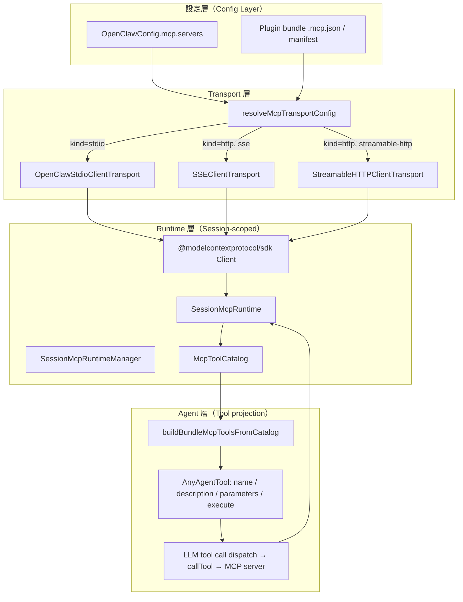

# openclaw MCP 整合架構深度剖析（SDK 建造者視角）

> 分析日期：2026-06-12
> 目標版本：openclaw monorepo（pnpm workspace）
> 分析範圍：`src/agents/mcp-*`、`src/agents/agent-bundle-mcp-*`、`src/agents/bundle-mcp-*`、`src/config/mcp-*`、`src/plugins/bundle-mcp.ts`

---

## 1. MCP 整合架構概覽

openclaw 把 MCP server 當成**外部 tool provider**，由一條清晰的分層管線把「設定檔中的 server 定義」轉換成「agent turn 可直接呼叫的 `AnyAgentTool`」。整體可分為四層：



核心設計決策：**MCP tools 不是動態注入的，而是在 session 開始時一次性列舉（`tools/list`），然後以靜態的 `AnyAgentTool[]` 傳給 LLM**。呼叫時再透過 `serverName` 路由回對應的 MCP session。

---

## 2. MCP Server 連接流程

### 2.1 設定來源合併

`src/agents/bundle-mcp-config.ts:52` 的 `loadMergedBundleMcpConfig` 負責把兩個來源合併：

1. **Plugin bundle**：從已安裝 plugin 的 `.mcp.json` / `claude-bundle.json` / `codex-bundle.json` 讀取（`src/plugins/bundle-mcp.ts:292` `loadEnabledBundleMcpConfig`）
2. **User config**：`OpenClawConfig.mcp.servers`（`src/config/types.mcp.ts:80`）

合併規則（`src/agents/bundle-mcp-config.ts:79`）：

```
mergedServers = { ...pluginServers, ...userConfiguredServers }
```

即 user config 永遠覆蓋 plugin 預設值。若 user 將某 server 的 `enabled` 設為 `false`，則它同時從 plugin 合併集中移除（`src/agents/bundle-mcp-config.ts:65`）。

### 2.2 Transport 解析優先序

`src/agents/mcp-transport-config.ts:199` 的 `resolveMcpTransportConfig` 按下列順序決定 transport 類型：

```
有 command 欄位？ → stdio（優先，永遠勝出）
↓ 否
有 transport = "streamable-http"？ → streamable-http
↓ 否（或 transport 未設定）
有 url？ → 嘗試 streamable-http，失敗則 fallback 到 sse
↓ 否
跳過此 server（logWarn）
```

**重要**：如果同時存在 `command` 和 `url`，永遠走 stdio。這符合 MCP 社群的「command-bearing server 即 stdio」慣例（`src/agents/mcp-transport-config.ts:214`）。

### 2.3 支援的 Transport 類型

| 類型 | 實作類別 | SDK 來源 |
|------|----------|---------|
| `stdio` | `OpenClawStdioClientTransport` | 自己實作（`src/agents/mcp-stdio-transport.ts`），基於 MCP SDK 的 `ReadBuffer` / `serializeMessage` |
| `sse` | `SSEClientTransport` | `@modelcontextprotocol/sdk/client/sse.js` |
| `streamable-http` | `StreamableHTTPClientTransport` | `@modelcontextprotocol/sdk/client/streamableHttp.js` |

openclaw **沒有原生 WebSocket transport**。WebSocket 支援僅限於 openclaw 作為 MCP server 端（`src/mcp/channel-bridge.ts`、`src/mcp/channel-server.ts`）。

### 2.4 Stdio Transport 的特殊處理

`src/agents/mcp-stdio-transport.ts:63` 中，spawn 子行程時：
- `detached: true`（非 Windows），讓子行程在 agent 側 crash 後不會因 SIGHUP 一起死亡
- `shell: false`，避免 shell injection
- `stderr: "pipe"` → 轉接到 `logDebug`（`src/agents/mcp-transport.ts:34`）
- 關閉時依序：stdin EOF → 等 2 秒 → `killProcessTree` → 等 2 秒 → `SIGKILL`（`src/agents/mcp-stdio-transport.ts:116`）

### 2.5 連線建立（getCatalog 驅動）

連線不在設定解析時發生，而是在第一次呼叫 `getCatalog()` 時才建立（懶連線）：

```
getCatalog() called
  ↓
for each server in mcpServers:
  resolveMcpTransport(serverName, rawServer) → ResolvedMcpTransport
  new Client({ name: "openclaw-bundle-mcp", ... })
  connectWithTimeout(client, transport, connectionTimeoutMs)  ← 30s 預設
  client.listTools(cursor?) → 分頁列舉工具  ← 1500ms 快速超時（預設）
  build McpServerCatalog + McpCatalogTool[]
```

連線超時預設 30 秒（`src/agents/mcp-transport-config.ts:51`），list tools 超時預設 **1500ms**（`src/agents/agent-bundle-mcp-runtime.ts:60`）——這個極短的超時用意是「快速跳過慢 server，不要卡住 agent 啟動」。若 server 明確設定了 `requestTimeoutMs`，則改用該值。

---

## 3. Tool Schema 轉換

### 3.1 MCP tool 欄位 vs openclaw AnyAgentTool 欄位

| MCP `ListedTool` 欄位 | openclaw `AnyAgentTool` 欄位 | 轉換說明 |
|-----------------------|------------------------------|---------|
| `name` | `name`（加命名空間前綴） | `${safeServerName}__${toolName}`，最多 64 字元 |
| `title` | `label` | 直接映射；若缺失則用 `toolName` |
| `description` | `description` | 經 `sanitizeMcpMetadataText` 清洗（截斷 1200 字元、過濾 prompt injection） |
| `inputSchema` | `parameters` | 經 `normalizeToolParameterSchema` 正規化；TypeBox compile |

（`src/agents/agent-bundle-mcp-materialize.ts:262`、`src/agents/agent-bundle-mcp-names.ts:52`）

### 3.2 Tool 命名規則

所有 MCP tool 的 agent 側名稱格式為（`src/agents/agent-bundle-mcp-names.ts:10`）：

```
<safeServerName>__<safeToolName>
```

- `safeServerName`：server key 去除非 `[A-Za-z0-9_-]` 字元，截斷 30 字元，衝突時加 `-2`、`-3` 後綴
- `safeToolName`：同樣規則，剩餘預算 = 64 - serverName.length - 2（雙底線）
- 總長度上限 64 字元

這是為了符合各 LLM provider 的 tool name 限制（例如 Claude API 要求 `[A-Za-z0-9_-]`，最多 64 字元）。

### 3.3 Schema 正規化的細節

`src/agents/agent-bundle-mcp-runtime.ts:130` 的 `stripJsonSchemaFormats` 有幾個重要處理：

1. **移除所有 `format` 欄位**：TypeBox 不支援，保留會破壞 validation
2. **展開 `type` 陣列**：`type: ["string", "null"]` → `anyOf: [{ type: "string" }, { type: "null" }]`，因為大部分 LLM API 不接受 type 為陣列
3. **JSON Schema draft-2020-12 特殊路徑**：若 schema 的 `$schema` 是 `https://json-schema.org/draft/2020-12/schema`，改用 `TypeBox.Compile` 直接 compile（`src/agents/agent-bundle-mcp-runtime.ts:168`），繞過 AJV 不支援 2020-12 的問題

### 3.4 Utility Tools（非 tool 操作）

除了 MCP `tools`，若 server 宣告了 `resources` 或 `prompts` 能力，`buildBundleMcpToolsFromCatalog`（`src/agents/agent-bundle-mcp-materialize.ts:296`）還會產生額外的 utility agent tools：

| MCP 能力 | 產生的 agent tool name | 功能 |
|---------|----------------------|------|
| `resources` | `${server}__resources_list` | 列舉 server 資源 |
| `resources` | `${server}__resources_read` | 讀取一個資源（需傳 `uri`） |
| `prompts` | `${server}__prompts_list` | 列舉 server prompts |
| `prompts` | `${server}__prompts_get` | 取得一個 prompt（需傳 `name`） |

這些同樣受 `toolFilter.include/exclude` 過濾（`src/agents/agent-bundle-mcp-materialize.ts:172`）。

---

## 4. Runtime 工具呼叫路由

### 4.1 從 LLM 決策到 MCP server

當 LLM 在回應中輸出 tool_use（例如 `{"name": "my-server__my-tool", "input": {...}}`），openclaw agent turn 執行器會呼叫該 `AnyAgentTool` 的 `execute` 函式。

這個 `execute` 是在 `materializeBundleMcpToolsForRun`（`src/agents/agent-bundle-mcp-materialize.ts:402`）建立時注入的閉包：

```typescript
// src/agents/agent-bundle-mcp-materialize.ts:404
createExecute: (tool) => async (_toolCallId, input) => {
  params.runtime.markUsed();
  const result = await params.runtime.callTool(tool.serverName, tool.toolName, input);
  return toAgentToolResult({ serverName: tool.serverName, toolName: tool.toolName, result });
}
```

`callTool` 的路由（`src/agents/agent-bundle-mcp-runtime.ts:779`）：

1. 呼叫 `getCatalog()` 確保已連線（若已連線則直接用快取）
2. 從 `sessions` Map 查找對應 `serverName` 的 `BundleMcpSession`
3. 呼叫 `session.client.callTool({ name: toolName, arguments: input }, undefined, { timeout: requestTimeoutMs })`
4. 若失敗 3 次（`BUNDLE_MCP_FAILURE_THRESHOLD = 3`），進入 backoff 冷卻 60 秒（`src/agents/agent-bundle-mcp-runtime.ts:58`）

### 4.2 回傳結果格式化

`toAgentToolResult`（`src/agents/agent-bundle-mcp-materialize.ts:59`）將 MCP `CallToolResult` 轉換為 `AgentToolResult`：

- `structuredContent`（MCP 2025 規格新增）：若存在，優先使用，序列化成 `structuredContent:\n{...}` 文字塊
- `content` 陣列：依 block type 處理：
  - `text` → `{type: "text", text}`
  - `image` → 確認有 `data` + `mimeType` 才輸出 image block，否則 fallback 成文字（避免 Anthropic API 400 問題，原始碼 `src/agents/agent-bundle-mcp-materialize.ts:36` 有詳細說明）
  - `audio` → `[audio {mimeType}]` 文字
  - `resource_link` → `[title] uri` 文字
  - `resource` → 文字內容或 uri
  - 未知 block → `JSON.stringify(block)`（向前相容）
- `isError: true` → 記入 `details.status = "error"`，但不拋例外（讓 LLM 看到錯誤訊息後自行決策）

---

## 5. 生命週期管理

### 5.1 Session 粒度：每 session 一個 Runtime

`SessionMcpRuntimeManager`（全域 singleton，`src/agents/agent-bundle-mcp-runtime.ts:54`）以 `sessionId` 為鍵管理 `SessionMcpRuntime`，每個 runtime 內部再以 `serverName` 為鍵維護 `BundleMcpSession`（即 SDK `Client` + `Transport` 組合）。

```
全域 SessionMcpRuntimeManager（singleton）
  ├── sessionId "abc" → SessionMcpRuntime
  │     ├── server "github-mcp" → BundleMcpSession { Client, StdioTransport }
  │     └── server "jira-mcp"   → BundleMcpSession { Client, SSETransport }
  └── sessionId "xyz" → SessionMcpRuntime
        └── server "github-mcp" → BundleMcpSession { Client, StdioTransport }
```

**不同 session 各自維護獨立的連線，不共用**。

### 5.2 Config Fingerprint 機制

`createCatalogFingerprint`（`src/agents/agent-bundle-mcp-runtime.ts:417`）對所有 server 設定計算 SHA-1，儲存為 `configFingerprint`。每次 `getOrCreate` 都重算當前設定的 fingerprint，若與已存在的 runtime 不符則銷毀舊 runtime 重建（`src/agents/agent-bundle-mcp-runtime.ts:966`）。

### 5.3 Idle Sweep（閒置回收）

```
預設 idle TTL：10 分鐘（DEFAULT_SESSION_MCP_RUNTIME_IDLE_TTL_MS）
掃描間隔：60 秒（SESSION_MCP_RUNTIME_SWEEP_INTERVAL_MS）
cfg.mcp.sessionIdleTtlMs：可自訂，設 0 禁用閒置回收
```

`sweepIdleRuntimes`（`src/agents/agent-bundle-mcp-runtime.ts:897`）檢查 `lastUsedAt`，若超過 TTL 且 `activeLeases === 0` 則 dispose。

**Lease 機制**（`src/agents/agent-bundle-mcp-runtime.ts:759`）：agent turn 執行期間呼叫 `acquireLease()` 取得 release callback，確保 turn 執行中的 runtime 不會被 sweep 回收。

### 5.4 Dispose 流程

`disposeSession`（`src/agents/agent-bundle-mcp-runtime.ts:383`）：

1. 若是 `streamable-http`，先發送 `terminateSession()` DELETE 請求（HTTP session 協議）
2. 關閉 transport（TCP/stdio）
3. 關閉 SDK Client
4. 整個流程有 5 秒強制超時（`DISPOSE_TIMEOUT_MS = 5_000`）
5. 超時後二次強制呼叫 transport.close + client.close（觸發 streamable-http 的 AbortSignal）

---

## 6. SDK 整合建議

如果要在自己的 agent SDK 加入 MCP 支援，以下是 openclaw 實戰結論：

### 6.1 最小依賴

直接使用 `@modelcontextprotocol/sdk` 的這些部分：

```
@modelcontextprotocol/sdk/client/index.js      ← Client 類
@modelcontextprotocol/sdk/client/sse.js        ← SSEClientTransport
@modelcontextprotocol/sdk/client/streamableHttp.js ← StreamableHTTPClientTransport
@modelcontextprotocol/sdk/client/auth.js       ← OAuth auth helper
@modelcontextprotocol/sdk/shared/stdio.js      ← ReadBuffer, serializeMessage（自己實作 stdio）
@modelcontextprotocol/sdk/types.js             ← CallToolResult, ErrorCode
@modelcontextprotocol/sdk/validation/ajv-provider.js ← AjvJsonSchemaValidator
```

**自己包裝的部分**：

- **stdio transport**：SDK 的 `StdioClientTransport` 不支援自訂 stderr 處理、OOM score 調整、跨平台 process tree kill。openclaw 選擇自己實作（`src/agents/mcp-stdio-transport.ts`）。
- **連線超時**：SDK `Client.connect()` 本身沒有超時，需要用 `Promise.race` 包裝（`src/agents/agent-bundle-mcp-runtime.ts:190`）。
- **HTTP fetch**：SDK 用原生 fetch，openclaw 換成 undici 並加 SSRF guard、TLS/mTLS 支援、redirect 追蹤（`src/agents/mcp-http-fetch.ts`）。

### 6.2 Session 管理模式

openclaw 的 session manager 是個值得直接借鑒的模式：

```typescript
// 最小 session manager 骨架
type McpSession = {
  client: Client;
  transport: Transport;
  lastUsedAt: number;
};
const sessions = new Map<string, McpSession>();

async function getOrConnect(serverName: string, config: ServerConfig): Promise<McpSession> {
  if (sessions.has(serverName)) return sessions.get(serverName)!;
  const transport = buildTransport(config);
  const client = new Client({ name: "my-agent", version: "1.0.0" }, {});
  await connectWithTimeout(client, transport, 30_000);
  const session = { client, transport, lastUsedAt: Date.now() };
  sessions.set(serverName, session);
  return session;
}
```

### 6.3 Schema 轉換的必要步驟

在把 MCP tool schema 傳給 LLM API 前，必須做：

1. **移除 `format`**：不同 LLM provider 對 `format` 支援不一，保留可能導致 400
2. **展開 type 陣列**：`type: ["string", "null"]` → `anyOf: [{type: "string"}, {type: "null"}]`
3. **長度截斷**：description 截斷（openclaw 用 1200 字元上限）
4. **工具名稱命名空間化**：以 `serverName__toolName` 避免不同 server 的同名工具衝突

### 6.4 分頁列舉

MCP `tools/list` 支援 cursor-based 分頁。切記用迴圈列舉到底（`src/agents/agent-bundle-mcp-runtime.ts:217`）：

```typescript
async function listAllTools(client: Client): Promise<ListedTool[]> {
  const tools: ListedTool[] = [];
  let cursor: string | undefined;
  do {
    const page = await client.listTools(cursor ? { cursor } : undefined);
    tools.push(...page.tools);
    cursor = page.nextCursor;
  } while (cursor);
  return tools;
}
```

---

## 7. 坑點紀錄

### 7.1 連線超時 vs 請求超時

openclaw 區分兩個超時：`connectionTimeoutMs`（30s）用於建立連線，`requestTimeoutMs`（60s）用於每次 tool call。list tools 有獨立的 **1500ms 快速超時**（`BUNDLE_MCP_CATALOG_LIST_TIMEOUT_MS`），這是刻意設計——啟動時快速掃描，不讓慢 server 卡住整個 agent。

若你的 server 啟動緩慢（例如需要初始化 DB）而沒有設定 `requestTimeoutMs`，會在 list tools 時超時被記為錯誤，工具不會暴露給 LLM。解法：在 config 顯式設定 `requestTimeoutMs`。

### 7.2 image content block 的陷阱

MCP server 可以回傳 image block，但若 `data`（base64）或 `mimeType` 缺失，直接傳給 Anthropic API 會 400，且因為訊息已進入對話歷史，**後續所有 turn 都會帶著這個壞 block 而持續 400**（`src/agents/agent-bundle-mcp-materialize.ts:36` 有詳細說明，issue #90710）。

必做的防護：收到 image block 時先檢查 `data && mimeType`，否則 fallback 成文字。

### 7.3 工具名稱衝突

兩個不同 server 若有相同的 tool name，碰撞偵測依賴 `reservedNames` Set，以 lowercase 比較（`src/agents/agent-bundle-mcp-names.ts:66`）。衝突時第二個工具名稱會加 `-2` 後綴，且**這個映射不會持久化**——每次 session 重新列舉順序若改變，工具名稱可能不同，導致 LLM 的 function call history 失效。建議在設計時確保 server 命名足夠唯一，或用 `toolFilter` 限制暴露的工具。

### 7.4 Prompt Injection via MCP Metadata

`sanitizeMcpMetadataText`（`src/agents/agent-bundle-mcp-runtime.ts:347`）過濾了 `ignore all previous instructions` 等常見注入句式。**任何把 MCP tool 的 `description` 直接餵給 LLM 的設計都需要這層防護**——惡意 MCP server 可以在 tool description 裡注入指令，影響 LLM 行為。

### 7.5 Stdio 環境變數安全

`toMcpEnvRecord`（`src/agents/mcp-config-shared.ts:95`）在設定 env 時，會透過 `isDangerousMcpStdioEnvVarName` 封鎖繼承自 host 的敏感環境變數（如 `PATH`、`HOME` 等影響 subprocess loader 行為的變數）。允許傳入的憑證類 key（`GH_TOKEN`、`DATABASE_URL` 等）是明確白名單（`src/agents/mcp-config-shared.ts:13`）。若你的 SDK 允許 stdio env 傳遞，這個防護層不可省略。

### 7.6 Config Fingerprint 與設定熱更新

runtime 以 config SHA-1 fingerprint 偵測設定變更（`src/agents/agent-bundle-mcp-runtime.ts:417`）。只要設定有任何變動，舊 runtime（包含所有 MCP 連線）都會被 dispose 並重建。在長連線場景下，這意味著設定更新必然有短暫斷線期。若需要 zero-downtime 更新，需要實作連線池漸進替換，openclaw 目前沒有這個功能。

### 7.7 tools/list 不支援的 server（MethodNotFound）

某些 MCP server（特別是只宣告 `resources` 或 `prompts` 能力，不宣告 `tools`）呼叫 `tools/list` 會回傳 `-32601 Method Not Found`。openclaw 的處理（`src/agents/agent-bundle-mcp-runtime.ts:229`）：若 server 有其他能力（resources/prompts），則靜默忽略 MethodNotFound，返回空工具清單，繼續正常流程。若完全沒有任何能力，則視為錯誤。

---

## 8. 關鍵檔案索引

| 功能 | 檔案 |
|------|------|
| 型別定義（核心） | `src/agents/agent-bundle-mcp-types.ts` |
| MCP Config 型別 | `src/config/types.mcp.ts` |
| Transport 選型邏輯 | `src/agents/mcp-transport-config.ts` |
| Transport 工廠 | `src/agents/mcp-transport.ts` |
| Stdio Transport 實作 | `src/agents/mcp-stdio-transport.ts` |
| HTTP 設定解析 | `src/agents/mcp-http.ts` |
| HTTP Fetch 包裝（SSRF/TLS） | `src/agents/mcp-http-fetch.ts` |
| OAuth 認證 | `src/agents/mcp-oauth.ts` |
| Session Runtime（核心） | `src/agents/agent-bundle-mcp-runtime.ts` |
| Tool materialization | `src/agents/agent-bundle-mcp-materialize.ts` |
| Tool naming / 命名空間 | `src/agents/agent-bundle-mcp-names.ts` |
| 設定合併（plugin + user） | `src/agents/bundle-mcp-config.ts` |
| Plugin bundle MCP loader | `src/plugins/bundle-mcp.ts` |
| Config 正規化 | `src/config/mcp-config-normalize.ts` |
| 安全 env 過濾 | `src/agents/mcp-config-shared.ts` |
