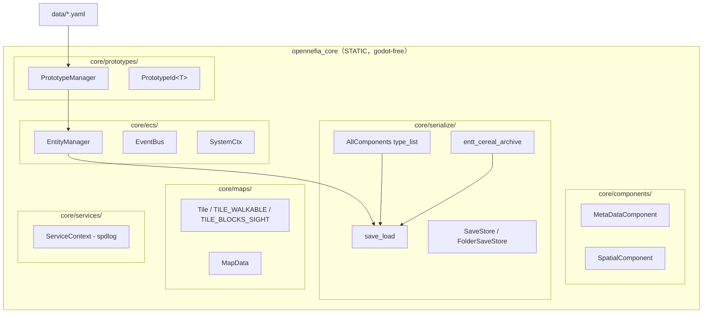

# opennefia-cpp — 架構總結

> 建立於 2026-06-01。本文為 `derived/opennefia-cpp/` 衍生小專案的分析文件，記錄 Phase 0–4（godot-free C++ 核心）完成後的架構決策、實作成果與關鍵坑點。
>
> 源碼位置：`../../derived/opennefia-cpp/`（本工作區相對路徑）。

---

## 1. 專案概覽

### 目標

以 **godot-free 純 C++20 靜態庫**重寫 OpenNefia 的引擎核心，架構藍本取自使用者自有的 `medps`（C++20 4X 模擬核心，EnTT + cereal，25/25 測試綠燈）。

核心命題：OpenNefia 的 C# 架構大量依賴**反射**（DI 注入、系統自動發現、欄位序列化）；C++ 沒有反射，但可以**順著 C++ 的紋理**用更少抽象表達同樣意圖。

### 完成範圍

| 階段 | 內容 | 狀態 |
|---|---|---|
| Phase 0 | CMake 雙目標骨架（godot-free STATIC + 測試）| ✅ 完成 |
| Phase 1 | ECS 地基（EntityManager + EventBus + SystemCtx）| ✅ 完成 |
| Phase 2 | 原型系統（yaml-cpp 載入 + 繼承解析 + spawn）| ✅ 完成 |
| Phase 3 | 序列化三件套（AllComponents + entt_cereal + save_load）| ✅ 完成 |
| Phase 4 | 地圖邏輯 + 整合測試（Tile + MapData + round-trip）| ✅ 完成 |
| F1 | GDExtension 工具鏈 smoke test | ✅ 完成 |
| F2 | 地圖資料橋接 + Image 渲染 | ✅ 完成 |
| F3 | 輸入 + 移動 + Signal + UI | ✅ 完成 |
| NPC AI | wander 系統 + 4 色渲染 + advance_turn | ✅ 完成 |
| FOV | Bresenham 射線視野 + 霧中戰爭渲染 | ✅ 完成 |
| NPC 尋路 | Chebyshev 距離追蹤 + 大 delta 軸優先 | ✅ 完成 |
| 碰撞信號 | hero_bumped_wall / hero_bumped_npc | ✅ 完成 |
| F4 音效 | AudioStreamPlayer 框架（plug-in .ogg 即啟用）| ✅ 完成 |
| NPC 警覺 | alerted + alert_turns + LOS 判定；失去視線後仍追蹤 6 回合 | ✅ 完成 |
| 戰鬥系統 | hero 攻擊 NPC（3 dmg）；NPC 依 CombatStatsComponent 反擊；game_over 偵測 | ✅ 完成 |
| 物品系統 | ItemComponent 回血藥 + 自動拾取 + item_picked_up signal | ✅ 完成 |
| 多樓層 | TILE_STAIR_DOWN + next_floor() + 樓層縮放難度 | ✅ 完成 |
| BSP 地城 | 60×40 BSP 生成，Room struct 控制英雄 / NPC / 物品 / 樓梯落點 | ✅ 完成 |
| 存讀檔 | WorldStateComponent + F5 存 / F9 讀 + game_over 後仍可操作 | ✅ 完成 |

**測試結果**：36 test cases / 139 assertions 全綠（2026-06-02）

### 技術棧

| 功能 | 函式庫 | 版本 |
|---|---|---|
| ECS | EnTT | v3.16.0 |
| 序列化 | cereal | v1.3.2 |
| YAML 原型 | yaml-cpp | 0.8.0 |
| 日誌 | spdlog | v1.14.1 |
| 測試 | doctest | v2.4.11 |
| 構建 | CMake | ≥ 3.14 |

---

## 2. 分層架構



---

## 3. Phase 1 — ECS 地基

### EntityManager（`src/core/ecs/entity_manager.h`）

薄封裝 `entt::registry`，持有一組 `std::vector<SystemFn>` 自由函式；`tick(ctx)` 依序呼叫每個系統。

```cpp
// entity_manager.h:34
using SystemFn = std::function<void(entt::registry&, SystemCtx&)>;
void add_system(SystemFn fn);
void tick(SystemCtx& ctx);
entt::registry& registry();
```

### EventBus（`src/core/ecs/event_bus.h`）

兩層派發：

- **定向（Directed）**：`raise_local<Event>(reg, entity, event)`。用 `void*` 類型抹除，以 `std::type_index` 為鍵分派給訂閱者 lambda。
- **廣播（Broadcast）**：透過 `entt::dispatcher`，`broadcast<Event>()` / `dispatcher().sink<Event>().connect()`。

```cpp
// event_bus.h:18
template<typename Event>
void subscribe(std::function<void(entt::registry&, entt::entity, Event&)> handler) {
    directed_[std::type_index(typeid(Event))].emplace_back(...);
}
template<typename Event>
void raise_local(entt::registry& reg, entt::entity target, Event& ev);
```

---

## 4. Phase 2 — 原型系統

### 設計

- **`PrototypeId<T>`**（`src/core/prototypes/prototype_id.h`）：強型別 id 包裝 `std::string`，以空 Tag 型別區分不同原型域。
- **`PrototypeManager`**（`src/core/prototypes/prototype_manager.h+cpp`）：
  1. `load_file()` — 用 yaml-cpp 讀入 YAML 序列，建立 raw_defs_ map。
  2. `resolve_inheritance()` — DFS 拓撲排序，把父原型的 component 深複製給子原型（flat merge）。
  3. `spawn(em, proto_id)` — 在 EntityManager 建新 entity，對每個已登錄的 `ComponentLoader` 呼叫，生出帶完整 component 的實體。

### ComponentLoader（零反射登錄）

```cpp
// prototype_manager.h:17
using ComponentLoader = std::function<void(entt::registry&, entt::entity, const YAML::Node&)>;
void register_loader(const std::string& type_name, ComponentLoader loader);
```

呼叫方只需：
```cpp
pm.register_loader("Spatial", [](auto& reg, auto e, const auto& n) {
    SpatialComponent s;
    if (n["x"]) s.x = n["x"].as<int>();
    reg.emplace_or_replace<SpatialComponent>(e, s);
});
```

### YAML 格式（`data/test_prototypes.yaml`）

```yaml
- id: BaseEntity
  components:
    Spatial: {x: 0, y: 0}
- id: BaseChara
  parent: BaseEntity
  components:
    MetaData: {name: chara}
- id: Putit
  parent: BaseChara
  components:
    CharaStats: {max_hp: 30, attack: 3}
```

3 層繼承（BaseEntity → BaseChara → Putit / EliteWarrior）+ 獨立 SimpleItem，20 test cases 全綠。

### 關鍵坑：YAML::Node 共享 detail::node 污染

yaml-cpp 的 `YAML::Node` map 複製只複製 handle（引用計數 + 共享底層 `detail::node`）。子原型繼承父原型 component 後，若任一原型對該 node 賦值，會透過 `AssignNode → set_ref` 修改**所有共享 handle**——導致其他所有繼承同一父原型的子類靜默被污染。

**修正**：繼承 merge 時，對父原型每個 component node 呼叫 `YAML::Clone()`，確保獨立的 `detail::node`；子原型自身的 override 也同樣 Clone。

---

## 5. Phase 3 — 序列化三件套

直接移植 medps 已驗證的做法，三個檔案構成完整體系。

### AllComponents（`src/core/serialize/all_components.h`）

```cpp
using AllComponents = entt::type_list<
    MetaDataComponent,
    SpatialComponent,
    MapData,
    NpcAiComponent,        // NPC AI（alerted + alert_turns）
    HealthComponent,       // 戰鬥：英雄 / NPC 生命值
    ItemComponent,         // 物品：回血藥
    CombatStatsComponent,  // NPC 種類：putit / warrior / bat
    WorldStateComponent    // 存讀檔：turn_count / current_floor
>;
```

新增 component 型別只改這裡，save/load 自動覆蓋。

### entt_cereal_archive（`src/core/serialize/entt_cereal_archive.h`）

薄 adapter 橋接 EnTT snapshot API 與 cereal，把 `entt::entity`（強型別 enum）轉成底層整數再存：

```cpp
struct output_archive {
    cereal::PortableBinaryOutputArchive& ar;
    void operator()(entt::entity e) {
        ar(static_cast<std::underlying_type_t<entt::entity>>(e));
    }
    template<typename T>
    void operator()(entt::entity e, const T& c) {
        ar(static_cast<entt_id_t>(e), c);
    }
};
```

### save_load（`src/core/serialize/save_load.h`）

fold expression 展開 AllComponents，單次 `snap.get<Cs>(out)` 覆蓋所有型別：

```cpp
template<typename... Cs>
void save_impl(entt::registry& reg, output_archive& out, entt::type_list<Cs...>) {
    auto snap = entt::snapshot{reg};
    snap.get<entt::entity>(out);
    (snap.get<Cs>(out), ...);    // ← 對每個 component 型別各存一次
}
```

三層 API：stream（`std::ostream`）、path（檔案路徑）、SaveStore（抽象後端）。

### SpatialComponent 的 save/load split

`parent` 欄位型別為 `entt::entity`，無法對稱序列化。改用 cereal 的 asymmetric split：

```cpp
// spatial_component.h:22
template<class Archive>
void save(Archive& ar) const {
    ar(x, y);
    ar(static_cast<std::underlying_type_t<entt::entity>>(parent));
}
template<class Archive>
void load(Archive& ar) {
    ar(x, y);
    std::underlying_type_t<entt::entity> raw{};
    ar(raw);
    parent = static_cast<entt::entity>(raw);
}
```

### 關鍵坑

- `entt::entity == entt::null_t` 在 doctest `CHECK()` 中與 EnTT 的 template `operator==<T>` 產生 C2593 歧義 → 先求值成 `bool` 再 `CHECK(parent_null)`。
- `std::string` 序列化需 `#include <cereal/types/string.hpp>`；`std::vector` 需 `<cereal/types/vector.hpp>`（兩者均無則 cereal static_assert「找不到序列化函式」）。

---

## 6. Phase 4 — 地圖邏輯

### MapData（`src/core/maps/map_data.h`）

稠密 tile 網格掛在**單一地圖 entity** 上（仿 medps Rimworld-style，不是一格一 entity）：

```cpp
struct MapData {
    int width{0}, height{0};
    std::vector<Tile> tiles;
    std::vector<uint8_t> visible;   // 執行期；不序列化
    std::vector<uint8_t> explored;  // 執行期；不序列化（霧中戰爭）

    void resize(int w, int h);      // 一次初始化 tiles + visible + explored
    bool in_bounds(int x, int y) const;
    Tile& at(int x, int y);
    Tile* get(int x, int y);        // 越界返回 nullptr（無 const 版）

    bool is_visible(int x, int y)  const;
    bool is_explored(int x, int y) const;
    void set_visible(int x, int y, bool v);
    void reset_visible();           // 每次 compute_fov 前清零

    // split save/load：load 後重新配置 visible/explored 為全零
    template<class Archive> void save(Archive& ar) const { ar(width, height, tiles); }
    template<class Archive> void load(Archive& ar) { ar(width, height, tiles);
        visible.assign((size_t)width*height, 0); explored.assign((size_t)width*height, 0); }
};
```

column-major 索引（`x * height + y`）。`visible`/`explored` 是執行期快取，不序列化；`load()` 後以 0 重新填滿，FOV 在下次 `_ready()` / `advance_turn()` 重算。

### Tile（`src/core/maps/tile.h`）

```cpp
inline constexpr uint8_t TILE_WALKABLE     = 1 << 0;
inline constexpr uint8_t TILE_BLOCKS_SIGHT = 1 << 1;

struct Tile {
    uint16_t terrain{0};
    uint8_t  flags{0};
    bool is_walkable()   const { return (flags & TILE_WALKABLE) != 0; }
    bool blocks_sight()  const { return (flags & TILE_BLOCKS_SIGHT) != 0; }
    template<class Archive> void serialize(Archive& ar) { ar(terrain, flags); }
};
```

### Phase 4 整合測試（`tests/src/test_phase4.cpp`）

完整驗證 PROJECT.md §5 完成定義：

```
原型生成（yaml-cpp，Putit 原型）
→ 地圖可走性設定（20×20，y=5 整行可走，x=10 為牆）
→ 移動系統 tick 3 回合（hero: x=3→4→5→6，牆在 x=10 正確阻擋）
→ FolderSaveStore save（"world" slot）
→ EntityManager 清空
→ restore from store
→ 驗證 hero.x==6、map tile 旗標正確
```

另有：牆阻擋測試（英雄無法走入不可走格）、多實體並存（地圖 + hero + NPC 同時序列化 round-trip）。

---

## 7. 構建細節

### CMake 相容性（`CMakeLists.txt`）

yaml-cpp 0.8.0 與 doctest v2.4.11 的 `cmake_minimum_required(VERSION 2.8.12)` 在 CMake 4.0+ 下報錯（4.0+ 移除 `< 3.5` 的向後相容性）。修正：

```cmake
if(NOT DEFINED CMAKE_POLICY_VERSION_MINIMUM)
    set(CMAKE_POLICY_VERSION_MINIMUM "3.5" CACHE STRING
        "Allow FetchContent deps that still declare cmake_minimum_required < 3.5")
endif()
```

### MSVC 2022 特有問題

**doctest 的 ostream forward declaration**：doctest v2.4.11 在沒有完整 `<sstream>` 的情況下前向宣告 `std::basic_ostream`，但 MSVC 2022 的 `string_view::operator<<` 需要完整 ostream 型別。修正：

```cmake
target_compile_definitions(opennefia_test PRIVATE DOCTEST_CONFIG_USE_STD_HEADERS)
```

---

## 8. 目錄結構（最終）

```
derived/opennefia-cpp/
├── CMakeLists.txt
├── PROJECT.md
├── CLAUDE.md
├── data/
│   └── test_prototypes.yaml
├── src/core/
│   ├── version.h / version.cpp
│   ├── ecs/          entity_manager.h+cpp, event_bus.h, system_ctx.h
│   ├── components/   meta_data_component.h, spatial_component.h, npc_ai_component.h,
│   │                  health_component.h, item_component.h, combat_stats_component.h,
│   │                  world_state_component.h
│   ├── prototypes/   prototype_id.h, prototype.h, prototype_manager.h+cpp
│   ├── serialize/    all_components.h, entt_cereal_archive.h, save_load.h, save_store.h
│   ├── maps/         tile.h, map_data.h（+ visible/explored FOV 陣列）
│   ├── systems/      npc_ai_system.h+cpp, fov_system.h+cpp
│   ├── services/     service_context.h+cpp
│   └── util/         vector2i.h, resource_path.h
├── tests/
│   ├── CMakeLists.txt
│   └── src/
│       ├── main.cpp
│       ├── smoke_test.cpp     (Phase 0)
│       ├── test_ecs.cpp       (Phase 1: 8 cases)
│       ├── test_prototypes.cpp(Phase 2: 12 cases)
│       ├── test_serialize.cpp (Phase 3: 9 cases)
│       └── test_phase4.cpp    (Phase 4: 7 cases)
└── docs/
    ├── 01_core_architecture.md
    ├── 02_subsystem_mapping.md
    └── 03_roadmap.md
```

---

## 9. 三大反射難題的實際解法（對照 analysis/OpenNefia/details/plan_cpp/05_lessons_from_medps.md）

| 難題 | OpenNefia C# 做法 | opennefia-cpp 實作 |
|---|---|---|
| ① 依賴注入 | `[Dependency]` 反射注入 | `SystemCtx` 顯式傳遞；服務用 `ServiceContext` 強型別單例 |
| ② 序列化 | `[DataField]` 反射讀寫 | `AllComponents type_list` + fold expression + cereal adapter |
| ③ 系統發現 | Assembly 掃描 `GetAllChildren<IEntitySystem>` | `add_system()` 顯式 vector 登錄；系統為自由函式 lambda |

---

## 10. 未來工作（F1–F4，暫緩）

- **F1 前端綁定**：建 `gbind/`（仿 medps），`opennefia_gd` GDExtension 目標，把核心狀態 / 事件以 POD 橋接給 Godot。
- **F2 渲染**：Godot TileMapLayer 畫 tile 層；Sprite2D / MultiMesh 畫實體；FOV overlay。
- **F3 UI**：Godot Control / .tscn 取代 Wisp（**不移植 XAML**）；UI 邏輯仍在核心。
- **F4 輸入 / 音效**：Godot InputMap action ↔ 核心指令；AudioStreamPlayer 接核心音效事件。

---

---

## 11. GDExtension 橋接層（F1–F3，2026-06-02）

godot-free 核心完成後，以 `src/gbind/` 建立薄殼 GDExtension facade，把核心狀態橋接給 Godot 4。

### 技術棧補充

| 新增項目 | 說明 |
|---|---|
| godot-cpp | v4.4（本地 checkout：`projects/godot-cpp`） |
| 構建開關 | `-DOPENNEFIA_BUILD_GDEXTENSION=ON` |
| 輸出 | `opennefia_gd.dll`（約 5 MB，含 godot-cpp bindings） |
| 測試專案 | `godot_test/`（`.gdextension` + `project.godot` + GDScript） |

### F1 — 工具鏈 smoke test（`src/gbind/opennefia_core_gd.h/.cpp`）

```cpp
// OpenNefiaCore : RefCounted — 最小 facade，驗證工具鏈端到端
class OpenNefiaCore : public godot::RefCounted {
    GDCLASS(OpenNefiaCore, godot::RefCounted)
public:
    godot::String version() const;  // 呼叫 opennefia::version()，回傳核心版本字串
};
```

GDScript 呼叫：`OpenNefiaCore.new().version()` → `"0.0.1-alpha"`。

### F2 — 地圖資料橋接 + Image 渲染（`src/gbind/opennefia_world_gd.h/.cpp`）

```cpp
// OpenNefiaWorld : Node — 持有模擬狀態，_ready() 建 20×15 測試世界
class OpenNefiaWorld : public godot::Node {
    GDCLASS(OpenNefiaWorld, godot::Node)
    opennefia::EntityManager em_;
    opennefia::ServiceContext svc_;
    entt::entity map_entity_{ entt::null };
    entt::entity hero_entity_{ entt::null };
public:
    int  get_map_width() const;
    int  get_map_height() const;
    bool is_walkable(int x, int y) const;
    godot::Ref<godot::Image> generate_map_image(int cell_px) const;
};
```

`generate_map_image()` 回傳 `FORMAT_RGB8 Image`（floor=棕 / wall=暗 / hero=黃），GDScript 一行轉 `ImageTexture` 掛 `Sprite2D`。

**設計依據**（`core_data_layer_design.md` §4 四大橋接慣例）：
- 持有狀態的模擬引擎 → 繼承 `Node`（有場景樹生命週期）
- 資料本體跨幀存活 → 持有 `EntityManager` 成員（不是每幀重建）
- 無狀態工具 → 用 `RefCounted`（F1 的 `OpenNefiaCore`）

### F3 — 輸入 → 移動 → Signal → UI（新增方法）

```cpp
bool move(int dx, int dy);   // walkable 檢查 + hero 移動 + emit world_changed
void wait_turn();             // 推進回合 + emit world_changed
int  get_hero_x() const;
int  get_hero_y() const;
int  get_turn_count() const;
// ADD_SIGNAL(MethodInfo("world_changed"));
```

GDScript 端：
```gdscript
world.world_changed.connect(_on_world_changed)  # 連接 signal
# _unhandled_input 中：
world.move(0, -1)   # 向上移動（walkable 才成功）
world.wait_turn()   # 等待
# _on_world_changed 中：
sprite.texture = ImageTexture.create_from_image(world.generate_map_image(16))
info_label.text = "Hero: (%d,%d)  Turn: %d" % [world.get_hero_x(), world.get_hero_y(), world.get_turn_count()]
```

**完整輸入 → 核心 → 渲染迴路**：玩家按鍵 → GDScript 呼叫 `move()` → 核心檢查 walkable → 移動成功 → emit `world_changed` → GDScript 重新生成 Image → 刷新 Sprite2D + Label。

### gbind/ 目錄結構（NPC AI + FOV + F4 完成後）

```
src/gbind/
├── register_types.h/.cpp      — GDExtension 進入點（opennefia_library_init）
├── opennefia_core_gd.h/.cpp   — OpenNefiaCore : RefCounted（version）
└── opennefia_world_gd.h/.cpp  — OpenNefiaWorld : Node
                                   （地圖 + FOV + NPC AI + 碰撞信號 + 音效信號）

godot_test/
├── opennefia.gdextension      — entry_symbol + compatibility_minimum 4.4
├── project.godot
├── smoke_test.gd              — F1 驗證腳本
├── map_view.gd                — 完整迴路（F2/F3/F4 + FOV + signals）
└── bin/
    └── opennefia_gd.dll       — ~5 MB
```

---

---

## 12. NPC AI、FOV、碰撞信號與 F4 音效（2026-06-02）

### 12.1 NpcAiComponent（`src/core/components/npc_ai_component.h`）

空 struct，作為「NPC 可被 AI 系統操控」的 tag。已加入 `AllComponents`（可序列化）。

```cpp
struct NpcAiComponent {
    template<class Archive>
    void serialize(Archive& ar) { /* 目前無需持久欄位 */ }
};
```

**EnTT 空型別注意事項**：EnTT 對沒有資料成員的 struct 使用特殊 storage，`registry::emplace<T>()` 回傳 `void` 而非 `T&`。`EntityManager::emplace` 原本宣告回傳 `C&`，在 `C = NpcAiComponent` 時觸發 MSVC C2440。**修正**：把回傳型別改成 `decltype(auto)`，讓 wrapper 自動跟隨 EnTT 的行為。

```cpp
// entity_manager.h:28
template<typename C, typename... Args>
decltype(auto) emplace(entt::entity e, Args&&... args) {
    return reg_.emplace<C>(e, std::forward<Args>(args)...);
}
```

### 12.2 FOV 視野系統（`src/core/systems/fov_system.h+cpp`）

使用 **Bresenham 直線演算法**做 LOS（Line of Sight）判定，對半徑內每格投射射線：

```cpp
// fov_system.cpp
static bool has_los(const MapData& map, int x0, int y0, int x1, int y1);
void compute_fov(MapData& map, int ox, int oy, int radius);
```

- 起點（觀察者）永遠可見，不做 `blocks_sight` 檢查。
- 終點是牆時仍回傳 true（可「看到」牆面）。
- 複雜度 O(R³)，radius = 8 在 20×15 地圖下效能可接受。
- 每次 `advance_turn()` 前呼叫（先算英雄新位置的視野，再 tick NPC）。

### 12.3 NPC 追蹤行為（`src/core/systems/npc_ai_system.cpp`）

NPC 行為升級為**二段切換**：

| 條件 | 行為 |
|---|---|
| Chebyshev 距離 ≤ 8（英雄在附近） | 追蹤：大 delta 軸優先的 4 方向移動，不踩英雄格 |
| 距離 > 8 / 追蹤被擋住 | Wander：從隨機方向起始，嘗試 4 方向中第一個可走格 |

```cpp
// 找英雄：非 NPC 中有 SpatialComponent 者
for (auto e : reg.view<SpatialComponent>(entt::exclude<NpcAiComponent>)) {
    hero_ent = e; break;
}
// 追蹤：大 delta 軸優先
int ax = abs(hdx), ay = abs(hdy);
int try_x[2] = {ax >= ay ? cx : 0, ax >= ay ? 0 : cx};
int try_y[2] = {ax >= ay ? 0 : cy, ax >= ay ? cy : 0};
```

### 12.4 碰撞信號（`OpenNefiaWorld`）

`move(dx, dy)` 拆成三條路徑：

| 情況 | 行為 | 回傳 | 信號 |
|---|---|---|---|
| 越界 / 牆 | 不移動 | `false` | `hero_bumped_wall` |
| 走入 NPC 格 | 推進回合（NPC 移動）| `true` | `hero_bumped_npc(npc_id)` |
| 正常可走格 | 移動 → 推進回合 | `true` | `world_changed`（從 advance_turn） |

### 12.5 FOV 渲染三層（`generate_map_image`）

```cpp
if      (map.is_visible(x, y))   c = 原色（地板/牆）;
else if (map.is_explored(x, y))  c = 原色 × 0.4 （暗色，霧中戰爭）;
else                             c = black;

// NPC：只在可見格顯示（紅）
if (map.is_visible(sp.x, sp.y)) img->fill_rect(..., npc_color);
// Hero：永遠顯示（黃），疊在最上層
img->fill_rect(..., hero_color);
```

### 12.6 F4 音效框架（`godot_test/map_view.gd`）

三個 `AudioStreamPlayer` 節點連接碰撞信號：

```gdscript
world.hero_bumped_wall.connect(_on_hero_bumped_wall)   # → sfx_wall.play()
world.hero_bumped_npc.connect(_on_hero_bumped_npc)     # → sfx_bump_npc.play()
# world_changed 同時播 sfx_step.play()
# 若 stream 為空（無音效檔）則靜默
```

放入 `.ogg` / `.wav` 並取消 `sfx_*.stream = load(...)` 的注釋即可啟用。

---

---

## 13. 戰鬥、物品、多樓層、NPC 警覺、BSP 地城與存讀檔（2026-06-02）

### 13.1 NpcAiComponent — 警覺狀態升級

從空 struct（NPC AI 初版）升級為帶持久狀態的元件：

```cpp
// npc_ai_component.h
struct NpcAiComponent {
    bool alerted{ false };    // 曾看見英雄，正在追蹤
    int  alert_turns{ 0 };    // 失去 LOS 後剩餘追蹤回合

    template<class Archive>
    void serialize(Archive& ar) { ar(alerted, alert_turns); }
};
```

**警覺狀態機**（`npc_ai_system.cpp`）：

1. LOS 判定：`opennefia::los(map, npc_pos, hero_pos)`（複用 `fov_system.cpp`）+ Chebyshev ≤ 10。
2. LOS 成立 → `alerted = true; alert_turns = 6`（記住 6 回合）。
3. LOS 失效 → `--alert_turns; if (alert_turns <= 0) alerted = false`。
4. `alerted == true` → 追蹤模式；否則 → wander 模式。

### 13.2 戰鬥系統

| 方向 | 觸發 | 傷害 | 結果 |
|---|---|---|---|
| 英雄攻擊 NPC | hero 走入 NPC 所在格 | 固定 3 HP | NPC 死亡：`reg.destroy(e)` + `npc_died(npc_id)` signal |
| NPC 攻擊英雄 | NPC 追蹤且 Chebyshev == 1 | `CombatStatsComponent::attack` | 英雄 HP -= dmg；`advance_turn()` 末偵測 `hp <= 0` → `game_over` signal |

```cpp
// npc_ai_system.cpp — NPC 鄰接攻擊
if (chebyshev == 1) {
    int dmg = 2;
    if (const auto* stats = reg.try_get<CombatStatsComponent>(e))
        dmg = stats->attack;
    hero_hp->hp -= dmg;
}

// opennefia_world_gd.cpp — advance_turn() 末尾
if (hp->hp <= 0) { game_over_ = true; emit_signal("game_over"); }
```

### 13.3 CombatStatsComponent（`src/core/components/combat_stats_component.h`）

```cpp
enum class NpcVariant : uint8_t { putit=0, warrior=1, bat=2 };

struct CombatStatsComponent {
    int        attack{ 2 };
    int        move_chance{ 50 };   // 行動機率 0-100（每回合骰到才移動）
    NpcVariant variant{ NpcVariant::putit };
    template<class Archive>
    void serialize(Archive& ar) { ar(attack, move_chance, variant); }
};
```

| 種類 | HP（基礎 + 樓層） | 攻擊 | 移動機率 | 渲染顏色 |
|---|---|---|---|---|
| Putit | 6 + (floor-1) | 1 | 40% | 紫 (0.6, 0.2, 0.7) |
| Warrior | 15 + (floor-1)×3 | 3 | 65% | 橙 (0.9, 0.5, 0.1) |
| Bat | 5 + (floor-1) | 2 | 90% | 青 (0.2, 0.8, 0.9) |

### 13.4 ItemComponent（`src/core/components/item_component.h`）

```cpp
enum class ItemType : uint8_t { health_potion = 0 };
struct ItemComponent {
    ItemType type{ ItemType::health_potion };
    int      value{ 8 };   // 回血量，深層遞增：8 + (floor-1)*2
    template<class Archive>
    void serialize(Archive& ar) { ar(type, value); }
};
```

物品以**綠點**渲染（`Color(0.20, 0.85, 0.40)`），只在 FOV 可見格顯示，層級低於 NPC。英雄走入物品格 → 自動拾取 → `hp = min(hp + value, max_hp)` → `emit item_picked_up(name, heal_amount)`。

### 13.5 多樓層（`TILE_STAIR_DOWN` + `next_floor()`）

```cpp
// tile.h — 新旗標
inline constexpr uint8_t TILE_STAIR_DOWN = 1 << 2;
bool is_stair_down() const { return (flags & TILE_STAIR_DOWN) != 0; }
```

樓梯放在 BSP 地城**最後一個房間**中心（需至少 2 個房間）。英雄踩到 → `next_floor()`：

```cpp
void next_floor() {
    ++current_floor_;
    setup_map();     // 銷毀舊 NPC + 物品 + 地圖，重新生成；英雄保留 HP
    recompute_fov();
    emit_signal("floor_changed", current_floor_);
    emit_signal("world_changed");
}
```

NPC 數量與難度隨樓層遞增：`npc_cap = min(4 + current_floor, 8)`；深層向 warrior / bat 偏移。

### 13.6 BSP 地城生成（`src/core/maps/map_gen.h+cpp`）

60×40 地圖，BSP（Binary Space Partitioning）演算法生成房間與走廊。回傳 `std::vector<Room>`：

- `rooms[0]`：英雄出生點。
- `rooms[1..n-2]`：NPC + 物品（中間房間，60% 機率生成回血藥）。
- `rooms.back()`：樓梯（≥ 2 個房間時設置）。

### 13.7 WorldStateComponent 與存讀檔

**設計動機**：`turn_count_` / `current_floor_` 是 C++ 成員變數，不在 ECS 中。需一個不依賴 sidecar 的辦法讓它們隨 `save/load` 持久化。

**解法**：建 `WorldStateComponent` 掛在 `map_entity_` 上，加入 `AllComponents` → 隨 snapshot 一併序列化。

```cpp
// world_state_component.h
struct WorldStateComponent {
    int turn_count{ 0 };
    int current_floor{ 1 };
    template<class Archive>
    void serialize(Archive& ar) { ar(turn_count, current_floor); }
};
```

**存檔流程**（`save_game(path)`）：
1. 同步 `turn_count_` / `current_floor_` → `WorldStateComponent`。
2. `opennefia::serialize::save(em_.registry(), path)` — cereal PortableBinary。

**讀檔流程**（`load_game(path)`）：
1. `em_.registry().clear()` — 清空 ECS；`systems_` vector 不受影響，`systems_ready_` 保持 `true`。
2. `opennefia::serialize::load(em_.registry(), path)` — snapshot_loader 還原全部實體。
3. `map_entity_` ← 首個持有 `MapData` 的實體；`hero_entity_` ← `MetaDataComponent::proto_id == "hero"`。
4. 從 `WorldStateComponent` 還原 `turn_count_` / `current_floor_`。
5. `recompute_fov()` + emit `world_changed`。

**F5/F9 GDScript 整合**（`godot_test/map_view.gd`）：
- `ProjectSettings.globalize_path("user://opennefia_save.bin")` 取得真實檔案路徑。
- F5/F9 在 `_unhandled_input` 的 `if _dead: return` 前攔截，允許 game_over 後仍可存/讀。
- 讀檔成功後設 `_dead = false`，恢復玩家輸入。

---

*真實來源（source of truth）為 `derived/opennefia-cpp/` 目錄下的源碼與 `docs/*.md`。本文件為分析摘要層，便於跨專案引用。*
