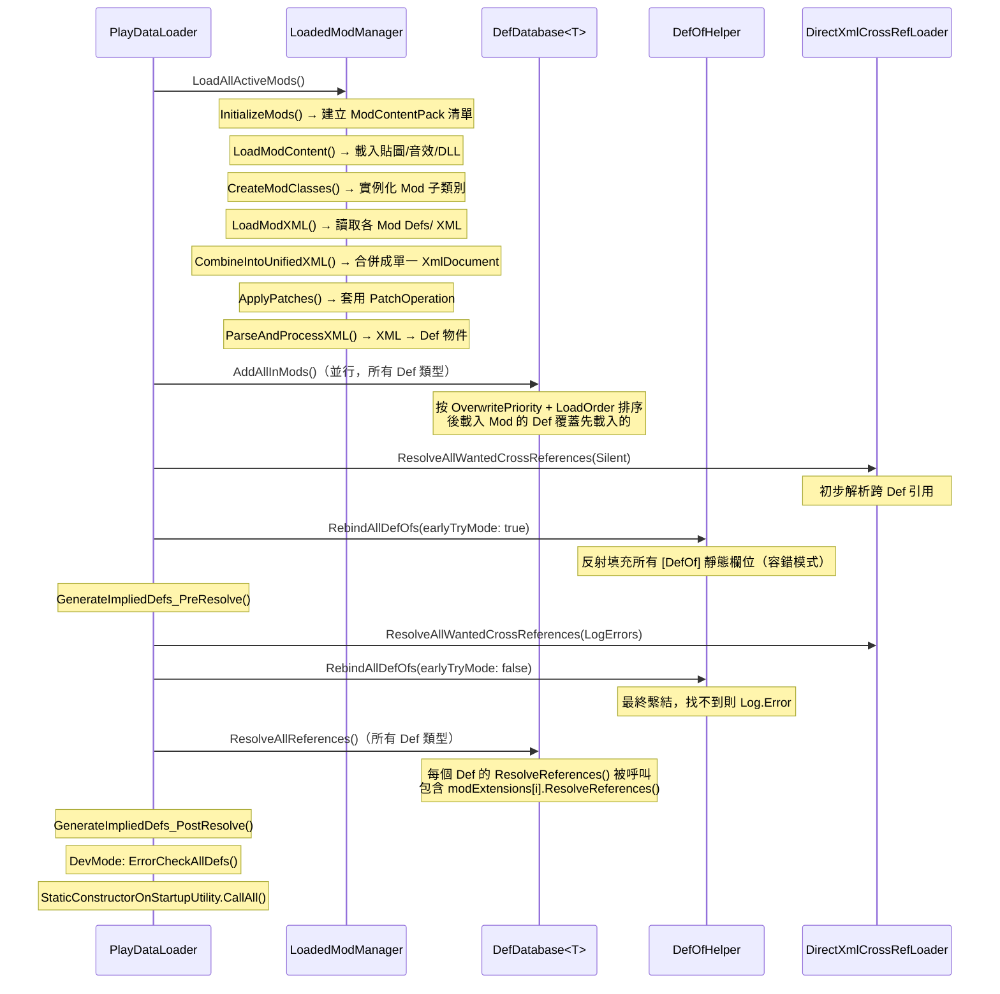

# Def 系統與 Mod 工具鏈架構分析

> 核對於 2026-06-01，對照 RimWorld 1.6/Odyssey 反編譯源碼（`projects/rimworld/`）。

## 目錄

1. [Def 基底類別](#1-def-基底類別)
2. [Def 生命週期](#2-def-生命週期)
3. [DefDatabase\<T\>：全局靜態字典](#3-defdatabaset全局靜態字典)
4. [DefOf 靜態類別與反射注入機制](#4-defof-靜態類別與反射注入機制)
5. [XML 載入管線](#5-xml-載入管線)
6. [XmlInheritance：XML 繼承系統](#6-xmlinheritancexml-繼承系統)
7. [PatchOperation：XML 層級 Mod 合併](#7-patchoperationxml-層級-mod-合併)
8. [ThingDef 特殊結構](#8-thingdef-特殊結構)
9. [DefModExtension 機制](#9-defmodextension-機制)
10. [Mod 工具鏈架構](#10-mod-工具鏈架構)
11. [整體載入流程時序](#11-整體載入流程時序)

---

## 1. Def 基底類別

**來源**：`Verse/Def.cs`

所有遊戲資料定義（武器、種族、地形、配方…）都繼承自 `Def`，`Def` 本身繼承自 `Editable`。

```csharp
// Verse/Def.cs:8
public class Def : Editable, IEquatable<Def>
```

### 1.1 核心欄位

| 欄位 | 型別 | 說明 |
|---|---|---|
| `defName` | `string` | 唯一識別字串，預設 `"UnnamedDef"`；只允許字母/數字/底線/連字號 |
| `label` | `string` | 玩家可見的人類可讀名稱（需翻譯） |
| `description` | `string` | 檢視時顯示的說明文字（需翻譯） |
| `modExtensions` | `List<DefModExtension>` | Mod 附加資料清單（詳見第 9 節） |
| `shortHash` | `ushort` | 執行期短雜湊，用於網路同步 |
| `index` | `ushort` | 在 `DefDatabase` 清單中的位置索引 |
| `modContentPack` | `ModContentPack` | 標記此 Def 來自哪個 Mod（`[Unsaved]`，不存檔） |
| `fileName` | `string` | 來源 XML 檔名（`[Unsaved]`） |

`[Unsaved(false)]` 代表欄位在執行期填充、不序列化進存檔。

### 1.2 Editable 基底

```csharp
// Verse/Editable.cs:6
public class Editable
{
    public virtual void ResolveReferences() { }
    public virtual void PostLoad() { }
    public virtual IEnumerable<string> ConfigErrors()
        => Enumerable.Empty<string>();
}
```

`Def` 的整個生命週期方法都透過 `Editable` 繼承而來，子類別覆寫即可掛進載入管線。

---

## 2. Def 生命週期

載入管線按順序觸發以下四個階段（詳細時序見第 11 節）：

```
XML 解析 → 反射實例化 → ResolveReferences() → PostLoad() → ConfigErrors()
```

| 階段 | 何時執行 | 典型用途 |
|---|---|---|
| **XML 解析 / 反射實例化** | `DirectXmlToObject` / `DirectXmlToObjectNew` 呼叫 | 把 XML 節點對應到 C# 物件欄位 |
| **`ResolveReferences()`** | `DefDatabase<T>.ResolveAllReferences()` | 解析跨 Def 的字串引用（例如把 `defName` 字串換成 Def 物件指標）；`Def.ResolveReferences()` 也會逐一呼叫 `modExtensions[i].ResolveReferences(this)` |
| **`PostLoad()`** | 反射實例化後緊接呼叫（由 `DirectXmlToObject` 負責） | 計算衍生值、快取欄位 |
| **`ConfigErrors()`** | 僅在 DevMode 下執行（`PlayDataLoader` 最末段） | 回報設定錯誤；`Def.ConfigErrors()` 已驗證 defName 格式、description 格式、modExtensions 的 ConfigErrors |

`Def.ResolveReferences()` 實作（`Verse/Def.cs:93`）：

```csharp
public override void ResolveReferences()
{
    base.ResolveReferences();
    if (modExtensions != null)
        for (int i = 0; i < modExtensions.Count; i++)
            modExtensions[i].ResolveReferences(this);
}
```

---

## 3. DefDatabase\<T\>：全局靜態字典

**來源**：`Verse/DefDatabase.cs`

```csharp
// Verse/DefDatabase.cs:8
public static class DefDatabase<T> where T : Def
{
    private static readonly List<T>            defsList    = new List<T>();
    private static readonly Dictionary<string,T> defsByName = new Dictionary<string,T>();
    private static readonly Dictionary<ushort,T> defsByShortHash = new Dictionary<ushort,T>();
    ...
}
```

每種 Def 類型都有獨立的靜態實例，例如 `DefDatabase<ThingDef>`、`DefDatabase<RecipeDef>`。

### 3.1 核心 API

| 方法 | 說明 |
|---|---|
| `DefDatabase<T>.GetNamed(string, bool)` | 以 defName 查詢；`errorOnFail=true` 時找不到會 Log.Error |
| `DefDatabase<T>.GetNamedSilentFail(string)` | 找不到時靜默回傳 null |
| `DefDatabase<T>.AllDefs` | 所有已載入 Def 的 IEnumerable |
| `DefDatabase<T>.AllDefsListForReading` | 直接暴露內部 List，效能較佳 |
| `DefDatabase<T>.Add(T)` | 手動加入（遊戲啟動後通常不呼叫） |
| `DefDatabase<T>.ResolveAllReferences()` | 呼叫所有 Def 的 `ResolveReferences()` |
| `DefDatabase<T>.ErrorCheckAllDefs()` | DevMode 下呼叫所有 Def 的 `ConfigErrors()` |

### 3.2 AddAllInMods：Mod 載入順序

```csharp
// Verse/DefDatabase.cs:22
public static void AddAllInMods()
{
    // 先依 OverwritePriority（Core=0, 其他=1），再依 LoadOrder 排序
    foreach (ModContentPack item in LoadedModManager.RunningMods
        .OrderBy(m => m.OverwritePriority)
        .ThenBy(x => LoadedModManager.RunningModsListForReading.IndexOf(x)))
    {
        foreach (T item2 in GenDefDatabase.DefsToGoInDatabase<T>(item))
        {
            AddDef(item2, item.ToString());
        }
    }
    // 最後加入透過 PatchOperation 新建的 Def
    foreach (T item3 in LoadedModManager.PatchedDefsForReading.OfType<T>())
        AddDef(item3, "Patches");
}
```

關鍵邏輯：**後載入的 Mod 遇到 defName 衝突時，會先 Remove 舊的再 Add 新的**（`Verse/DefDatabase.cs:54`），實現覆蓋（override）語意：

```csharp
if (defsByName.TryGetValue(def.defName, out var value))
    Remove(value);
Add(def);
```

---

## 4. DefOf 靜態類別與反射注入機制

### 4.1 `[DefOf]` Attribute

**來源**：`RimWorld/DefOf.cs:6`

```csharp
[AttributeUsage(AttributeTargets.Class)]
public class DefOf : Attribute { }
```

任何掛上 `[DefOf]` 的靜態類別，其公開靜態欄位都會在啟動時被自動填充。

### 4.2 DefOf 靜態類別的標準寫法

```csharp
// RimWorld/AbilityDefOf.cs（節錄）
[DefOf]
public static class AbilityDefOf
{
    [MayRequireRoyalty]
    public static AbilityDef Speech;

    [MayRequireBiotech]
    public static AbilityDef ReimplantXenogerm;

    static AbilityDefOf()
    {
        DefOfHelper.EnsureInitializedInCtor(typeof(AbilityDefOf));
    }
}
```

靜態建構子呼叫 `EnsureInitializedInCtor()`：若在 DefOf 尚未注入時被提早存取，會印出警告。

### 4.3 DefOfHelper：反射注入實作

**來源**：`RimWorld/DefOfHelper.cs`

```csharp
// RimWorld/DefOfHelper.cs:14
public static void RebindAllDefOfs(bool earlyTryMode)
{
    earlyTry = earlyTryMode;
    bindingNow = true;
    Parallel.ForEach(GenTypes.AllTypesWithAttribute<DefOf>(), BindDefsFor);
    bindingNow = false;
}

private static void BindDefsFor(Type type)
{
    FieldInfo[] fields = type.GetFields(BindingFlags.Static | BindingFlags.Public);
    foreach (FieldInfo fieldInfo in fields)
    {
        // 處理 [MayRequire] / [MayRequireAnyOf] 條件
        // 以欄位名稱（或 [DefAlias] 指定名稱）查詢 DefDatabase
        Def def = GenDefDatabase.GetDef(fieldType, text, flag);
        fieldInfo.SetValue(null, def);  // 反射寫入靜態欄位
    }
}
```

`GenDefDatabase.GetDef()` 內部使用反射快取，呼叫對應 `DefDatabase<T>.GetNamed()`（`Verse/GenDefDatabase.cs:26`）。

### 4.4 兩次 RebindAllDefOfs

`PlayDataLoader.DoPlayLoad()` 呼叫兩次：

| 時機 | 參數 | 說明 |
|---|---|---|
| 早期（`Verse/PlayDataLoader.cs:131`） | `earlyTryMode: true` | 找不到時不報錯，允許部分 Def 尚未載入 |
| 最終（`Verse/PlayDataLoader.cs:195`） | `earlyTryMode: false` | 找不到時報 Error |

---

## 5. XML 載入管線

**核心協調者**：`LoadedModManager`（`Verse/LoadedModManager.cs`）

### 5.1 完整流程

`LoadedModManager.LoadAllActiveMods()` 的執行步驟（`Verse/LoadedModManager.cs:26`）：

```
1. XmlInheritance.Clear()          — 清除繼承快取
2. InitializeMods()                 — 初始化 ModContentPack 清單
3. LoadModContent()                 — 載入貼圖/音效/DLL（ReloadContent）
4. CreateModClasses()               — 反射實例化所有 Mod 子類別
5. LoadModXML()                     — 各 Mod 讀取 Defs/ 目錄下的 XML
6. CombineIntoUnifiedXML()          — 合併成單一 XmlDocument（根節點 <Defs>）
7. TKeySystem.Parse()               — 解析翻譯 key 系統
8. ErrorCheckPatches()              — 驗證 Patch 設定
9. ApplyPatches()                   — 套用所有 PatchOperation
10. ParseAndProcessXML()            — 解析統一 XML → Def 物件實例
11. ClearCachedPatches()            — 清除 Patch 快取
12. XmlInheritance.Clear()          — 再次清除繼承快取
```

### 5.2 LoadModXML：逐 Mod 讀取 XML

```csharp
// Verse/LoadedModManager.cs:245
public static List<LoadableXmlAsset> LoadModXML(bool hotReload = false)
{
    List<LoadableXmlAsset> list = new List<LoadableXmlAsset>();
    for (int i = 0; i < runningMods.Count; i++)
        list.AddRange(runningMods[i].LoadDefs(hotReload));
    return list;
}
```

`ModContentPack.LoadDefs()` 呼叫 `DirectXmlLoader.XmlAssetsInModFolder(this, "Defs/")` 取得該 Mod 的所有 XML 資產（`Verse/ModContentPack.cs:249`）。

### 5.3 DirectXmlLoader：並行讀取 XML

**來源**：`Verse/DirectXmlLoader.cs`

`XmlAssetsInModFolder()` 以兩條背景執行緒平行讀取 XML 檔案（`Verse/DirectXmlLoader.cs:48`），返回 `LoadableXmlAsset[]`。

`DefFromNode()`（`Verse/DirectXmlLoader.cs:159`）是舊版 XML 反序列化器；1.6 預設使用 `DirectXmlToObjectNew.DefFromNodeNew()`（`Verse/DirectXmlToObjectNew.cs:164`），透過命令列 `--legacy-xml-deserializer` 才退回舊版。

### 5.4 CombineIntoUnifiedXML：合併為單一文件

```csharp
// Verse/LoadedModManager.cs:304
public static XmlDocument CombineIntoUnifiedXML(...)
{
    XmlDocument xmlDocument = new XmlDocument();
    xmlDocument.AppendChild(xmlDocument.CreateElement("Defs"));
    foreach (LoadableXmlAsset xml in xmls)
        foreach (XmlNode childNode in xml.xmlDoc.DocumentElement.ChildNodes)
        {
            XmlNode xmlNode = xmlDocument.ImportNode(childNode, deep: true);
            assetlookup[xmlNode] = xml;         // 記錄每個節點的來源 Mod
            xmlDocument.DocumentElement.AppendChild(xmlNode);
        }
    return xmlDocument;
}
```

所有 Mod 的 XML 節點都被合入同一份文件，並以 `assetlookup` 字典保留「節點 → 來源 Mod」的映射，後續可回溯每個 Def 的所屬 Mod。

### 5.5 ParseAndProcessXML：Def 實例化

**來源**：`Verse/LoadedModManager.cs:329`

1. 逐節點呼叫 `XmlInheritance.TryRegister()` 登記繼承關係
2. 呼叫 `XmlInheritance.Resolve()` 展開繼承樹
3. 對每個非 Abstract 節點：
   - 檢查 `MayRequire` / `MayRequireAnyOf` attribute（條件式載入）
   - 呼叫 `DirectXmlToObjectNew.DefFromNodeNew()` 或 `DirectXmlLoader.DefFromNode()` 建立 Def 物件
   - 透過 `assetlookup` 找到所屬 ModContentPack，呼叫 `modContentPack.AddDef(def)`

---

## 6. XmlInheritance：XML 繼承系統

**來源**：`Verse/XmlInheritance.cs`

XML 中可以用 `Name=` 定義抽象父節點，子節點用 `ParentName=` 繼承：

```xml
<!-- 抽象基底（不會產生 Def 物件） -->
<ThingDef Name="BasePlant" Abstract="True">
  <category>Plant</category>
  <statBases>
    <MaxHitPoints>85</MaxHitPoints>
  </statBases>
</ThingDef>

<!-- 繼承父節點欄位 -->
<ThingDef ParentName="BasePlant">
  <defName>Plant_Dandelion</defName>
  <label>dandelion</label>
</ThingDef>
```

`XmlInheritance.Resolve()` 展開所有 `ParentName` 引用，將父節點的 XML 元素合併進子節點（子節點欄位優先覆蓋父節點）。

---

## 7. PatchOperation：XML 層級 Mod 合併

Patch 操作在 `CombineIntoUnifiedXML()` 之後、`ParseAndProcessXML()` 之前執行，直接修改合併好的 `XmlDocument`。這是多 Mod 共存而不需要直接覆蓋對方 XML 的核心機制。

### 7.1 Patch 檔案格式

Mod 的 `Patches/` 目錄下的 XML 檔案（根節點 `<Patch>`）：

```xml
<Patch>
  <Operation Class="PatchOperationAdd">
    <xpath>/Defs/ThingDef[defName="Gun_AssaultRifle"]/statBases</xpath>
    <value>
      <RangedWeapon_Cooldown>1.2</RangedWeapon_Cooldown>
    </value>
  </Operation>
</Patch>
```

Patch 由 `ModContentPack.LoadPatches()`（`Verse/ModContentPack.cs:357`）載入，存入 `patches` 清單。套用時由 `LoadedModManager.ApplyPatches()` 按 Mod 載入順序逐一執行。

### 7.2 核心 PatchOperation 類別

所有 Patch 操作繼承自 `PatchOperation`，透過 xpath 定位目標節點：

| 類別 | 檔案 | 功能 |
|---|---|---|
| `PatchOperationAdd` | `Verse/PatchOperationAdd.cs` | 在 xpath 節點下追加子節點（Append 或 Prepend） |
| `PatchOperationReplace` | `Verse/PatchOperationReplace.cs` | 以新節點替換 xpath 匹配的節點 |
| `PatchOperationRemove` | `Verse/PatchOperationRemove.cs` | 移除 xpath 匹配的節點 |
| `PatchOperationAddModExtension` | `Verse/PatchOperationAddModExtension.cs` | 向 xpath 節點的 `<modExtensions>` 清單追加擴充 |
| `PatchOperationConditional` | `Verse/PatchOperationConditional.cs` | 條件式執行（`match` / `nomatch` 分支） |
| `PatchOperationFindMod` | `Verse/PatchOperationFindMod.cs` | 偵測某 Mod 是否已載入再決定是否執行 |
| `PatchOperationSequence` | `Verse/PatchOperationSequence.cs` | 循序執行多個 Operation |

`PatchOperation.Apply()` 呼叫虛擬方法 `ApplyWorker(xml)`，回傳是否成功；若整個 Mod 載入期間從未成功，`Complete()` 會印出錯誤（`Verse/PatchOperation.cs:59`）。

### 7.3 PatchOperationAddModExtension 實作

```csharp
// Verse/PatchOperationAddModExtension.cs:9
protected override bool ApplyWorker(XmlDocument xml)
{
    XmlNode node = value.node;
    foreach (object item in xml.SelectNodes(xpath))
    {
        XmlNode xmlNode = item as XmlNode;
        XmlNode xmlNode2 = xmlNode["modExtensions"];
        if (xmlNode2 == null)
        {
            xmlNode2 = xmlNode.OwnerDocument.CreateElement("modExtensions");
            xmlNode.AppendChild(xmlNode2);
        }
        foreach (XmlNode childNode in node.ChildNodes)
            xmlNode2.AppendChild(xmlNode.OwnerDocument.ImportNode(childNode, deep: true));
        result = true;
    }
    return result;
}
```

這讓 Mod 無需替換整個 Def，只需以 Patch 方式附加自己的 `DefModExtension`。

---

## 8. ThingDef 特殊結構

**來源**：`Verse/ThingDef.cs`（繼承鏈：`ThingDef → BuildableDef → Def → Editable`）

### 8.1 BuildableDef 的 statBases

`statBases` 定義於 `BuildableDef`（`Verse/BuildableDef.cs:11`）：

```csharp
public List<StatModifier> statBases;
```

`StatModifier`（`RimWorld/StatModifier.cs:6`）儲存一個 stat 與其基礎值：

```csharp
public class StatModifier
{
    public StatDef stat;
    public float value;

    // 自訂 XML 載入：<MaxHitPoints>200</MaxHitPoints> 格式
    public void LoadDataFromXmlCustom(XmlNode xmlRoot)
    {
        DirectXmlCrossRefLoader.RegisterObjectWantsCrossRef(this, "stat", xmlRoot.Name);
        value = ParseHelper.FromString<float>(xmlRoot.FirstChild.Value);
    }
}
```

XML 寫法（節點名稱即 StatDef 的 defName）：

```xml
<statBases>
  <MaxHitPoints>300</MaxHitPoints>
  <Flammability>0.5</Flammability>
  <Mass>2</Mass>
</statBases>
```

### 8.2 comps：Component 清單

```csharp
// Verse/ThingDef.cs:33
public List<CompProperties> comps = new List<CompProperties>();
```

`CompProperties`（`Verse/CompProperties.cs:9`）是每個 Comp 的設定資料載體：

```csharp
public class CompProperties
{
    public Type compClass = typeof(ThingComp);  // 指向對應的執行期 Comp 類別
    ...
}
```

XML 寫法：

```xml
<comps>
  <li Class="CompProperties_Forbiddable"/>
  <li Class="CompProperties_Power">
    <compClass>CompPowerTrader</compClass>
    <basePowerConsumption>150</basePowerConsumption>
  </li>
</comps>
```

### 8.3 ThingComp 執行期對應

`ThingComp`（`Verse/ThingComp.cs:10`）是掛在 `ThingWithComps` 上的行為元件：

```csharp
public abstract class ThingComp
{
    public ThingWithComps parent;
    public CompProperties props;          // 指回 CompProperties 設定

    public virtual void Initialize(CompProperties props) { this.props = props; }
    public virtual void CompTick() { }
    public virtual void PostSpawnSetup(bool respawningAfterLoad) { }
    // ... 其他生命週期方法
}
```

**CompProperties → ThingComp 的對應關係**：`CompProperties.compClass` 儲存 `ThingComp` 子類別的 `Type`，遊戲在實例化 `ThingWithComps` 時，遍歷 `def.comps`，用反射建立對應的 `ThingComp` 物件並呼叫 `Initialize(props)`。

---

## 9. DefModExtension 機制

**來源**：`Verse/DefModExtension.cs`

```csharp
// Verse/DefModExtension.cs:6
public abstract class DefModExtension
{
    public virtual IEnumerable<string> ConfigErrors()
        => Enumerable.Empty<string>();

    public virtual void ResolveReferences(Def parentDef) { }
}
```

### 9.1 自訂 DefModExtension

Mod 作者定義子類別，然後附加到任何 Def：

```csharp
// Mod 程式碼
public class MyRaceExtension : DefModExtension
{
    public float magicPower = 1f;
    public List<string> forbiddenBiomes;
}
```

XML 附加方式（在 Def 的 XML 定義中）：

```xml
<ThingDef>
  <defName>MyRace_Human</defName>
  ...
  <modExtensions>
    <li Class="MyMod.MyRaceExtension">
      <magicPower>2.5</magicPower>
      <forbiddenBiomes>
        <li>AridShrubland</li>
      </forbiddenBiomes>
    </li>
  </modExtensions>
</ThingDef>
```

也可以用 `PatchOperationAddModExtension` 以 Patch 方式附加，而不需要覆蓋整個 Def。

### 9.2 存取方式

**來源**：`Verse/Def.cs:192`

```csharp
public T GetModExtension<T>() where T : DefModExtension
{
    if (modExtensions == null) return null;
    for (int i = 0; i < modExtensions.Count; i++)
        if (modExtensions[i] is T)
            return modExtensions[i] as T;
    return null;
}

public bool HasModExtension<T>() where T : DefModExtension
    => GetModExtension<T>() != null;
```

使用範例：

```csharp
var ext = thingDef.GetModExtension<MyRaceExtension>();
if (ext != null)
    ApplyMagicBonus(ext.magicPower);
```

### 9.3 生命週期整合

`Def.ResolveReferences()` 會自動呼叫所有 `modExtensions[i].ResolveReferences(this)`，`Def.ConfigErrors()` 也會逐一呼叫 `modExtensions[i].ConfigErrors()`，無需額外掛鉤。

---

## 10. Mod 工具鏈架構

### 10.1 Mod 目錄結構

```
MyMod/
├── About/
│   └── About.xml           ← Mod 元資料
├── loadFolders.xml          ← 條件式目錄載入（選用）
├── Defs/                   ← Def XML 定義
│   ├── ThingDefs/
│   └── RecipeDefs/
├── Patches/                ← PatchOperation XML
├── Assemblies/             ← 編譯好的 .dll（C# 程式碼）
├── Textures/               ← 貼圖資源
├── Sounds/                 ← 音效資源
└── Languages/              ← 翻譯文字
```

### 10.2 About.xml：Mod 元資料

`ModMetaData` 從 `About/About.xml` 讀取（`Verse/ModMetaData.cs`）：

```xml
<?xml version="1.0" encoding="utf-8"?>
<ModMetaData>
  <packageId>author.mymod</packageId>          <!-- 全域唯一識別碼，格式：作者.名稱 -->
  <name>My Mod Name</name>
  <author>AuthorName</author>
  <supportedVersions>
    <li>1.6</li>
  </supportedVersions>
  <modDependencies>
    <li>
      <packageId>ludeon.rimworld.royalty</packageId>
      <displayName>Royalty</displayName>
    </li>
  </modDependencies>
  <loadBefore>
    <li>other.mod.packageId</li>
  </loadBefore>
  <loadAfter>
    <li>another.mod.packageId</li>
  </loadAfter>
  <description>Mod 說明文字。</description>
</ModMetaData>
```

關鍵欄位（對應 `ModMetaData.ModMetaDataInternal`，`Verse/ModMetaData.cs:17`）：

| 欄位 | 說明 |
|---|---|
| `packageId` | 全域唯一 ID，格式 `作者.modname`；正規表達式驗證 `(?=.{1,60}$)^...` |
| `modDependencies` | `List<ModDependency>`，宣告必要依賴 |
| `loadBefore` / `loadAfter` | 建議的載入順序（非強制，由 Mod Manager 排序） |
| `supportedVersions` | 支援的遊戲版本清單 |

### 10.3 loadFolders.xml：條件式目錄載入

**來源**：`Verse/LoadFolder.cs`、`Verse/ModContentPack.cs:260`

`loadFolders.xml` 允許 Mod 根據其他 Mod 是否存在，載入不同的子目錄：

```xml
<loadFolders>
  <v1.6>
    <!-- 基礎目錄，永遠載入 -->
    <li>Common</li>
    <!-- 僅在 Royalty DLC 存在時載入 -->
    <li IfModActive="ludeon.rimworld.royalty">RoyaltyCompat</li>
    <!-- 僅在某 Mod 不存在時載入 -->
    <li IfModNotActive="other.mod">NoConflictFolder</li>
  </v1.6>
</loadFolders>
```

`LoadFolder.ShouldLoad` 屬性（`Verse/LoadFolder.cs:18`）在運行時評估條件：

```csharp
public bool ShouldLoad
{
    get
    {
        if ((requiredAnyOfPackageIds.NullOrEmpty() ||
             ModsConfig.IsAnyActiveOrEmpty(requiredAnyOfPackageIds, trimNames: true)) &&
            (requiredAllOfPackageIds.NullOrEmpty() ||
             ModsConfig.AreAllActive(requiredAllOfPackageIds)))
        {
            if (!disallowedAnyOfPackageIds.NullOrEmpty())
                return !ModsConfig.IsAnyActiveOrEmpty(disallowedAnyOfPackageIds, trimNames: true);
            return true;
        }
        return false;
    }
}
```

`ModContentPack.InitLoadFolders()` 計算 `foldersToLoadDescendingOrder`（優先順序由高到低）；`DirectXmlLoader.XmlAssetsInModFolder()` 遍歷這個清單，以字典去重：**相同相對路徑的 XML 只取較高優先度資料夾的版本**（`Verse/DirectXmlLoader.cs:29`）。

### 10.4 DLL 載入：Assemblies/ 目錄

**來源**：`Verse/ModAssemblyHandler.cs`

```csharp
// Verse/ModAssemblyHandler.cs:31
public void ReloadAll()
{
    foreach (FileInfo item in from f in ModContentPack
        .GetAllFilesForModPreserveOrder(mod, "Assemblies/", e => e.ToLower() == ".dll")
        select f.Item2)
    {
        Assembly assembly = Assembly.LoadFrom(item.FullName);
        if (AssemblyIsUsable(assembly))
        {
            GenTypes.ClearCache();
            loadedAssemblies.Add(assembly);
        }
    }
}
```

DLL 以 `Assembly.LoadFrom()` 載入；`GenTypes.ClearCache()` 確保後續的類型反射掃描包含新組件。`AssemblyIsUsable()` 嘗試 `asm.GetTypes()`，若拋出 `ReflectionTypeLoadException` 則報錯並跳過。

### 10.5 載入順序決定機制

最終載入順序由兩個層面共同決定：

| 層面 | 機制 |
|---|---|
| **使用者 / Mod Manager 排序** | `ModsConfig.ActiveModsInLoadOrder`，玩家在遊戲內調整 |
| **About.xml 中的 loadBefore / loadAfter** | 僅作為 Mod Manager 的建議排序提示，不強制執行 |
| **modDependencies** | 宣告強制依賴；Mod Manager 會自動將依賴排在前面 |
| **DefDatabase.AddAllInMods 的覆蓋語意** | 後載入的 Mod 的 defName 若與先載入的衝突，後者勝出 |

**官方 packageId 常數**（`Verse/ModContentPack.cs:48`）：

```csharp
public const string CoreModPackageId      = "ludeon.rimworld";
public const string RoyaltyModPackageId   = "ludeon.rimworld.royalty";
public const string IdeologyModPackageId  = "ludeon.rimworld.ideology";
public const string BiotechModPackageId   = "ludeon.rimworld.biotech";
public const string AnomalyModPackageId   = "ludeon.rimworld.anomaly";
public const string OdysseyModPackageId   = "ludeon.rimworld.odyssey";
```

---

## 11. 整體載入流程時序

以下是 `PlayDataLoader.DoPlayLoad()`（`Verse/PlayDataLoader.cs:76`）的完整時序：



### 關鍵時序約束

- **不要在 Def 欄位的預設值中使用 DefOf**：DefOf 在所有 Def 載入完畢後才注入，在 XML 解析階段呼叫會得到 null（`DefOfHelper.EnsureInitializedInCtor` 會印警告）。
- **跨 Def 引用應在 `ResolveReferences()` 中處理**：此時 `DefDatabase` 已完整填充，`DefDatabase<T>.GetNamed()` 可安全呼叫。
- **DLL 在 XML 載入前就已讀入**（`LoadModContent` 在 `LoadModXML` 之前），因此 Patch XML 中可以用自定義的 `CompProperties` 子類別。

---

## 附錄：常用型別速查

| 型別 | 命名空間 | 檔案 | 職責 |
|---|---|---|---|
| `Def` | `Verse` | `Verse/Def.cs` | 所有遊戲資料定義的基底 |
| `DefDatabase<T>` | `Verse` | `Verse/DefDatabase.cs` | Def 的靜態全局字典 |
| `DefModExtension` | `Verse` | `Verse/DefModExtension.cs` | Mod 附加資料擴充點 |
| `DefOf` (Attribute) | `RimWorld` | `RimWorld/DefOf.cs` | 標記需要自動注入的靜態 DefOf 類別 |
| `DefOfHelper` | `RimWorld` | `RimWorld/DefOfHelper.cs` | DefOf 欄位的反射注入實作 |
| `Editable` | `Verse` | `Verse/Editable.cs` | 定義 ResolveReferences / PostLoad / ConfigErrors |
| `LoadedModManager` | `Verse` | `Verse/LoadedModManager.cs` | 統籌整個 Mod 與 Def 載入流程 |
| `DirectXmlLoader` | `Verse` | `Verse/DirectXmlLoader.cs` | XML 檔案讀取（舊版路徑） |
| `DirectXmlToObjectNew` | `Verse` | `Verse/DirectXmlToObjectNew.cs` | XML → Def 物件（1.6 預設路徑） |
| `XmlInheritance` | `Verse` | `Verse/XmlInheritance.cs` | ParentName XML 繼承展開 |
| `PatchOperation` | `Verse` | `Verse/PatchOperation.cs` | Patch 操作的抽象基底 |
| `ModContentPack` | `Verse` | `Verse/ModContentPack.cs` | 單一 Mod 的執行期資料容器 |
| `ModAssemblyHandler` | `Verse` | `Verse/ModAssemblyHandler.cs` | Assemblies/ DLL 的載入邏輯 |
| `LoadFolder` | `Verse` | `Verse/LoadFolder.cs` | loadFolders.xml 的單一資料夾條目 |
| `ModMetaData` | `Verse` | `Verse/ModMetaData.cs` | About.xml 的資料模型 |
| `ThingDef` | `Verse` | `Verse/ThingDef.cs` | 物品/建築/動植物定義 |
| `BuildableDef` | `Verse` | `Verse/BuildableDef.cs` | 可建造定義（含 statBases） |
| `CompProperties` | `Verse` | `Verse/CompProperties.cs` | Comp 系統的靜態設定資料 |
| `ThingComp` | `Verse` | `Verse/ThingComp.cs` | Comp 系統的執行期行為元件 |
| `StatModifier` | `RimWorld` | `RimWorld/StatModifier.cs` | 單一 stat 的基礎值設定 |
