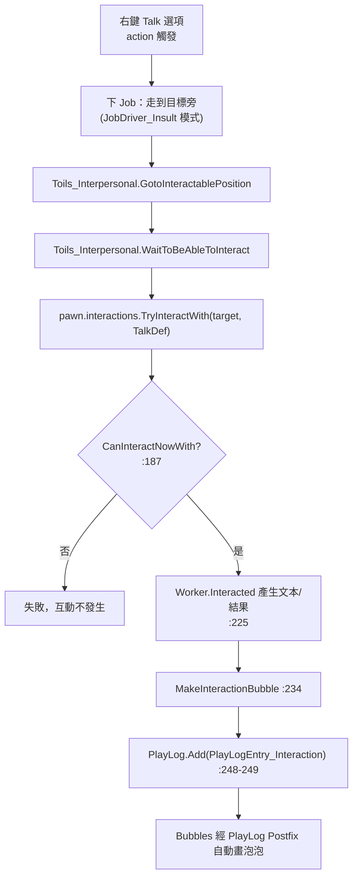
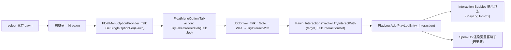

# Mod 構想可行性報告：Talk 強制社交動作（idea A）

> 來源權威反編譯：`projects/rimworld/`（1.6）。本報告所有結論皆落在反編譯源上，找不到確證者明示「待驗證」。
> 關聯 idea B（自訂對話內容與文本）在第 6 節「開放設計問題」點出接點，本報告不展開。

## 1. 目標與玩家體驗

玩家選中一個我方 pawn，右鍵另一個 pawn（友方／中立／敵對皆可，甚至動物或非人類），浮動選單出現「Talk」選項；點選後，被選中的 pawn 走到目標旁並強制觸發**一次**社交互動（產生互動文本、寫進 PlayLog，並由 Interaction Bubbles 自動畫出泡泡）。這是一個玩家主動下令的「指令式社交」，類比原版的「Insult（侮辱）」「Recruit（招募交談）」那種會排成 Job 走過去再互動的流程。

## 2. 對應原版機制

### 2.1 FloatMenuOptionProvider 收集機制 → 結論：加新選項**不需要 Harmony**

`FloatMenuMakerMap` 在初始化時用反射掃描所有非抽象子類自動註冊 provider：

- `RimWorld/FloatMenuMakerMap.cs:20-23`：
  ```csharp
  providers = new List<FloatMenuOptionProvider>();
  foreach (Type item in typeof(FloatMenuOptionProvider).AllSubclassesNonAbstract())
      providers.Add((FloatMenuOptionProvider)Activator.CreateInstance(item));
  ```
- 不是 Def 註冊、也不是手寫清單；**只要繼承 `FloatMenuOptionProvider` 就會被自動收進選單流程**。
- 右鍵 pawn 時的派發在 `FloatMenuMakerMap.cs:107-123`：對每個 `context.ClickedPawns`，先過 `provider.TargetPawnValid(...)`，再呼叫 `provider.GetOptionsFor(Pawn, context)`。

> 結論：新增「Talk」選項只需寫一個 `FloatMenuOptionProvider` 子類，無需 Harmony patch。這是本構想最關鍵且最有利的事實。

### 2.2 抽象基類可覆寫的成員（`RimWorld/FloatMenuOptionProvider.cs`）

| 成員 | 用途 | Talk 的取值（草案） |
|---|---|---|
| `Drafted` / `Undrafted`（abstract，`:8-12`） | 選中 pawn 處於徵召／非徵召時是否適用 | 兩者皆 `true`（隨時可下令） |
| `Multiselect`（abstract，`:12`） | 是否支援多選發起者 | `false`（先做單選，見第 5 節） |
| `RequiresManipulation`（`:14`） | 發起者需有操作能力 | 不需要（說話用 Talking 能力，非 Manipulation） |
| `MechanoidCanDo`（`:16`） | 機械體可否 | 預設 `false` |
| `SelectedPawnValid`（`:24`） | 驗證「被選中的發起者」 | 用預設即可（已含 drafted/mutant/機械過濾） |
| `TargetPawnValid`（`:62`） | 驗證「右鍵的目標 pawn」 | 預設已擋 self-target；其餘有效性放進 `GetSingleOptionFor` 判斷 |
| `GetSingleOptionFor(Pawn, context)`（`:130`） | 產出單一選項 | **主要實作點**：建 `FloatMenuOption`，action 內下 Talk Job |

範例對照：
- `RimWorld/FloatMenuOptionProvider_Arrest.cs:17-62`：典型「右鍵 pawn → 條件判斷 → 不可行回傳 disabled 選項或 null → 可行則 `DecoratePrioritizedTask` + 下 `JobMaker.MakeJob` + `TryTakeOrderedJob`」。
- `RimWorld/FloatMenuOptionProvider_CapturePawn.cs:16-61`：同樣模式，`GetSingleOptionFor(Pawn,...)` 內早退 + 建選項。

### 2.3 強制互動的執行流程：`Pawn_InteractionsTracker.TryInteractWith`

核心入口 `RimWorld/Pawn_InteractionsTracker.cs:176`：



`TryInteractWith` 內部關鍵點（`Pawn_InteractionsTracker.cs`）：
- `:182-185` 不能對自己互動（self 會 `Log.Warning` 並回 false）。
- `:187` 必過 `CanInteractNowWith(recipient, intDef)`。
- `:191-195` 若 `intDef.ignoreTimeSinceLastInteraction == false` 且太近期互動過，**會 `Log.Error` 並回 false**（不只是靜默失敗，會噴紅字）。
- `:197-213` 套用 initiator/recipient 的 thought、XP；其中 `:209` recipient XP 只給 `RaceProps.Humanlike`，`:201` recipient thought 只在 `recipient.needs.mood != null` 時加 → 對動物/非人多半自動略過，不會炸。
- `:215-218` social fight 只在 `recipient.RaceProps.Humanlike && recipient.Spawned` 時才可能觸發。
- `:234` 永遠畫互動泡泡 mote。
- `:248-249` 寫 `PlayLogEntry_Interaction` 進 `Find.PlayLog` → 這是 Bubbles / SpeakUp 的唯一資料捕獲點。

前置檢查 `CanInteractNowWith`（`:152-174`）：
- `:154` `InteractedTooRecentlyToInteract()` → 距上次互動 < 120 ticks 即拒。
- `:160-167` recipient 必須 `Spawned`（除非被發起者抱著），且 `IsGoodPositionForInteraction`（距離 ≤ 6 格且有視線，`SocialInteractionUtility.cs:148-155`）。
- `:169` 必過 `CanInitiateInteraction(pawn)` 與 `CanReceiveInteraction(recipient)`。

`CanInitiateInteraction`（`SocialInteractionUtility.cs:12-39`）：發起者需有 Talking 能力（`:18`）、清醒（`:22`）、未燃燒（`:26`）、非 mutant 禁社交、未被互動封鎖。
`CanReceiveInteraction`（`SocialInteractionUtility.cs:84-103`）：recipient 需清醒（`:86`）、未燃燒、非 mutant 禁社交、未被封鎖。

> 注意：`CanReceiveInteraction` **沒有要求 recipient 是 Humanlike，也沒擋 Downed、沒擋敵對**。Humanlike/Downed/敵對的限制只存在於 **random** 路徑（`CanInitiateRandomInteraction`/`CanReceiveRandomInteraction`，`:105-141`，且 `TryInteractRandomly` 在 `:318` 額外擋 `HostileTo`）。我們走的是 direct（玩家下令）路徑，**只受 `CanInteractNowWith` 約束**，不受 random 路徑那些限制。

### 2.4 互動文本與結果如何產生：`InteractionDef` / `InteractionWorker`

- `RimWorld/InteractionDef.cs:8`：`InteractionDef : Def`。可純 XML 配置的欄位：`workerClass`（預設 `typeof(InteractionWorker)`，`:10`）、`interactionMote`、`socialFightBaseChance`、`initiatorThought`、`recipientThought`、`initiatorXpGainSkill`、`ignoreTimeSinceLastInteraction`（`:28`）、`symbol`/`symbolSource`、`logRulesInitiator`/`logRulesRecipient`（`:35-37`，互動句子的 grammar 規則包）。
- `:96-103` `ResolveReferences`：若沒設 mote，預設 `Mote_Speech`。
- `RimWorld/InteractionWorker.cs:6`：worker 兩個虛擬方法——`RandomSelectionWeight`（`:10`，預設 0，只影響 random 排程；direct 用不到）與 `Interacted`（`:15`，產出 `letterText`/`letterLabel`/`letterDef`/`lookTargets`，預設全 null）。
- 文本本體：`TryInteractWith:225` 呼叫 `intDef.Worker.Interacted(...)` 收集 `List<RulePackDef>`，再於 `:248` 包進 `PlayLogEntry_Interaction(intDef, pawn, recipient, list)`。實際句子由 `logRulesInitiator`/`logRulesRecipient`（XML grammar）渲染。

### 2.5 對非人 / 敵對 recipient 的限制（彙整）

| 條件 | direct（玩家下令）路徑是否阻擋 | 依據 |
|---|---|---|
| recipient 為動物/非 Humanlike | **不阻擋**（thought/XP 自動略過） | `Pawn_InteractionsTracker.cs:201,209`；`CanReceiveInteraction` 無 Humanlike 檢查 `:84-103` |
| recipient 敵對 | **不阻擋**（direct 路徑無 `HostileTo` 檢查） | `HostileTo` 僅在 `TryInteractRandomly:318` |
| recipient Downed | **不阻擋**（無 Downed 檢查）— 但 Downed 不影響 receive，僅影響「能否生成右鍵浮動選單」見第 5 節 | `CanReceiveInteraction` 無 Downed 檢查；對比 random `:136` |
| recipient 睡著 / 昏迷 | **阻擋**（`!Awake()` 拒收） | `SocialInteractionUtility.cs:86` |
| recipient 未 Spawned | **阻擋**（除非被抱著） | `Pawn_InteractionsTracker.cs:160` |
| recipient 距離 > 6 格或無視線 | 互動時阻擋（但 Job 會先走過去） | `SocialInteractionUtility.cs:148-155` |
| 發起者無 Talking 能力 / 睡著 / 燃燒 | 阻擋 | `SocialInteractionUtility.cs:18,22,26` |

> 重要待驗證：動物 recipient 走 `TryInteractWith` 是否能順利生成 `PlayLogEntry_Interaction` 並讓 Bubbles 顯示——理論上可（無 Humanlike 硬阻擋），但原版沒有「人對動物的純社交 InteractionDef」先例（原版人對動物走的是 `JobDriver_InteractAnimal` 馴服/訓練那套，非 `Pawn_InteractionsTracker.TryInteractWith`）。需實機驗證動物 recipient 的 thought/log 渲染是否有 NRE。**標記為待驗證。**

## 3. 架構草案

### 3.1 需新增的類別與 Def

| 類型 | 名稱（草案） | 角色 | 必要性 |
|---|---|---|---|
| C# class | `FloatMenuOptionProvider_Talk : FloatMenuOptionProvider` | 右鍵 pawn 時產出「Talk」選項，action 內下 Job | 必須 C# |
| C# class | `JobDriver_Talk : JobDriver` | 走到目標 → 等可互動 → `TryInteractWith(target, TalkDef)` | 必須 C#（或復用既有，見下） |
| JobDef | `Talk`（XML） | 綁定 `driverClass="MyMod.JobDriver_Talk"` | XML |
| InteractionDef | `Talk`（XML） | 提供 mote、`logRulesInitiator/Recipient`、thought 等 | XML（可純 XML） |

`JobDriver_Talk` 幾乎可直接照抄 `RimWorld/JobDriver_Insult.cs:18-43` 的骨架（去掉 InsultingSpree 心理狀態相關）：
```
GotoInteractablePosition(A) → WaitToBeAbleToInteract(pawn)
→ GotoInteractablePosition(A, socialMode=Off) → Do { pawn.interactions.TryInteractWith(Target, MyMod_TalkDef) }
```
`Toils_Interpersonal.GotoInteractablePosition`（`Toils_Interpersonal.cs:9`）與 `WaitToBeAbleToInteract`（`:121`）都是公開可復用的 toil。

> 復用可能性（待驗證）：原版有 `JobDriver_SingleInteraction.cs`，疑似就是「走過去做一次指定 InteractionDef」的泛用 driver。若它能從 Job 取 InteractionDef，則可省去自寫 `JobDriver_Talk`，provider 直接下 `JobDefOf.???` + 帶 InteractionDef。**需讀 `JobDriver_SingleInteraction.cs` 確認其取 def 的方式後再定。**

### 3.2 資料流



## 4. 純 XML vs 必須 C# 拆分

| 項目 | 純 XML | 必須 C# | 說明 |
|---|---|---|---|
| `InteractionDef Talk`（mote/thought/grammar/`ignoreTimeSinceLastInteraction`） | ✅ | | 全是 `InteractionDef` 既有欄位，`workerClass` 留預設即可 |
| 互動句子文本（`logRulesInitiator/Recipient`） | ✅ | | XML grammar 規則包；idea B 的擴充也在這層 |
| `JobDef Talk` | ✅（殼） | | 但 `driverClass` 指向 C# driver |
| 浮動選單「Talk」選項 | | ✅ | provider 子類，反射自動註冊，不需 Harmony |
| 走過去再互動的 Job 行為 | | ✅ | `JobDriver`（或復用 `JobDriver_SingleInteraction`，待驗證） |
| 自訂「成功/失敗」判定、特殊結果（letter 等） | | ✅（選用） | 需自訂 `InteractionWorker` 子類覆寫 `Interacted` |

> 結論：**「能不能 Talk」這個選單與動作必須 C#**（provider + driver）；**「Talk 是什麼內容」可以純 XML**（InteractionDef + grammar）。最小可玩版約 = 2 個小 C# class + 2 個 XML Def。

## 5. 風險與坑

1. **120 ticks 最短間隔與紅字錯誤**：`InteractedTooRecentlyToInteract`（`:147-150`）距上次互動 < 120 ticks 直接拒。若 `Talk` 的 `ignoreTimeSinceLastInteraction == false` 且玩家連點，`TryInteractWith:191-195` 會 `Log.Error` 噴紅字。**建議**：要嘛在 provider/driver 端先擋 cooldown 不下 Job，要嘛設 `ignoreTimeSinceLastInteraction=true`（但見下條濫用風險）。
2. **`CanInteractNowWith` 的隱性失敗**：目標睡著（`!Awake()`）、未 spawned、距離超過 6 格又走不到、發起者無 Talking 能力，都會讓互動靜默失敗（`TryInteractWith` 回 false，pawn 白走一趟）。**建議**：在 `GetSingleOptionFor` 內預檢這些條件，不可行時回 disabled 選項（附原因），體驗較好（對照 Arrest `:35-38` 的 NoPath 處理）。
3. **Downed 目標仍可右鍵嗎？**：`FloatMenuMakerMap.ShouldGenerateFloatMenuForPawn:139-141` 是針對「被選中的發起者」Downed 時不生成選單；右鍵「目標」Downed 不被此處擋。Downed 目標的 receive 也不被 `CanReceiveInteraction` 擋（仍要 `Awake()`）。**待驗證**：downed 但清醒的目標能否互動。
4. **多選（Multiselect）**：先設 `Multiselect=false`（`Applies:72-73` 會在多選時整個 provider 不適用）。若要支援「多個 pawn 同時去 talk 同一目標」需設 true 並處理每個發起者的 cooldown，複雜度上升，建議二期。
5. **cooldown 濫用**：若設 `ignoreTimeSinceLastInteraction=true` 繞過 120 tick，玩家可瘋狂刷社交、刷 thought/opinion/XP，破壞平衡。**建議**：保留原版 cooldown，或自設較長的 Job 端冷卻。
6. **動物 / 非人 recipient**：理論可行（第 2.5 節），但無原版先例經 `TryInteractWith` 對動物互動，需實機驗證 thought/grammar 渲染不 NRE。**待驗證。**
7. **與 Bubbles / SpeakUp 的互動**：兩者都只認 `PlayLog` 內的 `PlayLogEntry_Interaction`（`interaction-bubbles/architecture/00_overview.md:13`；`speakup/architecture/01_dialogue_pipeline.md:71-75`）。我們的 `TryInteractWith:248-249` 正是寫這條 entry → **Bubbles 會自動畫泡泡、SpeakUp 會自動嘗試渲染句子，無需額外整合**。但 SpeakUp 的 grammar 注入只對它認得的 `r_logentry` tag 生效（`GrammarResolver_Resolve.cs:17-22`），對全新 `Talk` InteractionDef 若沒提供對應規則，會 fallback 到我們自己的 `logRules` 或原版預設句。
8. **敵對目標「成功」語意模糊**：見第 6 節，技術上能跑，但「對敵人 Talk」在玩法上意義需定義。

## 6. 開放設計問題（交給使用者決定）

1. **能否 Talk 敵對 pawn，且「成功」如何定義？**
   技術上 direct 路徑不擋敵對（第 2.5 節）。但「成功」要定義為：只是觸發一句對話＋泡泡？還是要影響關係/招降/觸發事件？若只是文本，純 InteractionDef 即可；若要結果，需自訂 `InteractionWorker.Interacted`。
2. **動物互動用哪種 InteractionDef？**
   選項 A：沿用同一個 `Talk` InteractionDef（最簡，但 grammar 句子要能容納「對動物說話」語境）；選項 B：偵測 recipient 是動物時改派一個 `TalkToAnimal` InteractionDef（句子更貼切）。後者需 provider/driver 端判斷 recipient race。
3. **Talk 是否吃既有社交 cooldown（120 tick / direct 320 tick）？**
   `Pawn_InteractionsTracker.cs:40` 有 `DirectTalkInteractInterval = 320`。是否設 `ignoreTimeSinceLastInteraction=true` 直接決定平衡（見風險 1、5）。建議預設「吃 cooldown」，提供 mod setting 切換。
4. **與 idea B（自訂對話內容與文本）的接點。**
   idea B 的所有文本都落在 **InteractionDef 的 `logRulesInitiator`/`logRulesRecipient`（XML grammar）** 這一層（`InteractionDef.cs:35-37`），由 `PlayLogEntry_Interaction` 渲染。idea B 可作為純 XML 內容包，或進一步像 SpeakUp 那樣 Prefix 注入 `r_logentry` 規則（`speakup/architecture/01_dialogue_pipeline.md:52-53`）。idea A 只要保證走標準 `TryInteractWith` → `PlayLog` 流程，idea B 就有乾淨的掛載點，兩者解耦。

## 7. 參考檔案清單（皆相對 `projects/rimworld/`，行號為 1.6 反編譯）

- `RimWorld/Pawn_InteractionsTracker.cs`：`TryInteractWith:176`、`CanInteractNowWith:152`、`InteractedTooRecentlyToInteract:147`、`TryInteractRandomly:300`、常數 `DirectTalkInteractInterval:40`
- `RimWorld/FloatMenuOptionProvider.cs`：抽象基類；`SelectedPawnValid:24`、`TargetPawnValid:62`、`GetOptionsFor(Pawn):111`、`GetSingleOptionFor(Pawn):130`
- `RimWorld/FloatMenuMakerMap.cs`：provider 反射收集 `:20-23`、右鍵 pawn 派發 `:107-123`、`ShouldGenerateFloatMenuForPawn:133`
- `RimWorld/FloatMenuOptionProvider_Arrest.cs:17`、`RimWorld/FloatMenuOptionProvider_CapturePawn.cs:16`：provider 範例
- `RimWorld/SocialInteractionUtility.cs`：`CanInitiateInteraction:12`、`CanReceiveInteraction:84`、`CanInitiateRandomInteraction:105`、`CanReceiveRandomInteraction:130`、`IsGoodPositionForInteraction:148`
- `RimWorld/InteractionDef.cs`：欄位與 `Worker:45`、`logRules*:35-37`、`ignoreTimeSinceLastInteraction:28`
- `RimWorld/InteractionWorker.cs`：`Interacted:15`、`RandomSelectionWeight:10`
- `RimWorld/JobDriver_Insult.cs:18`：可抄的「走過去做一次強制互動」driver 骨架
- `RimWorld/Toils_Interpersonal.cs`：`GotoInteractablePosition:9`、`WaitToBeAbleToInteract:121`、`ConvinceRecruitee:143`
- `RimWorld/JobDriver_SingleInteraction.cs`：可能可復用的泛用單次互動 driver（**待讀確認**）
- `analysis/rimworld_mods/interaction-bubbles/architecture/00_overview.md`：泡泡靠 `PlayLog.Add` Postfix（`:13`）
- `analysis/rimworld_mods/speakup/architecture/01_dialogue_pipeline.md`：文本來源＝本地 GrammarResolver + XML，掛 `r_logentry`（`:50-53`）
