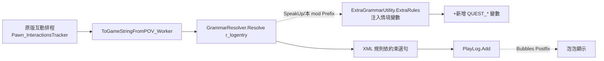
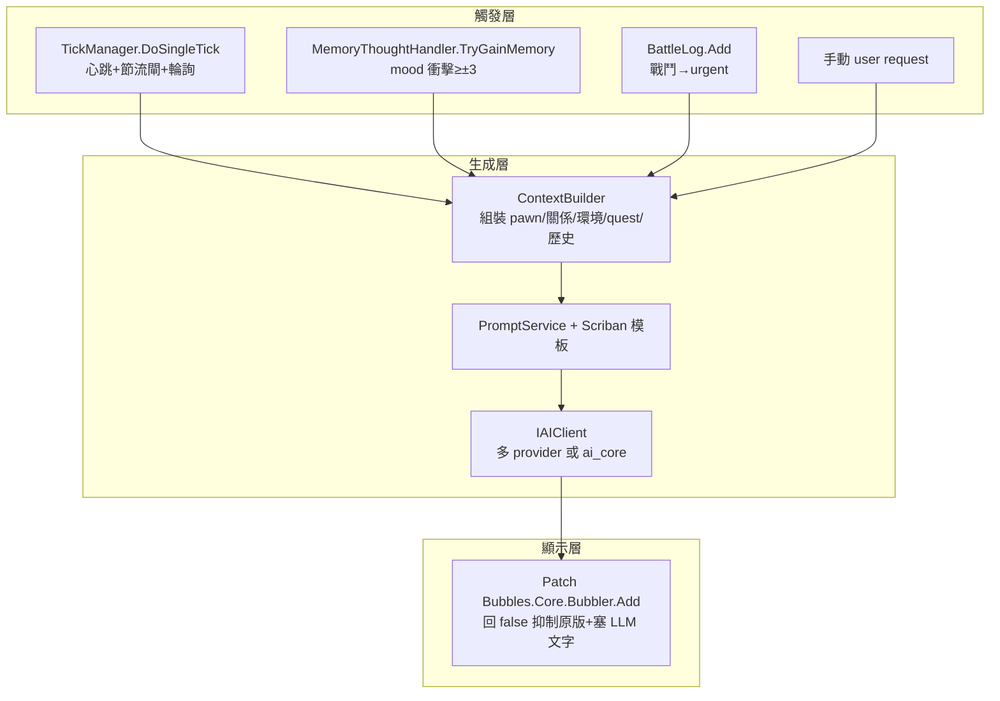
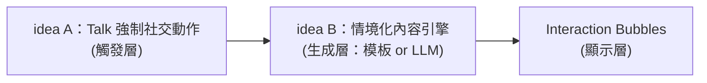

# 02 情境化對話內容（idea B，參考 RimTalk）可行性報告

> 構想：把現在「硬編碼隨機」的社交互動文本，換成**有脈絡走向／劇情、依當前狀況與 quest 狀態評論**的內容。核心抉擇：**模板/規則式（SpeakUp 風，離線零成本）** vs **接 LLM（RimTalk 風，動態但需 API/成本）**。
>
> 落實依據：本體 1.6 反編譯權威源 `projects/rimworld/`；群組 mod 分析 `analysis/rimworld_mods/speakup/`、`.../interaction-bubbles/`；RimTalk 採用既有調查結論（外部未 clone，網路調查見 README §跨報告共同發現）。
> 凡標「待驗證」者＝本工作區無權威源可佐證。

---

## 1. 目標與玩家體驗

現況：原版小人社交對話是**從 `RulePack` 文法隨機抽句**。流程權威源：

- 互動發生 → 建立 `PlayLogEntry_Interaction`（`projects/rimworld/Verse/PlayLogEntry_Interaction.cs:51`）。
- 要顯示成文字時走 `ToGameStringFromPOV_Worker`（`PlayLogEntry_Interaction.cs:141`），它把 `intDef.logRulesInitiator`（`InteractionDef.cs:35`）+ 雙方 pawn 規則丟給 `GrammarResolver.Resolve("r_logentry", request, ...)`（`PlayLogEntry_Interaction.cs:157`）。
- 隨機性來自 `Rand.Seed = logID`（`PlayLogEntry_Interaction.cs:149`）——**同一條 log 的文字固定、但選哪一句純隨機**，與「先前發生過什麼」「現在打哪個 quest」無關。

目標體驗（三個遞進層次）：

1. **依當前環境/狀態評論**（天氣、心情、傷病、工作）——SpeakUp 已部分做到。
2. **依劇情脈絡走向**（先前發生過的事；多輪你來我往有主題連續性）——SpeakUp 的續話排程部分做到，但「記得很久以前」做不到。
3. **依當前 quest 狀況評論**（「那個商隊任務還剩兩天就過期了」「我們上次襲擊失敗了」）——**這是構想的關鍵差異點，原版與 SpeakUp 都沒有**。本報告 §4 專門解決資料來源。

---

## 2. 兩條路線對照表

| 維度 | 模板/規則式（SpeakUp 風） | LLM（RimTalk 風） |
|---|---|---|
| 實作成本 | 低～中：純資料擴充免編譯；新情境變數要改 `ExtraGrammarUtility` 重編 DLL（SpeakUp B1） | 中～高：要寫 LLM client、context builder、prompt 模板、節流、顯示 re-route |
| 離線可用 | **完全離線**，零網路 | 視後端：雲端 API 需連網；本地（Ollama/LM Studio）可離線但吃顯卡 |
| 成本 | 零 | 雲端按 token 計費；本地免費但要硬體 |
| 動態程度 | 受限於預寫句庫 + 變數組合；句子是人寫死的 | 高：每句現生，理論上無限變化 |
| **「依任務狀況/劇情脈絡」達成度** | **低**：見下方說明，組合爆炸；「記得歷史」幾乎不可能 | **高**：把 quest 狀態/歷史塞進 prompt 即可，LLM 自然消化 |
| 相依 | GrammarResolver（本體內建，零外部相依）；顯示走 Bubbles（硬相依，與 SpeakUp 同） | RimTalk 路線硬相依 Bubbles（`Bubbler.Add` 攔截）；後端相依某 LLM provider |
| 維護 | 句庫越大越難維護，但穩定不會壞 | API 改版/模型停用/格式漂移要追 |
| 隱私 | 無外送 | 雲端會把遊戲狀態送第三方 |

### 為何「依當前 quest 狀況評論」在模板路線極難、在 LLM 路線自然

模板路線要做到，必須：

1. 先在 `ExtraGrammarUtility` 加一批 quest 相關情境變數（如 `QUEST_count`、`QUEST_nearestExpiry`、`QUEST_lastOutcome`）——**需改碼**（SpeakUp B1，`speakup/details/extension_points.md:40`）。
2. 然後**為每一種 quest 狀態 × 每一種情緒 × 每一種關係……手寫對應句子**。quest 種類本身就有數十種（且 mod 會再加），狀態有 7 種（`QuestState`，見 §4），交叉就是組合爆炸。
3. 「記得先前發生過的事」需要**自己維護一份對話歷史狀態**並轉成可比對的 grammar constant——GrammarResolver 的 constant 只支援字串相等＋ SpeakUp 擴充的數值比較（`RuleEntry_ValidateConstantConstraints.cs:43`），表達「上一句講過 X 所以這句接 Y」很彆扭。

LLM 路線只要把「進行中的 quest 清單 + 狀態 + 剩餘天數 + 最近結局 + 對話歷史」格式化進 prompt，模型就能生成切題的一句。**這正是構想想要的，也是 RRimTalk 走 LLM 的根本理由。**

---

## 3. 架構草案（兩路線各一）

### 3.1 模板路線（擴 GrammarResolver / RulePack，參考 SpeakUp）

直接站在 SpeakUp 肩上（它已是「純本地 GrammarResolver 模板擴充對話」的現成範本），分三段：



具體擴充手法（依風險由低到高，對照 `speakup/details/extension_points.md`）：

- **A 純資料**：新增 `1.6/Patches/zz_my_*.xml` 把句子規則注入原版 `Chitchat`（`extension_points.md:17`），條件用 SpeakUp 已提供的變數（mood/trait/weather/relationship 等，清單見該檔 D 區）。免編譯。
- **B1 加 quest 情境變數**（關鍵且必須）：仿 `ExtraGrammarUtility.ExtraRulesForMap`（`speakup/architecture/01_dialogue_pipeline.md:59` 引 `:246`）新增 `ExtraRulesForQuest`，內部讀 `Find.QuestManager.ActiveQuestsListForReading`（見 §4）→ `MakeRule("QUEST_count", n)`、`MakeRule("QUEST_nearestExpiryDays", d)` 等。**需改碼重編 DLL**。注意 SpeakUp 的 `ExtraRules` 用 try/catch 包整段（`extension_points.md:45`），單一變數 throw 會吞掉整批，要自己加 null 防護。
- **B3 獨立外掛**（最乾淨）：不改 SpeakUp 原始檔，另開 mod `loadAfter` SpeakUp，自己做一個 `GrammarResolver.Resolve` 的 Prefix 注入規則（`extension_points.md:52`）。要小心和 SpeakUp 的 `r_logentry` Prefix 競合（Harmony priority 決定順序）。

模板路線可達層次 1（環境評論，SpeakUp 已會）+ 部分層次 3（quest 數值化變數可比對），**但層次 2 的「劇情走向／記得歷史」基本到頂**。

### 3.2 LLM 路線（RimTalk 風）

RimTalk 既有調查結論（README §跨報告共同發現，直接採用）：**不鉤原版互動 worker、不鉤 `PlayLog.Add`**，改鉤心跳 + thought + 戰鬥 log，輸出 re-route 進 Bubbles 顯示層。重建其架構：



四個要素的本工作區落實：

- **觸發點**：`TickManager.DoSingleTick`（本體 `projects/rimworld/Verse/TickManager.cs:357`）是心跳鉤；它每 tick 跑、可在裡面做節流閘＋依遊戲速度停用。`MemoryThoughtHandler.TryGainMemory`、`BattleLog.Add`（本工作區未逐一驗證簽名，**待驗證**，但屬本體既有型別，RimTalk 已實證可鉤）。
- **context 組裝（餵 quest 狀態）**：見 §4，從 `Find.QuestManager` 拿進行中 quest。pawn/關係/環境變數可比照 SpeakUp 的 `ExtraGrammarUtility` 已盤點過的同源資料（`speakup/details/extension_points.md` D 區），不必重新摸索。
- **輸出顯示**：兩種選擇——
  - (a) **走 Bubbles**（RimTalk 做法）：patch `Bubbles.Core.Bubbler.Add` 攔截原版泡泡、回傳 false 抑制、改塞 LLM 文字。Bubbles **無原始碼只有 DLL**（`interaction-bubbles/details/extension_points.md:11`），是硬相依、升級易壞。
  - (b) **自繪**：照抄 Bubbles 的「範式 B：在小人頭上畫世界座標跟隨的浮動 UI」（`interaction-bubbles/details/extension_points.md:41`，`MapInterface...OnGUI` Postfix + `GenMapUI.LabelDrawPosFor`），不依賴 Bubbles。代價是自己重做外觀/淡出/過濾。
- **後端**：兩個架構選項——
  - **RimTalk-style 多供應商**（`IAIClient`+`AIClientFactory`，Gemini/OpenAI/DeepSeek/本地 Ollama…）。
  - **接使用者自有 `ai_core`**（GitHub justty32/ai_core）：ai_core 定位「便宜高頻智能＝消費資產」「程式碼助手＝抽取＋受約束生成」，**情境對話正是「便宜高頻消費」型場景**，與其定位吻合。可把 ai_core 當 LLM 後端、而非依賴 RimTalk 的 client 層。（不深入 ai_core 源，僅列為架構選項。）

---

## 4. 「依當前任務狀況」怎麼取得（關鍵資料來源）

這是本構想最重要的新資料來源。本體權威源已查實：

| 要拿什麼 | 來源 path:line | 說明 |
|---|---|---|
| 取得 QuestManager | `Find.QuestManager`（`projects/rimworld/Verse/Find.cs:164`） | `=> Current.Game.questManager` |
| **進行中 quest 清單** | `QuestManager.ActiveQuestsListForReading`（`RimWorld/QuestManager.cs:22`） | `=> activeQuests`，已過濾掉 historical |
| 全部 quest（含結束） | `QuestManager.QuestsListForReading`（`QuestManager.cs:20`） | 要評論「上次失敗」時用 |
| 顯示順序清單 | `questsInDisplayOrder`（`QuestManager.cs:14`，依 `TicksSinceAppeared` 排序 `:133`） | 想挑「最新出現的 quest」 |
| quest 名稱 | `Quest.name`（`RimWorld/Quest.cs:17`） | string |
| quest 描述 | `Quest.description`（`Quest.cs:19`，TaggedString） | 可直接餵 LLM prompt |
| quest 標籤 | `Quest.tags`（`Quest.cs:25`，List<string>） | 分類用 |
| **quest 狀態** | `Quest.State`（`Quest.cs:154`，回 `QuestState`） | 計算屬性，見下 |
| 是否曾接受 | `Quest.EverAccepted`（`Quest.cs:125`） | |
| **剩餘到期 tick** | `Quest.TicksUntilExpiry`（`Quest.cs:97`） | -1＝無到期；可換算「還剩幾天」 |
| 出現多久 | `Quest.TicksSinceAppeared`（`Quest.cs:71`） | |
| 接受多久 | `Quest.TicksSinceAccepted`（`Quest.cs:73`） | -1＝未接受 |
| quest 細部 | `Quest.PartsListForReading`（`Quest.cs:69`，List<`QuestPart`>） | 每個 `QuestPart`（`RimWorld/QuestPart.cs`）是一個子目標/事件，想做「快過期的擊殺目標」要逐 part 解讀，型別多、**待驗證逐一語意** |

`QuestState` 枚舉全集（`RimWorld/QuestState.cs:3`）：

```
NotYetAccepted, Ongoing, EndedUnknownOutcome,
EndedOfferExpired, EndedSuccess, EndedFailed, EndedInvalid
```

`Quest.State` 的判定邏輯（`Quest.cs:154-183`）：到期未接受→`EndedOfferExpired`；`ended` 且依 `endOutcome`→Success/Failed/Invalid/Unknown；未接受→`NotYetAccepted`；否則→`Ongoing`。

**最小可行 context 範例**（兩路線通用，差別只在輸出去向）：

```csharp
// 偽碼：可在 ExtraGrammarUtility（模板）或 ContextBuilder（LLM）內呼叫
foreach (var q in Find.QuestManager.ActiveQuestsListForReading) {
    if (q.hidden || q.State != QuestState.Ongoing) continue;
    int days = q.TicksUntilExpiry >= 0
        ? q.TicksUntilExpiry / GenDate.TicksPerDay   // GenDate.TicksPerDay 待驗證常數名
        : -1;
    // 模板路線：MakeRule("QUEST_nearestExpiryDays", days) 等
    // LLM 路線：append 進 prompt 的「進行中任務」段落
}
```

> 模板路線把這些**數值化**塞進 grammar constant 即可比對（如 `r_logentry(QUEST_nearestExpiryDays<2)->[句]`）；但要把 `Quest.description`（自然語言）變成切題評論，只有 LLM 路線做得到。

---

## 5. 與 idea A（Talk 動作）/ Bubbles / SpeakUp 的三層拆分

構想 A/B/Bubbles 是天生的三層管線（README §決策框架 已點明）：



- **觸發層（A）**：手動命令 pawn 發起互動。強制互動 API＝`Pawn_InteractionsTracker.TryInteractWith(recipient, intDef)`（README §共同發現引 `Pawn_InteractionsTracker.cs:176`）。SpeakUp 也是鉤這裡（`speakup/.../01_dialogue_pipeline.md:40`）。
- **生成層（B＝本報告）**：決定那次互動「說什麼」。模板路線改 grammar 規則；LLM 路線在觸發點組 context 生成。
- **顯示層（Bubbles）**：把文字畫成泡泡。SpeakUp/模板路線寫進 `PlayLog` → Bubbles 自動撈（`interaction-bubbles/details/extension_points.md:26` 範式 A）；LLM 路線可能反過來攔 `Bubbler.Add` 直接塞文字。

三者可分階段做：先 B 的模板版（最快見效）→ 再 A（手動觸發器）→ 顯示沿用既有 Bubbles。

---

## 6. 風險與坑

**LLM 路線**：
- **延遲**：生成有網路/推理延遲，與「即時泡泡」體驗衝突——RimTalk 用節流＋輪替＋ urgent 優先級緩解（不是每次互動都生成）。
- **成本/隱私**：雲端按 token 計費、且把遊戲狀態外送第三方。本地後端（含 ai_core）可規避兩者。
- **語言**：中文遊戲要求中文輸出，prompt/模型需支援；SpeakUp 的中文 label 比對經驗（`speakup/details/extension_points.md:93`）提醒「情境字串在中文版是中文」。
- **高速停用**：`DoSingleTick`（`TickManager.cs:357`）每 tick 跑，3x 速度時必須停用生成，否則洗版＋拖效能。RimTalk 已內建「依遊戲速度停用」。

**模板路線**：
- **組合爆炸**：quest × 狀態 × 情緒 × 關係的句子要人手寫，量大難維護（§2）。
- **不夠動態**：玩家很快會看到重複句；「記得歷史/劇情走向」基本做不到。
- `ExtraGrammarUtility` 的 try/catch 吞整批規則（`extension_points.md:45`）。

**共同**：
- **相依 Bubbles**：無原始碼只有 DLL（`interaction-bubbles/details/extension_points.md:11`），版本升級易壞；自繪可解耦但工作量大。
- **與 RimTalk 並存衝突**：若玩家同時裝 RimTalk，雙方都想接管同一批互動的文字／泡泡，會打架。要嘛偵測 RimTalk 在場則退讓，要嘛乾脆做成 RimTalk 的內容包（§7）。
- **靜態狀態時序**：若走 SpeakUp 式排程擴充，`DialogManager` 全 static 非 thread-safe、時序敏感（`speakup/details/extension_points.md:50`），亂插污染他人對話。

---

## 7. 開放設計問題

1. **模板 or LLM or 兩者皆備？**
   - 建議「兩者皆備、但分階段」：模板版當**離線保底**（零相依、零成本、必定能出話），LLM 版當**進階開關**（玩家自備後端才啟用）。共用同一套 §4 的 quest/context 抽取程式碼。
2. **接 RimTalk 的 `ContextHookRegistry`（當它的內容包）還是獨立？**
   - 若主打 LLM：當 RimTalk 內容包最省力——用其 `RegisterContextVariable`/`RegisterPawnHook` 注入 quest 上下文，借它的 client/節流/Bubbles re-route，自己只負責「quest context provider」。代價＝硬相依 RimTalk。
   - 若要離線模板版：必須獨立（RimTalk 是純 LLM）。
3. **要不要接 ai_core？**
   - 情境對話＝「便宜高頻消費型智能」，正中 ai_core 定位。可列為 LLM 後端的一個 provider 選項（與 RimTalk 的多供應商並列），但 ai_core 本身成熟度／API 形態本報告未深查（**待驗證**）。
4. **顯示走 Bubbles 還自繪？**
   - 起步走 Bubbles（生態標準、SpeakUp 玩家多已裝）；若要脫離 DLL 相依風險再考慮自繪（範式 B）。

---

## 8. 參考檔案清單

本體權威源（`projects/rimworld/`）：
- `Verse/PlayLogEntry_Interaction.cs:141,149,157`（互動文字生成、隨機 seed、Resolve 呼叫）
- `Verse/PlayLog.cs:26`（`Add` — Bubbles 的捕獲點）
- `Verse/PlayLogEntry_InteractionSinglePawn.cs` / `PlayLogEntry_InteractionWithMany.cs`（單方/多方互動 log）
- `RimWorld/InteractionDef.cs:35,37`（`logRulesInitiator`/`logRulesRecipient`）
- `RimWorld/InteractionWorker.cs:10,15`（`RandomSelectionWeight`/`Interacted` + `extraSentencePacks`）
- `Verse.Grammar/GrammarResolver.cs:110`（`Resolve` 入口）、`GrammarRequest.cs`（請求結構）、`Rule.cs`、`RulePack.cs`
- `RimWorld/Quest.cs:17,19,25,69,71,73,97,125,154`（quest 欄位與狀態）
- `RimWorld/QuestState.cs:3`（狀態枚舉）
- `RimWorld/QuestManager.cs:20,22,14`（quest 清單存取器）
- `RimWorld/QuestPart.cs`（quest 子目標型別，逐一語意待驗證）
- `Verse/Find.cs:164`（`Find.QuestManager`）
- `Verse/TickManager.cs:357`（`DoSingleTick` 心跳鉤）
- `RimWorld/Pawn_InteractionsTracker.cs:176`（`TryInteractWith` 強制互動 API，idea A 觸發）

群組 mod 分析（`analysis/rimworld_mods/`）：
- `speakup/architecture/01_dialogue_pipeline.md`（模板路線完整管線 + 接點速查）
- `speakup/details/extension_points.md`（純資料 vs 改碼擴充矩陣、情境關鍵字清單 D 區）
- `interaction-bubbles/details/extension_points.md`（顯示層三範式：PlayLog 捕獲 / 跟隨浮動 UI 自繪 / 反射設定）

外部（未 clone，網路調查 / 使用者專案）：
- RimTalk — Steam 3551203752 / GitHub jlibrary/RimTalk（`IAIClient`+`AIClientFactory`、`ContextBuilder`/`PromptService`/Scriban、`ContextHookRegistry`、鉤 `Bubbles.Core.Bubbler.Add`）
- ai_core — GitHub justty32/ai_core（本機 ~/repo/ai_core；LLM 後端架構選項，未深入源碼）
