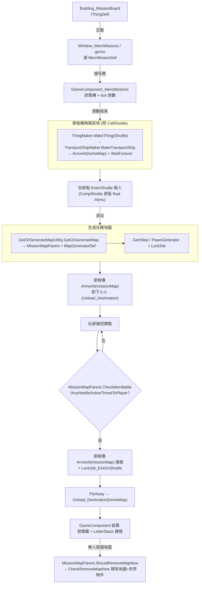

# 構想 C 可行性報告：宇宙僱傭兵任務系統（參考 Warband Warfare）

> 源版本：RimWorld 1.6（權威反編譯源 `projects/rimworld/`）。
> 既有 mod 對照：`analysis/rimworld_mods/{warband-warfare,deep-and-deeper,rimcities,vanilla-outposts-expanded}/`（索引層，演算法細節已回讀原始碼）。
> 結論先行：**核心可行**。穿梭機 API 可脫離 Quest 系統由 mod 直接生成／調度（已用原版 `RoyalTitlePermitWorker_CallShuttle` 證實）；「敵清→收圖→撤離」有原版 `CaravansBattlefield` 幾乎現成的範本。**最大門檻是 DLC 相依（穿梭機需 Royalty 或 Odyssey）與大量 C# 黏合邏輯**，沒有任何一段是純 XML 能獨立完成的。

---

## 1. 目標與玩家體驗

玩家建一個「宇宙僱傭兵任務告示牌」建築 → 小人互動開 UI 接任務 → 倒數 → 穿梭機降落殖民地 → 玩家裝載小人 → 送出 → 生成一張有敵人的任務地圖 → 玩家操控小人實戰 → 敵人清空後穿梭機降到任務地圖 → 小人登機撤離 → 回殖民地結算獎勵／失敗。

這是 Warband Warfare「派兵出擊打真實地圖」的**穿梭機版**：兵力仍是玩家殖民地真實 Pawn（非抽象計數表），進場方式從 Caravan 改為 Shuttle，戰鬥仍是 RimWorld 原生「進地圖實際打」，沒有戰力相減的抽象結算。

---

## 2. 流程逐段機制對應表

| 流程段 | 對應原版類別／既有 mod 做法（path:line） | 純 XML / 需 C# |
|---|---|---|
| 告示牌建築 | 自訂 `ThingDef`（Building）；gizmo 開窗用 `CompShuttle.CompGetGizmosExtra` `RimWorld/CompShuttle.cs:363` 模式，或建築 `GetGizmos`/`GetFloatMenuOptions` | ThingDef 純 XML；開 UI 行為需 C# |
| 互動開 UI 接任務 | 自訂 `Window`（參考 Warband `Window_WAW`/`Window_ArrangeWarband` 三步精靈，見 `warband-warfare/architecture/00_overview.md:45`）；或先用 gizmo float menu 列任務 | C#（UI）；任務清單來源可 Def 驅動 |
| 倒數 | `MapComponent`/`GameComponent` 計 tick；範本 Warband `WAW_WarbandRecruiting`（招募倒數世界物件，`warband-warfare/architecture/01_warband_mechanics.md:12`）；原版 `TimedDetectionRaids.StartDetectionCountdown` `RimWorld.Planet/CaravansBattlefield.cs:46` | C# |
| 穿梭機降落殖民地 | **直接 new 穿梭機**：`ThingMaker.MakeThing(ThingDefOf.Shuttle)` → `TransportShipMaker.MakeTransportShip` → `transportShip.ArriveAt(cell, map.Parent)` → `AddJobs(WaitForever, Unload_Destination, FlyAway)`，**完整範例見 `RimWorld/RoyalTitlePermitWorker_CallShuttle.cs:125-142`**。落地 skyfaller 由 `ShipJob_Arrive` 用 `GenSpawn.Spawn(SkyfallerMaker.MakeSkyfaller(def.arrivingSkyfaller, shipThing), cell, mapParent.Map)` `RimWorld/ShipJob_Arrive.cs:64` 生成 | C#（但呼叫的全是公開 API） |
| 玩家裝載小人 | 原版穿梭機自帶裝載 gizmo/float menu：`CompShuttle.CompFloatMenuOptions`「EnterShuttle」`RimWorld/CompShuttle.cs:404`、`CompMultiSelectFloatMenuOptions:427` → `JobDefOf.EnterTransporter`。設定 `acceptColonists=true` 即可手動點人上船 | C#（設旗標）；裝載 UI 原版免費提供 |
| 送出 | `CompShuttle.CanLaunch` `RimWorld/CompShuttle.cs:292`；`ShipJob_WaitForever` 等待玩家按發射。原版玩家穿梭機（Odyssey `playerShuttle`）裝人即 `InitiateLoading` `RimWorld/CompShuttle.cs:495` | C# |
| 生成敵對任務地圖 | `GetOrGenerateMapUtility.GetOrGenerateMap(tile, size, worldObjectDef, extraGenSteps)` `Verse/GetOrGenerateMapUtility.cs:9`；地圖內容靠 `MapGeneratorDef`+`GenStepDef` 鏈。可攻打敵對地圖範本見 RimCities `WorldGenStep`+18 個 `GenStep_*`（`rimcities/architecture/00_overview.md:34`）與 Warband `SpawnDefenders`/`LordJob_AssaultColony`（`warband-warfare/architecture/01_warband_mechanics.md:49`） | MapGeneratorDef/GenStepDef 串接純 XML；新生成演算法需 C# GenStep |
| 戰鬥 | 純 RimWorld 原生：玩家操控進場 Pawn。敵人用 `PawnGenerator`+`LordJob_DefendPoint`/`LordJob_AssaultColony`（Warband `SpawnDefenders` `core.cs:3398`） | C#（生成敵人）；威脅值可 Def |
| 敵清偵測 | **原版現成**：`CaravansBattlefield.CheckWonBattle()` 每 tick 檢查 `!GenHostility.AnyHostileActiveThreatToPlayer(map)` `RimWorld.Planet/CaravansBattlefield.cs:49-51`（`GenHostility.AnyHostileActiveThreatToPlayer` 簽名見 `RimWorld/GenHostility.cs:227`，含 `countDormantPawnsAsHostile`/`canBeFogged` 旗標可調潛伏判定）。Warband 收圖也用同一判定（`AnyHostileToPlayerCheckPatch`） | C#（一行判定，可直接抄） |
| 穿梭機接駁（降到任務地圖） | 同「降落殖民地」一路：對任務地圖的 `MapParent` 再 `ArriveAt(cell, missionMapParent)`，因 `ShipJob_Arrive` 用 `mapParent.Map` 作落點，任何已生成地圖皆可 `RimWorld/ShipJob_Arrive.cs:37-64` | C# |
| 撤離 | 小人登機：掛 `LordJob_ExitOnShuttle(shuttle)` `RimWorld/LordJob_ExitOnShuttle.cs:7`（內部 `LordToil_EnterShuttleOrLeave` 派 `DutyDefOf.EnterTransporterAndDefendSelf` `RimWorld/LordToil_EnterShuttleOrLeave.cs:33`）；或讓玩家手動點 EnterShuttle。穿梭機 `FlyAway` job 帶人回殖民地（`Unload_Destination` 卸到目的地圖） | C# |
| 結算獎勵／失敗 | 自訂 `GameComponent`/`MapComponent`：偵測穿梭機帶人離場後發 `LetterStack.ReceiveLetter`（CaravansBattlefield 勝利信 `RimWorld.Planet/CaravansBattlefield.cs:54` 為範本）、發獎勵物資。獎勵清單可 Def 化 | C# 觸發；獎勵內容可 Def |
| 收任務地圖 | **原版現成**：`CaravansBattlefield.ShouldRemoveMapNow` `RimWorld.Planet/CaravansBattlefield.cs:19-31`——`AnyPawnBlockingMapRemoval` 且無 `IncomingTransporterPreventingMapRemoval` 才收圖（`alsoRemoveWorldObject=true`）。透過 `MapParent.CheckRemoveMapNow()` `RimWorld.Planet/MapParent.cs:315` 驅動 | C#（繼承 MapParent 覆寫，可幾乎照抄） |

---

## 3. 架構草案

### 需新增的核心型別

| 型別 | 基類／性質 | 職責 |
|---|---|---|
| `Building_MissionBoard` | `Building`（ThingDef 純 XML 殼） | 提供開 UI 的 gizmo/float menu；持有「可接任務」清單 |
| `MercMissionDef` | `Def`（純資料） | 一個任務模板：地圖生成器、敵方威脅值、獎勵表、倒數時間、地圖類型、難度標籤 |
| `Window_MercMissions` | `Window`（C# UI） | 列任務、接受按鈕；MVP 可砍成 gizmo float menu |
| `GameComponent_MercMissions`（或 `WorldComponent`） | `GameComponent` | 全域任務狀態機：待接／倒數中／穿梭機待命／戰鬥中／撤離中；驅動穿梭機調度與結算 |
| `MissionMapParent` | `MapParent`（仿 `CaravansBattlefield`） | 任務地圖世界物件；覆寫 `CheckWonBattle`(敵清)＋`ShouldRemoveMapNow`(收圖) |
| `GenStep_MissionEnemies`（選用） | `GenStep` | 生成敵人並掛 Lord；MVP 可改用原版 GenStep+簡單 spawn |
| 穿梭機調度（不需新型別） | 直接用 `TransportShipMaker`/`TransportShip`/`ShipJob*` | 照 `RoyalTitlePermitWorker_CallShuttle` 模式調度 |

### 資料流

---

## 4. 三種任務地圖實現取捨

| 方案 | 機制 | 對穿梭機進出 | 對撤離 | 對敵清 | 評價 |
|---|---|---|---|---|---|
| **(a) 真實世界地圖 Site/MapParent** | `WorldObjectMaker` 放世界物件 + `GetOrGenerateMap`（`Verse/GetOrGenerateMapUtility.cs`），仿 `CaravansBattlefield`/Warband `Site` | ✅ 完美：`ShipJob_Arrive` 直接吃 `mapParent.Map`，穿梭機可在世界圖飛、可在任務圖落（兩端都是真 MapParent） | ✅ `FlyAway` 走世界旅程回殖民地 | ✅ `CaravansBattlefield` 模式現成 | **推薦**。與穿梭機「跨地圖飛行」語意最契合 |
| **(b) PocketMap**（Deep And Deeper 路線） | `PocketMapUtility.GeneratePocketMap`（`deep-and-deeper/architecture/00_overview.md`，`CaveEntrance:MapPortal`） | ⚠️ PocketMap 無世界 tile，穿梭機跨地圖「飛行」語意不自然；`ShipJob_Arrive` 對 PocketMapParent 有特判（`RimWorld/ShipJob_Arrive.cs:38` 把 pocket 落點轉到 sourceMap）——意味穿梭機不易真的「飛去」口袋地圖 | ⚠️ 撤離得改走 `MapPortal`/傳送門而非穿梭機 | ✅ 同樣可查敵清 | 適合「下地洞」不適合「飛去外星據點」。與本構想穿梭機敘事衝突 |
| **(c) 臨時 map（無世界物件）** | 直接 `MapGenerator.GenerateMap` 不掛持久世界物件 | ⚠️ 仍需一個 `MapParent` 作落點，`ShipJob_Arrive` 要求 `mapParent.HasMap`（`:42`）；裸 map 難管理存檔 | ⚠️ 同上 | ✅ | 不建議：RimWorld 地圖幾乎都綁 MapParent，繞過反而更麻煩 |

**結論：選 (a)**。任務地圖＝一個臨時 `MissionMapParent`（仿 `CaravansBattlefield`），放在世界某 tile（可放在殖民地附近或隱藏 tile）。穿梭機在世界地圖兩個 MapParent 間飛行＝原版完全支援。

---

## 5. 純 XML vs 必須 C# 拆分

### 可純 XML（資料驅動）
- **告示牌 ThingDef**（建築外觀/材質/成本/blueprint）。
- **MercMissionDef 的資料欄位**（倒數時間、威脅值、地圖大小、地圖生成器 defName、獎勵物資清單）——若把 MercMissionDef 設計成純資料容器。
- **任務地圖 MapGeneratorDef + GenStepDef 串接**：組合既有 GenStep（地形/岩石/出生點）＝純 XML，如 Deep And Deeper「重排一層洞窟＝純 XML」（`deep-and-deeper/architecture/00_overview.md:47`）。
- **穿梭機外觀**：可直接複用原版 `Shuttle` ThingDef + `Ship_Shuttle` TransportShipDef，或純 XML 複製改貼圖。
- **敵方 PawnKindDef / FactionDef**：純 XML。

### 必須 C#（行為鎖死）
- 告示牌開 UI / gizmo 行為、`Window_MercMissions`。
- `GameComponent_MercMissions` 狀態機（倒數、穿梭機調度、結算）——**整套黏合邏輯**。
- 穿梭機生成與 ShipJob 編排（雖呼叫公開 API，仍是 C#）。
- `MissionMapParent`（覆寫 `CheckWonBattle`/`ShouldRemoveMapNow`）。
- 敵人生成 + Lord 掛載（除非全靠既有 IncidentDef/GenStep）。
- 撤離觸發（`LordJob_ExitOnShuttle` 掛載時機）。

**判斷：本 mod 與 Warband 同屬「行為重 C#、資料輕 XML」型**——Warband 的擴充點表（`warband-warfare/details/extension_points.md`）顯示其核心 warband 行為全鎖 C#，只有兵種池/派系特性/政策數值是資料驅動。本構想同理：**沒有任何一段主流程是純 XML 能獨立跑的**，XML 只能餵參數。

---

## 6. 與 Warband Warfare 的異同

| 面向 | Warband Warfare | 本構想（僱傭兵任務） | 可否借鑑 |
|---|---|---|---|
| 進場方式 | **Caravan**：`CaravanMaker.MakeCaravan`+`CaravanEnterMapUtility.Enter`（`warband-warfare/architecture/01_warband_mechanics.md:48`） | **Shuttle**：`TransportShipMaker`+`ArriveAt`+ShipJob | ❌ 必須不同（進出機制換成穿梭機） |
| 兵力本質 | **抽象計數表** `Dictionary<string,int>`，進場才 `PawnGenerator` 臨時生 pawn、退場 DeSpawn（`01_warband_mechanics.md:15-17`） | **真實殖民地 Pawn**（玩家現有小人上船） | ⚠️ 不同：本構想沿用玩家既有 pawn，不臨時生成、不需 `CompMercenary`/`ExitMapPatch` 那套派系歸屬 Harmony |
| 是否上世界地圖 | warband＝`Site` 世界物件，自帶世界移動 `WarbandPather`（`01_warband_mechanics.md:33`） | 任務地圖＝臨時 `MapParent`；穿梭機用原版世界飛行，**不需自製 pather** | ⚠️ 簡化：穿梭機世界移動原版全包，省掉 Warband 自製尋路器 |
| 觸發 UI | `MainButtonDef`+`Window_WAW`（`00_overview.md:45`） | 告示牌建築 gizmo/window | ✅ UI 三步精靈模式可借鑑（MVP 可砍成 gizmo） |
| 戰鬥結算 | 純原生實戰，`points` 只決定敵方規模，無抽象勝負（`01_warband_mechanics.md:56`） | **完全相同**：原生實戰 + `AnyHostileActiveThreatToPlayer` 判敵清 | ✅ 直接沿用此哲學 |
| 收圖 | `MapComponent_WarbandRaidTracker` `forceQuitTicks=60000` 強制收（`01_warband_mechanics.md:54`） | `MissionMapParent.ShouldRemoveMapNow`（仿 CaravansBattlefield） | ✅ 借鑑超時強制收圖 |

**可借鑑**：UI 精靈、"進真實地圖實戰"哲學、收圖計時、捷報信、戰利品提領 UI。
**必須不同**：進場用穿梭機而非 Caravan；兵力用玩家真實 pawn 而非抽象表（→省掉一大半 Warband 的 pawn 生成/派系/GC 相關 Harmony）。

---

## 7. MVP 切割建議

### MVP（最小可玩，砍到剩）
1. 告示牌建築：**純 ThingDef + 一個 gizmo**（`Command_Action`），跳過 Window UI。
2. **寫死一個 MercMissionDef**（固定威脅值、固定獎勵）。
3. 點 gizmo → **立刻**生成任務地圖（`MissionMapParent`+原版 MapGeneratorDef，跳過倒數/穿梭機降殖民地裝載），用原版「殲滅」型地圖。
4. 直接把選中的小人空投/Caravan 進場（**MVP 階段甚至可先不用穿梭機**，先驗證地圖生成+敵清+收圖 loop）。
5. 敵清：照抄 `CaravansBattlefield.CheckWonBattle`（`AnyHostileActiveThreatToPlayer`）。
6. 撤離：`CaravansBattlefield`「reform caravan」原版機制，或最簡單地圖清空就發獎勵信 + `CheckRemoveMapNow` 收圖。

→ MVP 先打通「接任務→生成敵對地圖→實戰→敵清→收圖→發獎」這條骨幹，**穿梭機進出可暫緩**（穿梭機是體驗加分，不是骨幹必需）。

### 後續分階段
- **階段 2**：接上穿梭機（照 `RoyalTitlePermitWorker_CallShuttle`）——降殖民地、玩家裝載、送出、降任務地圖、接駁撤離。
- **階段 3**：倒數 + `Window_MercMissions` UI（任務列表/隨機刷新）。
- **階段 4**：MercMissionDef 完全資料化（多任務類型、難度、獎勵表、自訂 GenStep）。
- **階段 5**：失敗條件、傷亡持久化、地圖類型多樣化。

---

## 8. 風險與坑

### ★ 關鍵風險：CompShuttle / TransportShip 能否脫離 Quest 自行生成調度？
**已證實：可以，且原版有現成範例。** 證據鏈：
- `TransportShip` 有公開建構子 `TransportShip(TransportShipDef def)`（`RimWorld/TransportShip.cs:171`），建構即自行 `Find.TransportShipManager.RegisterShipObject(this)`，**不經 Quest**。
- `TransportShipMaker.MakeTransportShip(def, contents, shipThing)` 是 public static、無 quest 參數（`RimWorld/TransportShipMaker.cs:8`）。
- **最強證據**：`RoyalTitlePermitWorker_CallShuttle.CallShuttle` `RimWorld/RoyalTitlePermitWorker_CallShuttle.cs:125-142` 完整示範玩家主動叫穿梭機，全程**沒有 Quest**：`MakeThing(Shuttle)` → 設 `compShuttle.permitShuttle=true; acceptChildren=true` → `MakeTransportShip` → `ArriveAt` → `AddJobs(WaitForever, Unload_Destination, FlyAway)`。
- `CompShuttle` 對 quest 的依賴是**軟性、可選**：`questTags` 只在 `SendLaunchedSignals`/`Dispose` 時 `QuestUtility.SendQuestTargetSignals`（`RimWorld/CompShuttle.cs:543`、`TransportShip.cs:341`）——沒有 quest tag 就不發訊號，不報錯。`requiredPawns`/`requiredItems`/`requiredColonistCount` 全是 mod 可自行填的欄位，**不強制**（為空＝無要求，配 `acceptColonists=true` 即可手動裝任意殖民者）。
- `TransportShip.curJob`/`shipJobs` 由 `TransportShipManager.ShipObjectsTick` 自行 tick（`RimWorld/TransportShipManager.cs:26`），**不依賴 Quest tick**。`CanDispose` 雖檢查 `Find.QuestManager.IsReservedByAnyQuest`（`TransportShip.cs:90`），但無 quest 保留時該條件為 false，反而**更容易**正常 Dispose。

→ **架構難度因此大幅下降**：不需要硬寫一條 Quest/QuestScriptDef，可直接在 GameComponent 裡 new 穿梭機並編排 ShipJob。

### ★★ DLC 相依（最大實質門檻）
- **CompShuttle 受 DLC gate 鎖**：`PostSpawnSetup` 開頭 `if (!ModLister.CheckAnyExpansion("Shuttle")) return;`（`RimWorld/CompShuttle.cs:330`）——`"Shuttle"` 內容由 **Royalty 或 Odyssey** 提供（任一即可）。沒有任一 DLC，CompShuttle 不初始化。
- **`IsPlayerShuttle`（玩家可控穿梭機）需 Odyssey**：`if (ModLister.OdysseyInstalled)`（`RimWorld/CompShuttle.cs:81`）。`playerShuttle=true` 的方便行為（自動裝載、acceptColonists 等，`:337-343`）**只在 Odyssey 生效**。
- `ShipJobDefOf.FlyAway`/`WaitForever`/`Unload_Destination` 標 `[MayRequireRoyalty]`，`Arrive`/`WaitTime`/`Unload` 標 `[MayRequireAnyOf("Royalty,Biotech")]`（`RimWorld/ShipJobDefOf.cs`）。
- `LordJob_ExitOnShuttle.CreateGraph` 開頭 `if (!ModLister.CheckRoyalty("Shuttle crash rescue")) return emptyGraph;`（`RimWorld/LordJob_ExitOnShuttle.cs:37`）——撤離 Lord **需 Royalty**。

→ **結論：穿梭機進出方案實質上要求 Royalty（最好再加 Odyssey 才能用玩家可控穿梭機）**。若要無 DLC 也能玩，必須走 MVP 的「Caravan/空投進場」備案（Warband 路線），不用穿梭機。**這是要先和使用者拍板的設計前提（見開放問題）。**

### 其他坑
- **敵清誤判**：`AnyHostileActiveThreatToPlayer` 有 `countDormantPawnsAsHostile`（潛伏機械/休眠）與 `canBeFogged`（霧中）旗標（`RimWorld/GenHostility.cs:227`）。逃跑出地圖邊緣的敵人會自動移除不算威脅；但**躲在霧裡或潛伏的敵人**預設不算→可能提早判定勝利。`CaravansBattlefield.CanReformFoggedEnemies => true`（`:11`）顯示原版對此的處理態度（允許帶霧敵離場）。需依任務類型決定是否 `canBeFogged=true`。
- **收圖與存檔**：`ShouldRemoveMapNow` 必須擋住「穿梭機仍在來的路上」——`CaravansBattlefield` 用 `TransporterUtility.IncomingTransporterPreventingMapRemoval`（`:26`）正是防這個。直接沿用。多地圖會增加存檔體積與 tick 成本，務必確保任務結束後地圖被收。
- **小人卡在地圖**：若穿梭機接駁失敗、小人全滅或斷腿無法登機，需明確失敗路徑（強制收圖 + 視為失敗，仿 Warband `forceQuitTicks`）。
- **與 Warband/CE 相容**：CE 改裝備/彈藥不影響本 loop（兵力是玩家原 pawn，CE 自然套用）。與 Warband 並存無衝突點（不同世界物件/不同 ThingDef）。CE 的穿梭機相容性需實測（**待驗證**）。

---

## 9. 開放設計問題（需使用者拍板）

1. **要不要 Royalty 前提？** 穿梭機進出實質需 Royalty（+Odyssey 更佳）。若堅持無 DLC，進場退化為 Caravan/空投（≈ Warband 路線），失去「穿梭機」敘事。**建議：以 Royalty 為前提**（穿梭機是構想的核心賣點）。
2. **任務地圖用哪種實現？** 建議 (a) 真實世界地圖 `MapParent`（仿 `CaravansBattlefield`），與穿梭機飛行語意最契合。PocketMap 與穿梭機敘事衝突。
3. **失敗條件？** 候選：小人全滅 / 撤離超時（穿梭機沒接到人）/ 主動放棄。建議「全滅或超時=失敗，地圖強制收、無獎勵」。
4. **獎勵型別？** 銀子 / 物資 / 聲望 / 招募 pawn？建議 MercMissionDef 用獎勵表（`ThingDefCountClass` 列表）資料驅動，MVP 先發銀子。
5. **告示牌是建築還世界物件？** 建議**建築**（小人互動、放殖民地內）。對照 `vanilla-outposts-expanded`（世界地圖自治設施，`vanilla-outposts-expanded/`）——那是「派人長駐世界設施產資源」，與本構想「派人出擊打一場就回」不同，**不需要世界物件型告示牌**。
6. 任務刷新機制（時間刷 / 接一個鎖其他 / 多並行）？開放。

---

## 10. 參考檔案清單

### 權威源（`projects/rimworld/`）— 穿梭機/運輸
- `RimWorld/CompShuttle.cs`（欄位、裝載 float menu、DLC gate `:330`、`IsPlayerShuttle` `:81`、quest 訊號 `:543`）
- `RimWorld/CompProperties_Shuttle.cs`、`RimWorld/TransportShipDef.cs`（`shipThing`/`arrivingSkyfaller`/`leavingSkyfaller`/`worldObject`/`playerShuttle`）
- `RimWorld/TransportShip.cs`（公開建構子 `:171`、ShipJob 編排、`Dispose` `:327`、`ArriveAt` `:310`）
- `RimWorld/TransportShipMaker.cs`（`MakeTransportShip` `:8`）、`RimWorld/TransportShipManager.cs`（自行 tick `:26`）
- **`RimWorld/RoyalTitlePermitWorker_CallShuttle.cs`（無 quest 叫穿梭機完整範例 `:125-142`）** ← 最重要範本
- `RimWorld/ShipJob_Arrive.cs`（落點 skyfaller 生成 `:64`、PocketMap 特判 `:38`）、`RimWorld/ShipJobDefOf.cs`（DLC gate）
- `RimWorld/LordJob_ExitOnShuttle.cs`（撤離 Lord，需 Royalty `:37`）、`RimWorld/LordToil_EnterShuttleOrLeave.cs`
- `RimWorld/ShuttleIncoming.cs`、`RimWorld/PassengerShuttleLeaving.cs`（skyfaller 視覺）
- QuestPart（理解原版串接，本構想可不用）：`RimWorld/QuestPart_AddContentsToShuttle.cs`（直接操作 `CompTransporter.innerContainer` `:97`）、`RimWorld/QuestPart_SendShuttleAway.cs`（`:48` 含直接造穿梭機的 debug 範例）

### 權威源 — 地圖生成 / 敵清 / 收圖
- `Verse/GetOrGenerateMapUtility.cs`（`GetOrGenerateMap` `:9`）
- **`RimWorld.Planet/CaravansBattlefield.cs`（敵清+收圖+捷報的近乎現成範本 `:19-60`）** ← 最重要範本
- `RimWorld.Planet/MapParent.cs`（`CheckRemoveMapNow` `:315`、`ShouldRemoveMapNow` `:104`）、`RimWorld.Planet/Site.cs`
- `RimWorld/GenHostility.cs`（`AnyHostileActiveThreatToPlayer` `:227`）

### 既有 mod 對照（`analysis/rimworld_mods/`）
- `warband-warfare/architecture/00_overview.md`、`01_warband_mechanics.md`（進地圖實戰哲學、UI 精靈、收圖計時）、`details/extension_points.md`（XML/C# 二分對照）
- `deep-and-deeper/architecture/00_overview.md`（PocketMap/MapPortal loop——本構想不採用，但對比進出機制）
- `rimcities/architecture/00_overview.md`（程序生成可攻打敵對地圖 + GenStep 管線）
- `vanilla-outposts-expanded/`（世界自治設施對比——本構想不需世界物件型告示牌）
