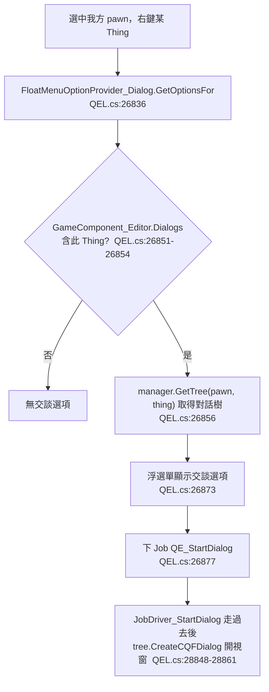
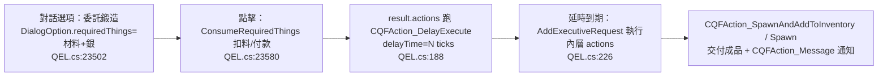

# Mod 構想可行性報告：與 NPC 對話驅動的互動（idea 11）

> 權威來源：CQF 反編譯 `projects/rimworld_mods/custom-quest-framework/decompiled/QuestEditor_Library/QuestEditor_Library.decompiled.cs`（以下簡稱 `QEL.cs`）；RimWorld 1.6 反編譯 `projects/rimworld/`。
> analysis/ 文件只當索引，所有結論落在上述源碼，找不到確證者明示「待驗證」。
> **重要更正**：prompt 引用的 `.QuestEditor_Library/Skill/*/SKILL.md`（cqf-overview 等 4 份）在本工作區的 `projects/` 樹中**不存在**（`find` 全空）；本報告一律以反編譯源為準，不引用該批 SKILL.md。
> 社交軌姊妹報告：`01_talk_action.md`（Talk 觸發 / FloatMenuOptionProvider）、`02_contextual_dialogue.md`（對話內容）、`03_mercenary_missions.md`（告示牌任務）。

---

## 1. 目標與玩家體驗（對話→四種分支）

玩家選中我方 pawn，右鍵某個「特定 NPC」（訪客／囚犯／具名角色／甚至建築），浮動選單出現一個「交談」選項；點選後我方 pawn 走過去，跳出一個**多輪分支對話視窗**。對話節點裡的選項依條件啟用／隱藏，玩家挑選後可導向四種結果：

1. **啟動任務**：對話收尾後生成一個 RimWorld 正規 Quest。
2. **開額外分支對話**：跳到對話樹的另一個節點（多輪、可回頭）。
3. **買東西**：與該 NPC 交易（給銀子拿貨）。
4. **委託服務**：付費請 NPC 依某配方／清單延時產出成品再交付。

結論先講：**分支 1、2 由 CQF 純 XML 完整覆蓋；分支 3 的「給 X 拿 Y」可用 CQF 對話原語純 XML 模擬（不是原版交易視窗）；要真正開原版交易視窗、或分支 4 的延時委託，需要少量 C#。** 詳見第 8、9 節定位表。

---

## 2. CQF 當對話／任務骨幹

### 2.1 對話資料結構（DialogTreeDef / DialogNode / DialogOption / DialogResult）

CQF 的對話樹是一組可被 `DirectXmlToObject` 反序列化的 Def，全限定 XML node 名 `QuestEditor_Library.DialogTreeDef`。四層結構：

| 類別（`QEL.cs:行`） | 關鍵欄位 | 職責 |
|---|---|---|
| `DialogTreeDef`:22474 | `title`、`dialogReportKey`、`requireNonHostile`、`nodeMoulds: Dictionary<int,DialogNode>`、`idleNodes` | 整棵樹；節點以整數 index 互相索引 |
| `DialogNode`:22618 | `text`、`extraText`（隨機挑一句，`:22661`）、`index`、`options: List<DialogOption>`、`subNodeIndexs`、`images` | 一個對話畫面（一段話 + 數個選項 + 可選配圖） |
| `DialogOption`:23485 | `text`、`conditions: List<DialogCondition>`、`results: List<DialogResult>`、`requiredThings: List<CQFThingData>`、`hideWhenDisabled`、`removeDialogAfterSelect` | 一個玩家可點的選項；條件不滿足會 disabled 或隱藏 |
| `DialogResult`:22768 | `resultName`、`conditions`、**`actions: List<CQFAction>`**、`nextIndex` | 選項的後果：跑一串 CQFAction + 跳到下一節點 |

**最關鍵事實**：`DialogResult.actions` 是 `List<CQFAction>`（`QEL.cs:22774`），而選項被點擊時的 callback（`DialogOption.GetDEOptions` 內 `dialogElement_Option.action`，`QEL.cs:23567-23572`）會 `dR.actions.ForEach(a => a.Work(targets, quest))` 並把 `nextIndex` 設給對話視窗。**這代表：對話選項可以掛任意 CQFAction，包含啟動任務、給物品、發信號——這就是「對話→四種分支」的根本接點。**

`DialogOption` 還能依目標狀態選不同 `DialogResult`：`ProduceResult`（`QEL.cs:23504`）回傳第一個 `conditions` 全滿足的 result，達成「同一選項按 NPC 狀態分歧」。

### 2.2 DialogManagerDef（把樹綁到一個 Thing）

`DialogManagerDef`:22279 是「掛載器」：

- `trees: List<DialogTreeAndConditions>`（`QEL.cs:22291`）——每棵樹配一組 `conditions`；`GetTree(interviewer, interviewee)`（`:22366`）回傳第一棵條件全滿足的樹。可用條件做「好感度夠才開隱藏對話樹」。
- `genrationConditions`、`forcedTraits`、`tags`、`removeWhenThingDespawned`/`removeWhenPawnDied`（綁定生命週期）。
- 內建 target 變數：`Interviewer`（發起的我方 pawn）、`Interviewee`（被右鍵的 NPC），在 `GetTree`/`CreateCQFDialog` 注入 targets dict（`QEL.cs:22372-22374`、`23509-23510`、`23536-23537`），CQFAction 與 DialogCondition 都能用這兩個 key 取目標。

### 2.3 對話如何接 QuestScriptDef 啟動任務

現成 `CQFAction_Quest`（`QEL.cs:719`）正是此用途：

```csharp
// QEL.cs:749  CQFAction_Quest.Work
IncidentParms val = StorytellerUtility.DefaultParmsNow(IncidentCategoryDefOf.GiveQuest, Find.RandomPlayerHomeMap);
Quest val2 = QuestUtility.GenerateQuestAndMakeAvailable(this.quest, val.points);
if (!val2.hidden && this.quest.sendAvailableLetter) QuestUtility.SendLetterQuestAvailable(val2, null);
```

把這個 action 放進某 `DialogResult.actions`，欄位 `quest` 指向任一 `QuestScriptDef`（含 CQF 自己用 `QuestNode_DoCQFActions` 編的腳本，或 03 報告的告示牌任務腳本）。**純 XML 即可**：對話選一行 → 生成正規 Quest → 跳信。

### 2.4 現成 CQFAction 清單裡哪些能用（共 ~80 個子類，`QEL.cs` grep `class CQFAction`）

對「對話四分支」直接有用的：

| CQFAction（`QEL.cs:行`） | 對話分支用途 |
|---|---|
| `CQFAction_Quest`:719 | **分支 A**：啟動 QuestScriptDef |
| `CQFAction_StartDialog`:815 | **分支 B**：在當前對話內另開一個 DialogManager 的對話視窗（巢狀對話） |
| `CQFAction_Spawn`:1473 / `CQFAction_SpawnCustomThing`:2597 | 在地圖生成物（買東西的「交貨」之一） |
| `CQFAction_SpawnAndAddToInventory`:1642 | 把物品塞進目標 pawn 物品欄（交貨給商隊／NPC） |
| `CQFAction_ConsumeInInventory`:4505 | 消耗物品欄裡的物（付款） |
| `CQFAction_DelayExecute`:188 | **分支 C 核心**：延時後執行一串 action（委託延時交付） |
| `CQFAction_Message`:618 | 跳訊息／信件 |
| `CQFAction_SentSignal`:447 | 發 CQF 信號（接力下一步） |
| `CQFAction_SetBool`:528 / `CQFAction_SetGlobalBool`:573 | 設旗標（記「已委託過」「已買過」） |
| `CQFAction_ChangeGoodwillOfFaction`:4592 / `CQFAction_SetRelation`:927 | 改派系好感（社交後果） |
| `CQFAction_GainExperience`:4008 / `CQFAction_Hediff`:3049 / `CQFAction_Trait`:3238 | 改 pawn 屬性（服務／劇情後果） |
| `CQFAction_AddDialogManager`:2179 / `CQFAction_RemoveDialogManager`:2148 | 動態給／撤某 Thing 的對話（對話後解鎖新對話） |

**沒有任何 `CQFAction_Trade`／`ITrader`／`TradeSession` 相關**（`QEL.cs` grep `trade/ITrader/TradeSession/Tradeable` 僅命中 `CompPowerTrader` 等無關電力組件）。→ **CQF 不提供原版交易視窗的接口；分支 B（真交易）必須自寫 C# 或用對話原語模擬。**

### 2.5 條件系統（哪個選項可選）

`DialogCondition` 抽象基類（`QEL.cs:5439`）下約 30 個子類可純 XML 組合，例如：`DialogCondition_Skill`:6426（技能門檻）、`DialogCondition_Trait`:6617、`DialogCondition_Faction`:6279、`DialogCondition_DatabaseExists`:5584（CQF 流程旗標）、`DialogCondition_ColonistCount`:5952、`DialogCondition_QuestState`:6080、`DialogCondition_Chance`:5541、`DialogCondition_And/Or/Reversal`:5771/5810/5850（組合）。掛在 `DialogOption.conditions` 或 `DialogResult.conditions`。

### 2.6 純 XML 能做到哪、何時需自寫 CQFAction 子類

- **純 XML 覆蓋**：整棵對話樹（節點/選項/條件/分支跳轉/配圖）、啟動任務、給物品/收物品/延時、發信號、改好感/屬性、巢狀對話。檔案丟進 CQF 的 `Quests/DialogTree/` 或子 mod `Defs/`，由 `CQFQuestDefBootstrap.LoadAll()`（見 analysis 00_overview）載入 DefDatabase。
- **需自寫 C#（subclass `CQFAction_Target`，override `Draw`/`RealWork`/`ExposeData`，樣板見 analysis 00_overview 的 HCFWithCQF 範例）**：只有當需要既有 action 做不到的副作用——本構想中典型就是「開原版 `Dialog_Trade` 交易視窗」與「下一張 `Bill` 委託」。

---

## 3. 觸發：與特定 NPC 對話（接 idea 1）

### 3.1 CQF 自帶的觸發鏈（不需自寫，1.6 原生 FloatMenuOptionProvider）

CQF 已實作完整「右鍵 NPC → 交談」鏈，**完全不用 Harmony**（沿用 01 報告同款 1.6 機制）：



- `FloatMenuOptionProvider_Dialog`（`QEL.cs:26823`）：繼承 1.6 原生 `FloatMenuOptionProvider`，反射自動註冊（同 `01_talk_action.md` 2.1），`Drafted=Undrafted=true`、要求 `PawnCapacityDefOf.Talking`（`:26833`）。
- `JobDriver_StartDialog`（`QEL.cs:28840`）：`Toils_Goto.Goto` 走到目標 → `CreateCQFDialog` 開 `CQFDialogTreeWindow`。
- `requireNonHostile`（`DialogTreeDef`:22480）：預設只能對非敵對開（`QEL.cs:26867`），可在 XML 設 `false`。

### 3.2 如何指定「特定 NPC」＝把 DialogManagerDef 註冊到該 Thing

觸發的唯一前提是該 Thing 在 `GameComponent_Editor.Dialogs` 字典裡（`QEL.cs:26851`、`7590 AddDialog`）。三種綁法：

| 綁法 | 機制 | 純 XML？ |
|---|---|---|
| **任務生成時綁**（最常見） | `CQFAction_AddDialogManager`（`QEL.cs:2179`，`component.AddDialog(thing, dialog)` `:2213`）放進任務腳本/對話結果 → 對某個 target pawn 加對話 | ✅ |
| **依機率對隨機訪客綁** | `SpecialPawnGenerator_AddDialog`（`QEL.cs:20244`）：pawn 生成時依 tag/commonality 抽 DialogManagerDef 掛上（`:20296`），條件含「非商人、人形」（`:20291`） | ✅（配 `SpecialPawnGenerateDef`） |
| **建築/物件天生帶對話** | `InteractableThing`（`QEL.cs:14062`）等自訂 ThingDef 本身可作 interviewee；地圖生成時掛 `dialogManager`（見 `QEL.cs:31503` MapParent 欄位） | ✅ |

> 綁定持久化：`Dialogs` 字典走 `GameComponent_Editor.ExposeData`（`QEL.cs:7626`），存檔讀檔保留；`removeWhenPawnDied`/`removeWhenThingDespawned` 控制自動清除（`:7636-7644`）。**「特定 NPC」＝被 AddDialog 過的具體 Thing 實例，不是 def 級全域。**

### 3.3 與 idea 1（自寫 Talk FloatMenuOptionProvider）的整合

- idea 1 的 Talk 是「強制一次原版社交互動 + 泡泡/PlayLog」；CQF 的交談是「開分支對話視窗」。兩者是**不同的右鍵選項、可並存**（兩個各自的 FloatMenuOptionProvider，互不衝突）。
- 若要「對話視窗也產生社交泡泡/PlayLog」，需在 CQFAction 子類裡呼叫 `Pawn_InteractionsTracker.TryInteractWith`（idea 1 報告 2.3 的入口）——這是 C#，屬增強非必要。

---

## 4. 分支 A：啟動任務（對照 idea 3 告示牌）

- 路線：`DialogResult.actions` 裡放一個 `CQFAction_Quest`（`QEL.cs:719`），指向任一 `QuestScriptDef`。純 XML。
- **對話驅動 vs 板驅動**：
  - idea 3（`03_mercenary_missions.md`）的告示牌是「一個建築 → 開列表 UI → 接任務」；
  - idea 11 是「右鍵具名 NPC → 對話 → 收尾接任務」。
  - 兩者底層**同一個** `QuestScriptDef`，只是入口不同。建議**並存且分工**：告示牌＝匿名／量產／重複委託（沉浸感低但方便刷）；對話＝劇情／具名 NPC／一次性或好感解鎖任務（沉浸感高）。讓告示牌「降級為輔助」而非取代——因為對話入口需要先把 NPC 綁定且 NPC 須在場，刷新頻率與可達性不如固定建築。
- 進階：對話可在接任務前用 `DialogCondition` 卡好感/技能/旗標，做到「告示牌做不到的前置門檻」。

---

## 5. 分支 B：買東西（交易）

### 5.1 原版交易能否對任意 NPC 開？要滿足什麼

原版「與 pawn 交易」的觸發在 `RimWorld/FloatMenuOptionProvider_Trade.cs`，前提是 `((ITrader)clickedPawn).CanTradeNow`（`:19`）。`Pawn_TraderTracker.CanTradeNow`（`projects/rimworld/RimWorld/Pawn_TraderTracker.cs:65`）要求：

```
!Dead && Spawned && mindState.wantsToTradeWithColony && CanCasuallyInteractNow()
&& !Downed && !IsPrisoner && Faction != OfPlayer && (Faction==null || !Faction.HostileTo(OfPlayer))
&& Goods.Any(traderKind.WillTrade) ...   (Pawn_TraderTracker.cs:69-75)
```

而貨物清單來自 `traderKind`（`TraderKindDef`，`:13`）配的 `StockGenerator`，且 `traderKind` 預設只有商隊/訪商生成時才設。

→ **結論：要讓「任意 NPC」可被交易，必須讓該 pawn 具備 `pawn.trader.traderKind != null` 且 `mindState.wantsToTradeWithColony = true`。** 這兩個都不是 XML 能對既有 pawn 動態設的欄位。

### 5.2 純 XML vs C#

**選項 B1（推薦、純 XML，CQF 對話原語模擬交易）**——不開原版交易視窗，用對話樹做「以物易物」：

- `DialogOption.requiredThings`（`List<CQFThingData>`，`QEL.cs:23502`）作「成本」：選項顯示時若玩家家當不足，自動 disabled 並提示缺料（`GetDEOptions` 內 `CheckRequiredThings` `QEL.cs:23559`、helper `GameTools.CheckRequiredThings` `QEL.cs:10470`）。
- 選項點擊後：`ConsumeRequiredThings`（`QEL.cs:23580`→`10498`，從家當/物品欄扣料），同 result 的 `actions` 用 `CQFAction_Spawn`/`SpawnAndAddToInventory` 給貨。
- 等於「付 N 銀 → 拿 M 木材」的固定價買賣，**純 XML、零 C#**。缺點：價格寫死、無原版議價/數量滑桿/社交技能折扣。

**選項 B2（要原版交易視窗，C#）**——寫 `CQFAction_OpenTrade : CQFAction_Target`：

1. 確保 interviewee `pawn.trader.traderKind` 已設（可在 AddDialog 時或此 action 內補設一個自訂 `TraderKindDef`，純 XML 可定義 TraderKindDef + StockGenerator 內容）；設 `pawn.mindState.wantsToTradeWithColony = true`。
2. `TradeSession.SetupWith((ITrader)interviewee, interviewerPawn, giftMode:false)`（`projects/rimworld/RimWorld/TradeSession.cs:19`）。
3. `Find.WindowStack.Add(new Dialog_Trade(interviewerPawn, (ITrader)interviewee, false))`（`Dialog_Trade` ctor `projects/rimworld/RimWorld/Dialog_Trade.cs:235`）。

C# 量很小（一個 action 子類），貨物清單仍可純 XML 用 `TraderKindDef`/`StockGenerator` 定義。**這是「真交易視窗」的最低成本路。**

---

## 6. 分支 C：委託服務（鍛造／配方）—— 最可能要自建

### 6.1 原版有無「委託他人製作」機制？

**沒有現成可複用的「付費委託 NPC 製作」機制。** 原版 `RecipeDef`（`projects/rimworld/Verse/RecipeDef.cs:10`，`ingredients`:31 / `products`:49 / `workAmount`:21）＋ `Bill`（`projects/rimworld/RimWorld/Bill.cs:17 recipe`）／`BillStack`／`JobDriver_DoBill` 是「**我方 pawn 在工作台上做東西**」的生產鏈，受 colonist 勞動、技能、工作台、材料約束——它不是「外包給某個外部 NPC」的模型。把它接到「委託」需要自寫排程與交付，性價比差。

### 6.2 最小機制設計（推薦：CQF 對話原語 + 延時，純 XML 為主）

把「委託」拆成三段，全部可用既有 CQFAction 組合，**幾乎零 C#**：



- **下單**：對話選項 `requiredThings` = 材料 + 銀（成本/門檻校驗 + 扣除，§5.1 同機制）。
- **延時產出**：`DialogResult.actions` 放 `CQFAction_DelayExecute`（`QEL.cs:188`），`delayTime` = 加工時間（tick），內層 `actions` 在到期時透過 `GameComponent_Editor.AddExecutiveRequest`（`QEL.cs:226`）執行。**此延時請求由 GameComponent 排程，存檔安全**（`CQFAction_DelayExecute.ExposeData` `QEL.cs:230`，且 component 級排程隨存檔走）。
- **交付**：到期動作用 `CQFAction_Spawn`（地圖落地，`QEL.cs:1473`）或 `CQFAction_SpawnAndAddToInventory`（塞給 NPC 由其帶來，`QEL.cs:1642`）+ `CQFAction_Message` 通知玩家。
- **可選旗標**：`CQFAction_SetGlobalBool`（`QEL.cs:573`）記「委託進行中」，用 `DialogCondition_DatabaseExists` 卡「同時只能委託一件」。

**缺口（若要更擬真）**：上述產出是「固定配方→固定產物」，產物寫死在交付 action 裡，不會真的跑 `RecipeDef.products` 的品質/材料 roll，也不消耗 NPC 自己的工時/技能。若要「依玩家給的 RecipeDef 動態決定產物、含品質」，需自寫 `CQFAction_Commission : CQFAction_Target`（C#）：讀 RecipeDef，按 `workAmount` 算 delay、按 `products`（`RecipeDef.cs:49`）與技能 roll 出品質，再走 DelayExecute 同款排程交付。

---

## 7. 與 idea 3／10 的關係

- **沉浸感**：對話入口把「接任務／買賣／委託」包進角色互動，比點一塊告示牌更具角色扮演感，且能用 `DialogCondition` 做好感/前置門檻、用 `extraText` 隨機台詞、`DialogImage` 配圖。
- **告示牌降級**：建議告示牌（idea 3/10）保留為「匿名、可重複、隨時刷」的後備入口；對話入口承載「具名、劇情、好感解鎖、一次性」內容。兩者共用 `QuestScriptDef`，不重工。
- **據點服務併入對話（idea 10 酒館/租房）**：據點裡的具名 NPC（用 `SpecialPawnGenerator_AddDialog` 或地圖生成時 `AddDialog` 綁定）即為服務窗口——酒館掌櫃對話樹掛「買酒（§5 B1）/接委託（§6）/租房（一個改旗標+延時的 result）」。據點地圖本就是 CQF `CustomMapDataDef` 的主場，NPC＋對話樹是它的自然延伸。

---

## 8. 別重造輪子定位表

| 分支 | 借 CQF（純 XML） | 借原版 | 自建 C# |
|---|---|---|---|
| **觸發（右鍵 NPC 開對話）** | ✅ `FloatMenuOptionProvider_Dialog` + `JobDriver_StartDialog` + `AddDialog`（全現成） | 1.6 原生 FloatMenuOptionProvider 反射註冊 | 無（除非要併入 idea 1 的社交泡泡） |
| **A 啟動任務** | ✅ `CQFAction_Quest` → QuestScriptDef | QuestUtility.GenerateQuestAndMakeAvailable | 無 |
| **B 分支對話** | ✅ DialogNode/Option/Result 跳轉 + `CQFAction_StartDialog` 巢狀 | — | 無 |
| **B' 買東西（以物易物）** | ✅ `requiredThings` + `CQFAction_Spawn/SpawnAndAddToInventory` | — | 無 |
| **B'' 買東西（原版交易視窗）** | 用 TraderKindDef/StockGenerator 定貨（XML） | `TradeSession.SetupWith` + `Dialog_Trade` | ⚠ 一個 `CQFAction_OpenTrade`（設 traderKind + wantsToTrade + 開窗） |
| **C 委託（固定配方）** | ✅ `requiredThings` + `CQFAction_DelayExecute` + 交付 action | — | 無 |
| **C' 委託（動態 RecipeDef + 品質）** | 延時/交付沿用 DelayExecute | RecipeDef.products / workAmount 讀取 | ⚠ 一個 `CQFAction_Commission`（讀 recipe、roll 品質、排程） |

**一句話**：CQF 純 XML 能覆蓋「觸發 + 對話樹 + 啟動任務 + 巢狀對話 + 以物易物買賣 + 固定配方委託」≈ 構想的 80%；只有「原版交易視窗」與「依 RecipeDef 動態產出含品質」這兩個進階需求各需一個小 CQFAction 子類。

---

## 9. 純 XML vs C# 拆分

**純 XML（丟進 CQF `Quests/` 或子 mod `Defs/`）**：
- `DialogTreeDef`（節點/選項/條件/分支/配圖/台詞）
- `DialogManagerDef`（樹掛載 + 條件 + forcedTraits + 生命週期）
- 任務腳本 `QuestScriptDef`（含 03 報告的告示牌共用腳本）
- `SpecialPawnGenerateDef`（給隨機訪客掛對話）
- 買賣用 `TraderKindDef` + `StockGenerator`（若走 B''）
- Languages keyed（台詞翻譯，CQF 文本走 `GameTools.GetDialogText` 解析）

**C#（編 net48 DLL，依賴 `QuestEditor_Library.dll` + `0Harmony.dll`，樣板見 analysis 00_overview）**：
- 僅在需要時：`CQFAction_OpenTrade`（B''）、`CQFAction_Commission`（C'）。
- 兩者皆 `subclass CQFAction_Target`，override `Draw`/`RealWork`/`ExposeData`，各約數十行。

---

## 10. 風險與待驗證、開放設計問題、參考清單

### 10.1 待驗證（須對實裝版實測，反編譯無法 100% 確認執行期行為）

1. **DialogTreeDef 純 XML 手寫的 schema 細節**：本工作區 `derived/rimworld_mods/cqf-caravan-redemption` **並未實際使用 DialogTreeDef**（grep 僅 docs 提及，實作只有 QuestScriptDef）——故「手寫 DialogTree XML」**目前無本地實證範例**。`nodeMoulds` 是 `Dictionary<int,DialogNode>`、`subNodeIndexs`/`nextIndex` 用整數索引互連，手寫易錯；建議**用 CQF 遊戲內 QuestEditor 視覺化編完再導出 XML**（產物存 CQF mod 的 `Quests/DialogTree/`），而非純手寫。【待驗證：手寫 DialogTree XML 的最小可載入範例】
2. **對任意 NPC 開原版交易**：`CanTradeNow` 的 `wantsToTradeWithColony` 與 `traderKind` 能否對「我方未持有的中立 pawn」安全動態設值、交易結束後是否要清理（避免該 pawn 永久變商人），須實測。`Goods` 來源（`Pawn_TraderTracker`）對非商隊 pawn 是否合理也要驗。【待驗證】
3. **委託延時的存檔安全**：`CQFAction_DelayExecute` 的 `AddExecutiveRequest`（`QEL.cs:226`）排程在 `GameComponent_Editor`；其延時佇列是否完整 ExposeData（跨存檔讀檔不丟失）須實測——`CQFAction_DelayExecute` 自身 ExposeData 有（`QEL.cs:230`），但 component 端佇列序列化未在本次核對範圍。【待驗證】
4. **與 idea 1 觸發共存**：兩個 FloatMenuOptionProvider 同時出現在同一個 NPC 右鍵選單時的排序/重疊體驗，須實測（兩者都用 `MenuOptionPriority`）。

### 10.2 開放設計問題

- 對話入口的 NPC「在場可達」限制較強（NPC 要 spawned、可 reach、Talking 能力）；長期服務型 NPC 該用什麼承載（駐場據點 NPC vs 週期訪客 vs 自訂 InteractableThing 建築當「窗口」）？
- 買賣走 B'（純 XML 固定價）還是 B''（原版視窗）——固定價省工但無議價/社交折扣，需依玩法定位取捨。
- 委託是否要佔用 NPC「忙碌」狀態、可否並行多筆、失敗/取消退款邏輯（皆可用旗標 + 條件純 XML 做，但要設計）。

### 10.3 參考檔案清單（皆 path:line）

- `projects/rimworld_mods/custom-quest-framework/decompiled/QuestEditor_Library/QuestEditor_Library.decompiled.cs`：
  - 對話資料：`DialogTreeDef`:22474、`DialogNode`:22618、`DialogOption`:23485、`DialogResult`:22768、`DialogManagerDef`:22279、`DialogTreeAndConditions`:22432
  - 觸發：`FloatMenuOptionProvider_Dialog`:26823、`JobDriver_StartDialog`:28840、`GameComponent_Editor.AddDialog`:7590、`SpecialPawnGenerator_AddDialog`:20244
  - Action：`CQFAction_Quest`:719、`CQFAction_StartDialog`:815、`CQFAction_DelayExecute`:188、`CQFAction_Spawn`:1473、`CQFAction_SpawnAndAddToInventory`:1642、`CQFAction_ConsumeInInventory`:4505、`CQFAction_AddDialogManager`:2179
  - 買賣原語：`CQFThingData`:15511、`GameTools.CheckRequiredThings`:10470、`GameTools.ConsumeRequiredThings`:10498、`DialogOption.GetDEOptions`:23527（扣料/跑 action 邏輯）
  - 條件：`DialogCondition`:5439（基類）、子類 5494–6930
- `projects/rimworld/RimWorld/Pawn_TraderTracker.cs:65`（CanTradeNow）、`RimWorld/FloatMenuOptionProvider_Trade.cs:17`、`RimWorld/TradeSession.cs:19`、`RimWorld/Dialog_Trade.cs:235`
- `projects/rimworld/Verse/RecipeDef.cs:10/21/31/49`、`RimWorld/Bill.cs:17`、`RimWorld/BillStack.cs:8`、`RimWorld/Bill_Production.cs:10`
- analysis：`analysis/rimworld_mods/custom-quest-framework/architecture/00_overview.md`（DLL 分佈、純 XML vs C# 二分、C# 樣板）
- 姊妹報告：`_mod_ideas/01_talk_action.md`（FloatMenuOptionProvider 觸發）、`02_contextual_dialogue.md`、`03_mercenary_missions.md`
- 反例提醒：`derived/rimworld_mods/cqf-caravan-redemption/`（用 QuestScriptDef，**未**用 DialogTreeDef）
