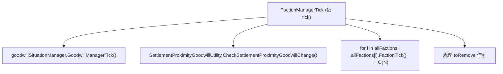

# 派系規模效能 + 動態派系生命週期 + 勢力內具名 NPC 政治演進（idea 7、8 可行性）

> 目標玩法：在 RimWorld 1.6 世界地圖上做「動態派系政治」層（騎砍／十字軍之王風）——上千勢力、遊戲途中誕生／滅亡、分裂／反叛／同盟／合併，且勢力內有具名 NPC（反叛者）隨時間累積反叛進展、達閾值分裂出新勢力並讓據點易主。
>
> 本報告落實在本體反編譯源 `projects/rimworld/`（行號為該目錄檔案）與 `projects/rimworld_mods/rim-war/decompiled/RimWar.decompiled.cs`（Rim War 行號）。太吾的動態門派經驗僅供理解「玩法形狀」，**API 不可混用**。

---

## 1. 目標拆解（對應原版掛點）

| 願景 | 對應原版機制 | 結論速覽 |
|---|---|---|
| 上千勢力 + Rim War 疊加 | `FactionManagerTick` O(N) + 關係 N² 儲存 + world pawn 線性增長 | **上千不可行；數百是上限區，且強烈受關係 N² 與首領 world pawn 拖累** |
| 途中新增勢力 | `FactionGenerator.CreateFactionAndAddToManager`（public，途中可呼叫） | **可行**，但每次新增是 O(N) 關係建立 + 1 個 world pawn |
| 途中滅亡勢力 | `FactionManager.Remove`（**僅 `temporary` 派系**） | **半可行**：原版不刪正規派系，只標 `defeated`；要真刪需自管 |
| 分裂／反叛／同盟／合併 | 新 Faction + `SetRelation` + 轉移 settlement 歸屬 + 通知 Rim War | **可行但要自己編排**，無現成 API |
| 勢力內具名 NPC | world pawn（`PassToWorld` + `KeepForever`）+ `previouslyGeneratedInhabitants` 定位 | **可行**，原版首領就是這套；定位靠 settlement 的 inhabitant 清單 |

---

## 2. 派系規模效能分析

### 2.1 FactionManagerTick：O(N) 線性，但常數不小

`FactionManager.FactionManagerTick`（`RimWorld/FactionManager.cs:147`）每 tick：



- 主迴圈 `for (int i = 0; i < allFactions.Count; i++) allFactions[i].FactionTick();`（`FactionManager.cs:151`）是純 **O(N)**。
- `Faction.FactionTick`（`RimWorld/Faction.cs:304`）本體很輕：`CheckReachNaturalGoodwill`、`kidnapped` tick、清過期 `predatorThreats`，多數是計時器檢查。**單派系 tick 成本低**，數百派系的純 FactionTick 本身不是主瓶頸。
- 真正堆積成本的是 **goodwill 子系統與關係**（下節）以及隨派系而生的 world pawn（首領）。

### 2.2 關係矩陣是 N²（確證——最大效能風險）

`Faction.relations` 是 `List<FactionRelation>`（`Faction.cs:24`），**每個派系各存一份對其他所有派系的關係**，且雙向對稱寫入：

- 新派系誕生時 `NewGeneratedFaction` 對 **每個既有派系** 呼叫 `TryMakeInitialRelationsWith`（`FactionGenerator.cs:171-174`），每次往 **雙方** 的 `relations` 各 `Add` 一筆（`Faction.cs:402-407`）。
- 因此關係總儲存量 = **每派系 N 筆 × N 派系 = O(N²) 記憶體**。
- `RelationWith` 是線性搜尋 `relations`（`Faction.cs:494` `for ... relations[i].other == other`）→ **單次查關係 O(N)**。任何「對所有派系兩兩比關係」的邏輯就是 **O(N²)**。

效能/存檔放大點：
- `Faction.ExposeData` 用 `Scribe_Collections.Look(ref relations, "relations", LookMode.Deep)`（`Faction.cs:277`）逐筆深存。N=1000 → 約 100 萬筆 FactionRelation 進存檔，**存檔大小與載入時間爆炸**。
- `RemoveAllRelations`（`Faction.cs:659`）刪一個派系要遍歷所有其他派系的 relations 清掉自己 → **O(N²) 最壞**（每個 RemoveAll 又是 O(N)）。途中大量刪派系時尤其痛。

### 2.3 首領 world pawn 隨派系線性增長 + WorldPawnsTick/GC

- 每個正規 humanlike 派系誕生時 `TryGenerateNewLeader`（`Faction.cs:1145`）會 `PawnGenerator.GeneratePawn` 造一個首領，並 `Find.WorldPawns.PassToWorld(leader, KeepForever)`（`Faction.cs:1195-1198`）。→ **N 派系 = 至少 N 個被永久保留的 world pawn**。
- `WorldPawnsTick`（`RimWorld.Planet/WorldPawns.cs:73`）每 tick 遍歷 `pawnsAlive` 全 DoTick（`:79-101`）。首領雖會被 mothball（`DoMothballProcessing` `:435`，每 15000 tick 一次轉入 `pawnsMothballed`，改走 `TickMothballed`），但：
  - 首領是 GC 的「critical pawn」永不回收：`GetCriticalPawnReason` 對 `IsFactionLeader` 直接回 `"FactionLeader"`（`WorldPawnGC.cs:192-194`）→ **首領永遠不會被 WorldPawnGC 清掉**。
  - `WorldPawnGCTick`（`WorldPawnGC.cs:28`）每 15000 tick 跑一次 `AccumulatePawnGCData`，會 **遍歷所有 world pawn**（`:82` `Find.WorldPawns.AllPawnsAliveOrDead`）並對每個 kept pawn 展開關係／記憶圖。world pawn 越多，GC pass 越重（雖分攤 `currentGCRate`）。
- 結論：派系數 → 首領 world pawn 線性增長 → WorldPawnsTick 遍歷成本 + 存檔 deep-save 成本線性增長。其他 mod 若也替派系造常駐 pawn（Empire 的爵位 NPC、各種「named ruler」mod），會再疊加。

### 2.4 Rim War 疊加成本：每派系 power tracker tick

Rim War 的唯一世界心跳 `WorldComponent_PowerTracker.WorldComponentTick`（rim-war `:17030`，見 `analysis/.../rim-war/architecture/01_world_simulation.md`）：

- `Initialize` 為 **每個可見派系** 建一份 `RimWarData`、指派聚落（`:17411`）。→ 派系數線性的記憶體與初始化成本。
- 每 `rwdUpdateFrequency` 跑 `UpdateFactions()`／`IncrementSettlementGrowth`（`:17567`）對 **每派系每聚落** 算成長 → 成本 ∝（派系數 × 平均聚落數）。
- `DoGlobalRWDAction`（`:17310`，每 60000 tick）對派系做全域外交調整。
- 緩解：Rim War 有 `threadingEnabled`（把 `UpdateFactions` 丟背景執行緒，`:17059`）與 `rwdUpdateFrequency`／`averageEventFrequency` 滑桿可調慢。但這只攤平 CPU，**不解決派系數本身帶來的記憶體與存檔成本**。
- 注意 Rim War 的事件評估是「**隨機挑一個派系一個聚落**做一個 action」（`:17089`），所以單次評估 **不是 O(N)**；它的 O(N) 在 `UpdateFactions` 的成長迴圈。

> Diplomacy 類 mod 的 N² 風險：凡是「定期讓每對派系互相調 goodwill／重算外交」的設計，配合原版關係查找本身 O(N)，整體就是 **O(N²) per pass**。這是「上千勢力」最致命的隱性成本——不在 RimWorld 本體，而在這類疊加 mod。

### 2.5 定性風險評級

| 派系數 | 純原版 | + Rim War | + Rim War + Diplomacy 類 N² | 主瓶頸 |
|---|---|---|---|---|
| ~20（原版量級） | 無感 | 無感 | 無感 | — |
| 50–100 | 輕微（存檔變大） | 可接受（可調 freq） | 開始可感 | 關係 deep-save、首領 world pawn |
| 200–400 | 存檔/載入明顯變慢、世界生成變慢 | tick 可調慢但卡頓增 | **N² 外交運算成卡頓主因** | 關係 N² 儲存＋查找、WorldPawnGC pass |
| 1000+ | **不建議**：存檔可達數十 MB 關係資料、載入數十秒、世界生成龜速 | 記憶體＋初始化成本疊加 | **不可行** | 關係 N² 記憶體/存檔、N 首領 world pawn、N² 外交 |

**瓶頸排序（由重到輕）**：① 關係 N² 儲存＋deep-save（記憶體/存檔/載入） → ② Diplomacy 類兩兩外交 O(N²) per pass → ③ N 個首領 world pawn 的 WorldPawnsTick/GC/存檔 → ④ Rim War 成長迴圈 O(派系×聚落) → ⑤ FactionManagerTick 純 O(N)（最輕）。

---

## 3. 遊戲途中增刪勢力可行性

### 3.1 新增：可行（public 入口，途中可呼叫）

- `FactionGenerator.CreateFactionAndAddToManager(FactionDef)`（`FactionGenerator.cs:106`）→ 內部 `NewGeneratedFaction` + `Find.FactionManager.Add`。**public static，無「僅世界生成」限制**，途中可直接呼叫。
- `NewGeneratedFaction`（`FactionGenerator.cs:130`）途中呼叫會：建 Faction → 取 loadID → 生 ideo → 取名 → **對所有既有派系建立初始關係**（`:171-174`，O(N)）→ 若非 hidden 自動 **造一個 settlement world object**（`:175-185`）→ `TryGenerateNewLeader`（`:186`，造首領 world pawn）。
- `FactionManager.Add`（`FactionManager.cs:93`）會 `RecacheFactions()` + 通知每張地圖 `Notify_FactionAdded`（`:101-104`）。

> 副作用提醒：`NewGeneratedFaction` 預設會幫你造一個聚落並隨機選 tile。若你要自己控制據點（例如分裂時繼承母派系的據點），可改用 `NewGeneratedFactionWithRelations` 並自行管理 world object，或生成後立刻把自動造的聚落處理掉。

### 3.2 滅亡：原版只「標記 defeated」，真刪受限

- `FactionManager.Remove` 是 **private**，且開頭就擋：`if (!faction.temporary) Log.Error(... only temporary factions can be removed)`（`FactionManager.cs:107-112`）。**正規派系無法經此路徑刪除**。
- 整套移除佇列（`QueueForRemoval` `:386`、`Notify_*` `:338-362`、`FactionCanBeRemoved` `:398`）都只服務 `temporary` 派系（quest 用的臨時派系）。
- 原版「派系滅亡」的真實語意是把 `Faction.defeated = true`（`Faction.cs:32`、`ExposeData :281`），由 `SettlementDefeatUtility.CheckDefeated`（在 `Settlement.TickInterval` 呼叫，`Settlement.cs:196`）在派系最後一個聚落被消滅時標記。**defeated 派系仍留在 allFactions、仍佔關係矩陣、首領仍在 world pawns**——只是不再被當作活躍目標。

**對你的設計的意涵**：
- 若沿用原版語意（標 `defeated` 不真刪），**關係 N² 與 world pawn 成本不會隨「滅亡」回收** → 長局累積派系只增不減，效能持續惡化。
- 若要真正回收，必須自己做：呼叫 `RemoveAllRelations`（`Faction.cs:659`，O(N²) 風險）、把首領 world pawn `RemovePawn`／允許 GC（先清掉 `IsFactionLeader` 條件，即把 `faction.leader = null`，否則 GC 永不收）、轉移或銷毀其 world objects。原版沒有現成「安全刪正規派系」的 API，這塊要自管且要小心 cross-ref（quest、site、caravan 仍引用該派系時刪會炸——參考 `FactionCanBeRemoved` 的檢查清單 `:404-419`）。
- 一個務實折衷：把你的動態派系建成 `temporary = true`，就能走原版 Remove 路徑自動回收。但 `temporary` 派系 `HasGoodwill=false`（`Faction.cs:202-212`）、無首領（`ShouldHaveLeader` 要求 `!temporary`，`Faction.cs:166`）、不參與 goodwill 系統 → 與「有政治關係的正規勢力」需求衝突。**需權衡：要可回收就失去完整外交語意，要完整外交就得自己寫安全刪除**。（待驗證自管刪除的穩定性）

---

## 4. 分裂／反叛／同盟／合併 的實作路徑

無現成 API，全部是「組合原語」。各操作要動的東西：

| 操作 | 新 Faction | Settlement 歸屬 | Relations | Rim War 通知 | World pawn |
|---|---|---|---|---|---|
| **分裂/反叛** | `CreateFactionAndAddToManager` 造新派系 | 把母派系部分 settlement 的 `SetFaction(新派系)` | 新舊派系設 Hostile（`SetRelation`/`SetRelationDirect`）；對第三方繼承或重算 | 新派系會被 `CheckForNewFactions`（rim-war `:17302`）自動建 RimWarData；或主動呼叫 | 為新派系 `TryGenerateNewLeader`（反叛者升為首領，見 §5） |
| **同盟** | 無 | 無 | `SetRelationDirect(other, Ally)` 或拉 goodwill ≥75（`TryAffectGoodwillWith`） | Rim War 自有 `AllianceFactions`（rim-war `:1484`）；需確認你的同盟與它的同盟概念一致 | 無 |
| **合併** | 無（保留一個、滅另一個） | 被併方所有 settlement `SetFaction(存留派系)` | 對存留派系 `RemoveAllRelations` 被併方後刪除/標 defeated | 通知 Rim War 清掉被併派系的 RimWarData（`RemoveRWDFaction` rim-war `:15310`）；或讓它自然偵測無聚落 | 被併方首領處理（轉移或移除） |

關鍵 API：
- 轉移據點歸屬：`WorldObject.SetFaction(faction)`（`FactionGenerator.cs:42`、`:178` 都用它）。Settlement 是 WorldObject 子類。
- 設關係：goodwill 派系用 `TryAffectGoodwillWith`（`Faction.cs:579`，會自動算 kind 門檻並發信）；非 goodwill 派系用 `SetRelationDirect`（`Faction.cs:641`）。**注意 `SetRelationDirect` 對 `HasGoodwill && other.HasGoodwill` 的兩個派系會報錯拒絕（`:643-647`）**——正規 humanlike 派系都 HasGoodwill，所以兩個正規派系要改關係只能走 `TryAffectGoodwillWith` 拉 goodwill 過 ±75 門檻（Hostile -75 / Ally 75，見 `Faction.cs:397`、`:700`、`:711`）。
- 初始關係：直接設 `SetRelation`（`Faction.cs:431`）可指定 kind + baseGoodwill。

> 設計提醒：分裂後新舊派系的「對第三方關係」要怎麼定？最省事是讓新派系經 `TryMakeInitialRelationsWith` 走預設（`NewGeneratedFaction` 已做），再針對母派系手動設敵對。若要繼承母派系的外交立場，需手動複製 relations（又是 O(N)）。

---

## 5. 勢力內具名 NPC 政治系統（idea 8）

### 5.1 生成「他派系內的具名 NPC」——就是原版首領那套

原版首領生成（`Faction.TryGenerateNewLeader` `Faction.cs:1145-1202`）即範本：
```
PawnGenerationRequest(kind, faction, PawnGenerationContext.NonPlayer, ...)
→ leader = PawnGenerator.GeneratePawn(request)
→ Find.WorldPawns.PassToWorld(leader, PawnDiscardDecideMode.KeepForever)   (:1195-1198)
```
你的「反叛者」NPC 照此造：指定其 `Faction = 目標派系`、`PawnGenerationContext.NonPlayer`，生成後 `PassToWorld(..., KeepForever)` 長期保存。`KeepForever` 會進 `pawnsForcefullyKeptAsWorldPawns`（`WorldPawns.cs:226-228`），`GetCriticalPawnReason` 對 `ForceKept` 回非空（`WorldPawnGC.cs:212-214`）→ **永不被 GC 回收**，符合「長期追蹤」需求。

成本：每個這種 NPC = 1 個常駐 world pawn（DoTick + mothball + 存檔 deep-save）。若每派系都養數個反叛者候選，乘上派系數會放大 §2.3 的 world pawn 成本 → **務必只對「活躍／玩家附近」派系生成，其餘休眠**（見 §7）。

### 5.2 定期狀態更新的掛點

- **首選 `WorldComponent` + 自管 tick**：自寫一個 `WorldComponent`，override `WorldComponentTick`，內部 `if (Find.TickManager.TicksGame % interval == 0)` 批次推進反叛進展。這正是 Rim War 用的模式（`WorldComponent_PowerTracker.WorldComponentTick`）。
- 不要把進展邏輯掛在 `Pawn.Tick`（mothball 的 world pawn 走 `TickMothballed`，間隔不定且被合併，`WorldPawns.cs:442`）。**用 WorldComponent 集中排程才可控**，並可做 tick 分攤（一次只處理 K 個 NPC）。
- 反叛進展數值可存在你自己的資料結構（以 `pawn.thingIDNumber` 或 `Faction.loadID` 為 key），或掛在 NPC 的自訂 `Hediff`／自訂 comp。**不要塞進原版 Faction/Pawn 欄位**。

### 5.3 達閾值 → spawn 新派系 + 據點易主

達閾值時編排（複用 §3、§4）：
1. `CreateFactionAndAddToManager(rebelFactionDef)` 造新派系（或先造再把反叛者設為其 leader）。
2. 反叛者 NPC：`pawn.SetFaction(新派系)`，並設為新派系 leader（直接賦值 `faction.leader = rebel`，或讓 `TryGenerateNewLeader` 的 map-members-only 路徑挑他，`Faction.cs:1149`）。
3. 把母派系「倒戈」的 settlement 逐一 `SetFaction(新派系)`（據點易主）。
4. 新舊派系 `TryAffectGoodwillWith` 拉到 Hostile。
5. Rim War 會經 `CheckForNewFactions` 自動接管新派系（rim-war extension_points `:10`）；若要立刻指定戰力/聚落歸屬，呼叫 Rim War 的 `WorldUtility`/`ConvertSettlement`（見 §6）。

### 5.4 NPC ↔ settlement 定位關聯（visit 時找得到）——關鍵發現

**RimWorld 的非玩家聚落沒有常駐 pawn**。Settlement（`RimWorld.Planet/Settlement.cs`）不存居民清單，只在 `TickInterval` 跑 trader tick + `CheckDefeated`（`:189-197`）。居民是 **visit 時 lazy 生成**，並記錄在 `previouslyGeneratedInhabitants`（`Settlement.cs:14`）：

- 進入某聚落地圖、用 `PawnGenerationRequest { Inhabitant = true, Tile = 該聚落 tile }` 生成 pawn 時，`GenerateOrRedressPawnInternal`（`Verse/PawnGenerator.cs:199`）會：
  - 先嘗試 **重用（redress）** 該 settlement 之前生過、且仍是 world pawn 的居民：`settlement.previouslyGeneratedInhabitants.Contains(x)`（`PawnGenerator.cs:212-214`）→ 讓「上次見過的同一個 NPC」再次出現。
  - 若新生成，記進 `previouslyGeneratedInhabitants.Add(result)`（`PawnGenerator.cs:237`）。
- 所以「某具名 NPC 駐在某聚落」的原版表達 = 把該 pawn 放進 **目標聚落的 `previouslyGeneratedInhabitants`**（且其為 world pawn）。visit 時的 inhabitant redress 就會優先把它請回場上 → **玩家造訪該據點即可遇到他**。

**定位設計建議**：
- 生成反叛者時，除 `PassToWorld(KeepForever)` 外，把他 `Add` 進「所在聚落」的 `previouslyGeneratedInhabitants`。這就是原版能「在特定據點找到特定 NPC」的唯一現成鉤子。
- `previouslyGeneratedInhabitants` 是 `LookMode.Reference` 存檔（`Settlement.cs:165`），會跟著存檔走，定位關係持久。
- 注意 `Notify_MyMapRemoved` 會清掉已銷毀/已非 world pawn 的條目（`Settlement.cs:202-209`）；保持你的 NPC 是 world pawn 即不被清。
- 你自己的「NPC 在哪個派系/哪個聚落」權威資料仍建議自管（WorldComponent 內的 dict），`previouslyGeneratedInhabitants` 只當「visit 時把人請回場」的橋。

---

## 6. 與 Rim War 的協作／衝突（誰是 source of truth）

Rim War 自己就管「聚落佔領、派系成長、派系滅亡」，與你的動態派系層職責高度重疊。核心衝突點：

- **易主**：Rim War 用 `WorldUtility.ConvertSettlement`（rim-war `:15289`）做佔領（摧毀原 Settlement → `AddNewHome` → 重建 RimWar settlement）。你的分裂/反叛若直接 `SetFaction` 改歸屬，Rim War 的 RimWarData 可能與實際派系不同步。
- **滅亡**：Rim War 在派系無聚落時 `RemoveRWDFaction`（rim-war `:15310`）清掉它的 RimWarData 與世界物件——但這是清 Rim War 的資料，**不刪原版 Faction**（原版仍標 defeated）。

**建議的 source-of-truth 切分**：

| 範疇 | 建議權威 | 理由 |
|---|---|---|
| 派系存在/關係/首領（原版 Faction 物件） | **原版 FactionManager** | 兩邊都讀它；Rim War 也是讀原版派系建 RimWarData |
| 聚落歸屬（誰擁有哪個 Settlement） | **原版 WorldObject.Faction** | Rim War 的 ConvertSettlement 最終也是改這個；保持原版為準 |
| 軍事戰力/行軍/抽象戰 | **Rim War（RimWarData/points）** | 別自己重做一套戰力，疊加只會打架 |
| 政治演進（反叛進展/分裂觸發） | **你的 WorldComponent** | 這是 Rim War 沒有的層，你獨佔 |

**協作方式（取自 rim-war extension_points 的 B 類「薄 C# 呼叫層」）**：
- 你的動態派系層做完「造派系 + 改 settlement 歸屬」後，**主動呼叫 Rim War 的 public static**：`WorldUtility.ConvertSettlement` 觸發它認可的易主、或讓新派系經 `CheckForNewFactions`（rim-war `:17302`）自動建 RimWarData（extension_points `:10`）。
- 讀盤用 Rim War 的 public getter（`RimWarData` list、`AllRimWarSettlements`、`TotalFactionPoints`，extension_points `:36-39`），不攔截其內部。
- **避免**：你和 Rim War 同時改同一聚落歸屬／同時判定同一派系滅亡。約定「政治事件由你發起 → 呼叫 Rim War API 落地」的單向流，別雙向各改各的。
- 風險：Rim War 是純 DLL 無源、無事件鉤，所有 B 類假設未實機驗證（rim-war extension_points `:48`）。

---

## 7. 效能設計建議（上千勢力不可行時的折衷）

核心原則：**「上千」不要是「上千個原版 Faction 物件」**。原版 Faction 的關係 N²＋首領 world pawn 注定撐不住上千。

1. **活躍/休眠分層**：只把玩家附近、近期互動、或正在政治演進的派系實體化為原版 Faction（建議活躍上限數十～百餘）；其餘「勢力」用你自己的輕量資料結構（純數值，不建 Faction、不建 world pawn、不進關係矩陣）。需要登場時才「升格」成原版 Faction。這直接砍掉 §2 的三大瓶頸。
2. **避免 N² 外交**：不要每 pass 對所有派系兩兩重算關係。改成事件驅動（只有發生政治事件的派系對才更新關係），或對「活躍集合」內才算兩兩。
3. **tick budget 分攤**：政治演進在 WorldComponent 裡用 `TicksGame % interval` + 「每次只處理 K 個 NPC/派系」的游標，把成本攤平到多 tick（Rim War 的 `rwdUpdateFrequency`、WorldPawnGC 的 `currentGCRate` 都是這套）。
4. **world pawn 節流**：具名 NPC（反叛者）只對活躍派系生成；非活躍派系的「首領」用純資料記名字即可，不造 pawn。記得真要刪派系時把 `leader=null` 才能讓 GC 回收（否則 `FactionLeader` 永久 kept，`WorldPawnGC.cs:192`）。
5. **存檔瘦身**：關係矩陣是 deep-save（`Faction.cs:277`），是存檔膨脹主因。活躍派系少 → 關係筆數平方級下降，存檔/載入直接受益。
6. **借 Rim War 的 threading/freq 滑桿**：引導玩家或 patch 預設，把 `rwdUpdateFrequency`/`averageEventFrequency` 調大、開 `threadingEnabled`（rim-war extension_points `:14`）。

---

## 8. 風險與待驗證

- **[高] 上千原版 Faction 不可行**——關係 N² 記憶體/存檔、N 首領 world pawn、Diplomacy 類 N² 外交三重夾擊。必須走「活躍/休眠分層」。（§2 已從源碼確證 N² 與線性增長，但「具體幾百開始卡」未實機壓測——**待驗證**。）
- **[高] 真刪正規派系無原版 API**——`Remove` 只收 `temporary`（`FactionManager.cs:107`）。自管刪除要處理 `RemoveAllRelations`（O(N²)）、首領 world pawn 回收、cross-ref（quest/site/caravan）安全性。**自管刪除穩定性待驗證**。
- **[中] `temporary` 派系的權衡**——可被原版回收，但無 goodwill、無首領、不參與外交（`Faction.cs:166`、`:202`），與「完整政治勢力」需求衝突。
- **[中] Rim War 協作未實機驗證**——`ConvertSettlement`/`CheckForNewFactions`/public getter 的 prefix/postfix 與直接呼叫假設皆來自反編譯閱讀，**未跑過**（rim-war extension_points `:48-51`）。
- **[中] 兩派系皆 HasGoodwill 時不能 `SetRelationDirect`**（`Faction.cs:643-647`）——正規派系改關係只能拉 goodwill 過門檻，分裂瞬間「立刻敵對」需用 `TryAffectGoodwillWith` 一次拉到 ≤ -75（`GoodwillToMakeHostile` `Faction.cs:550` 給了現成數值）。
- **[低] PlanetLayer**——1.6 的 `NewGeneratedFaction` 帶 `PlanetLayer` 參數（`FactionGenerator.cs:130`），途中造派系要選對 layer（預設 `Find.WorldGrid.Surface`，`:108`）。
- **[待驗證] `previouslyGeneratedInhabitants` 跨 mod 相容性**——其他改 settlement 生成的 mod（Empire/VOE outpost）是否也動這份清單，未查。

---

## 9. 開放設計問題

1. 「勢力」的數量級到底要多少？若真要「世界上有上千個名字」，**名字層（資料）與實體層（Faction）必須分離**——你接受嗎？
2. 反叛進展要不要可被玩家干預（visit 該 NPC 安撫/煽動）？若要，就坐實 §5.4 的 inhabitant 定位橋。
3. 分裂後的據點歸屬比例由誰決定？是固定比例還是按 NPC 在各據點的「影響力」？影響力要不要也是 per-settlement 資料？
4. 與 Rim War 的戰力是否要雙向影響（反叛成功讓新派系繼承部分 RimWarPoints）？這需要寫入 Rim War 的 `RimWarSettlementComp.RimWarPoints`（有 public setter，extension_points `:39`）。
5. 不裝 Rim War 時，你的動態派系層是否要自備一套極簡「誰打誰、誰滅誰」？還是 Rim War 設為硬依賴？

---

## 10. 參考檔案清單

本體源（`projects/rimworld/`）：
- `RimWorld/FactionManager.cs`（`:93` Add／`:107` Remove 僅 temporary／`:147` FactionManagerTick O(N)／`:398` FactionCanBeRemoved 刪除前置檢查）
- `RimWorld/Faction.cs`（`:24` relations 為 List＝N² 儲存／`:277` ExposeData deep-save／`:304` FactionTick／`:431` SetRelation／`:494` RelationWith 線性查／`:550` GoodwillToMakeHostile／`:641` SetRelationDirect 兩 goodwill 派系拒絕／`:659` RemoveAllRelations O(N²)／`:1145` TryGenerateNewLeader＋PassToWorld KeepForever）
- `RimWorld/FactionGenerator.cs`（`:106` CreateFactionAndAddToManager public 途中可呼叫／`:130` NewGeneratedFaction 流程／`:171-174` 對所有派系建關係 O(N)／`:175-186` 自動造聚落＋首領）
- `RimWorld/FactionDef.cs`（`:134` requiredCountAtGameStart／`:136` settlementGenerationWeight／`:140` maxConfigurableAtWorldCreation／`:186` permanentEnemy／`:239` 已棄用 maxCountAtGameStart/canMakeRandomly）
- `RimWorld.Planet/WorldPawns.cs`（`:73` WorldPawnsTick 遍歷 pawnsAlive／`:200` PassToWorld／`:226` KeepForever／`:435` DoMothballProcessing 每 15000 tick）
- `RimWorld.Planet/WorldPawnGC.cs`（`:28` WorldPawnGCTick／`:174` GetCriticalPawnReason／`:192` FactionLeader 永不回收）
- `RimWorld.Planet/Settlement.cs`（`:14` previouslyGeneratedInhabitants／`:189` TickInterval 無常駐居民／`:196` CheckDefeated）
- `Verse/PawnGenerator.cs`（`:199` GenerateOrRedressPawnInternal／`:209-219` Inhabitant redress 從 previouslyGeneratedInhabitants 重用同一 NPC／`:237` 新生成記入聚落）

既有分析：
- `analysis/rimworld_mods/rim-war/architecture/01_world_simulation.md`（WorldComponentTick 逐派系成本、ConvertSettlement 易主、RemoveRWDFaction 滅亡）
- `analysis/rimworld_mods/rim-war/details/extension_points.md`（CheckForNewFactions 自動納管、public static 呼叫面、threading/freq 滑桿、B 類風險）
