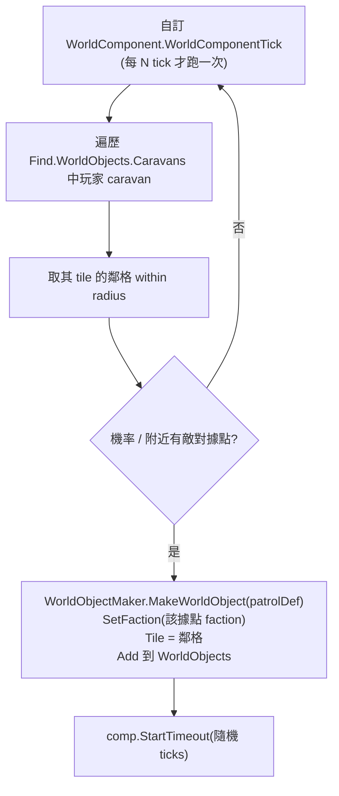

# 據點與世界物件效能 + 自寫輕量 WorldObject + 臨時生成（idea 4/5/6 可行性）

> 權威源：`projects/rimworld/`（本體 1.6 反編譯）、`projects/rimworld_mods/vanilla-outposts-expanded/decompiled-framework/Outposts.decompiled.cs`（VOE 引擎）。
> 引用一律附 `path:line`。標「待驗證」者為尚未在反編譯源中坐實的推論。

---

## 1. 目標

使用者要在世界地圖放「一大堆」NPC 勢力的 **永久 outpost**，平時不常駐小人（頂多幾個代表），玩家**實際襲擊/拜訪時才生成臨時 NPC**；外加在玩家部隊周圍刷出 **臨時性物件**（巡邏隊、小型臨時聚居地，到期自毀）與 **臨時事件**（傷獸、旅商）。本報告回答：VOE outpost 到底多重、能否給 NPC、自寫輕量 WorldObject 划不划算、lazy 生成怎麼複用、臨時物件/事件原版範本。

**先講三個結論：**
1. **VOE outpost 是「中量級」、且天生綁玩家**——不是因為 WorldObject 本身重，而是因為它**把活 pawn 常駐在世界物件裡逐 tick 養**（`SatisfyNeeds`）。用它鋪「一大堆 NPC 據點」是錯誤工具。
2. **強烈建議自寫輕量 WorldObject**：原版 WorldObject 的 per-tick 成本極低（空 `Tick()` + 每 15 tick 一次 `TickInterval`），數百個無 map、無 pawn、無 comp 的純圖標物件對世界 tick 幾乎零負擔。
3. **lazy 臨時 NPC 是原版 `Settlement` 的既有行為**：無 map 時 settlement 持有 **零個活 pawn**，玩家攻打/拜訪才 `GetOrGenerateMap` 連帶生人。直接複用 `Settlement`（或 `: MapParent` 自寫）即可，不要學 VOE 常駐 pawn。

---

## 2. VOE outpost 效能解剖

### 2.1 類別形態與 comp
- `Outpost : MapParent, IRenameable`（`Outposts.decompiled.cs:731`）。繼承鏈 `Outpost → MapParent → WorldObject`。
- **沒有掛任何 `WorldObjectComp`**（def 的 `comps` 為空，邏輯全寫在 override 的 `Tick`/`TickInterval`）。成本不在 comp，在 override。
- 持有的重量級狀態：`List<Pawn> occupants`（`:743`，**活 pawn 物件**）、`List<Thing> containedItems`（`:735`）、`Dictionary<SkillDef,int> totalSkills`（`:765`）。

### 2.2 逐 tick 真正做什麼（熱點）
世界 tick 入口：`WorldObjectsHolder.WorldObjectsHolderTick()`（`WorldObjectsHolder.cs:207`）對 **全部** WorldObject 呼叫 `DoTick()`。`WorldObject.DoTick()`（`WorldObject.cs:361`）每 tick 呼叫 `Tick()`，但 `TickInterval()` 走 **批次節流**：`tickDelta > UpdateRateTicks` 才執行（`:370`），`UpdateRateTicks` 在世界畫面沒選中時是 **15**（`WorldObject.cs:231-241`）＋ HashOffset 錯開。

VOE 的 override：
- **`Outpost.Tick()`（`:908`）每 tick 跑**：`PawnCount==0` 檢查；**`if (Map == null) SatisfyNeeds()`**（`:919-922`）→ `SatisfyNeeds()`（`:1618`）**逐 occupant 呼叫 `OutpostHealthTick(pawn)`**（`:1638`/`:1703`，逐 hediff 處理）。這是 **per-tick × per-pawn 的熱點**。
- **`Outpost.TickInterval(delta)`（`:925`）每 ~15 tick 跑**：生產倒數/打包倒數；掃 `PlayerControlledCaravanAt`（`:946`）給在營玩家 caravan 回 rest/food；`if (Map==null) SatisfyNeedsInterval(delta)`（`:977`）→ 逐 occupant 跑 `AgeTickInterval`、rest、food、`OutpostHealthTickInterval`、`Need_Chemical` 補滿（`:1647-1700`）。

**定性結論：VOE outpost 的開銷與「常駐 pawn 數」成正比，不是與「outpost 數」成正比的廉價量。** 每個 outpost 每 tick 都在養活 pawn（健康/年齡/需求），這在原版世界物件裡是不存在的負擔。N 個各駐 3~5 人的 outpost = N×(3~5) 個 pawn 的逐 tick 模擬（即使簡化版）。要鋪「數十～數百個」，這條路會逐 tick 線性累加，**不可取**。

### 2.3 冷路徑（只在互動時算）
- 生產 `Produce()`/`ProducedThings()`（`:983-991`）只在 `ticksTillProduction<=0` 觸發（預設 `TicksPerProduction=900000`，`:775`）——極低頻，非熱點。
- `Material`/`cachedMat`（`:807`）、技能加總 `RecachePawnTraits`（`:1007`）都有快取，互動時才重算。
- gizmo / float menu / inspect 都是 UI 互動才呼叫，不入 tick。

### 2.4 是否綁玩家 faction
- VOE outpost **建立時把 faction 設成建立者（玩家 caravan）的 faction**：`((WorldObject)outpost).SetFaction(((WorldObject)creator).Faction)`（`:221`）。
- `SpawnSetup` 找 `m.IsPlayerHome` 當 `deliveryMap`（`:998`），產出物投回玩家基地；`Deploy`/防禦邏輯（見 `details/raid_and_attack_design.md`）全假設玩家。
- **結論：VOE 從建立、產出、到 UI 全程假設「玩家擁有」。** 沒有任何 NPC-owned outpost 的程式路徑。要改成 NPC 擁有等於重寫整條生命週期，不如自寫。

> 旁證（既有分析）：`analysis/.../vanilla-outposts-expanded/details/raid_and_attack_design.md` — outpost 平時 `Map==null`、`raidPoints`/`raidFaction` 是死欄位、框架不會主動襲擊 outpost。

---

## 3. 自寫輕量 WorldObject vs 照搬 VOE

### 3.1 原版 WorldObject 的最低成本
`WorldObject`（`WorldObject.cs:11`）本身：
- `DoTick()`（`:361`）→ `Tick()`（`:420`）預設只跑 `comps[i].CompTick()`。**沒有 comp 就是空迴圈。**
- `TickInterval()`（`:428`）同樣只跑 comp，且 **15 tick 才一次**（無 map 時）。
- `DoTick` 尾段的 `IThingHolder` 遞迴（`:383-417`）只在物件 `is IThingHolder` 時才進；純 WorldObject **不是** holder → 直接 `return`（`:390`）。
- 繪製走 `Print`（靜態 mesh，`:514`）或 `Draw`（`:521`）；圖標另由 `ExpandableWorldObjectsUtility` 處理（見 §9）。

→ **一個無 comp、無 map、非 holder 的 WorldObject，每 tick 成本 ≈ 一次虛呼叫 + 一個空 for 迴圈。** 數百個的世界 tick 負擔可忽略。

### 3.2 最小輕量 WorldObject 範本（NPC 永久據點用）

```csharp
public class NpcOutpost : WorldObject   // 直接繼承 WorldObject，不要 MapParent
{
    public override Material Material => /* 用 def.Material 或 faction 顏色快取 */ base.Material;
    // Label / ExpandingIcon 走 def，或 override 給 faction 圖標
    // 不 override Tick / TickInterval → 享受空迴圈
    // 不持有 List<Pawn> → 無逐 pawn 開銷
}
```

XML def 取最省設定（`WorldObjectDef.cs`）：
| 欄位 | 建議值 | 理由 | 行 |
|---|---|---|---|
| `worldObjectClass` | 自訂類 | — | `:11` |
| `canHaveFaction` | `true` | 要綁 NPC faction | `:13` |
| `expandingIcon` | `true` | 縮放時顯示圖標 | `:52` |
| `selectable` | `true` | 玩家可點 | `:39` |
| `useDynamicDrawer` | `false`（預設） | 用靜態 mesh，免逐幀重繪 | `:50` |
| `saved` | `true`（永久）/ `false`（純臨時） | `false` 不入存檔（見 `WorldObjectsHolder.cs:137`） | `:15` |
| `comps` | 空（或只放 Timeout，見 §7） | comp 才是 tick 成本來源 | `:27` |

### 3.3 取捨對照

| 面向 | 照搬 VOE Outpost | 自寫輕量 WorldObject |
|---|---|---|
| per-tick 成本 | 高，∝ 常駐 pawn 數（`SatisfyNeeds`） | ≈0（空迴圈） |
| NPC 擁有 | 全程假設玩家，需重寫 | 天生支援（`SetFaction` 任意 faction） |
| 常駐 pawn | 有（要養） | 無（lazy 生成，§5） |
| 生產/打包/部署 | 內建 | 需要才自寫，可掛 comp |
| 進地圖防守 | `MapParent` 已有 | 若要攻打需 `: MapParent`（見 §5） |
| 犧牲 | — | 放棄 VOE 的產出/部署 UI；要攻打得自己接 `GetOrGenerateMap` |

**建議：自寫 `: WorldObject`（純展示型）或 `: MapParent`（要可進地圖攻打/拜訪）。** 不要繼承或實例化 VOE 的 `Outpost`。VOE 的價值在「玩家自營產出據點」這個玩法，不在當廉價地圖圖釘。

---

## 4. 讓 NPC 勢力擁有 outpost 的改法

自寫輕量 WorldObject 後，NPC 擁有幾乎是免費的：

1. **faction 欄位**：`WorldObject.factionInt` + `SetFaction(newFaction)`（`WorldObject.cs:308`），只要 `def.canHaveFaction==true`（`:310` 會擋）即可設任意 NPC faction。原版 `Settlement` 就是這樣存在每個 NPC faction（見 `WorldObjectsHolder` 的 `AnyFactionSettlementOnLayer`，`WorldObjectsHolder.cs:109`）。
2. **世界生成時放置**：原版 NPC base 由 `WorldGenStep`/`SettlementUtility` 在 gen 階段鋪設；自訂物件可仿 `Find.WorldObjects.Add(WorldObjectMaker.MakeWorldObject(def))`（參考 `Settlement.Abandon` 的 `:450-453` 範式）。
3. **途中放置**：任何時候 `WorldObjectMaker.MakeWorldObject(def)` → `obj.Tile = tile` → `obj.SetFaction(npcFaction)` → `Find.WorldObjects.Add(obj)`。
4. **AI 是否誤管**：原版 storyteller/raid AI 只挑「有地圖的玩家殖民地」當目標（見 `Settlement.IncidentTargetTags`，`Settlement.cs:146-160`，非玩家走 `Map_Misc`）。純無 map 的 NPC 物件 **不會被原版 AI 當 raid 來源誤管**。唯一要注意：`SettlementDefeatUtility.CheckDefeated`（`Settlement.cs:196`）僅對有 map 的 settlement 生效——自寫物件不繼承就無此邏輯，**待驗證** 你是否需要「打下據點後消滅」的等價行為（要的話自寫）。

---

## 5. lazy 臨時 NPC（複用 Settlement 模式）

### 5.1 原版 Settlement 確實是「無 map = 零活 pawn」
- `Settlement : MapParent`（`Settlement.cs:10`）**不持有任何 `List<Pawn>` 活 pawn**。唯一的 pawn 欄位是 `previouslyGeneratedInhabitants`（`:14`），且那是 **WorldPawn 參照**，無 map 時 `Notify_MyMapRemoved` 還會清掉已死/非世界 pawn（`:199-210`）。
- `Map => Current.Game.FindMap(this)`（`MapParent.cs:29`）；`HasMap => Map != null`（`:23`）。無 map 時整個 settlement 就是 tile + faction + 圖標，**零 pawn 模擬成本**。

### 5.2 攻打/拜訪才生 pawn 的機制
- 攻打：`SettlementUtility.Attack`（`SettlementUtility.cs:29`）→ `GetOrGenerateMapUtility.GetOrGenerateMap(settlement.Tile, ...)`（`:47`）。地圖生成時由 `MapGeneratorDef`（`Settlement.cs:80`，非玩家用 `Base_Faction`）的 genstep **當場生成守軍 pawn**。生完才 `CaravanEnterMapUtility.Enter`（`:57`）。
- 用完回收：`MapParent.CheckRemoveMapNow()`（`MapParent.cs:315`）在 `TickInterval` 呼叫（`:177`），`ShouldRemoveMapNow`（`Settlement.cs:212`：無建築/無 pawn 阻擋即可移除）成立就 `DeinitAndRemoveMap`，pawn 隨地圖回收/轉 WorldPawn。

### 5.3 複用法
**最省事 = 直接用原版 `Settlement`**（或薄薄子類），給它 NPC faction，平時零 pawn，攻打/拜訪自動 lazy 生成。代價是它帶 trader（`Settlement.cs:12,143`）等你可能不要的東西。
**要更乾淨 = 自寫 `: MapParent`**，override `MapGeneratorDef` 指向你的守軍 genstep，再借 `SettlementUtility.Attack` 的同一套 `GetOrGenerateMap` 流程。**核心可複用點：lazy 生成完全靠 `GetOrGenerateMapUtility.GetOrGenerateMap` + `MapGeneratorDef`，與物件平時是否有 pawn 無關。**

> 平行範本：`analysis/rimworld_mods/deep-and-deeper/`（Site→口袋地圖 lazy 生成）與下節 `Site`，都是「無 map 物件 + 觸發時 GetOrGenerateMap」的同一模式。

---

## 6. visit settlement 適用性

- 入口：`CaravanArrivalAction_VisitSettlement`（`CaravanArrivalAction_VisitSettlement.cs:6`）。`CanVisit` 條件僅三項：`settlement != null && settlement.Spawned && settlement.Visitable`（`:53`）。
- `Visitable`（`Settlement.cs:48`）：非玩家、且 **不敵對**、且非太空層。
- float menu 由 `Settlement.GetFloatMenuOptions`（`Settlement.cs:342`）串接 visit/trade/gift/attack 各 ArrivalAction。

**適用性結論：visit 機制綁的是 `Settlement` 類型（`CanVisit` 形參就是 `Settlement`，arrival action 內部欄位也是 `Settlement`）。**
- 若自訂 NPC 據點 **繼承 `Settlement`**：visit 直接可用，只要 `Visitable` 為真（非敵對）。
- 若自訂 **不繼承 `Settlement`**（純 `: MapParent` / `: WorldObject`）：原版 visit 套不上，需要自寫對應的 `CaravanArrivalAction`（照抄這個 60 行的類即可，改成接受你的型別）。`Attack` 同理（`SettlementUtility.Attack` 形參也是 `Settlement`）。

→ **若你想白嫖「拜訪/交易/送禮/攻打」全套 UI，繼承 `Settlement` 是 CP 值最高的路；** 不繼承就要逐一複製 ArrivalAction。

---

## 7. 大地圖臨時物件（巡邏隊 / 臨時聚居地，到期自毀）

### 7.1 原版到期自毀範本：`TimeoutComp`
`TimeoutComp : WorldObjectComp`（`TimeoutComp.cs:5`）：
- `StartTimeout(ticks)`（`:47`）設 `timeoutEndTick`。
- `CompTickInterval`（`:57`）每隔 `ShouldRemoveWorldObjectNow`（`Passed && !ParentHasMap`，`:23-33`）成立就 `parent.Destroy()`（`:62`）。
- **關鍵：有 map 時不會自毀**（`!ParentHasMap`）——玩家正在打就不會憑空消失，打完移除 map 後才到期銷毀。完美符合「臨時物件」語意。
- 由 `WorldObjectCompProperties_Timeout` 在 def 的 `comps` 宣告即可掛上。

→ **臨時物件範本 = 自寫輕量 WorldObject（或 MapParent）+ def 掛 `WorldObjectCompProperties_Timeout`，生成後呼叫該 comp 的 `StartTimeout(ticks)`。** 純展示巡邏隊可設 `def.saved=false`（`WorldObjectDef.cs:15`），連存檔都省。

### 7.2「玩家部隊周圍十格刷新」觸發設計
原版沒有現成的「掃描 caravan 鄰格刷物件」元件，但拼裝零件都在：
- `WorldComponent`（`WorldComponent.cs:5`）提供 `WorldComponentTick()`（`:18`）每 tick 鉤子（記得自己節流，例如 `Find.TickManager.TicksGame % 250 == 0`）。
- 取玩家 caravan：`Find.WorldObjects.Caravans`（`WorldObjectsHolder.cs:47`）或 `PlayerControlledCaravanAt`（`:537`）。
- 鄰格判定：`WorldGrid.IsNeighborOrSame` / `GetTileNeighbors`（VOE `AnySettlementBaseAtOrAdjacent` 即用 `IsNeighborOrSame`，`WorldObjectsHolder.cs:555` 可參考）。

建議流程：



- 與 Faction Territories 聯動（`analysis/rimworld_mods/faction-territories/`）：可在 `R` 判定時查「caravan 是否進入某 faction 領土」決定刷哪一家的巡邏隊；屬設計接點，**待驗證** Territories 的領土查詢 API 形態。

---

## 8. 臨時事件（傷獸 / 旅商）— 原版機制與複用

原版「世界地圖臨時遭遇」有兩種範式：

### 8.1 臨時地圖型遭遇（伏擊/野獸群/交火）
- `CaravanIncidentUtility.GetOrGenerateMapForIncident(caravan, size, WorldObjectDefOf.Ambush)`（`CaravanIncidentUtility.cs:59`）：在 caravan 當前 tile **臨時生成戰鬥地圖**，掛 `Ambush`/`AttackedNonPlayerCaravan` 這類 **臨時 map parent def**，並 `Notify_GeneratedTempIncidentMapFor`（`:66`）標記為臨時——打完地圖移除、物件隨之消失。
- `SetupCaravanAttackMap`（`:41`）：算地圖大小→生成→`CaravanEnterMapUtility.Enter` 放玩家、`GenSpawn.Spawn` 放敵人。
- 觸發者是 `IncidentWorker`：`IncidentWorker_Ambush`（`IncidentWorker_Ambush.cs:8`）、`IncidentWorker_CaravanMeeting`（`IncidentWorker_CaravanMeeting.cs`，`:77` 用 `AttackedNonPlayerCaravan`）。**傷獸 = 一個對 caravan 觸發、生成野獸 pawn 進臨時地圖的 IncidentWorker**——複用 `GetOrGenerateMapForIncident` + 自己的 pawn 生成清單即可。
- 關鍵 def 旗標：`allowCaravanIncidentsWhichGenerateMap`（`WorldObjectDef.cs:33`）、`isTempIncidentMapOwner`（`:35`）控制哪些物件容許在其 tile 觸發這類臨時地圖（`CanFireIncidentWhichWantsToGenerateMapAt`，`CaravanIncidentUtility.cs:20`）。

### 8.2 純世界物件型遭遇（旅商隊 / 過境）
- 旅商抵達 **基地** 走 `IncidentWorker_TraderCaravanArrival`（對有 map 的玩家殖民地）；**世界地圖上移動的商隊** 則是 `Caravan`/`TravellingTransporters` 類世界物件（`WorldObjectsHolder.cs:19,51`）。
- 要做「世界地圖上路過的旅商物件」：自寫帶 `TimeoutComp` 的世界物件（§7.1）或仿 NPC `Caravan` 物件，到期/抵達後自毀。最省＝§7 的 Timeout 巡邏隊範式換個圖標與互動。

→ **複用建議**：傷獸/伏擊用 §8.1 的 `CaravanIncidentUtility` 臨時地圖路線（成熟、回收乾淨）；旅商過境用 §7 的 Timeout 世界物件路線。

---

## 9. 效能設計總結：「一大堆 outpost」可行的前提與守則

`WorldObjectsHolderTick`（`WorldObjectsHolder.cs:207-215`）**每 tick `AddRange` 複製整個列表再逐一 `DoTick`**——所以 per-object 的 `Tick()` 成本就是線性放大的關鍵。守則：

1. **冷熱分離**：永久 NPC 據點 **不要常駐活 pawn**（這正是 VOE 的逐 pawn `SatisfyNeeds` 之所以重）。pawn 只在 `GetOrGenerateMap` 時 lazy 生成（§5）。
2. **空 Tick**：自寫物件 **不 override `Tick`**，把週期邏輯放進 `TickInterval`（無 map 時 15 tick 才一次，`WorldObject.cs:231`）或更省地放進 `comp.CompTickInterval`。能用節流的 `WorldComponentTick`（§7.2）統一掃描，就別讓每個物件各自 tick。
3. **tick 分攤**：`UpdateRateTickOffset => HashOffset()`（`WorldObject.cs:243`）原版已把各物件的 `TickInterval` 用 hash 錯開到不同 tick——自訂物件繼承即享，別覆寫掉。
4. **圖標 LOD**：`ExpandableWorldObjectsUtility` 已做縮放轉場（`transitionPct`，`:99`）+ `HiddenByRules`（`:72`，非玩家 settlement 圖標可被「showBasesExpandingIcons」關掉）+ 距離排序（`SortByExpandingIconPriority`，`:245`）。但 `ExpandableWorldObjectsOnGUI`（`:123`）**每幀 `AddRange` 全物件再排序**——數百物件時這是 **繪製端** 的真熱點（非 tick 端）。守則：non-player 物件圖標善用 `def.expandingIcon`＋讓玩家可關閉、優先 `useDynamicDrawer=false` 走靜態 mesh。
5. **WorldPawnGC**：lazy 生成的守軍打完轉 WorldPawn 後，`WorldPawnGC`（`projects/rimworld/RimWorld.Planet/WorldPawnGC.cs`）會回收無關聯 pawn——別把生成的臨時 NPC 硬塞進長期參照（如 `previouslyGeneratedInhabitants` 之外的自訂 list），否則阻止 GC、世界 pawn 膨脹。**待驗證**：自訂物件若要記住「曾生成的守軍」，須仿 `Settlement` 用 WorldPawn 參照而非持有活 pawn。

**可行性裁決**：數百個 **無 map、無常駐 pawn、無重 comp** 的自寫 WorldObject 對世界 tick 幾乎零負擔，**可行**。真正的天花板在「繪製端的圖標全掃描」(§9.4) 與「玩家同時開啟太多 lazy 地圖」——後者本就受原版 map 數限制，與 outpost 數量無關。

---

## 10. 風險與待驗證

| # | 項目 | 狀態 |
|---|---|---|
| 1 | `ExpandableWorldObjectsOnGUI` 每幀全物件排序，數百物件的繪製端開銷未量測 | 待驗證（建議真機 profile） |
| 2 | 自寫物件「被打下後消滅」需自寫 `SettlementDefeatUtility` 等價邏輯 | 待驗證需求 |
| 3 | Faction Territories 領土查詢 API 形態（§7.2 聯動） | 待驗證 |
| 4 | lazy 生成守軍轉 WorldPawn 後的 GC 行為（§9.5），自訂參照是否阻止回收 | 待驗證 |
| 5 | `def.saved=false` 的純臨時物件在跨存檔/重載時的行為（`WorldObjectsHolder.cs:137` 存檔時剔除） | 已坐實邏輯，行為待真機確認 |
| 6 | NPC-owned `Settlement` 子類是否與原版 raid/quest 系統產生非預期互動（`IncidentTargetTags` 走 `Map_Misc`） | 部分坐實，建議測試 |

## 開放設計問題
- 永久 NPC 據點該繼承 `Settlement`（白嫖 visit/trade/attack 全套，但帶 trader 包袱）還是純 `: MapParent`（乾淨但要自寫 ArrivalAction）？取決於是否要交易/拜訪 UI。
- 「臨時聚居地」要不要可進地圖（`: MapParent` + Timeout），還是純展示巡邏隊（`: WorldObject` + Timeout）？前者要配 `MapGeneratorDef` 與守軍 genstep。
- 巡邏隊刷新要 `WorldComponentTick` 掃描（簡單、集中）還是 storyteller `IncidentWorker`（融入難度曲線、可被頻率調節）？

## 參考檔案清單
- `projects/rimworld/RimWorld.Planet/WorldObject.cs`（最小成員、`DoTick`/`TickInterval` 節流、`SetFaction`、繪製）
- `projects/rimworld/RimWorld.Planet/WorldObjectsHolder.cs`（`WorldObjectsHolderTick` 全物件迭代、faction settlement 查詢）
- `projects/rimworld/RimWorld.Planet/MapParent.cs`（`HasMap`、`CheckRemoveMapNow`、lazy 地圖回收）
- `projects/rimworld/RimWorld.Planet/Settlement.cs`（零常駐 pawn、`Visitable`、`MapGeneratorDef`、float menu）
- `projects/rimworld/RimWorld.Planet/TimeoutComp.cs` + `projects/rimworld/RimWorld/WorldObjectCompProperties_Timeout.cs`（到期自毀範本）
- `projects/rimworld/RimWorld.Planet/CaravanArrivalAction_VisitSettlement.cs`、`SettlementUtility.cs`（visit/attack 介面）
- `projects/rimworld/RimWorld.Planet/CaravanIncidentUtility.cs`（臨時遭遇地圖生成/回收）
- `projects/rimworld/RimWorld/IncidentWorker_Ambush.cs`、`IncidentWorker_CaravanMeeting.cs`（伏擊/交火 incident 範本）
- `projects/rimworld/RimWorld.Planet/ExpandableWorldObjectsUtility.cs`（圖標 LOD/繪製端成本）
- `projects/rimworld/RimWorld.Planet/WorldComponent.cs`（`WorldComponentTick` 掃描鉤子）
- `projects/rimworld/RimWorld/WorldObjectDef.cs`（最省 def 旗標）
- `projects/rimworld_mods/vanilla-outposts-expanded/decompiled-framework/Outposts.decompiled.cs`（VOE outpost 全貌）
- `analysis/rimworld_mods/vanilla-outposts-expanded/details/raid_and_attack_design.md`（VOE 不被襲擊、死欄位）
- `analysis/rimworld_mods/deep-and-deeper/`（Site→口袋地圖 lazy 生成平行範本）
- `analysis/rimworld_mods/faction-territories/`（臨時物件領土聯動接點）
