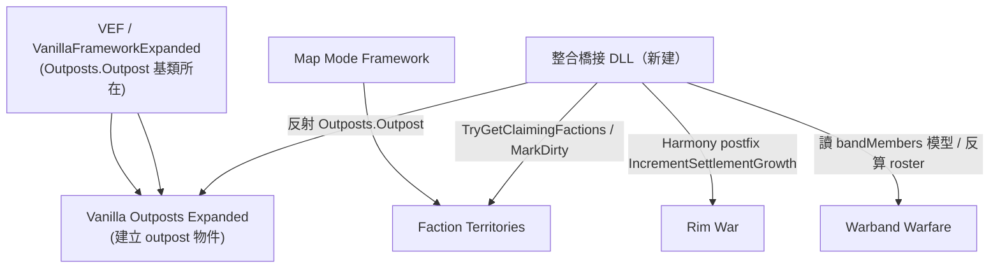
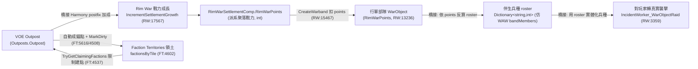

# Rim War × Warband × Faction Territories 三 mod 整合可行性報告

> 本報告為 idea 5、6 整合的可行性調查。所有演算法/公式結論皆已回到反編譯源碼確認（analysis 僅作索引）。
> 引用標記：
> - Rim War → `projects/rimworld_mods/rim-war/decompiled/RimWar.decompiled.cs`（簡稱 `RW:行`）
> - Warband → `projects/rimworld_mods/warband-warfare/decompiled/WarfareAndWarbands/WarfareAndWarbands.decompiled.cs`（簡稱 `WAW:行`）
> - Faction Territories → `projects/rimworld_mods/faction-territories/decompiled/FactionTerritories.decompiled.cs`（簡稱 `FT:行`）

---

## 1. 目標

把三個既有 mod 縫成一條「大地圖大戰略」資料流：

1. **outpost 資源點** 餵養 →
2. **Rim War NPC 派系戰力（RimWarPoints）** 成長 →
3. 戰力外溢成 **大地圖行軍部隊**，部隊帶 **Warband 式兵種組成（defName→人數）** →
4. 部隊／據點落在 **Faction Territories 領土** 內，outpost 只能建在自家領土且能反向擴張領土。

本報告逐條回答四個具體問題，並評估整合落地路徑與風險。

---

## 2. Rim War 襲擊接管查證

### 2.1 結論（先講）

**部分為真，但有條件、且可關閉。**

- Rim War **不是用 Harmony 直接 patch `IncidentWorker_RaidEnemy`**。它的手段是 patch 數個原版「派系 pawn 抵達」事件的 `CanFireNowSub`，當設定 `restrictEvents` 開啟時讓它們**回傳 false（不能觸發）**，藉此把「storyteller 隨機生成的派系襲擊／商隊／勒索／訪客」整批掐掉。
- **`restrictEvents` 預設為 `true`**（`RW:7617` 欄位預設、`RW:7682` Scribe 預設皆 true），且有玩家設定開關（`RW:7377`）。所以**預設安裝下，原版派系襲擊／商隊大多被擋**，改由 Rim War 自己的大地圖部隊行軍抵達後轉成襲擊。
- 但這是**設定可關**的；關掉 `restrictEvents` 後原版事件恢復，兩套來源會並存。

### 2.2 被掐掉的原版事件（精確清單）

`RimWarMod` 建構時手動註冊以下 Harmony patch（`RW:5966` 起 `new Harmony("rimworld.torann.rimwar")`）：

| 目標方法 | Patch 方法 | 行 | 作用 |
|---|---|---|---|
| `IncidentWorker_Ambush_EnemyFaction.CanFireNowSub` | `CanFireNow_Ambush_EnemyFaction_RemovalPatch_Prefix` | 註冊 `RW:6054`，本體 `RW:6673` | restrictEvents 時 `__result=false` |
| `IncidentWorker_CaravanDemand.CanFireNowSub` | `CanFireNow_CaravanDemand_RemovalPatch_Prefix` | `RW:6055` / `RW:6683` | 同上（擋勒索商隊） |
| `IncidentWorker_CaravanMeeting.CanFireNowSub` | `CanFireNow_CaravanMeeting_RemovalPatch_Prefix` | `RW:6056` / `RW:6693` | 同上（擋遭遇商隊） |
| `IncidentWorker_PawnsArrive.CanFireNowSub` | `CanFireNow_PawnsArrive_RemovalPatch_Prefix` | `RW:6057` / `RW:6703` | **關鍵**：擋 `RaidEnemy`/`RaidFriendly`/`TraderCaravanArrival` |

`IncidentWorker_PawnsArrive` 的 removal patch（`RW:6711`）邏輯最重要：

```
若 restrictEvents 且非任務/非強制/非隱藏派系：
    若 def == RaidEnemy || RaidFriendly || TraderCaravanArrival → __result = false（禁止）
```

> 注意：RimWorld 的 `IncidentWorker_RaidEnemy` 並非 `IncidentWorker_PawnsArrive` 的子類（兩者平行繼承 `IncidentWorker`），所以這個 patch 對「掛 `IncidentWorker_RaidEnemy` 的 def」**未必生效**。實際被掐的是「以 `IncidentWorker_PawnsArrive` 為 workerClass 的 def」且其 `def` 命中上述三個 IncidentDefOf 的情況。**這是 Rim War 攔截覆蓋面的精確邊界，整合時務必實機驗證「原版襲擊到底被擋多少」**（見 §8 待驗證）。
> 白名單例外：`VisitorGroup`/`VisitorGroupMax`、含 `Cult`/`Salvagers`/`Mechanoids`(僅 PawnsArrive 版)、`Rumor_Code` workerClass、quest/forced 事件不擋。

另有一個全域 `IncidentWorker.TryExecute` 的 prefix（`RW:6011` 註冊、`RW:6560` 本體）——**但它不擋事件**，只是在 `def==null` 時補回 `RaidEnemy`（防呆），永遠 `return true` 放行。

### 2.3 商隊 / 事件被「重導向」而非單純刪除

- `IncidentQueue.Add` 被 patch（`RW:6028` / 本體 `RW:6491`）：當 storyteller 排入「120000 tick 後的 `TraderCaravanArrival`」時，**取消原排程**（`return false`），改由最近的 Rim War 聚落生成一個真正在大地圖行軍的 `Trader` WarObject（`WorldUtility.CreateTrader`，`RW:6504`），並扣該聚落一半 RimWarPoints。→ **商隊確實「改成大地圖部隊行軍而來」**。
- `FactionDialogMaker.CallForAid` 被 patch（`RW:6035` / 本體 `RW:6443`）：玩家「請求軍援」改走 Rim War 的派系部隊。

### 2.4 襲擊是否「全改大地圖部隊行軍」

是，**在 restrictEvents=true 的預設下，敵對襲擊的主來源變成大地圖部隊**：

- AI warband 行軍抵達玩家聚落 tile → `IncidentUtility.ResolveRimWarBattle` → 對玩家跑 `DoRaidWithPoints`（`RW:10314`，見 `01_world_simulation.md` §4）→ 由 `IncidentWorker_WarObjectRaid : IncidentWorker_Raid`（`RW:3359`）把該部隊的 points 轉成一場真實地圖襲擊。襲擊 pawn 由 `PawnGroupMakerUtility.GeneratePawns`（`RW:3431`）從 `parms.points` 生成。
- 即「襲擊規模＝抵達部隊的 RimWarPoints」，而非 storyteller 威脅曲線。

**整合啟示**：要做「outpost→戰力→部隊」的閉環，Rim War 預設行為已經與之契合（襲擊本就源自大地圖部隊）。不需要額外擋原版襲擊；只要不動 `restrictEvents` 即可。

---

## 3. Rim War 戰力公式定位 + 改綁 outpost

### 3.1 公式確切位置

聚落戰力（RimWarPoints）成長唯一發生在 **`WorldComponent_PowerTracker.IncrementSettlementGrowth()`**，本體 `RW:17567`，每 `rwdUpdateFrequency` 觸發一次（驅動見 `01_world_simulation.md` §0）。

核心公式在 `RW:17622-17626`（僅當 `PointDamage<=0` 且 `RimWarPoints<=上限num2` 時成長）：

```
num4 = Rand.Range(2f,3f) + WorldUtility.GetBiomeMultiplier(該tile生態)       // RW:17624
num4 = num4
     * num                                              // (rwdUpdateFrequency/10000)，Expansionist ×1.1、Citadel +0.02、首都 +0.05/0.075  RW:17584-17614
     * WorldUtility.GetFactionTechLevelMultiplier(faction)
     * rimWarData.growthAttribute                        // 來自 RimWarDef.growthBonus
     * settingsRef.settlementGrowthRate                  // 玩家滑桿
component.RimWarPoints += Clamp(num4, 1f, 100f)          // RW:17626，每週期最多 +100
```

成長上限 `num2`：基礎 `50000`（`RW:17597`），Citadel +5000、首都 +5000/+1000（`RW:17600/17607/17612`）。

### 3.2 現行輸入彙總

| 輸入 | 來源 | 行 |
|---|---|---|
| 基礎隨機 | `Rand.Range(2,3)` | `RW:17624` |
| 生態乘數 | `GetBiomeMultiplier(PrimaryBiome)` | `RW:17624` |
| 週期係數 `num` | `rwdUpdateFrequency/10000`（+behavior/建物加成） | `RW:17584` |
| 科技乘數 | `GetFactionTechLevelMultiplier` | `RW:17625` |
| 派系成長係數 | `rimWarData.growthAttribute`（`RimWarDef.growthBonus`，預設 1f，`RW:1124`/`RW:5395`；無 def 則 `Rand 0.75~1.25`，`RW:5432`） | `RW:17625` |
| 玩家滑桿 | `settlementGrowthRate` | `RW:17625` |

戰力**不分兵種**，純粹一個 `int RimWarPoints`。派系總戰力 = Σ聚落 + Σ在途WarObject + Σ其他世界物件（`RimWarData.TotalFactionPoints`，`RW:1510`）。

### 3.3 改成「讀 outpost 資源點」的接法

公式裡**沒有任何 outpost 維度**，也沒有 DefModExtension/事件 hook 可注入額外成長項。三條路：

| 路徑 | 可行性 | 說明 |
|---|---|---|
| **DefModExtension** | ❌ | `IncrementSettlementGrowth` 不讀任何 extension，係數全寫死或來自 SettingsRef/RimWarDef 固定欄位。無注入點。 |
| **Harmony Postfix（推薦）** | ✅ 中等 | Postfix patch `WorldComponent_PowerTracker.IncrementSettlementGrowth`（無參數、`public`，可掛）。在 postfix 內：對每個 Rim War 聚落，查附近／同派系 outpost（VOE `Outposts.Outpost`），依其產出加成 `RimWarSettlementComp.RimWarPoints`。`RimWarSettlementComp` 與 `RimWarPoints` 為 public（`RW:6067` 等多處直接讀寫），可直接加。 |
| **fork Rim War** | ✅ 但成本高 | 直接改 `RW:17625` 那行公式插入 outpost 項。不建議（要重編 DLL）。 |

**推薦：Harmony Postfix on `IncrementSettlementGrowth`**。橋接 DLL 內：
- 用反射 `AccessTools.TypeByName("Outposts.Outpost")` 取得 VOE outpost 集合（FT 已示範此法，`FT:5682`）。
- 把 outpost 綁到「擁有它的派系」的聚落 → 額外 `RimWarPoints +=` 一個與 outpost 產出/數量相關的值。
- 注意 §3.1 的 `Clamp(num4,1,100)` 只夾「成長量」，不夾你 postfix 另外加的值；但聚落上限 `num2≈50000` 仍由原方法的 `if (RimWarPoints<=num2)` 閘控——你的 postfix 加在外面不受該閘限制，需自行尊重上限避免破壞平衡。

> 結論：**改綁 outpost 必須 C#（Harmony postfix），純資料不可行**。難度：中（單一公開無參方法、欄位全 public、有現成 VOE 反射範例）。

---

## 4. Warband roster 接 Rim War 部隊

### 4.1 Warband 兵種計數表資料模型（確認）

- `Warband : Site`（`WAW:3192`，分析誤記為兵團物件，實為 `Site` 子類）持有 **`private Dictionary<string,int> bandMembers`**（`WAW:1736`，public getter `BandMembers` `WAW:1750`）。key=`PawnKindDef.defName`，value=人數。
- **平時不存實體 Pawn**，只有這張計數表。存檔安全：`Scribe_Collections.Look(bandMembers, "bandMembers", LookMode.Value, LookMode.Value, ...)`（`WAW:1809`），純 string/int。
- 出擊時才實體化：`MercenaryUtil.GenerateWarbandPawns` 逐筆 `PawnGenerator.GeneratePawn`（見 `warband-warfare/01_warband_mechanics.md` §5）。
- NPC warband 的 roster 由 `GenerateNPCCombatGroup` 自動填（`WAW` PostAdd 路徑）。
- 成本＝Σ(人數 × `PawnKindDef.combatPower`) × 費率（`GetCostOriginal` `WAW:2815`）。**這個「人數×combatPower」正好對應一個 points 值**，是接 Rim War 的天然換算橋。

### 4.2 Rim War 部隊現行表示（確認）

- Rim War 部隊＝ `WarObject` 子類（`Warband`/`Scout`/`Trader`/`Settler`/`Diplomat`，`RW:13236` 等），力量**只有一個 `int RimWarPoints`**（外加 `PointDamage` 傷害）。
- `WarObject.Pawns`（`RW:14217`）是 lazy `List<Pawn>`，**預設空**；只有在需要實體化（轉成地圖襲擊）時才由 `PawnGroupMakerUtility.GeneratePawns` 從 points 生成（`RW:3431`），兵種組成由**該派系 FactionDef 的 PawnGroupMaker** 決定，不是被記錄的 roster。
- `PointsPerPawn`（`RW:14241`）只是 `RimWarPoints/Pawns.Count` 的事後平均，不是預存組成。

### 4.3 整合接法與落差

| 維度 | Warband | Rim War | 落差 |
|---|---|---|---|
| 力量表示 | `Dictionary<string,int>` 兵種 roster | `int RimWarPoints` | **不同維度**：一個是組成、一個是純量 |
| 兵種來源 | 玩家/NPC 編組表，存檔 | 派系 FactionDef PawnGroupMaker，臨時生成 | Rim War 無持久 roster |
| 戰鬥 | 進真地圖實打（無抽象） | 抽象 points 比大小 + 玩家相關時轉真襲擊 | 結算模型不同 |

**source of truth 衝突是核心難點**：Rim War 視 points 為唯一真相，部隊組成隨機；Warband 視 roster 為唯一真相，points 是衍生。兩者要合，必須選一個當主：

**建議接法（roster 為輔、points 為主，最小侵入）**：
1. 不改 Rim War 的 points 體系（維持其行軍/抽象戰）。
2. 新增橋接 DLL，為 `WarObject` 掛一個**伴生資料**（`WorldObjectComp` 或外部 `Dictionary<WarObject, Dictionary<string,int>>`，存於自訂 `WorldComponent`），在 `WorldUtility.CreateWarband`（`RW:15467`）後用 postfix 依 `RimWarPoints` 反推一張兵種 roster（複用 Warband 的「人數×combatPower=points」反算法，`WAW:2815` 邏輯反向）。
3. 當該 WarObject 對玩家轉成襲擊（`DoRaidWithPoints`/`IncidentWorker_WarObjectRaid`）時，用伴生 roster 取代 `PawnGroupMakerUtility.GeneratePawns`，改用 `MercenaryUtil.GenerateWarbandPawns` 風格逐兵種生成 → **騎砍式「看得到大地圖部隊的確切兵種」**。
4. 存檔：伴生資料用自己的 `WorldComponent` + `Scribe`，與 Rim War 既有存檔正交，**不污染對方 Scribe**。

**落差/風險**：
- Rim War 部隊在抽象戰中損耗的是 points，不會回寫 roster；需在 points 變動時同步重算 roster（或接受 roster 僅在生成/落地時對齊）。
- Warband 的 `combatPower` 排序與 Rim War 的 points clamp（`CalculateWarbandPointsForRaid` 50~2e6，`RW:15871`）量級需校準。

> 結論：**可行但需 C# 橋接 DLL**，兩者無共用資料接點。難度：高（要新建伴生資料層 + 兩套力量模型換算 + 攔截襲擊生成路徑）。

---

## 5. Faction Territories 領土聯動

### 5.1 領土資料結構（確認）

- 領土**不存實體**，是從錨點 flood 出來的快取 `Dictionary<int,HashSet<int>> factionsByTile`（tile → 宣稱該格的派系 loadID 集合，`FT:4602`/`BuildFactionMap` `FT:4614`）。
- 錨點＝`CollectSources`（`FT:4815`）掃所有 `Settlement` + 所有 `IsTerritoryAnchorWorldObject` 的 WorldObject。
- 成長＝**Dijkstra 加權 flood**：每錨點以 `outer = baseRadius+variation` 為預算（`baseRadius = radiusSteps×100`，`FT:4624`），逐格擴張，step cost = `ComputeStepCostScaled`（移動難度，有路更便宜）。確定性種子 `GetDeterministicSeed`。
- 快取以 `dirty` flag 重建：`MarkDirty()`（`FT:4508`）只設 `dirty=true`，下次 `EnsureCache`（`FT:4591`）若 dirty 就 `BuildFactionMap` 重算、`revision++`。

### 5.2 「outpost 僅建在領土內」的查詢接點 → ✅ 有現成 public API

**`TerritoryOwnershipCache.TryGetClaimingFactions(int tile, List<int> outFactionIds)`**（`public static`，`FT:4537`）：回傳宣稱該 tile 的派系 loadID 清單。
另有 `TryGetSingleFactionIfUncontested(int tile, out int factionId)`（`FT:4566`）：無爭議時回單一派系。

→ **建 outpost 前查 `TryGetClaimingFactions(目標tile)`，若不含該派系 loadID 就拒絕**。這是純查詢、main-thread、無副作用。**不需 fork FT，直接呼叫即可**（FT.dll 為硬相依，loadID 跨 mod 通用）。

### 5.3 「outpost 擴張領土」的寫入接點 → ✅ 幾乎零成本（已自動支援）

關鍵發現：**Faction Territories 已經把 outpost 當領土錨點**。

- `IsTerritoryAnchorWorldObject`（`FT:5414`）對 `Settlement`、VassalOutpost、**`IsOutpostWorldObject`（`FT:5616`）**、`IsOutpostSite`（含 Site part defName=="Outpost"，`FT:5568`）、Empire FC 聚落、`LooksLikeOutpost`（型別/defName 含 "Outpost"，`FT:5595`）皆回 true。
- `IsOutpostWorldObject` 透過 **`GetOutpostBaseType()` 反射 `"Outposts.Outpost"`**（`FT:5673-5682`）→ **正是 VOE/VEF 的 outpost 基類**。

→ 也就是說：**只要 NPC 派系建出一個 VOE outpost（或任何 defName/型別含 "Outpost" 的 WorldObject），FT 下次重建快取時就自動把它當新錨點、從它再 flood 一圈領土**。outpost 擴張領土**幾乎免寫**，唯一要做的是建完後呼叫 `TerritoryOwnershipCache.MarkDirty()`（`FT:4508`，public）觸發重算。

- 領土「擴張幅度」＝該錨點的 `outer` 半徑，與 Settlement 同一套 `radiusSteps` 全域設定（`FT:4845` outpost 源與 `FT:4831` settlement 源用同一 baseRadius/variation）。**無法靠 def 對單一 outpost 設不同半徑**（半徑是全域玩家設定，非 def）。若要 outpost 半徑 ≠ 聚落半徑，需 fork FT 的 `CollectSources`。

### 5.4 判斷：C# 橋接 vs 資料接點

| 需求 | 接點 | 需 C#？ |
|---|---|---|
| outpost 只建在自家領土 | `TryGetClaimingFactions`（公開查詢） | 需 C#（在建造邏輯前加一行查詢判斷），但**不需 fork FT** |
| outpost 擴張領土 | 自動（FT 已認 outpost 為錨點）＋ `MarkDirty()` 觸發 | 幾乎零；只需在建/拆 outpost 後呼叫 `MarkDirty()` |
| outpost 自訂領土半徑 | `CollectSources` 寫死共用半徑 | 需 **fork FT** |

> 結論：領土聯動是三項整合中**最容易**的——FT 設計時就預留了 outpost 錨點與公開查詢 API。難度：低（查詢 + MarkDirty），除非要差異化半徑（則升為高）。

---

## 6. 三 mod 同時在場的相依／載入順序／相容風險

### 6.1 相依鏈



### 6.2 載入順序建議

1. Harmony / VEF / Map Mode Framework（框架先載）
2. VOE、Faction Territories
3. Rim War、Warband Warfare
4. **整合橋接 DLL（最後）**——確保它 patch 時三者型別都已存在；橋接內所有跨 mod 取型別一律用 `AccessTools.TypeByName` + `ModsConfig.IsActive` 軟相依，缺任一不報錯。

### 6.3 相容風險

| 風險 | 說明 | 緩解 |
|---|---|---|
| Rim War `restrictEvents` vs 其他襲擊 mod | 預設擋掉原版派系襲擊/商隊（§2），與「想要原版襲擊」的 mod/玩家衝突 | 文件明示；或讓橋接尊重該設定 |
| WorldObject 數量膨脹 | Rim War 大量行軍部隊 + VOE outpost + FT 每次重算 flood 全錨點 | FT 有 `dirty`/快取，但錨點變多→重算變慢；節流 `MarkDirty` 頻率 |
| FT flood 把 outpost 當錨點 = 已知行為 | 若不想讓**所有** mod 的 outpost 都擴張領土，需在橋接過濾 | 目前無 def 過濾；要選擇性需 fork FT |
| points/combatPower 量級不一致 | Rim War clamp 50~2e6 vs Warband combatPower | 校準換算係數 |
| 存檔耦合 | 三 mod 各自 Scribe；橋接的伴生 roster 要獨立 WorldComponent | 不寫入他人 Scribe，正交存檔 |
| Rim War WarObject 走自訂 pather + patch `Caravan_PathFollower.StartPath`（`RW:5978`） | 與其他改世界尋路的 mod 可能撞 | 已知 Rim War 行為，非橋接引入 |

---

## 7. 整合架構草案（資料流）



閉環：**outpost → 加成派系戰力 → 戰力外溢成部隊（帶兵種 roster）→ 襲擊玩家用 roster 兵種；outpost 同時擴張領土，領土又限制 outpost 只能建在自家範圍。**

---

## 8. 風險與待驗證

**必須實機驗證（analysis 非權威，且涉及跨 mod 執行期行為）**：

1. **Rim War 到底擋掉多少原版襲擊**：§2.2 指出 `IncidentWorker_PawnsArrive` 的 patch 對「真正掛 `IncidentWorker_RaidEnemy` workerClass 的 RaidEnemy def」未必生效（兩者非繼承關係）。需開遊戲 `restrictEvents=true` 觀察原版派系襲擊是否真的不再出現，或僅商隊/訪客被擋。
2. **`Outposts.Outpost` 反射在當前 VOE 版本的型別全名**：FT 寫死 `"Outposts.Outpost"`（`FT:5682`）。若 VOE 改命名空間則 FT 認不出，需確認當前版本仍是此名。
3. **NPC 派系是否會主動建 VOE outpost**：VOE outpost 多為玩家服務型（見 `project_rimworld_mods_analysis` 記憶：outpost 不會被襲擊、raidPoints 死欄位）。NPC 派系自動建 outpost 可能需橋接自己生成 → 確認生成 API。
4. **FT flood 效能**：大量 outpost 錨點時 `BuildFactionMap` 重算成本。
5. **points↔roster↔combatPower 量級校準**：需試玩平衡。

## 開放設計問題

- outpost 對戰力的加成曲線該怎麼設（線性？產出掛鉤？上限？）——Rim War 聚落上限 ~50000，outpost 加成不該輕易破表。
- 是否要讓**玩家**也納入此循環（玩家 outpost 擴張玩家領土）？FT 對玩家錨點同樣 flood（`FT:4847` `val2.Faction ?? Faction.OfPlayer`）。
- 部隊 roster 在抽象戰損耗後是否要回寫（§4.3 落差）。
- 是否差異化 outpost 領土半徑（需 fork FT，§5.3）。
- 三項是否分階段交付：**領土聯動（低）→ outpost 餵戰力（中）→ Warband roster 接部隊（高）**。

## 參考檔案清單

- `projects/rimworld_mods/rim-war/decompiled/RimWar.decompiled.cs`
  - 襲擊/事件 patch 註冊：`:5966`–`:6058`；removal patch 本體 `:6673`–`:6718`；`IncidentQueue.Add` 重導 `:6491`；`restrictEvents` 預設 `:7617`/`:7682`
  - 戰力成長公式：`IncrementSettlementGrowth` `:17567`，核心式 `:17622`–`:17626`
  - 戰力欄位/總和：`RimWarData` 屬性 `:1169`–`:1173`/`:1510`；`RimWarDef.growthBonus` `:1124`
  - 部隊表示：`WarObject` `:14157`，`Pawns`/`PointsPerPawn` `:14217`/`:14241`；`Warband` `:13236`；襲擊轉換 `IncidentWorker_WarObjectRaid` `:3359`；`CreateWarband` `:15467`
- `projects/rimworld_mods/warband-warfare/decompiled/WarfareAndWarbands/WarfareAndWarbands.decompiled.cs`
  - roster 模型：`bandMembers` `:1736`/`BandMembers` `:1750`/`Scribe` `:1809`；成本換算 `GetCostOriginal` `:2815`
- `projects/rimworld_mods/faction-territories/decompiled/FactionTerritories.decompiled.cs`
  - 查詢 API：`TryGetClaimingFactions` `:4537`、`TryGetSingleFactionIfUncontested` `:4566`
  - 錨點判定：`IsTerritoryAnchorWorldObject` `:5414`、`IsOutpostWorldObject` `:5616`、`GetOutpostBaseType`("Outposts.Outpost") `:5673`、`IsOutpostSite` `:5568`、`LooksLikeOutpost` `:5595`
  - 成長/重算：`BuildFactionMap` `:4614`、`CollectSources` `:4815`、`MarkDirty` `:4508`、`EnsureCache` `:4591`
- 分析索引（非權威）：`analysis/rimworld_mods/rim-war/architecture/01_world_simulation.md`、`analysis/rimworld_mods/warband-warfare/architecture/01_warband_mechanics.md`、`analysis/rimworld_mods/faction-territories/architecture/00_overview.md` + `details/extension_points.md`
