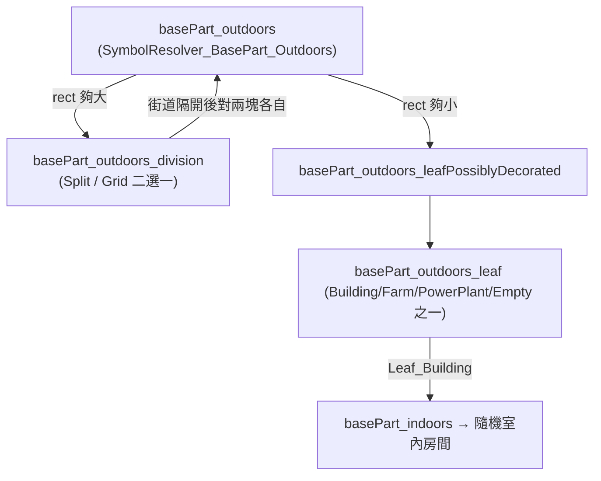

# 完整聚居點的據點地圖生成（idea 9 可行性）

> 大戰略整合層叢集第 4 份。前三份確立方向：自寫輕量 WorldObject、守軍 lazy 生成（玩家攻打/拜訪才生圖生人）。本報告聚焦「lazy 生成那一刻，地圖長什麼樣」，以及怎麼讓它變成有規劃感的聚居點（議事廳/家族屋/工坊），並讓自訂 outpost 也共用這套生成。
>
> 權威源（工作目錄 `/home/lorkhan/repo/pas`）：
> - 本體 1.6 反編譯：`projects/rimworld/`（`RimWorld.BaseGen/*`、`RimWorld/GenStep_Settlement.cs`、`RimWorld.Planet/Settlement.cs`、`RimWorld/WorldObjectDef.cs`）。
> - VBGE 純資料 + 安裝版：`projects/rimworld_mods/vanilla-base-generation-expanded/`、`~/.local/share/Steam/.../3209927822/`。**KCSG 引擎已於 2026-06-12 反編譯坐實**（`…/vanilla-base-generation-expanded/decompiled-framework/KCSG.decompiled.cs`，結論見 `analysis/rimworld_mods/vanilla-base-generation-expanded/details/kcsg_engine_takeover.md`）；本文舊「待驗證」標記已就地更新。
> - RimCities 反編譯：`projects/rimworld_mods/rimcities/decompiled/RimCities.decompiled.cs`。
> - Ancient Urban Ruins 反編譯：`projects/rimworld_mods/ancient-urban-ruins/`。
> - 引用一律附 `path:line`。`analysis/` 非權威，生成演算法已回 `projects/` 源坐實。

---

## 1. 目標

使用者抱怨：攻打/拜訪 NPC 據點時，原版地圖只是「隨便擺幾個房間 + 圍牆/防禦/農田/倉庫」，鬆散、沒有規劃感。他要更像真正規劃過的聚居點：**議事廳、各 NPC 家族的房子、工坊**。並且**自訂 outpost（idea 4 的 NPC outpost / 自寫輕量 WorldObject）也要支援這套地圖生成**，而不是退回原版鬆散生成。

要回答：
1. 原版為何只有「幾個房間」（管線解剖）。
2. 四條做法對比（原版 BaseGen 擴充 / KCSG 手繪佈局 / 程序街區 / 預製地圖）。
3. 「各家族房子」怎麼對應到具名 NPC（接 idea 8 的家族 NPC 系統）。
4. outpost 怎麼指定用這套生成器而非原版。

**三句結論先講：**
- **原版鬆散的根因**＝聚落內部不是「規劃」，而是 `SymbolResolver_BasePart_Outdoors` 的**遞迴隨機二分切塊**：把矩形隨機切成街道隔開的小區，葉節點隨機放一棟「無語意」的建築或田地。沒有「議事廳該在中心、家族屋成排、工坊靠倉庫」這種規劃意圖。
- **要規劃感，最划算的是 KCSG 手繪佈局（VBGE 那套）**：純 XML 畫好「整座聚落分區 + 各棟結構 grid」，引擎拼裝。代價是硬相依 VFE Core（KCSG 引擎不是你的）。
- **outpost 共用很簡單**：原版早就支援 `WorldObjectDef.mapGenerator` 覆寫（`WorldObjectDef.cs:43`），`Settlement.MapGeneratorDef` 也是先看 `def.mapGenerator`（`Settlement.cs:84-92`）。你的自寫 WorldObject 只要 `def.mapGenerator` 指向同一個 `MapGeneratorDef`，就跟正式聚落走完全相同的生成管線。

---

## 2. 原版聚落生成解剖

### 2.1 選哪個 MapGeneratorDef

`Settlement.MapGeneratorDef`（`RimWorld.Planet/Settlement.cs:80-93`）：

```csharp
public override MapGeneratorDef MapGeneratorDef {
    get {
        if (def.mapGenerator != null) return def.mapGenerator;       // ← 覆寫點
        if (base.Faction == Faction.OfPlayer) return MapGeneratorDefOf.Base_Player;
        return MapGeneratorDefOf.Base_Faction;                       // ← NPC 聚落走這個
    }
}
```

基底 `MapParent.MapGeneratorDef`（`RimWorld.Planet/MapParent.cs:31`）：`def.mapGenerator ?? MapGeneratorDefOf.Encounter`。

NPC 聚落地圖實體化的入口是 `GetOrGenerateMapUtility.GetOrGenerateMap`（`RimWorld.Planet/SettlementUtility.cs:47`，攻打時呼叫），它用 `MapParent.MapGeneratorDef` 取得管線。**這就是 idea 9「outpost 共用」的鑰匙：覆寫 `def.mapGenerator` 或 override `MapGeneratorDef` 屬性即可換管線**（詳見 §6）。

> `MapGeneratorDef.genSteps`（GenStepDef 清單）定義在原版 XML（`Core/Defs/MapGenerators/...`，本地反編譯只含 `.cs` 無 XML，**清單內容待 XML 核**）。重點是其中包含 `GenStep_Settlement`，那是聚落內容的真正生成步驟。

### 2.2 GenStep_Settlement → 推一個 "settlement" symbol

`GenStep_Settlement : GenStep_Scatterer`（`RimWorld/GenStep_Settlement.cs:8`）。`ScatterAt`（`:60`）做的事：

- 聚落矩形尺寸固定取 `SettlementSizeRange = (34,38)`（`:10`）——**整座聚落就只有 34~38 格見方**，先天容不下「多家族成排房子 + 工坊區 + 議事廳」這種規模。
- 選派系：`overrideFaction` → `map.ParentFaction` → 隨機敵派（`:65`）。
- 設全域旋鈕：`minBuildings = 1`、`minBarracks = 1`（`:82-83`）；帝國額外 `minThroneRooms=1`/`minLandingPads=1`（`:88-89`）。
- **核心**：`BaseGen.symbolStack.Push("settlement", resolveParams)`（`:85`）後 `BaseGen.Generate()`（`:96`）。

→ 所有聚落內容由 BaseGen 的 symbol 樹遞迴展開，**入口 symbol 是 `"settlement"`**。

### 2.3 "settlement" symbol → SymbolResolver_Settlement

`SymbolResolver_Settlement.Resolve`（`RimWorld.BaseGen/SymbolResolver_Settlement.cs:14`）推下列子 symbol（節錄）：

| 推入的 symbol | 作用 | line |
|---|---|---|
| `lootScatter` | 散落戰利品 | `:42` |
| `pawnGroup` | 守軍 pawn（`LordJob_DefendBase`） | `:45,63` |
| `outdoorLighting` | 室外照明 | `:69` |
| `firefoamPopper` | 滅火泡沫（科技 ≥ 工業） | `:77` |
| `edgeDefense` | 邊緣防禦（沙袋/砲塔，rect ≥ 20×20 才有） | `:80-86` |
| **`basePart_outdoors`** | **聚落主體（建築/田地的母 symbol）** | `:96` |
| `floor`/`removeDangerousTerrain`/`unpollute` | 地板與清理 | `:98-108` |

**關鍵：聚落「長什麼樣」幾乎全由 `basePart_outdoors` 這一支遞迴決定。**

### 2.4 為何鬆散——basePart_outdoors 的遞迴隨機切塊

這是「只有幾個房間、無規劃感」的真正根因：



- `SymbolResolver_BasePart_Outdoors.Resolve`（`SymbolResolver_BasePart_Outdoors.cs:7`）：rect 夠大（寬或高 > 23，或 ≥ 11 且 `Rand.Bool`）→ 推 `basePart_outdoors_division`；否則 → `basePart_outdoors_leafPossiblyDecorated`（`:12-19`）。**純看尺寸 + 擲骰，沒有任何「這塊該是議事廳/這排該是住宅」的意圖。**
- `SymbolResolver_BasePart_Outdoors_Division_Split.Resolve`（`SymbolResolver_BasePart_Outdoors_Division_Split.cs`）：隨機選水平/垂直，在 `[5, len-5-space]` 內**隨機**切一刀，中間鋪一條 `street`，對切出的兩塊**遞迴**推回 `basePart_outdoors`，順序還用 `Rand.Bool` 洗（`:75-86`）。
- `SymbolResolver_BasePart_Outdoors_Division_Grid`：另一種把區塊切成 2~4 行/列的網格（`MinRoomSize=6`、`MaxRoomsPerRow=4`，`SymbolResolver_BasePart_Outdoors_Division_Grid.cs:30-39`）。
- 葉節點 `LeafPossiblyDecorated`（`SymbolResolver_BasePart_Outdoors_LeafPossiblyDecorated.cs:7`）：25% 機率 decorated，否則 `basePart_outdoors_leaf`。
- `Leaf_Building`（`SymbolResolver_BasePart_Outdoors_Leaf_Building.cs`）：只負責「這格放一棟建築」→ 推 `basePart_indoors`（室內隨機房間，barracks/storage/dining 等），**牆材/地板都用 `BaseGenUtility.RandomCheapWallStuff` 隨機**（`:26-27`）。建築之間沒有功能關聯。

**定性結論**：原版聚落 = 一個 34~38 格的方塊，被「隨機二分/網格切塊 + 街道」切成若干小區，每個葉區隨機放一棟功能無關的建築或田地。它是**程序化但無規劃語意**的：引擎不知道「議事廳」「家族」「工坊群」這些概念，自然生不出規劃感。要的不是「更多房間」，而是**把語意（哪棟是什麼、誰住、彼此關係）灌進生成**。

---

## 3. 四條做法對比

| 維度 | (A) 擴充原版 BaseGen symbol | (B) KCSG 手繪佈局（VBGE） | (C) 程序街區（RimCities 風） | (D) 預製地圖（Ancient Urban Ruins） |
|---|---|---|---|---|
| **本質** | 自寫 `SymbolResolver_*`，重排 `"settlement"` 子樹 | 純 XML 畫「整座聚落分區 + 各棟 grid」，引擎拼裝 | 自寫整條 `GenStep` 管線，演算法即時生街道/建築 | 逐格手繪/匯入整張地圖藍圖（`CustomMapDataDef`） |
| **規劃感** | 中（可放「中心議事廳 + 周邊住宅 symbol」，但仍偏程序、不像手繪） | **高**（每棟都是人手畫的 grid，分區明確；最像「規劃過的村」） | 高（街道網 + 分區建築，城市感強，但每次隨機） | **最高/固定**（就是設計師擺的，但不隨機、可重複看膩） |
| **議事廳達成度** | 寫一個 `SymbolResolver_CouncilHall` 強制放中心，可行 | 設 `centralBuildingTags` 必放中心地標（`Tribals.xml:102` 的 specialisation 已用此法） | 寫一個固定建築 `GenStep_Buildings`（RimCities 的 Prison/Hospital 就是此法，`01_city_map_generation.md` order 301-303） | 直接在藍圖畫一棟議事廳 |
| **家族屋達成度** | symbol 可重複放 N 棟「住宅」，但「對應某家族」需自寫資料傳遞 | tag+count 抽 N 棟住宅結構（`allowedStructures <count>2~10</count>`，`Tribals.xml:84`）；「對應家族」仍需引擎支援或後處理 | 散佈式 `GenStep_Buildings`（Houses，order 311）放 N 棟，居民由 RoomDecorator 生（`SpawnInhabitant`）；「對應家族」需改 C# | 藍圖固定畫 N 棟，但家族是寫死的、不隨派系變 |
| **工坊達成度** | 寫 `SymbolResolver_Workshop`（放工作台 + 倉庫鄰接） | 畫一棟「工坊」StructureLayoutDef，掛 tag 抽（VBGE 已有 `GenericProduction` tag） | `City_ProductionBuildings`（order 310）已是此概念 | 藍圖固定畫 |
| **資料驅動 vs C#** | **C# 為主**（resolver 邏輯）+ 少量 XML（GenStepDef 參數） | **純 XML**（你只填藍圖；演算法是別人的） | **C# 為主**（GenStep/Decorator/Stencil 演算法）+ XML 參數 | **半資料**（藍圖是資料，但通常由遊戲內工具產生，不手寫；`CustomMapDataDef` 由匯入工具生，`00_overview.md:41`） |
| **相依** | **零外部相依**（原版 BaseGen API） | **硬相依 VFE Core / KCSG**（VBGE `About.xml:17-23`） | 零外部相依（但要寫一大坨 C#，等於自建迷你 RimCities） | 零外部相依，但要 CQF（AUR 建在 CustomQuestFramework 上，`00_overview.md:9`） |
| **工作量** | 中（每種建築一個 resolver + 排版邏輯，但可複用原版 leaf） | **低（純填資料）**，但要學 KCSG schema；引擎不可控 | **高**（街道網/BSP 切房/選址/居民全自寫，是整個子系統） | 高（要嘛手繪數十張、要嘛做匯入工具） |
| **與 outpost 共用難易** | 易：outpost 的 `def.mapGenerator` 指向你的 MapGeneratorDef（內含你的 GenStep_Settlement 變體） | 易：給 outpost 的派系掛 `CustomGenOption`（KCSG 以 FactionDef 為單位），或讓 outpost 走聚落生成器 | 中：outpost 需用 RimCities 的 City 型 MapGeneratorDef（要嘛繼承 City，要嘛抄管線） | 易但僵：outpost 全部長一樣（同一張藍圖） |

### 3.1 (B) KCSG 的掛接與三層模型（為何是規劃感最佳解）

VBGE 三層（`01_kcsg_data_model.md`）：
- 第 3 層 `SettlementLayoutDef`：整座聚落分 `centerBuildings`/`peripheralBuildings`，各區用 `allowedStructures`（**tag + count**）抽結構，`centralBuildingTags` 指定中心必放地標（`Tribals.xml:80-102`）。
- 第 2 層 `StructureLayoutDef`：一棟建築 = `terrainGrid`/`layouts`(可多層)/`roofGrid` 的 **2D 字串 grid** + `tags`（`VGBE_PiratesDefence.xml:3`）。
- 第 1 層 `SymbolDef`：少數需要旗標的格（屍體/奴隸）才命名；多數 grid token 直接寫原版 defName。

掛接（`projects/rimworld_mods/vanilla-base-generation-expanded/.../Patches/Settlements.xml`）：用 `PatchOperationAddModExtension` 把 `KCSG.CustomGenOption{chooseFromSettlements:[...]}` 注入 `FactionDef`。引擎在生該派系聚落地圖時，從 `chooseFromSettlements` 抽一個 `SettlementLayoutDef` 鋪設。

> **KCSG 引擎內部機制已坐實（2026-06-12 反編譯，詳見 `kcsg_engine_takeover.md`）**：接管＝Harmony Postfix 偷換 `Settlement.MapGeneratorDef`／`MapParent.MapGeneratorDef` getter → 自家 `KCSG_Base_Faction`/`KCSG_WorldObject` MapGeneratorDef（內含 `KCSG.GenStep_Settlement : 原版 GenStep_Settlement` 子類），`CustomGenOption.Generate` 最終 push `kcsg_settlement` 符號回**原版 BaseGen symbolStack**——既不 patch `SymbolResolver_Settlement` 也不另起爐灶。`symbolResolvers` 只能填引擎已註冊的 18 個符號（坐實，清單見該檔 §五）；想加新 resolver 必須改 VFE Core C#。

### 3.2 (C) RimCities 的程序生成（規劃感高但全自寫）

RimCities `City : Settlement`（`RimCities.decompiled.cs:5445`），`MapGeneratorDef => def.mapGenerator`（`:5451`）——印證 §6 的覆寫法。它整條管線是自寫 `GenStep`（`01_city_map_generation.md`）：`GenStep_Walls`(250)→`GenStep_Streets`(251，遞迴生主幹道+側路)→功能建築(Prison/Hospital 301-303)→散佈建築(Houses 311)→`GenStep_Fields`(320)…，全建立在 `Stencil` 幾何游標（`:4796`）+ `GenStep_RectScatterer` flood-fill 選址（`:1447`）+ `GenRooms` BSP 切房（`:1079`）。**結論：規劃感強，但等於從零自建一個迷你城市生成子系統，C# 量巨大；居民由各 `RoomDecorator` 散生（`SpawnInhabitant`），城市清單寫死。**

### 3.3 (D) 預製地圖（最高還原但僵）

AUR 的 `CustomMapDataDef : Def`（`AncientMarket_Libraray.decompiled.cs:939`）逐格描述地形/屋頂/物件/pawn/命名路徑（`ancient-urban-ruins/00_overview.md:27-41`），由 `GenStep_GenerateData/SetTerrain` 攤開（`:1371,4424`）。最像「設計師擺的村」，但**藍圖固定**——同型據點長一樣、看膩；且逐格資料通常由遊戲內匯入工具產生，不適合手寫。適合「少數招牌地標據點」，不適合「上千 NPC 據點各有風貌」。

---

## 4. 推薦做法 + 理由

**首選：(B) KCSG 手繪佈局（VBGE 那套），作為「外觀層」；自寫的只是把 outpost/輕量 WorldObject 接到它。**

理由：
1. **規劃感最高、工作量最低**：議事廳（`centralBuildingTags`）、家族住宅（住宅 tag + `count` 抽多棟）、工坊（production tag）這三個需求，KCSG 的三層模型**原生就能表達**，且全是純 XML。RimCities 風(C)要自寫整條管線，性價比差；原版擴充(A)雖零相依但排版仍偏程序、難到「成排家族屋」的視覺。
2. **天生資料驅動**：使用者最終想要的是「上千派系、各派系/家族風貌不同」。KCSG 用 tag 抽結構，天然支援「同一聚落每次生成都不同、不同派系掛不同 SettlementLayoutDef」，正好對上 idea 7/8 的大量動態派系。
3. **與 outpost 共用零摩擦**：KCSG 以 FactionDef 為掛接單位（`CustomGenOption`），只要 NPC outpost 的派系掛了 CustomGenOption，且 outpost 走聚落型生成器，就自動套用（細節 §6 有兩條路徑）。

**代價/取捨（必須讓使用者知情）：**
- **硬相依 VFE Core**。若使用者的 mod 想零相依，這條不可行 → 退而求其次走 (A)。
- **引擎不可控**：CustomGenOption 只能填既有旋鈕；「家族屋對應到具名 NPC」這種**動態語意注入**，KCSG 不見得開放（§5 詳述，極可能需後處理 C#）。

**次選 / 零相依路線：(A) 自寫精簡 BaseGen symbol 集。**
若要避開 VFE Core，做法是：自訂 `MapGeneratorDef`（給 outpost 與 NPC 聚落共用），其中放一個 `GenStep_Settlement` 的子類，把入口 symbol 從 `"settlement"` 換成自寫的 `"plannedSettlement"`，在自寫 `SymbolResolver_PlannedSettlement` 裡**明確規劃**：中心放 `councilHall` symbol、繞中心放 N 個 `familyHouse` symbol、邊角放 `workshop` symbol、外圍 `farm`/`stockpile`（複用原版 `Leaf_Farm`/`Interior_Storage` 等既有 resolver）。工作量中等、零相依、語意完全可控（家族資料可塞進 `ResolveParams`，§5）。**若使用者重視「不靠別人引擎 + 家族 NPC 精準對應」，(A) 反而更合適。**

> 給判斷：要「最省力 + 最美」→ (B)；要「零相依 + 家族 NPC 精準綁定可控」→ (A)。兩者可並存（KCSG 當預設外觀，(A) 的後處理 step 補家族對應）。

---

## 5. 家族/角色驅動房舍（接 idea 8 的家族 NPC）

需求：生成的房舍要對應到該派系的具名 NPC——議事廳 → 領袖、家族屋 → 各家族 NPC、工坊 → 產業。資料怎麼進生成？

### 5.1 資料載體：ResolveParams（A 路線）

原版 BaseGen 的所有資料都靠 `ResolveParams`（值型 struct，在 symbol 間複製傳遞）。觀察 `SymbolResolver_Settlement` 全程把 `rp` 拷貝改欄位再 `Push`（`SymbolResolver_Settlement.cs:29,47,75,...`）。`ResolveParams` 已有 `faction`、`singlePawnLord`、`pawnGroupMakerParams`（`:53-61`）等欄位。

**做法（A 路線）**：自寫的 `ResolveParams` 子集無法加欄位（原版 struct），但可走兩條：
- **MapGenerator.SetVar / GetVar**（`GenStep_Settlement.cs:80` 用 `SetVar("SettlementRect", ...)` 就是此機制）：在自寫 GenStep 開頭把「本次據點的家族/NPC 清單」`SetVar`，各 resolver `TryGetVar` 取出，決定議事廳放誰、哪棟家族屋對應哪個家族。
- **自寫 resolver 直接吃 Faction**：`rp.faction` 已在；從 idea 8 的家族系統（掛在 faction 上的具名 NPC / 家族資料）查出本派系的家族列表，生對應數量的家族屋，並把該家族成員 pawn 直接 spawn 進對應房（複用 `SymbolResolver_PawnGroup`/`SinglePawn` 的 spawn 邏輯）。

> 接 idea 8：idea 8 的家族 NPC 是「定期計算、存活在 WorldPawns / faction」的。生成據點地圖時，從 `rp.faction` 反查「常駐此據點的家族 NPC」（idea 8 生成時須計算其所在，正是為此），lazy 生圖時把這些**既有 WorldPawn** 取回 spawn，而非生匿名守軍。這需要自寫 spawn step（C#），KCSG 不會幫你綁既有具名 pawn。

### 5.2 KCSG 路線（B）的限制

KCSG 的 `SymbolDef` 能指定 `pawnKindDef`（生**新的匿名** pawn，如 `VESSlave`，`01_kcsg_data_model.md:31`），但**沒有「把這棟綁到某個既有具名 NPC / 家族」的資料欄位**（2026-06-12 反編譯坐實：pawn 生成走 `AddHostilePawnGroup` 的 PawnGroupMaker 隨機抽，`KCSG.decompiled.cs:6264`；schema 無具名綁定概念）。

→ **結論**：純 KCSG 能做到「視覺上有議事廳/成排住宅/工坊」，但**做不到「這棟是 Smith 家、住的是名叫 X 的家族 NPC」**。要家族對應，必須加一個**自寫的 C# 後處理 GenStep**（在 KCSG 鋪完地圖後跑）：掃描地圖上的住宅房間（用 roof/door 分割或 KCSG 留的標記），把 idea 8 的家族 NPC 逐一塞進去、掛名牌/領地標記。這也是 §4 建議「(B) 當外觀、(A)/後處理補語意」的原因。

### 5.3 議事廳 → 領袖

最直接：自寫後處理 step 找到中心地標建築（KCSG `centralBuildingTags` 放的那棟，或 A 路線自己放的 `councilHall`），把 `faction.leader`（既有具名領袖 pawn）spawn 在裡面並設一張寶座/主位。領袖 pawn 原版本就存在於 faction，不需新生。

---

## 6. outpost 共用這套地圖生成

這是 idea 9 後半的核心，且**比想像中簡單**——原版的覆寫點現成。

### 6.1 覆寫機制（已坐實）

地圖生成器的選擇有兩個覆寫點：

1. **WorldObjectDef.mapGenerator**（`RimWorld/WorldObjectDef.cs:43`：`public MapGeneratorDef mapGenerator;`）——任何 WorldObject 都能在 def 裡指定。
2. **override `MapGeneratorDef` 屬性**：`Settlement.MapGeneratorDef`（`Settlement.cs:80`）與 `MapParent.MapGeneratorDef`（`MapParent.cs:31`）都先看 `def.mapGenerator`。RimCities 的 `City : Settlement` 就是 override 成 `def.mapGenerator`（`RimCities.decompiled.cs:5451`）。

→ **自寫輕量 WorldObject（前三份的方向）的接法**：


- 若走 **A 路線**：`MapGeneratorDef.genSteps` 裡放你的 `GenStep_PlannedSettlement`（自寫），outpost 與 NPC 聚落**指向同一個 MapGeneratorDef** 即完全共用。
- 若走 **B 路線（KCSG）**：兩條子路徑（**2026-06-12 反編譯定案，皆可行**，見 `kcsg_engine_takeover.md` §一/§二）——
  - (i) **派系層**：outpost 派系的 `FactionDef` 掛 `CustomGenOption` → KCSG 的 `Settlement.MapGeneratorDef` Postfix 自動接管（只對 `Settlement` 型生效）。
  - (ii) **WorldObject 層（推薦，輕量 WorldObject 直接可用）**：把 `CustomGenOption`（含專屬 `chooseFromSettlements`，可比聚落小/專一）掛在**自訂 WorldObjectDef** 上 → KCSG 的 `MapParent.MapGeneratorDef` Postfix 以「同 tile world object def 掃描」接住，換成 `KCSG_WorldObject` 生成器，`GenStep_WorldObject` 從 `map.Parent.def` 讀 ext。**不必繼承 `Settlement`、不必自寫 MapGeneratorDef，零 C#。**唯一注意：同 tile 多個帶 ext 的物件時取第一個，保持一格一物。

### 6.2 給輕量 WorldObject 一個「以後才生圖」的生成器

前三份方向是「平時無 pawn、攻打才生」。`MapParent` 的 `GetOrGenerateMap`（透過 `GetOrGenerateMapUtility`，`SettlementUtility.cs:47`）天然 lazy。你的輕量 WorldObject 只要：
1. 繼承 `MapParent`（或 `Settlement` 以最大化相容 KCSG）；
2. def 設 `mapGenerator`（A 路線指自寫；B 路線(i) 留空走 `Base_Faction`，靠派系 CustomGenOption）；
3. 生圖時的守軍/家族 NPC 由 §5 的 step 決定（既有具名 NPC 取回 spawn）。

> 與 VOE outpost 的差異（02 報告）：VOE outpost 常駐活 pawn 養 needs，是「中量級」；本方案是「無 pawn 圖標，攻打才生圖生人」，正是原版 Settlement 的既有 lazy 行為，效能對齊原版聚落。

---

## 7. 純 XML vs 必須 C# 拆分

| 能力 | 純 XML 可達 | 需 C# |
|---|---|---|
| 換 outpost / WorldObject 的 MapGeneratorDef | ✅ `WorldObjectDef.mapGenerator`（`WorldObjectDef.cs:43`） | — |
| 整座聚落分區 + 各棟手繪 grid（議事廳/住宅/工坊的「外觀」） | ✅ **若用 KCSG**（SettlementLayoutDef/StructureLayoutDef，純 XML） | KCSG 引擎本身（VFE Core，已存在，不用你寫） |
| 把藍圖掛到某派系 | ✅ `PatchOperationAddModExtension` 注 `CustomGenOption` | — |
| 零相依的「規劃式」symbol 樹（中心議事廳/成排家族屋/工坊） | ⚠️ GenStepDef 參數可 XML，但**排版規劃邏輯必須自寫 resolver** | ✅ `SymbolResolver_*` + `GenStep_Settlement` 子類 |
| **家族屋對應到既有具名 NPC**（議事廳放 faction.leader、家族屋放 idea 8 家族 pawn） | ❌ | ✅ 後處理 GenStep：反查 faction 的家族 NPC、取回 WorldPawn、spawn 進對應房 |
| 新的 KCSG symbolResolver（新填充邏輯） | ❌（只能填引擎已註冊名，`extension_points.md:56`） | ✅ 改 VFE Core（不現實）→ 改走 A 路線自寫 |
| outpost 走 KCSG 但用專屬小佈局 | ⚠️ 取決於引擎是否認非-Settlement MapParent | 可能需讓 outpost 繼承 Settlement / 自寫接管 |

**底線**：外觀（規劃感）可以純 XML（靠 KCSG）；但**「家族 NPC 精準對應房舍」這個 idea 9 的靈魂需求，無論走 A 或 B，都需要一段自寫 C#**（A 路線在 resolver 內做、B 路線在 KCSG 之後做後處理 step）。

---

## 8. 風險與待驗證 / 開放設計問題 / 參考檔案

### 8.1 風險與待驗證

| 項目 | 狀態 | 說明 |
|---|---|---|
| KCSG 引擎接管原版生成的**確切機制** | ✅ **已坐實**（2026-06-12 反編譯 KCSG.dll） | ＝Harmony Postfix 偷換 `Settlement.MapGeneratorDef`/`MapParent.MapGeneratorDef` getter → 自家 `KCSG_Base_Faction`/`KCSG_WorldObject` MapGeneratorDef，最終 push `kcsg_settlement` 回原版 BaseGen。詳見 `analysis/rimworld_mods/vanilla-base-generation-expanded/details/kcsg_engine_takeover.md`。 |
| KCSG 對「非 Settlement 的 MapParent / 自寫 WorldObject」是否生效 | ✅ **生效**（已坐實） | `CustomGenOption` 掛自訂 **WorldObjectDef** 即被 `MapParent.MapGeneratorDef` Postfix 接住（同 tile def 掃描）；輕量 WorldObject **不必**繼承 `Settlement`。注意同 tile 多 ext 物件取第一個＋靜態全域 `GenOption.customGenExt` 非可重入。 |
| KCSG 是否能綁既有具名 pawn | ✅ **不行**（已坐實） | pawn 生成走 `AddHostilePawnGroup` PawnGroupMaker 隨機（`KCSG.decompiled.cs:6264`）→ 家族對應一律走自寫後處理 step。 |
| 生成效能（大地圖 + 多結構） | 注意 | KCSG 鋪多棟 grid + RimCities BSP 都是**生圖那一刻**的一次性成本，不是逐 tick；但 idea 7 上千據點若玩家頻繁攻打，仍是逐次數百 ms 級開銷。聚落尺寸越大（KCSG `settlementSize 72,72`，`Tribals.xml:77`，遠大於原版 34~38）生圖越久。建議對 NPC outpost 用較小佈局。 |
| 與 Rim War 佔領易主後外觀一致性 | 注意（接 03 報告） | 據點易主換派系後，下次生圖會用**新派系**的 CustomGenOption / MapGeneratorDef → 外觀會變。若希望「建築還在、只是換旗」，需把已生成的 map 持久化（原版 Settlement 攻破後 map 可留存一段），或自寫「保留建物只換守軍/旗標」的輕量重生路徑。這與 idea 8「據點隨派系易主」直接相關，是跨報告的整合風險。 |

### 8.2 開放設計問題

1. **走 A 還是 B？** §8.1 前兩項已坐實（B 路線對自訂 WorldObject 完全可行、零 C#），技術障礙消除——剩下唯一考量是**能否接受硬相依 VFE Core**。
2. **家族屋的「家族」粒度**：idea 8 的家族 NPC 是逐 pawn 還是有「家族」聚合實體？家族屋數量 = 家族數還是固定？影響後處理 step 怎麼分房。
3. **outpost 與正式聚落是否共用同一套 SettlementLayoutDef？** 還是 outpost 用精簡版（少幾棟、無防禦）？影響效能與辨識度。
4. **易主後外觀策略**：重生（換派系外觀）vs 保留建物（只換旗/守軍）。後者需自寫，但對「世界有連續性」的大戰略體驗更好。

### 8.3 參考檔案清單（全為絕對路徑）

本體（權威）：
- `/home/lorkhan/repo/pas/projects/rimworld/RimWorld/GenStep_Settlement.cs`（聚落生成入口，推 `"settlement"` symbol）
- `/home/lorkhan/repo/pas/projects/rimworld/RimWorld.BaseGen/SymbolResolver_Settlement.cs`（聚落 symbol 樹根）
- `/home/lorkhan/repo/pas/projects/rimworld/RimWorld.BaseGen/SymbolResolver_BasePart_Outdoors.cs`（鬆散根因：遞迴切塊入口）
- `/home/lorkhan/repo/pas/projects/rimworld/RimWorld.BaseGen/SymbolResolver_BasePart_Outdoors_Division_Split.cs`、`..._Division_Grid.cs`、`..._LeafPossiblyDecorated.cs`、`..._Leaf_Building.cs`（隨機切塊/葉建築）
- `/home/lorkhan/repo/pas/projects/rimworld/RimWorld.Planet/Settlement.cs`（`MapGeneratorDef` 覆寫點 :80-93）
- `/home/lorkhan/repo/pas/projects/rimworld/RimWorld.Planet/MapParent.cs`（基底 `MapGeneratorDef` :31）
- `/home/lorkhan/repo/pas/projects/rimworld/RimWorld/WorldObjectDef.cs`（`mapGenerator` 欄位 :43）
- `/home/lorkhan/repo/pas/projects/rimworld/RimWorld.Planet/SettlementUtility.cs`（攻打生圖 :47）

VBGE / KCSG（純資料 + 分析）：
- `/home/lorkhan/repo/pas/analysis/rimworld_mods/vanilla-base-generation-expanded/architecture/01_kcsg_data_model.md`（三層模型）
- `/home/lorkhan/repo/pas/analysis/rimworld_mods/vanilla-base-generation-expanded/architecture/00_overview.md`、`details/extension_points.md`
- `/home/lorkhan/repo/pas/projects/rimworld_mods/vanilla-base-generation-expanded/SOURCE_POINTER.md`（安裝版 def 檔位置）
- 安裝版根：`~/.local/share/Steam/steamapps/workshop/content/294100/3209927822/1.6/`（`Patches/Settlements.xml`=掛接、`Defs/SettlementDefs/Tribals.xml:77/84/102`=分區/抽結構/中心地標）

RimCities（程序街區範本）：
- `/home/lorkhan/repo/pas/analysis/rimworld_mods/rimcities/architecture/01_city_map_generation.md`
- `/home/lorkhan/repo/pas/projects/rimworld_mods/rimcities/decompiled/RimCities.decompiled.cs`（`City : Settlement` :5445、`MapGeneratorDef => def.mapGenerator` :5451、`Stencil` :4796、`GenStep_RectScatterer` :1447、`GenRooms` BSP :1079）

Ancient Urban Ruins（預製地圖第四選項）：
- `/home/lorkhan/repo/pas/analysis/rimworld_mods/ancient-urban-ruins/architecture/00_overview.md`（`CustomMapDataDef` :939、攤開 step :1371/4424）

待補（不在本地）：
- VFE Core / `OskarPotocki.VanillaFactionsExpanded.Core` 反編譯（KCSG 引擎接管點與 schema）——**需 clone 才能坐實 §8.1 前兩項**。
