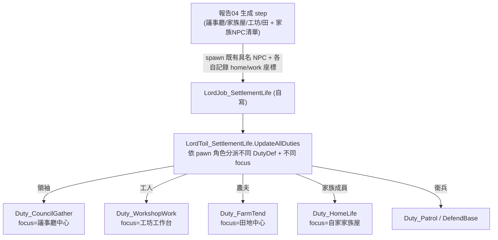
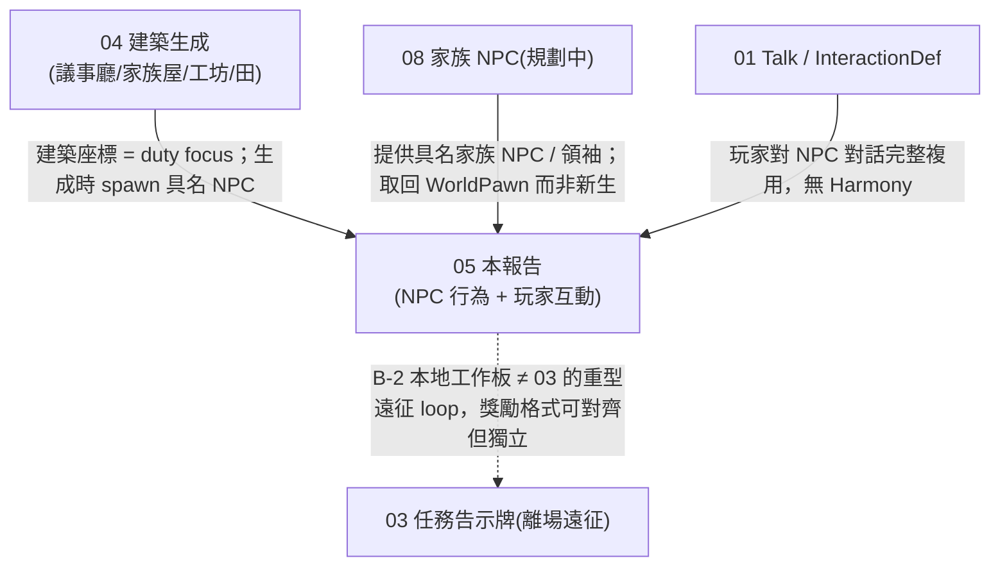

# 活的 NPC 聚居點 + 玩家在其中互動（idea 10 可行性）

> 大戰略整合層叢集第 5 份。前文已確立：自寫輕量 `WorldObject`（繼承 `Settlement`）、守軍 lazy 生成、地圖用 KCSG / 自寫 GenStep 蓋出議事廳 / 家族屋 / 工坊（報告 04）。本報告聚焦「進到這張地圖後，NPC 怎麼活、玩家怎麼互動」。
>
> 權威源（工作目錄 `/home/lorkhan/repo/pas`）：
> - 本體 1.6 反編譯：`projects/rimworld/`（`Verse.AI.Group/*`、`Verse.AI/DutyDef.cs`、`RimWorld/DutyDefOf.cs`、`RimWorld.BaseGen/SymbolResolver_Settlement.cs` 等）。
> - RimCities 反編譯：`projects/rimworld_mods/rimcities/decompiled/RimCities.decompiled.cs` ＋ 安裝版 `…/1775170117/1.6/Defs/Duties.xml`（最接近「活城市」的範本）。
> - 引用一律附 `path:line`。`analysis/` 非權威，行為已回 `projects/` 源坐實。
>
> **先前構想對照**：本主題在 `analysis/rimworld/others/life_politics/` 有兩份**設計願景**級舊稿——`sims_mode_community.md`（NPC 自主生活、據點當社會舞台、佈告欄「清雜草」式引導、襲擊時並肩作戰）幾乎就是 idea 10 的願景描述但無 API；`rpg_quest_system.md`（冒險者公會/佈告欄任務）對應本報告 B-2 與 idea 3。本報告為其源碼可行性落地版（願景→Lord/Duty 機制）。舊稿設定在「原版白手起家」，本報告設定在「疊既有 mod（RimCities 範式）」。

---

## 1. 目標

使用者要兩件事：

- **A. NPC 自己過日子**：訪問 / 襲擊 NPC 據點時，NPC 不只站著或防守，而是在議事廳討論、在工坊工作、處理農務、巡邏、居家——依角色 / 家族 / 建築做日常行為。
- **B. 玩家側互動**：玩家角色（帶隊的 caravan pawn）能在 NPC 據點酒館與**特定 NPC 對話**、**取得房間**（租房 / 留宿），甚至在**告示牌接本地工作**（如幫忙收穫作物）。連回 idea 1（Talk / InteractionDef）、idea 3（任務告示牌）。

**四句結論先講：**
1. **原版 NPC 聚落 pawn 沒有生活，根因在 Lord**：`SymbolResolver_Settlement` 把全部守軍掛同一個 `LordJob_DefendBase`（`SymbolResolver_Settlement.cs:45`），其 toil 只發 `DutyDefOf.DefendBase`（`LordToil_DefendBase.cs:22`）＝守在中心 + 打入侵者，**沒有工作 / 社交 / 居家 duty**。
2. **「過日子」最務實的做法＝自寫一個 `LordJob_SettlementLife`，內含一組自訂 `DutyDef`（純 XML thinkNode）＋ 用 `Trigger` 在被襲擊時轉去 `LordToil_DefendBase`**。RimCities 的 `LordJob_LiveInCity` 正是此法（`RimCities.decompiled.cs:701`），且它的 `LiveInCity` duty **整個 think node 是純 XML**（`Duties.xml:4-38`）。
3. **但 duty 驅動「真工作站動畫」是天花板級難題**：非玩家 pawn 無 `workSettings`（`JobGiver_Work` 直接 `EverWork==false` 早退，`JobGiver_Work.cs:21-23`），RimCities 自己也**沒讓居民真的操作工作台**——它的 `LiveInCity` 只是「打敵人→滿足需求→在 duty 點附近遊蕩」（`Duties.xml:12-35`）。要「在工坊真的鍛造」必須自寫 JobGiver 或偽造工作點，視覺說服力是最大待驗證。
4. **玩家側：對話可借 idea 1 整套（零障礙）；但「租房 / 留宿」原版完全沒有對應概念（bed 只有 Colonist/Slave/Prisoner 三種 `BedOwnerType`，無「賓客 / 租客」），這塊 100% 要自寫——是 B 區最大缺口。**

---

## 2. 原版 NPC 聚落 pawn 行為現況

### 2.1 守軍受誰管：單一 `LordJob_DefendBase`

聚落地圖生成時，`SymbolResolver_Settlement` 對 `pawnGroup` symbol 掛 Lord（`RimWorld.BaseGen/SymbolResolver_Settlement.cs:45`）：

```csharp
Lord singlePawnLord = (rp.settlementLord = rp.singlePawnLord
    ?? LordMaker.MakeNewLord(faction, new LordJob_DefendBase(faction, rp.rect.CenterCell, 25000, ...), map));
…
resolveParams2.singlePawnLord = singlePawnLord;
resolveParams2.pawnGroupKindDef = rp.pawnGroupKindDef ?? PawnGroupKindDefOf.Settlement;  // :51
```

→ **整座聚落的守軍共用同一個 Lord**，pawnGroup 生出來的人全部加進去。

### 2.2 那個 Lord 只發「守家」duty

`LordJob_DefendBase.CreateGraph`（`RimWorld/LordJob_DefendBase.cs:33-67`）的起始 toil 是 `LordToil_DefendBase`，其 `UpdateAllDuties`：

```csharp
lord.ownedPawns[i].mindState.duty = new PawnDuty(DutyDefOf.DefendBase, baseCenter);  // LordToil_DefendBase.cs:22
```

`DutyDefOf.DefendBase`（`RimWorld/DutyDefOf.cs:105`）的 think node ＝守在 baseCenter、打入侵者、否則在中心附近遊蕩。**沒有任何「去工作台」「去議事廳」「回家睡」的節點。** 這就是「NPC 只會站著或防守」的根因。

> 順帶：原版 `LordToil_DefendBase` 已內建「被打到一定程度就轉 `LordToil_AssaultColony` 主動反擊」（`LordJob_DefendBase.cs:55-66` 的 `transition3` ＋ `Trigger_FractionPawnsLost`/`Trigger_PawnHarmed` 等）。這套「狀態機 + Trigger 轉換」正是 §3 要複用來做「生活↔防禦」切換的範本。

### 2.3 訪問（非攻打）時：visitor Lord，一樣不工作

若是友好 caravan 來訪（非生聚落守軍），原版用 `LordJob_VisitColony`（`RimWorld/LordJob_VisitColony.cs:34`）：先 `LordJob_Travel` 走到 chillSpot → `LordToil_DefendPoint` 待著 → 遇危險 / 變敵對才轉移。**同樣只有「待著 / 遊蕩 / 撤離」，無工作。** 結論：無論哪條原版路徑，NPC 聚落 pawn 都不會「過日子」，要自己做。

---

## 3. A. 讓 NPC 過日子的做法

### 3.1 核心架構：自寫 `LordJob_SettlementLife` + 一組 `DutyDef`

照 RimCities 的範式（已坐實可行）：一個 `LordJob` → 一個常駐 `LordToil`（`UpdateAllDuties` 給每個 pawn 指派 duty）→ duty 的 think node 決定行為。

RimCities `LordJob_LiveInCity`（`RimCities.decompiled.cs:701-735`）：

```csharp
public override StateGraph CreateGraph() {
    StateGraph val = new StateGraph();
    val.AddToil(new LordToil_LiveInCity(workSpot));   // 單一常駐 toil
    return val;
}
```

`LordToil_LiveInCity.UpdateAllDuties`（`:814-833`）對每個 pawn：

```csharp
ownedPawn.mindState.duty = new PawnDuty(DefDatabase<DutyDef>.GetNamed("LiveInCity", true), workSpot, -1f);
```

→ **每個居民得到 `LiveInCity` duty，綁定一個 `workSpot`（duty target）**，在那附近活動。

### 3.2 duty 本身是純 XML（關鍵利多）

`LiveInCity` 的 think node 整個寫在 XML（`…/1775170117/1.6/Defs/Duties.xml:4-38`），節點順序（優先級由上而下）：

| 節點（`<li Class=…>`） | 作用 |
|---|---|
| `ThinkNode_Subtree treeDef=Abilities_Aggressive` | 有攻擊性能力就用 |
| `JobGiver_AIFightEnemies`（acquire 50 / keep 60） | 有敵人就打 |
| `JobGiver_AIDefendPoint` | 守 duty 點 |
| `Cities.JobGiver_CityAIGotoNearbyHostile`（C#，`:536`） | 主動靠近 40 格內敵人 |
| `ThinkNode_Subtree treeDef=SatisfyBasicNeeds` | **吃飯 / 睡覺 / 社交 / 娛樂**（原版子樹，居民「像活的」全靠這個） |
| `JobGiver_SeekSafeTemperature` | 避溫 |
| `ThinkNode_ConditionalCloseToDutyTarget` → `JobGiver_WanderAnywhere`(r=12) | 接近 duty 點時就地遊蕩 |
| `JobGiver_WanderNearDutyLocation` | 否則走回 duty 點附近 |

**重點觀察：RimCities 的「活城市居民」實際行為 ＝ 打敵人 + `SatisfyBasicNeeds`（吃睡社娛）+ 在指定點附近遊蕩。** `SatisfyBasicNeeds` 是原版 think 子樹，會讓 pawn 自己去吃飯、睡（找床）、社交、放鬆——這已足夠營造「有人住、會走動、會聊天」的氛圍。**它沒有「真的去工坊鍛造 / 種田」**。

### 3.3 把 duty 綁到報告 04 生成的建築與角色

報告 04 的生成步驟（議事廳 / 家族屋 / 工坊 / 田）產出建築與「該據點的家族 NPC 清單」。要把 duty 對應上去，靠 **duty target（`PawnDuty` 的 `focus`/第二參數）＋ 角色分流**：



實作要點：

1. **生成時把每個 NPC 的角色 + 目標座標記下來**。最乾淨的做法是讓報告 04 的生成 step 直接 `lord.AddPawn(pawn)` 並用一個 per-pawn 的資料（自寫 `LordJob` 持有一個 `Dictionary<Pawn, (DutyDef, IntVec3)>`，`ExposeData` 存檔）。RimCities 是粗放地全給同一個 duty + 隨機 workSpot（`SpawnInhabitant(..., randomWorkSpot:true)`，`:179`），你要更精準就自己存對應表。
2. **角色分流**：領袖（`faction.leader`，接報告 04 §5.3）→ 議事廳 duty；家族 NPC（接 idea 8）→ 各自家族屋 home duty；標記為「工人 / 農夫」的 → 工坊 / 田 duty。分流邏輯寫在 `UpdateAllDuties`（C#）。
3. **每個 duty 是純 XML think node**，只是 `focus`（duty target）不同 → 同一份 XML duty 可被多個 pawn 用不同座標複用。

### 3.4 「議事廳聚集討論」＝ gathering / social meeting 機制

原版的「一群人聚在某點互動」有現成範式：**gathering**。`GatheringsUtility.SetDuty`（`RimWorld/GatheringsUtility.cs:32`）：

```csharp
lord.ownedPawns[i].mindState.duty = new PawnDuty(gatheringDef.duty, spot);
```

`GatheringDef.duty`（`RimWorld/GatheringDef.cs:12`）通常指向 `DutyDefOf.SocialMeeting`（`DutyDefOf.cs:140`），其 think node 用 `JobGiver_StandAndBeSociallyActive`（`RimWorld/JobGiver_StandAndBeSociallyActive.cs` 存在）＝站在聚會點、彼此觸發社交互動（會進 PlayLog → idea 1 的 Talk 泡泡也吃這條）。

→ **「議事廳討論」最務實做法**：給領袖 + 數名核心 NPC 一個 `Duty_CouncilGather`，think node 用 `JobGiver_StandAndBeSociallyActive`（站在議事廳中心彼此社交），外圍包 `WanderNearDutyLocation`。**不需用完整 ritual / LordJob_Joinable_Gathering**（那套有 letter / 時限 / 召集邏輯，太重）；直接拿 `SocialMeeting` 風格 duty 即可。視覺上＝幾個人圍在議事廳裡互相講話冒泡泡，正是「討論」的觀感。

### 3.5 「工坊工作」「農務」：duty 能否驅動工作站？

**這是 A 區最硬的問題。** 兩條路：

**路線 1：借 `JobGiver_Work`（讓 NPC 像殖民者工作）——障礙大、不建議。**
- `JobGiver_Work.GetPriority` 開頭：`if (pawn.workSettings == null || !pawn.workSettings.EverWork) return 0f;`（`JobGiver_Work.cs:21-23`）。`EverWork => priorities != null`（`Pawn_WorkSettings.cs:28`）。非玩家 pawn **預設沒有初始化 workSettings**。
- 理論上可手動 `pawn.workSettings.EnableAndInitialize()`（`Pawn_WorkSettings.cs:89`，**不是 faction-gated**）讓它有工作優先級，再把 `JobGiver_Work` 塞進自訂 duty 的 think node。
- **但深層風險**：WorkGiver scanner 大量假設「玩家殖民地」語境——找 stockpile（玩家 zone）、reservation 系統、`Faction.OfPlayer` 擁有的物件 / 作物。非玩家派系的工作台 / 田地不在玩家 zone、作物非玩家所有，多數 WorkGiver 會掃不到目標而空轉，甚至 NRE。**這是「待實機驗證」的高風險區，RimCities 刻意沒走這條。**

**路線 2：偽造「在工作台旁做動作」（建議）——視覺夠用、零工作系統相依。**
- 自寫一個輕量 `JobGiver`（或 duty 內用 `JobGiver_WanderNearDutyLocation` + 自寫 `JobDriver_FakeWork`），讓 NPC 走到指定工作台 / 田格，播工作 toil 動畫（`Toils_General.Wait` + 朝向工作台、或借 `JobDriver` 的 `WithEffect`/`PlaySustainerOrSound`），**不真的產出物品**。對「訪客看一眼覺得有人在做事」這個需求，這完全足夠，且無 work 系統相依。
- 農務同理：走到田格、蹲下做動作。**不真的種收**（NPC 派系的作物產出對玩家無意義）。

> **定性結論**：duty 能輕鬆驅動「移動到某點 + 社交 + 滿足需求 + 遊蕩 + 防禦」（全純 XML think node）；但「真的操作工作站產出」要嘛冒險借 `JobGiver_Work`（高待驗證），要嘛自寫假動作 JobGiver（穩、建議）。**最務實＝假動作。**

### 3.6 被襲擊時：生活 toil → 防禦 toil 的轉換

複用 §2.2 看到的原版範式。`LordJob_SettlementLife.CreateGraph` 不止一個 toil，而是：

```mermaid
graph LR
    LIFE["LordToil_SettlementLife<br/>(分派生活/工作/議事 duty)"]
    DEF["LordToil_DefendBase<br/>(全員 DutyDefOf.DefendBase)"]
    ASS["LordToil_AssaultColony<br/>(主動反擊, 重襲時)"]
    LIFE -->|Trigger_PawnHarmed / Trigger_BecamePlayerEnemy| DEF
    DEF -->|Trigger_FractionPawnsLost(0.2) 等| ASS
    DEF -->|Trigger_BecameNonHostileToPlayer| LIFE
```

- 起始 toil ＝ `LordToil_SettlementLife`（生活）。
- 加 `Transition`，trigger 用原版現成的 `Trigger_PawnHarmed`、`Trigger_BecamePlayerEnemy`、`Trigger_OnClamor`（全在 `LordJob_DefendBase.cs:53-62` 用過）→ 轉去 `LordToil_DefendBase`（直接複用原版 toil，全員秒切守家 duty）。
- 進一步可再接 `LordToil_AssaultColony`（複用原版）做重襲反擊。
- 威脅解除（`Trigger_BecameNonHostileToPlayer`）可轉回生活。

**這套 Lord 狀態機 + Trigger 完全是原版公開 API，零 Harmony。** 時序風險見 §9。

---

## 4. RimCities 居民行為借鑑（總結）

| 面向 | RimCities 怎麼做 | path:line | 對本 mod 的啟示 |
|---|---|---|---|
| 居民生成 | `GenCity.SpawnInhabitant` → `PawnGenerator.GeneratePawn` + `LordMaker.MakeNewLord(LordJob_LiveInCity)` | `:4667,4701,4713` | 我們改成「取回 idea 8 既有具名 WorldPawn」而非每次新生匿名 pawn |
| 管 AI | 一個 `LordJob_LiveInCity` / `LiveInCitadel` / `LiveInAbandonedCity`，各一個常駐 `LordToil` 發 duty | `:701,665,630` ／ toil `:814,791,768` | 直接照抄此「Job→單 Toil→UpdateAllDuties 發 named DutyDef」骨架 |
| duty 內容 | `LiveInCity` ＝ 打敵 + `SatisfyBasicNeeds` + 遊蕩，**純 XML think node** | `Duties.xml:4-38` | duty 全可 XML 化；「過日子」靠 `SatisfyBasicNeeds` 子樹 |
| 「工作」 | **居民不真工作**；房間裝飾器生成時放好傢俱，居民只是 wander + 滿足需求 | `RoomDecorator_*` `:116-385`、`SpawnInhabitant(randomWorkSpot)` `:179` | 印證 §3.5：別硬做真工作，假動作 / 遊蕩即可 |
| 特殊角色 | `LordJob_ManTurrets`（操砲塔）、`LordToil_Captor`/`Hostage`（人質劇情）用獨立 DutyDef（`CityCaptor`/`CityHostage`，後者 think node 只有 `JobGiver_DoNothing`） | `:736-767`、`Duties.xml:132-154` | 「特殊角色給專屬 duty」是乾淨的分流法 |
| 主動找玩家麻煩 | `JobGiver_CityAIGotoNearbyHostile`（C#，靠近 40 格內敵人） | `:536` | 若要 NPC 對入侵玩家有反應，這是輕量 C# 範本 |

> 一句話：**RimCities 證明「活的 NPC 聚落」用 `LordJob_LiveInCity` 範式 + 純 XML duty + `SatisfyBasicNeeds` 就能達成「看起來有人住」的效果，且它刻意不做真工作系統。** 本 mod 在此之上加「角色分流 + duty target 綁建築 + 議事廳 social meeting + 假工作動畫」即可，全在原版 API 內。

---

## 5. B-1 酒館對話、租房

### 5.1 玩家 pawn 在他派系地圖的可操控性（坐實：完全可操控）

caravan 進入 NPC 聚落地圖走 `CaravanArrivalAction_VisitSettlement`（`RimWorld.Planet/CaravanArrivalAction_VisitSettlement.cs:6`）→ `CaravanEnterMapUtility.Enter`（`RimWorld.Planet/CaravanEnterMapUtility.cs:11`）。進場的 pawn **仍是玩家派系 pawn**（caravan 本就是玩家的），落在地圖邊緣（`:102-103`）。

→ **玩家進入後對自己的 caravan pawn 有完整指揮權**（徵召、移動、下令），就跟攻打聚落時一樣。host 派系的建築 / NPC 屬對方，玩家不能直接操作對方東西，但可下令自己的 pawn 走到酒館、走到特定 NPC 旁。**這對 idea 10 的「玩家走進酒館找人講話」是現成的。**

### 5.2 與特定 NPC 對話（接 idea 1，零障礙）

idea 1 報告（`_mod_ideas/01_talk_action.md`）已坐實：「Talk」＝一個 `FloatMenuOptionProvider_Talk`（反射自動註冊，無 Harmony，`01_talk_action.md:16-25`）+ `JobDriver_SingleInteraction`（**原版已有此泛用 driver**，`RimWorld/JobDriver_SingleInteraction.cs`：Goto→WaitToBeAbleToInteract→`Toils_Interpersonal.Interact(A, job.interaction)`）+ 一個純 XML `InteractionDef`。

- 玩家右鍵 NPC 聚落裡的某個居民 → 浮選單出「Talk」→ 自己的 pawn 走過去觸發互動 → 進 PlayLog → Bubbles / SpeakUp 自動顯示。
- **direct（玩家下令）路徑不擋敵對 / 非 Humanlike**（`01_talk_action.md:78,90-92`），所以即使是中立 / 微敵的據點居民也能對話。
- 「酒館特定 NPC」只是「某個被標記成 bartender / 重要 NPC 的居民」——可在生成時給它一個 tag / hediff / 名牌，provider 可只對這類 NPC 顯示更豐富的對話選項（自訂 InteractionDef）。

→ **對話這塊 100% 複用 idea 1，本報告不重複展開。** 唯一新增是「在 NPC 據點脈絡下，哪些 NPC 可對話、對話內容」——純 InteractionDef + grammar（XML）。

### 5.3 「取得房間」（租房 / 留宿）——B 區最大缺口，必須自寫

**原版沒有任何「賓客租房 / 留宿」概念。** 證據：

- 床的擁有權只有三種 `BedOwnerType`：Colonist / Slave / Prisoner（`RimWorld/Building_Bed.cs:76-92`、`CompAssignableToPawn_Bed.cs`）。**沒有「Guest / Renter」型別。**
- 床指派（`CompAssignableToPawn_Bed.TryAssignPawn`，`:45`）是玩家 UI 驅動、且 `CanAssignTo`（`:74`）以玩家派系語境檢查。**無法把一張「NPC 據點的床」指派給玩家 pawn 當租客。**
- grep `lodger`/`Lodger` 在 1.6 本體無「租客 / 留宿者」獨立系統（命中的都是別的東西）。原版「外人住你家」最接近的是 quest 的 lodger/避難者，那是**對方住玩家殖民地**，方向相反，且仍是 guest 狀態而非「租了一個房間」。

→ **「玩家在 NPC 據點租房 / 留宿」要自寫的東西：**

| 要件 | 自寫內容 | 可否複用原版 |
|---|---|---|
| 互動入口 | 對「旅店老闆 NPC」或「櫃台建築」加 float menu / gizmo「租房」 | float menu provider 同 idea 1（無 Harmony） |
| 付款 | 扣 caravan / pawn 身上的銀；或記一筆 | 原版交易 `TradeDeal` 太重，建議自寫簡單扣銀 |
| 「房間」概念 | 自寫資料：哪間房 / 哪張床被玩家 pawn 租用一段時間（存 `GameComponent`/`MapComponent` 或 pawn 上的 comp） | 無對應，全自寫 |
| 讓玩家 pawn 能睡那張床 | 最務實：**臨時把該床 reservation / ownership 借給玩家 pawn**（自寫，繞過 `BedOwnerType`），或直接讓 pawn 下 `LayDown` job 指定該床 | 部分借 `Building_Bed.GetCurOccupant`/job，但 ownership 邏輯自寫 |
| 留宿狀態 / 時限 | 自寫狀態機（租到第幾天、到期趕人） | 無對應 |
| 存檔 | 自寫 `ExposeData`（玩家 pawn 還在他人地圖 + 租約狀態） | 原版多地圖存檔支援，但租約資料自寫 |

> **缺口總結**：對話可白嫖 idea 1；**租房 / 留宿是純自寫子系統**——原版連資料模型都沒有。最務實的 MVP ＝「付銀 → 在租期內，指定某張床允許玩家 pawn `LayDown`」，不碰原版 bed ownership UI（避免和玩家殖民地床指派系統打架）。**最大風險其實在 §9 的「玩家久留他人地圖，地圖會不會被回收」。**

---

## 6. B-2 本地工作板接工作

需求：在 NPC 據點地圖放一個工作板，接「幫忙收穫作物」這類**本地、短程**任務，完成給獎勵。

### 6.1 與 idea 3 告示牌的關係

idea 3（`_mod_ideas/03_mercenary_missions.md`）是「**離開**據點、穿梭機 / caravan 去打一張遠端任務地圖」的重型 quest loop（`MercMissionDef` + 穿梭機 + `MissionMapParent` + 敵清收圖）。**idea 10 B-2 是相反量級：在當前 NPC 據點地圖上、不換地圖、做個小活就拿錢。**

→ **不建議共用 idea 3 的 `MissionDef` / 重型 loop。** B-2 的本質是「在已存在的地圖上臨時給玩家 pawn 一個可接的工作」，不需要生新地圖、不需要穿梭機、不需要敵清。

### 6.2 走 quest 還是臨時 job？建議「臨時 job + 簡單結算」

| 方案 | 機制 | 評價 |
|---|---|---|
| **(a) 臨時 job（建議）** | 工作板 float menu「接：幫忙收穫」→ 把該據點某片田標記成「玩家可收割」→ 玩家下令自己的 pawn 去割（割完的作物算任務進度）→ 自寫計數，達標發獎 | 最輕。難點：原版收割 WorkGiver 認 zone / 派系，玩家 pawn 對「他派系的田」不會自動收割 → 需自寫 `JobDriver_HarvestForLocal`（指定田格、割完計數）或臨時把田設成可被玩家 pawn 操作 |
| **(b) 原版 quest 框架** | 真的開一個 `Quest` + `QuestPart`，綁本地目標 | 太重，quest 框架為跨地圖 / 跨時間設計，殺雞用牛刀；且要寫 QuestScriptDef |
| **(c) 自寫迷你任務狀態** | `MapComponent` 持本地任務清單（接哪個、進度、獎勵），工作板開 UI | 中等，最有「告示牌」感；可與 idea 3 共用「獎勵表」資料格式但不共用 loop |

**建議 MVP ＝ (a)：** 工作板 gizmo / float menu 列 1~2 個本地工作（「收穫這片田 / 搬這堆貨」）→ 玩家接 → 自寫 `JobDriver` 讓玩家 pawn 做（或臨時開放該目標給玩家 pawn 的 WorkGiver，**待驗證可行性**）→ 完成計數達標 → 扣據點好感變獎勵（發銀 / 物資 / 加 goodwill）。完成獎勵資料可純 XML（`ThingDefCountClass` 列表 + goodwill 增量），**與 idea 3 的獎勵表格式對齊但各自獨立**。

> **核心難點同 §3.5**：「讓玩家 pawn 去做 NPC 派系的活」和「讓 NPC 做真工作」是同一個 WorkGiver / 派系 / zone 障礙的兩面。最穩的是自寫一個專用 `JobDriver`（明確指定目標格 / 物件，不靠 WorkGiver 掃描），避開派系 zone 問題。**待驗證。**

---

## 7. 純 XML vs 必須 C# 拆分

| 能力 | 純 XML 可達 | 需 C# |
|---|---|---|
| NPC「生活」duty 的 think node（打敵 / 滿足需求 / 遊蕩 / 議事 social meeting / 防禦） | ✅ 整個 `DutyDef` think node 是 XML（範本 `Duties.xml:4-38`） | — |
| `LordJob_SettlementLife` + `LordToil`（發 duty、角色分流、生活↔防禦轉換） | ❌ | ✅ `LordJob`/`LordToil` 子類（複用原版 Trigger/DefendBase toil） |
| 把 duty 綁到具名 NPC / 家族建築（角色→duty→focus 對應表） | ❌ | ✅ `UpdateAllDuties` 內的分流 + 自寫對應表存檔 |
| 議事廳「討論」（站著互相社交） | ✅ duty 用 `JobGiver_StandAndBeSociallyActive`（純 XML 節點） | 觸發 / 召集若要 group ⇒ 少量 C#（或直接 duty 化，免 C#） |
| 「真工作站產出」 | ❌ | ⚠️ 借 `JobGiver_Work`（高待驗證）或自寫假動作 `JobDriver`（建議） |
| 玩家右鍵 NPC「Talk」對話 | ⚠️ InteractionDef + grammar 純 XML | ✅ `FloatMenuOptionProvider`（同 idea 1，無 Harmony）；driver 可用原版 `JobDriver_SingleInteraction` |
| 租房 / 留宿（資料模型、付款、床借用、時限、存檔） | ❌ | ✅ **全自寫**（原版無對應） |
| 本地工作板（接工作、計數、結算） | ⚠️ 獎勵表 / 工作清單可 XML | ✅ 工作板 UI / gizmo、`JobDriver`、計數狀態機 |

**底線**：「NPC 看起來在過日子」可以**幾乎純 XML**（duty think node）+ 一層薄 C#（LordJob/Toil 分派與切換）；但「真工作站」「租房」「本地工作板」三項都需要實質 C#，其中**租房原版連資料模型都沒有，是最大自寫量**。

---

## 8. 與叢集其他報告的接點



- **04→05**：04 生成的建築座標直接當 duty 的 focus（議事廳→領袖 duty、工坊→工人 duty、田→農夫 duty、家族屋→該家族 home duty）。04 §5 已規劃「生成時把既有具名 NPC spawn 進對應房」，05 在其上掛 Lord/duty。
- **08→05**：05 的「家族成員回各自家族屋過日子」「領袖在議事廳」都依賴 idea 8 提供的具名家族 NPC / 領袖，且要「取回既有 WorldPawn 而非每次新生匿名」（接 04 §5.1）。
- **01→05**：玩家對據點 NPC 的對話 100% 是 idea 1 的 `FloatMenuOptionProvider_Talk` + InteractionDef，05 不重做。
- **03↔05**：B-2 本地工作板與 03 的傭兵遠征是兩個量級（本地不換圖 vs 遠征生新圖），**不共用 loop**，僅獎勵表格式可對齊。

---

## 9. 風險與待驗證 / 開放設計問題 / 參考檔案

### 9.1 風險與待驗證

| 項目 | 狀態 | 說明 |
|---|---|---|
| **duty 工作行為的視覺說服力** | **待驗證（建議走假動作）** | `JobGiver_Work` 對非玩家 pawn 早退（`JobGiver_Work.cs:21-23`），且 WorkGiver scanner 假設玩家 zone / reservation / 所有權。真工作高機率掃不到目標或 NRE。**RimCities 刻意不做真工作。** 建議自寫假動作 JobDriver（走到工作台 / 田格 + 播動畫，不產出），需實機確認觀感足夠。 |
| **玩家久留他人地圖 → 地圖被回收** | **★最大風險，待驗證** | idea 3 報告指出 `MapParent.CheckRemoveMapNow`/`ShouldRemoveMapNow`（`03_mercenary_missions.md:33`、`RimWorld.Planet/MapParent.cs:104,315`）。若玩家 caravan pawn**還在 NPC 據點地圖上租房 / 留宿**，必須確保地圖不被收。原版 `ShouldRemoveMapNow` 會檢查 `AnyPawnBlockingMapRemoval`——**玩家 pawn 在場應該算 blocking**（待坐實），理論上能擋住回收。但若自寫輕量 WorldObject 覆寫了 `ShouldRemoveMapNow`（報告 02/04 方向），務必保留「玩家 pawn 在場則不收圖」判定，否則留宿中玩家 pawn 連同地圖被回收 → 災難。**必讀 `MapParent.cs` 的 `AnyPawnBlockingMapRemoval` 確認玩家 pawn 是否計入。** |
| **被襲擊轉換時序** | 注意 | 生活 toil→防禦 toil 的 Trigger 是每隔 tick 檢查（`Trigger_PawnHarmed` 等）。若 NPC 正在議事廳社交 / 假工作中被打第一槍，到 toil 切換有數 tick 延遲（pawn 可能先傻站一下）。原版 `LordToil_DefendBase` 也有此延遲，可接受；但「全員從散在各處（家 / 工坊 / 田）集結防守」會比原版「本來就站中心」更明顯地「反應慢」。可加 `Trigger_OnClamor`（槍聲）加速。 |
| **NPC 散在大地圖 → 防禦時集結慢、被各個擊破** | 注意（玩法面） | 生活時 NPC 分散在議事廳 / 家 / 工坊 / 田，被襲擊時要跑回 baseCenter 集結，玩家可埋伏各個擊破。這可能是 feature（真實）也可能是 exploit。需設計（如部分衛兵始終 DefendBase 不過生活）。 |
| **取回既有具名 WorldPawn 的所有權 / 重複 spawn** | 待驗證 | 接 idea 8：lazy 生圖時要把「常駐此據點的具名 NPC」從 WorldPawns 取回 spawn（非新生匿名）。需確認 WorldPawn 取回 + 加 Lord + 存檔來回不會重複 / 遺失（RimCities 是每次新生匿名 `:4713`，迴避了此問題；本 mod 要具名就得自己處理）。 |
| **租房床與玩家殖民地床系統打架** | 待驗證 | 若借原版 bed ownership 給玩家 pawn，可能污染玩家殖民地的床指派 UI / `BedOwnerType`。建議**完全不碰 ownership**，只在租期內讓 pawn 對該床下 `LayDown` job。 |

### 9.2 開放設計問題

1. **NPC「工作」要真做還是假動作？** 建議假動作（穩、夠用）。若堅持真工作，需先實機驗證 `JobGiver_Work` + `EnableAndInitialize` 在非玩家 pawn 上是否可用且不 NRE。
2. **生活時全員分散還是留一隊衛兵守中心？** 影響被襲擊時的防禦反應與平衡（§9.1）。
3. **租房 MVP 範圍**：只「付銀 + 睡一晚回血」，還是要房間私密 / 物品寄存 / 長租？建議先做最小（睡一晚）。
4. **本地工作板用 (a) 臨時 job 還是 (c) 迷你任務狀態？** 取決於要不要「告示牌列多個可選工作」的 UI 感。MVP 走 (a)。
5. **玩家久留他人地圖的時間上限**：要不要強制「天黑 / 數日後 NPC 趕人、地圖回收」以免玩家無限佔用他人地圖（也順帶迴避 §9.1 的回收衝突）？建議設留宿時限。
6. **議事廳討論是常駐 social meeting 還是定時觸發 gathering？** 常駐 duty 最簡（領袖 + 核心 NPC 一直在議事廳社交）；定時 gathering 更像「開會」但要 group 召集 C#。

### 9.3 參考檔案清單（皆絕對路徑）

本體（權威，`/home/lorkhan/repo/pas/projects/rimworld/`）：
- `RimWorld.BaseGen/SymbolResolver_Settlement.cs`（守軍掛單一 `LordJob_DefendBase` :45、pawnGroupKind :51）
- `RimWorld/LordJob_DefendBase.cs`（守家 Lord 狀態機 + Trigger 轉換範本 :33-67）
- `RimWorld/LordToil_DefendBase.cs`（發 `DutyDefOf.DefendBase` :22）
- `RimWorld/LordJob_VisitColony.cs`（訪客 Lord：走到 chillSpot→待著→撤離 :34）
- `Verse.AI/DutyDef.cs`（duty 資料模型：thinkNode :7、socialModeMax :15）
- `RimWorld/DutyDefOf.cs`（現成 duty 清單：`DefendBase` :105、`SocialMeeting` :140、`Idle`/`WanderClose` :38-42 等）
- `RimWorld/GatheringsUtility.cs`（聚會發 duty :32）、`RimWorld/GatheringDef.cs`（`duty` 欄位 :12）
- `RimWorld/JobGiver_StandAndBeSociallyActive.cs`（議事廳「討論」的 job giver）
- `RimWorld/JobGiver_Work.cs`（非玩家 pawn 早退 :21-23 → 真工作障礙）
- `RimWorld/Pawn_WorkSettings.cs`（`EverWork => priorities != null` :28、`EnableAndInitialize` :89）
- `RimWorld.Planet/CaravanArrivalAction_VisitSettlement.cs`（訪問入口 :6）、`RimWorld.Planet/CaravanEnterMapUtility.cs`（玩家 pawn 進場 :11,102）
- `RimWorld/Building_Bed.cs`（`BedOwnerType` 只有 Colonist/Slave/Prisoner :76-92 → 無租客概念）、`RimWorld/CompAssignableToPawn_Bed.cs`（床指派 :45,74）
- `RimWorld/JobDriver_SingleInteraction.cs`（玩家對 NPC 對話可複用的泛用 driver）
- `RimWorld.Planet/MapParent.cs`（`ShouldRemoveMapNow` :104、`CheckRemoveMapNow` :315 → §9.1 留宿回收風險必讀）

RimCities（活城市範本）：
- `/home/lorkhan/repo/pas/projects/rimworld_mods/rimcities/decompiled/RimCities.decompiled.cs`（`LordJob_LiveInCity` :701、`LordToil_LiveInCity` :814、`SpawnInhabitant` :4667/4701/4713、`JobGiver_CityAIGotoNearbyHostile` :536、`LordToil_Captor/Hostage` :736/756、`LordJob_ManTurrets` 用法 :1323）
- `/home/lorkhan/.local/share/Steam/steamapps/workshop/content/294100/1775170117/1.6/Defs/Duties.xml`（`LiveInCity` :4-38、`CityHostage`/`CityCaptor` :132-154——純 XML duty think node 範本）
- `/home/lorkhan/repo/pas/analysis/rimworld_mods/rimcities/architecture/00_overview.md`、`details/extension_points.md`（XML/C# 二分，新 Lord 行為需 C# :22）

叢集內：
- `/home/lorkhan/repo/pas/analysis/rimworld_mods/_mod_ideas/01_talk_action.md`（Talk 對話完整接點）
- `/home/lorkhan/repo/pas/analysis/rimworld_mods/_mod_ideas/03_mercenary_missions.md`（遠征 loop / 收圖機制，B-2 對照）
- `/home/lorkhan/repo/pas/analysis/rimworld_mods/_mod_ideas/world_map_grand_strategy/04_settlement_map_generation.md`（建築 / 家族綁定，duty focus 來源）
