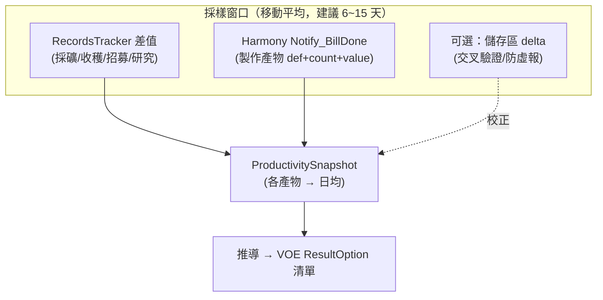

# 06 殖民地產出採樣 → 封存 → 抽象 outpost 持續產出（可行性報告）

> 本文是舊構想的**重啟與落地**，建在三份舊稿之上，不重述其結論，只在源碼上坐實或修正：
> - `analysis/rimworld/others/outpost/productivity_profiling_logic.md`（產出採樣：移動平均／理論產出／屬性映射／防作弊）
> - `analysis/rimworld/others/outpost/simplified_outpost_logic.md`（儲存區 Delta 輕量法）
> - `analysis/rimworld/others/outpost/military_outpost_extension.md`（封存抽象化、戰場重生成）
> - `analysis/rimworld/answers/mod_feasibility_review.md`（§0.1 無快照、§2 ResourceCounter 範圍坑、§1 A④ 理論產出版可行）
>
> 對照基準：`projects/rimworld/`（1.6/Odyssey）、`projects/rimworld_mods/vanilla-outposts-expanded/decompiled-framework/Outposts.decompiled.cs`（VOE）。
> ⚠️ analysis 文件非權威，行為一律以 projects/ 源碼為準；本文新查證的行已附 `path:line`。

---

## 1. 目標與玩家體驗

玩家在某個成熟殖民地花一段時間「採樣」其真實產能（種了多少、挖了多少、做了多少），然後**封存該殖民地**——地圖被銷毀、人物與物資轉為抽象，世界地圖上留下一個 **outpost**，按採樣推導的產出率**持續送資源回主基地**，不必再手動經營那張地圖。

這是「玩家側 outpost」，與叢集其他構想互補：
- 與 `02_outposts_and_world_objects.md` 的玩家 outpost 模型同源（皆借 VOE）。
- 與 idea 5（`03_rimwar_warband_territories_integration.md`）：同一個 outpost 資源點也能餵 Rim War 戰力。
- 與 idea 4（NPC 建 outpost）：本構想是玩家把**既有殖民地**降級成抽象點，而非 NPC 憑空生成。

核心差異（一句話）：**VOE outpost 從一開始就是抽象的、產出率寫死在 XML；本構想要從一個真實運轉過的地圖「測量」出產出率，再餵進 VOE 那套抽象引擎。**

---

## 2. 三段機制拆解


| 段 | 對應原版／VOE 機制 | 純 XML？ | 需 C#？ |
| :-- | :-- | :-- | :-- |
| **A 採樣** | `Pawn_RecordsTracker`（理論產出）／`ResourceCounter`（庫存 delta） | ❌ | ✅ 必須自寫採樣器 |
| **B 封存** | `Game.DeinitAndRemoveMap` + `Settlement.Abandon` 流程 | ❌ | ✅ 必須自寫轉換 |
| **C 抽象產出** | VOE `Outpost` / `OutpostExtension.ResultOptions` | 產出格式可 XML，但**動態產出率**需 C# | ⚠️ 半 |

---

## 3. A — 產出採樣

### 3.1 兩條路線

**路線一：理論產出（記錄工作量）— 推薦。**
RimWorld 每個 pawn 都有 `Pawn_RecordsTracker`，工作完成時由各 `JobDriver` 直接 `Increment`：

| 產能類型 | 記錄點（源碼） | RecordDef |
| :-- | :-- | :-- |
| 收穫作物 | `JobDriver_PlantWork.cs:91` `actor.records.Increment(RecordDefOf.PlantsHarvested)` | `PlantsHarvested`（**計株數，非營養值**） |
| 採礦 | `JobDriver_Mine.cs:71` `actor.records.Increment(RecordDefOf.CellsMined)` | `CellsMined`（計格數，非礦量） |
| 製作／烹飪 | `RimWorld/RecordsUtility.cs:60,64` `Notify_BillDone` 內 `MealsCooked`/`ThingsCrafted` | 見下方坑 ⚠️ |
| 馴服／招募 | `InteractionWorker_RecruitAttempt.cs:191,218` | `PrisonersRecruited`/`AnimalsTamed` |
| 研究 | `ResearchManager.cs:326` `records.AddTo(RecordDefOf.ResearchPointsResearched, amount)` | 浮點累加（真值） |

API（`RimWorld/Pawn_RecordsTracker.cs`）：
- `Increment(RecordDef)`（`:72`，限 `RecordType.Int`）
- `AddTo(RecordDef, float)`（`:84`，Int/Float 皆可）
- `GetValue(RecordDef)` / `GetAsInt(RecordDef)`（`:99,:109`）

採樣作法：**期初記下每個殖民者各 RecordDef 的 `GetValue`，期末再記一次，差值即採樣窗口內的「真實工作量」**。它反映真實產能，即便產物被立刻消耗也算數——這正是舊稿 `productivity_profiling_logic.md §1B` 的主張，源碼坐實成立。

⚠️ **新查證的坑（修正舊稿）**：`RecordDefOf` 的製作類記錄**範圍很窄**。`RecordsUtility.Notify_BillDone`（`RecordsUtility.cs:52-76`）只在產物為「高 preferability 餐點（`MealsCooked`）」或「武器/服裝/藝術/有 `CompQuality` 的物件（`ThingsCrafted`，見 `:70` `ShouldIncrementThingsCrafted`）」時才 +1，且**只計件數不計價值**。一般鋼錠、布料、藥物、零件等**不會被記錄**。
→ 因此**製作類產出不能靠原版 RecordDef**。要採樣製作產出，必須 Harmony 攔 `RecordsUtility.Notify_BillDone(Pawn, List<Thing>)` 或更上游的 `GenRecipe.MakeRecipeProducts`，自己把 `products` 的 `def + stackCount`（甚至 `MarketValue`）累進自訂的 `ProductivitySnapshot`。

**路線二：庫存 delta（儲存區快照）— 不推薦作為主力。**
舊稿 `simplified_outpost_logic.md` 已被 §2 修正坐實：`map.resourceCounter.AllCountedAmounts` **只統計儲存格**（`ResourceCounter.cs:128-141`），需 `def.CountAsResource==true`、未腐壞、未霧化（`:158-168`），每 204 tick 更新一次（`:120`）。漏掉地上未入庫物、背包、站立作物、活體、建築。期初/期末做 delta 雖簡單，但「灌水」極易（搬東西進倉庫即虛增），且名實上只是「儲存區 Delta」。

### 3.2 推薦法：理論產出為主、庫存 delta 為輔



- **採樣窗口 / 移動平均**：用滑動窗口（如過去 N 天逐日累積），`日均產出 = Σ窗口內增量 / 窗口天數`，平滑掉單日波動。沿用舊稿 §1A。
- **防作弊**：理論產出版天然抗「搬東西灌水」（搬運不增加 RecordDef）；唯一可刷的是「臨時雇大量短工狂挖狂收」，可用「採樣需連續、封存當下才結算」+「以採樣全程的人員平均數正規化」緩解。舊稿 §1 提的 `IncomingTrade`/`CaravanTransfer` 標記機制**不存在於引擎**（已於舊稿 2026-06-01 核對），不要依賴。

---

## 4. B — 封存殖民地（最大難點）

### 4.1 無快照：`DeinitAndRemoveMap` 是「銷毀」

`Verse/Game.cs:723 DeinitAndRemoveMap(Map, bool)` 流程（`:723-775`）：通知 `Notify_MyMapAboutToBeRemoved` → `MapDeiniter.Deinit` → 從 `maps` 移除 → 切換 CurrentMap → `MapComponentUtility.MapRemoved`。**全程是拆除，無任何序列化/快照。** 銷毀後地圖不存在，無法還原原貌（坐實 §0.1）。

放棄聚落即走此路：`Settlement.Abandon`（`RimWorld.Planet/Settlement.cs:445`）→ `MapParent.Abandon`（`:119`）→ `Destroy()` → `MapParent.PostRemove`（`:114-116`）→ `DeinitAndRemoveMap`。注意 `MapParent.Abandon` 還會處理殖民者心情（`NewColonyOptimism` 等，`:140-150`），並對放棄玩家唯一基地有特判（`:131` `Map.IsPlayerHome && !flag`）。

### 4.2 兩條路線（沿用 `military_outpost_extension.md` 的結論）

| 路線 | 作法 | 代價 | 評價 |
| :-- | :-- | :-- | :-- |
| **A. 抽象化（推薦，VOE 路線）** | 採樣 → 把人物/選定物資轉成抽象 outpost 數值 → `DeinitAndRemoveMap` 銷毀地圖 → 世界上留 `Outpost` world object | 不可還原原圖；要造訪只能重生成「新」圖 | 工業界 Outposts 類 mod 標準作法 |
| **B. 解封還原同圖** | 自序列化整張 `Map` 存成獨立檔，載回再還原；或把 `Map` 留記憶體只移出 tick 清單 | 存檔暴脹/全 save-reload 週期/逐 mod 存檔 XML 修補/生命週期脆弱 | 極重，**但有現成 mod 做到（見 4.5 Faction Manager，自帶源碼）** |

**本構想原選 A（抽象化）。** 但使用者前瞻需求「以後想讓 outpost 可被訪問/襲擊」其實正是 B 的能力——而 B 已有現成實作（4.5），故**最省力路 = A 的抽象產出 + B 的同圖還原 兩者結合**（兩半各借一個現成 mod，見 4.5）。

### 4.5 現成 mod：Faction Manager（路線 B 的真‧序列化實作，使用者指認）

`PirateBY.FactionManager.byTGPArcher.Updated`（Workshop 2878135150，作者 TGPArcher，**自帶完整源碼 + .sln**）就是路線 B 的可運作實作——多殖民地管理：不想顧的殖民地「卸載」存檔、想玩再「載回」、**「all will be there as you left it」**（同圖還原）。源碼權威路徑：`…/2878135150/Source/`。

- **卸載 `PersistenceUtility.UnloadMap`（`:121`）**：把該圖序列化成獨立存檔 + `Current.Game.DeinitAndRemoveMap`（`:133`）銷毀 live 圖。
- **載回 `LoadMap`（`:17`）**：`MemoryUtility.ClearAllMapsAndWorld`（`:54`）後從檔重載**同一張地圖**。
- **冷凍保存 `UnloadedWorldObjectComp`（`IThingHolder`）**：持 `ThingOwner<Pawn> unloadedPawns` + `ThingOwner<Building> unloadedBuildings`，掛在卸載後留世界的 world object 上。
- **相容代價**：`PrepareSaveGame`（`:81-98`）要對存檔 XML 逐 mod 動手術（WorkTab/CombatExtended/BetterPawnControl 的 component dictionary）——正是 §0.1 警告「易與其他 mod 衝突」的具體形態。
- **★關鍵落差——卸載期間不產出**：`UnloadedWorldObjectComp.CompTick`/`CompTickInterval`（`:32/:65`）**只做 `p.ageTracker.AgeTick`**（殖民者照常變老），**無任何生產/資源/工作邏輯**。純冷儲存。

**結論**：兩半正好分屬兩個現成 mod——
- **可還原同圖（＝可訪問/襲擊那半）** → **Faction Manager**（真序列化，re-enterable，開源可借）；
- **卸載期間持續抽象產出（＝本構想核心）** → **VOE**（抽象 producer，但永不生圖、不可還原）。

沒有任一 mod 同時做到。**最省力 = 以 Faction Manager 的 `PersistenceUtility`/`UnloadedWorldObjectComp` 為持久化底，補上「卸載期間依 §3 採樣產出率累積資源」這一層**（VOE 的 `Produce`/`ResultOption` 邏輯可參照，但要嫁接到 Faction Manager 的 `UnloadedWorldObjectComp` 上，因為後者才支援同圖還原）。待驗證：兩 mod 並存相容、`UnloadedWorldObjectComp` 加產出累積的存檔與效能。

### 4.3 封存時 pawn / 物資 / 建築怎麼處置

VOE 的抽象模型可直接借用（`Outposts.decompiled.cs`）：
- **occupants 是抽象 world pawn 清單** `List<Pawn> occupants`（`:743`），**永不生成地圖**（`Outpost : MapParent` 但 `Map` 恆 null，Tick 走 `:919/:977` 的 `SatisfyNeeds`）。封存時把選定殖民者 `AddPawn`（`:1022`）進 occupants，`AddPawn` 會自動 `Find.WorldPawns.RemovePawn`（`:1107`）並加入清單（`:1109-1111`）。
- **物資**：VOE 的 `containedItems`（Deliver 時 `DeliveryMethod.Store` 會塞進去，`:1487`）可承接「想隨封存帶走的物資」。其餘地圖上的東西**隨地圖銷毀消失**（`MapParent.Destroy` 會對所有 thing 呼叫 `Notify_LeftBehind`，`:163-170`）。
- **建築**：銷毀，不保留實體；但其價值可在採樣/封存當下被讀出，折算成 outpost 的「防禦等級／產能等級」抽象屬性（舊稿 §2 屬性映射）。

設計取捨：**封存 = 把「人 + 一部分指定物資」轉成抽象 outpost，其餘隨地圖銷毀。** 產出率由 A 段採樣決定，與帶走多少物資無關（物資只是一次性的封存收尾）。

### 4.4 邊界：封存玩家唯一基地

`MapParent.Abandon:131` 有 `Map.IsPlayerHome && !flag` 特判（沒有其他玩家家園地圖時）。若玩家把**唯一**基地封存，等於沒有 home map → `deliveryMap` 會是 null（VOE 產出投遞目標，見 §5），outpost 無處投遞。必須在封存 UI 擋住「這是你最後一個基地」或要求先有商隊/另一基地。**列為必驗證邊界。**

---

## 5. C — 抽象持續產出（借 VOE）

### 5.1 直接借 VOE 引擎

VOE `Outpost`（`Outposts.decompiled.cs:731`）每 `TicksPerProduction`（`OutpostExtension.TicksPerProduction`，預設 900000，`:2040`）跑一次 `Produce()`（`:988`）：
```
ProducedThings() = ResultOptions.SelectMany(ro => ro.Make(CapablePawns))   (:983-986)
Produce() => Deliver(ProducedThings())                                      (:988-991)
```
- `ResultOption.Make`（`:2067`）= `Thing.Make(Amount(pawns))`；`Amount`（`:2061`）= `(BaseAmount + AmountPerPawn*pawnCount + Σ AmountsPerSkills) * ProductionMultiplier`。
- `Deliver`（`:1409`）依設定送達最近的 home map（`deliveryMap`，`:1444`）：傳送/馱獸/投送艙/直接入庫（`:1463-1512`），並發信件通知。
- 抽象生活：`SatisfyNeeds`（`:1618`）餵食、休息、老化、健康 tick，pawn 死亡轉 corpse 進 `containedItems`（`:1641-1643`）。

### 5.2 把採樣推導的產出率餵進去（關鍵改寫點）

VOE 的 `ResultOption` 是**純 XML 寫死數值**。本構想要**動態**。兩種接法：

1. **子類化 `Outpost`，override `ResultOptions`（推薦）。** VOE 本身就這樣做（`:826 public virtual List<ResultOption> ResultOptions => Ext.ResultOptions`，子類如 `:2495` override 之）。自寫 `Outpost_Sampled : Outpost`，把 §3 的 `ProductivitySnapshot` 存成欄位（`IExposable`/`Scribe`），`ResultOptions` getter 動態組出 `List<ResultOption>`（每個產物 def → `BaseAmount = 日均`）。`Produce()`/`Deliver()`/`SatisfyNeeds()` 全繼承不動。
2. **override `ProducedThings()`** 直接從 snapshot 產 `IEnumerable<Thing>`，連 ResultOption 中介都跳過。更直接但少了 VOE 的 skill 加成框架。

推薦 1：最大化複用 VOE，產出格式仍走 ResultOption（相容 VOE 設定 UI 的 `ProductionMultiplier`/`TimeMultiplier`）。

---

## 6. 別重造輪子定位表

| 段 | 借 VOE / 原版 | 自建 |
| :-- | :-- | :-- |
| **A 採樣** | 讀 `Pawn_RecordsTracker`（原版，免費的工作量計數） | ✅ 採樣器 `WorldComponent`/`MapComponent`：窗口管理、期初期末 delta、Harmony 攔 `Notify_BillDone` 補製作產物、防作弊正規化、`ProductivitySnapshot` 存檔 |
| **B 封存** | `DeinitAndRemoveMap`（銷毀）、VOE `AddPawn`/`containedItems`（承接抽象人/物） | ✅ 封存指令與轉換邏輯：採樣結算→建 outpost→搬 pawn/物資→銷毀地圖→唯一基地邊界擋擋 |
| **C 抽象產出** | ✅ **全借 VOE**：`Outpost`/`Produce`/`Deliver`/`SatisfyNeeds`/`ResultOption` | 僅子類 `Outpost_Sampled` + override `ResultOptions` 餵動態率 |

預期成立：**抽象產出借 VOE，採樣與封存轉換自建。**（與任務假設一致。）

---

## 7. 與叢集接點

- **餵 idea 5（Rim War 戰力）**：本構想產出的 `Outpost`（world object）就是一個資源/實力點。`03_rimwar_warband_territories_integration.md` 的戰力推導只需讀同一個 outpost 的抽象屬性（occupants 數、防禦等級），不需另建模型——同一資源點模型雙用。
- **與「可造訪據點 = Settlement 線」的區分**：VOE/本構想 outpost = **抽象、不可造訪**（無地圖，`Map` 恆 null）。要可造訪、可進戰場的據點走 `Settlement` + `MapGenerator`（見 `04_settlement_map_generation.md`），是另一條軌，不要混淆。封存=走 outpost 抽象線。

---

## 8. 純 XML vs C# 拆分

| 項目 | 純 XML | 必須 C# |
| :-- | :-- | :-- |
| outpost world object 外觀/名稱/biome 限制/cost | ✅ `WorldObjectDef` + `OutpostExtension` | |
| 固定產出清單 | ✅ `ResultOptions`（若不要動態） | |
| **動態產出率（採樣推導）** | | ✅ 子類 + override `ResultOptions` |
| 採樣窗口/移動平均/防作弊 | | ✅ Component + Harmony |
| 製作產物採樣（補 RecordDef 盲區） | | ✅ Harmony `Notify_BillDone` |
| 封存指令、地圖銷毀、pawn/物資轉換 | | ✅ Gizmo + 轉換邏輯 |
| 快照存檔 | | ✅ `IExposable`/`Scribe` |

結論：**outpost 殼與固定產出可 XML；採樣、封存、動態產出三件事都必須 C#。**

---

## 9. 風險與待驗證 / 開放問題 / 參考清單

### 9.1 風險與待驗證（analysis 非權威，行為去 projects/ 坐實）
1. **製作產物採樣盲區（已坐實）**：原版 `ThingsCrafted`/`MealsCooked` 範圍窄且只計件（`RecordsUtility.cs:52-76`），一般材料/藥物/零件不入帳——製作採樣**必須** Harmony 補。
2. **封存後存檔**：`ProductivitySnapshot` 與 `Outpost_Sampled` 的 `Scribe` 要全覆蓋；VOE occupants 用 `Scribe_Collections.Look(..., LookMode.Deep)`（`:884`），自寫欄位別漏。**待真機驗證存讀檔。**
3. **「解封還原同圖」是否真要**：本構想預設**不要**（路線 A）。若使用者堅持要還原，成本是 §4.2 路線 B，需另案評估，不建議。
4. **採樣防作弊**：理論產出版抗搬運灌水，但抗不了「採樣期臨時塞滿短工」；需以採樣全程平均人數正規化。**待設計確認。**
5. **與 VOE 並存相容**：本構想若與 VOE 同時裝，`OutpostsMod.FindOutposts`（`:2129` 起）會掃所有 `worldObjectClass` 是 `Outpost` 子類的 def——自訂 `Outpost_Sampled` 會被 VOE 自動納管（共用設定 UI/Multiplier）。需確認 Harmony patch 不互踩。**待驗證共存。**
6. **封存玩家唯一基地（已定位邊界）**：`MapParent.Abandon:131` 特判 + `deliveryMap` 會 null（`:1444` 找不到 home map 就 `containedItems` 暫存，`:1448-1456`）。UI 必須擋。
7. **`PlanetTile`/多星球層**：outpost 投遞距離用 `Find.WorldGrid.ApproxDistanceInTiles`（`:1000`/`:1446`），單層下無虞；多 `PlanetLayer` 需同層（見 §0.2）。

### 9.2 開放設計問題
- 採樣窗口長度（6/10/15 天？）與是否允許「重新採樣」（解封→重經營→再封存以更新率，舊稿 §4.2 重採樣）。
- 封存帶走多少物資、是否折算 outpost 起始庫存。
- 抽象產出是否吃 occupants 技能成長（VOE `Amount` 已支援 `AmountsPerSkills`，可掛 §3 採樣的技能 XP 成長率）。
- 產出率隨時間衰減/維護不足降效？（VOE `SatisfyNeeds` 已有死亡邏輯，可加產能懲罰。）

### 9.3 參考檔案清單（皆 projects/ 權威源）
- `projects/rimworld/Verse/Game.cs:723`（`DeinitAndRemoveMap`，銷毀無快照）
- `projects/rimworld/RimWorld.Planet/MapParent.cs:114,:119,:131,:163,:316`（Abandon/PostRemove/CheckRemoveMapNow/唯一基地特判）
- `projects/rimworld/RimWorld.Planet/Settlement.cs:445`（`Settlement.Abandon`）
- `projects/rimworld/RimWorld/Pawn_RecordsTracker.cs:72,:84,:99,:109`（採樣 API）
- `projects/rimworld/RimWorld/RecordDefOf.cs`（記錄清單）
- `projects/rimworld/RimWorld/JobDriver_PlantWork.cs:91`、`JobDriver_Mine.cs:71`、`RimWorld/RecordsUtility.cs:52-76`、`ResearchManager.cs:326`（記錄掛點 + 製作盲區）
- `projects/rimworld/RimWorld/ResourceCounter.cs:120,:128-141,:158-168`（儲存區 delta 範圍坑）
- `projects/.../vanilla-outposts-expanded/decompiled-framework/Outposts.decompiled.cs`：`Outpost:731`、`occupants:743`、`ResultOptions:826`、`Tick/SatisfyNeeds:908/:919/:977/:1618`、`ProducedThings:983`、`Produce:988`、`AddPawn:1022`、`Deliver:1409`、`ConvertToCaravan/MakeCaravan:1126`、`OutpostExtension:2014`、`ResultOption:2050`、`FindOutposts:2129`

---
*文件路徑：analysis/rimworld_mods/_mod_ideas/world_map_grand_strategy/06_colony_archival_to_outpost.md*
*撰寫日期：2026-06-07 — 對照 projects/rimworld（1.6/Odyssey）+ VOE decompiled-framework*
