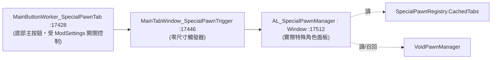

# 核心子系統深入：特殊角色框架 (SCMF)

本檔聚焦最核心也最具下游價值的子系統——**特殊角色框架 (Special Character / Special Pawn Framework)**。它把「一個 PawnKindDef」升格成「一個有唯一身分、不會真死、可從面板召回的具名角色」。

## 1. 三層身分模型

| 層 | 物件 | 角色 |
|---|---|---|
| **宣告層 (Def)** | `PawnKindDef` + `SpecialPawnExtension` | 在 XML 宣告「這個 kind 是某個特殊角色」，給 `uniqueID`、面板、圖示、召回冷卻 |
| **註冊表層 (靜態快取)** | `SpecialPawnRegistry`（反編譯檔 `:17282`） | 開局掃描所有 PawnKindDef，建立 `PawnKindDef → uniqueID(staticID)` 對映 (`KindToIdMap`) 與分頁資料 (`CachedTabs`) |
| **執行期實例層 (存檔元件)** | `AriandelLibrary_GameComponent_VoidPawnManager`（`:18043`，`IThingHolder`） | 真正持有 pawn 實體、冷卻、`staticID → ThingID` 對映、虛境旅人狀態 |

關鍵概念：**staticID 是邏輯主鍵**（如 `Ingefrid`、`Remiel`）；`ThingID` 是該存檔中「真身」的執行期 ID。`VoidPawnManager` 以 `specialPawnMapping` (`staticID → ThingID`) 判定誰是真身、誰是冒牌（複製人）。

## 2. 註冊表如何建立（純資料驅動）

`SpecialPawnRegistry` 在靜態建構式中 `QueueLongEvent(Initialize)`（`:17296`）。`Initialize`（`:17302`）：
1. `InjectHardcodedDefaults`：對作者自己的 Milira 角色（Remiel/Lydia/Skuld）做硬編註冊，**但用 `ModsConfig.IsActive("Ariandel.MiliraImperium")` 閘住**（`:17322`）——缺該 mod 時跳過，不影響下游。
2. 遍歷 `DefDatabase<PawnKindDef>.AllDefsListForReading`，凡帶 `SpecialPawnExtension` 且 `tabDef != null` 且 `uniqueID` 非空者，`RegisterEntry` 建立分頁項（`:17308`）。
3. `FinalizeData` 依 `order` 排序，建出 `CachedTabs` 供 UI 用（`:17374`）。

> 推論：下游 mod **只要寫對 `SpecialPawnExtension`，pawn 就會自動進註冊表與面板**，零 C#。唯一硬編特例是作者私有角色，與下游無關。

## 3. UI 入口鏈

按鈕可見性由 `Settings_AL_Main.Instance.settings_AL.EnableSpecialPawnTab` 控制（`:17430`）。

## 4. 死亡攔截與召回（最關鍵的「不會真死」機制）

由 `AL_Kill_Manager_Extension`（**空標記類別**，`:16657`）觸發：
- `AL_Kill_Manager_Cache`（`:16660`，`StaticConstructorOnStartup`）開局把所有帶此 Extension 的 PawnKindDef 收進 `VoidKillKinds` 集合。
- `Patch_Pawn_Kill_Manager`（`Pawn.Kill` 前綴，`:16677`）：
  - kind 不在 `VoidKillKinds` → 放行原版死亡。
  - 是真身 (`IsRealSpecialPawn`) 且屬玩家派系 → `HealAndRecover(pawn)` 後 **`return false` 阻止真死**（送回虛境等復活冷卻）。
  - 否則 (冒牌/複製人) → `DiscardFakePawn` 丟棄。

這是「Boss/神選者打不死、死了會復活」的底層；冷卻時間來自 `SpecialPawnExtension.resurrectCooldownTicks`（預設 45 天）。

## 5. 把「真身」綁進管理器的三條路徑

`SpecialPawnExtension` 只宣告 kind 是特殊角色；還需把**這次生成的實體**綁成 `staticID → ThingID`。手冊 §3.4 列出：
1. **生成後 patch 自動註冊/驗證**（`HediffComp_SpecialIdentity` / `HediffComp_StaticIDCheck`，標記或清冒牌）。
2. **對話選項**：`DialogueOptionCompProperty_RegisterDialogPawn` → `CheckAndRegisterPawn(pawn)`（劇情招募流程）。
3. **Debug**：`AL_DebugActions` 開發者工具（含舊存檔重新註冊）。

手冊推薦的劇情流：生成 pawn → 掛含 `HediffComp_AriandelDialogue` 的 hediff → 玩家右鍵開對話 → 某選項跑 `RecruitDialogPawn` + `RegisterDialogPawn`。

## 6. 周邊「保護 Extension」群（全純 XML，掛 PawnKindDef.modExtensions）

這些是讓特殊角色「行為符合 Boss/具名角色直覺」的開關，各自對應一個 Harmony patch（行號見 `00_overview` 分類表）：

| Extension | 作用 | 對應 patch |
|---|---|---|
| `AL_AgeFreeze_Extension` | 凍結生理/歷法年齡 | `Pawn_AgeTracker.AgeTick*` |
| `AL_RefuseMentalBreak_Extension` | 禁一切精神崩潰 | `MentalStateHandler` |
| `AL_FloatMenuBlocker_Extension` | 禁救援/俘虜/拘捕右鍵 | `FloatMenuOptionProvider_*` |
| `AL_HediffImmunity_Extension` | 免疫指定 hediff | `Pawn_HealthTracker.AddHediff` |
| `AL_SubcoreScannerBlocker_Extension` | 拒次核掃描 | `Building_SubcoreScanner.CanAcceptPawn` |
| `AL_SurgeryBlocker_Extension` | 禁低科義體/摘器官 | `Recipe_Install/RemoveBodyPart` |
| `AL_LockConsciousness_Extension` | 意識/移動/操作鎖 1 | `PawnCapacityUtility.CalculateCapacityLevel` |
| `AL_TraitLock_Extension` | 專屬特質，錯誤 pawn 自動移除 | 生成 patch |
| `AL_AzzyPregnancy_Extension` | 懷孕產物換 kind（防生複製人） | `PregnancyUtility` |
| `AL_WarpRetreat_Extension` | 撤退時丟裝備、刪 pawn 不留屍 | — |
| `AL_StatLock_Extension` | 鉗制/強制 Stat | — |

> 設計觀察：核心採「**空標記 Extension + StaticConstructorOnStartup 快取 + Harmony patch 查快取**」模式（`AL_Kill_Manager_Extension` 是範本）。優點：下游零 C#，patch 只查 HashSet 故開銷低。
