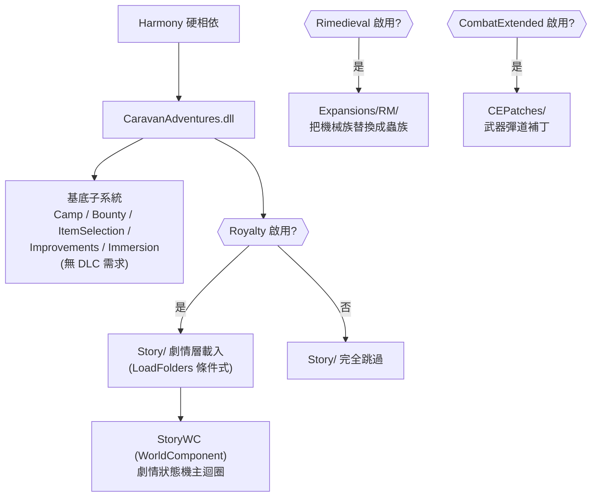

# Caravan Adventures — 架構總覽 (Level 1-2)

## 一句話定位
Caravan Adventures 是一個 **C# 引擎驅動的大型商隊玩法 + 線性劇情線 mod**：基底是一組「商隊 QoL／露營／賞金」獨立子系統（無需 DLC），疊加一條**硬編在 C# 的線性主線劇情**（需 Royalty，約佔 25% 內容），由一個全域 `WorldComponent` 狀態機以「劇情旗標 (storyFlags)」逐步推進。

- packageId：`iforgotmysocks.CaravanAdventures`（workshop 2558957509，作者 iforgotmysocks，標版 1.8.3）
- 唯一硬相依：**Harmony**（`brrainz.harmony`）。Royalty 為**軟相依**——無 Royalty 仍可玩，但整條 `Story/` 不載入。
- DLL：`1.6/Assemblies/CaravanAdventures.dll`（~502 KB，反編譯 23944 行）

## 相依鏈與載入分層

`LoadFolders.xml` 用 `IfModActive` 條件式掛載資料夾：`Story/`（需 Royalty）、`CEPatches/`（需 CombatExtended）、`Expansions/RM/`（需 Royalty）。這是 mod 的「能力分層」骨架——**DLC／相容性以資料夾為單位開關，不是用 C# if**。

## 子系統分類表

| 子系統 (namespace) | 反編譯行數約值 | 職責 | 需 Royalty | 純 XML 可改? |
|---|---|---|---|---|
| `CaravanCamp` | ~4400 | 自動紮營：依旅伴數/關係自動蓋帳篷、儲物、預排工作 | 否 | 否（Tent 行為全 C#） |
| `CaravanStory` | ~6900 | **劇情引擎**：StoryWC 狀態機、村莊/神殿/最終審判地圖、對話、Boss | 是 | 否（核心 C#） |
| `CaravanStory.Quests` | ~900 | QuestCont 各章控制器（FriendlyCaravan/Village/StoryStart/LastJudgment） | 是 | 否 |
| `CaravanMechBounty` | ~1950 | 機械賞金：擊殺換點數、雇傭兵、改善派系關係 | 否（劇情會用到） | 否 |
| `CaravanStory.MechChips` + `CaravanAbilities` | ~2600 | 特殊兵種 hediff（守護機械/飛彈/雷射/近戰）、自訂異能 | 部分 | 否 |
| `CaravanItemSelection` | ~540 | 商隊組隊／交易預設過濾器 | 否 | 否 |
| `CaravanIncidents` | ~560 | 自訂事件（落難少女 DamselInDistress 等） | 否 | 否 |
| `CaravanImprovements` / `CaravanImmersion` | ~700 | 旅途思緒、卸貨提示等沉浸感 QoL | 否 | 否 |
| `Patches` (+ `.Compatibility`) | ~1370 | Harmony 補丁 + 對 RimWar/SoS2/Rimedieval/CE/WinstonWaves 相容 | 否 | 否 |
| `Settings` | ~900 | 多頁 mod 設定（旅伴/露營/賞金/異能/劇情/過濾器） | 否 | 否 |
| `Expansions` | 小 | **C# 外掛框架**：以 `ExpansionDef.assemblyName` 識別第三方 mod 做 reskin | — | 半（見下） |

## 原始碼／組件／Story 目錄分佈

- **C# 真相層**：`1.6/Assemblies/CaravanAdventures.dll`（單一組件，所有玩法邏輯）。反編譯置於 `projects/rimworld_mods/caravan-adventures/decompiled/CaravanAdventures.decompiled.cs`。
- **基底 Defs**（`1.6/Defs/`，無 DLC）：幾乎全是露營用 ThingDef（`ThingDefs/CampThingDefs.xml`、`CampSimpleThingDefs.xml`）、WorkGiver/Job/Thought/Recipe/Sound + 一個 `WorldObjectDefs/Events.xml`。**沒有任何劇情資料**。
- **劇情 Defs**（`1.6/Story/Defs/`，需 Royalty）：18 個子目錄——ThingDefs(神殿/Boss假武器)、IncidentDefs、Faction、QuestScript、Ability、BossAbility、PawnKind、BossBodyAndRace、GameCondition、MapGeneration、WorldObject 等。**這些是劇情的「素材庫」（Boss 長相、神殿外觀、異能數值），不是劇情流程本身**。
- **Expansions**（`1.6/Expansions/RM/`）：Rimedieval 相容包。`Defs/Defs/Expansion.xml` 宣告一個 `ExpansionDef`（指向 assemblyName=Rimedieval）+ 一個把基底機械 fleshType 改成 Insectoid 的 `PatchOperationReplace`。
- **CEPatches**（`1.6/CEPatches/Patches/`）：4 個 CombatExtended 武器補丁 XML。

## 關鍵結論（劇情：硬編 vs 資料驅動）
劇情**幾乎全硬編在 C#**。`Story/Defs/QuestScriptDefs/QuestScriptDefs.xml` 裡 5 個 QuestScriptDef 全部 `ParentName="CAQuestScriptDefBase"`，root 統一指向 `QuestNode_Temp`，而該節點 `RunInt()` 只呼叫 `StartQuest()` 直接 `return true`（`CaravanAdventures.decompiled.cs:11611-11622`）——**完全是空殼**。RimWorld 原生的資料驅動 QuestScript DSL 在此被刻意架空，真正的流程由 `StoryWC` 狀態機 + `QuestCont_*` 控制器以 C# 驅動。詳見 `architecture/01_story_state_machine.md`。
