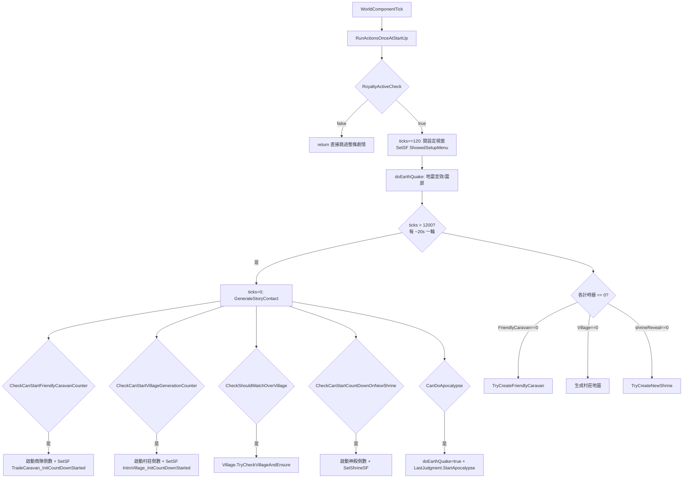

# 核心子系統深入：劇情狀態機 (StoryWC + storyFlags + QuestCont)

> 行號皆指 `projects/rimworld_mods/caravan-adventures/decompiled/CaravanAdventures.decompiled.cs`。

## 一句話
劇情不是用 RimWorld 原生 QuestScript DSL 寫的，而是一個**自訂的旗標驅動狀態機**：全域 `StoryWC : WorldComponent` 每 tick 輪詢一組 `Dictionary<string,bool> storyFlags`，依條件推進到下一章，章節的實作分散在 `QuestCont_*` 控制器與 `MapComponent`／`MapParent` 子類。

## 三大零件

### 1. StoryWC — 中央泵 (`:9434`)
- 持久化欄位：`storyFlags`（劇情進度旗標）、`questCont`（章節控制器容器）、`mechBossKillCounters`、`unlockedSpells`、各種倒數計時器。全部走 `ExposeData()` 存檔（`:9521`）。
- `InitializeStoryFlags()`（`:9575`）：把硬編的 `flagsToAdd` 清單灌進字典，預設全 false。神殿旗標用迴圈動態生成 `Shrine{1..6}_{InitCountDownStarted,Created,Completed}`（`:9581`）。
- `flagsToAdd` 初始清單（`:9475-9480`）即**整條主線的階段定義**——以前綴分組：
  - `TradeCaravan_*`：第一章 友善商隊接觸
  - `IntroVillage_*`：第二章 介紹村莊（被機械襲擊→援軍→玩家獲勝）
  - `Start_*`：第三章 異化之樹低語、收禮、開異能
  - `Shrine{n}_*`：中段 神殿巡禮（擊殺 Boss、解鎖法術，最多 5 座）
  - `Judgment_*`：最終章 末日審判（大地震→傳送門→終局對話）
  - 加上 `ShowedSetupMenu`、`SacrilegHuntersBetrayal`

### 2. storyFlags — 進度真相 (旗標字典)
- 寫入用 helper：`SetSF(key)`、`SetShrineSF(postFix)`（依當前神殿序號組 key）、`SetSFsStartingWith(prefix, value)`。
- 讀取即一般 `storyFlags["..."]` 查詢；全程 26+ 個旗標互相 gate。
- 另有 `debugFlags`（`:9462`）做開發跳關（`StoryStartDone`/`ForwardToLastShrine`/`ShrinesDone` 等），`FinalizeInit` 會據此批次塞旗標（`:9551-9565`）。

### 3. QuestCont — 章節控制器 (`:10982`)
`QuestCont` 只是容器，持有四個 `IExposable` 子控制器（`:10984-10990`）：
- `QuestCont_StoryStart`（`:11499`）
- `QuestCont_FriendlyCaravan`（`:11056`）
- `QuestCont_Village`（`:11520`）
- `QuestCont_LastJudgment`（`:11395`）

每個控制器自帶倒數計時器與「生成該章內容」的方法（如 `TryCreateFriendlyCaravan`、`TryCheckVillageAndEnsure`、`StartApocalypse`）。

## 主迴圈：WorldComponentTick (`:9602`)

- 每個 `CheckCanStart*` 判斷式（`:9778+` 一帶）就是「前一章旗標已完成 + 設定允許」的布林組合——這是**章節之間的轉移條件 (transition guard)**，全寫死在 C#。
- 倒數計時器歸零時觸發對應 `TryCreate*`，把劇情實體（商隊 incident、村莊 `StoryVillageMP`、神殿 `AncientMasterShrineWO`/`AncientMasterShrineMP`）生到世界地圖上。

## 劇情實體的承載類別（皆 C#）
| 類別 | 基底 | 角色 |
|---|---|---|
| `StoryVillageMP`（`:6108`） | `Settlement` | 第二章 介紹村莊地圖（含對話、機械襲擊腳本） |
| `AncientMasterShrineMP`（`:4060`） | `MapParent` | 神殿地圖（Boss 戰、解鎖法術） |
| `AncientMasterShrineWO`（`:8249`） | `WorldObject` | 神殿在世界地圖上的圖標／到達動作 |
| `LastJudgmentMP`（`:5719`） | `MapParent` | 最終審判地圖 |
| `GameCondition_Apocalypse`（`:5074`） | `GameCondition` | 末日天象 |
| `StoryStart`（`:10015`） | `MapComponent` | 異化之樹低語等開場觸發 |

## 對話系統：CompTalk + TalkSet（也是 C#）
- `CompTalk : ThingComp`（`:9002`）掛在可對話的劇情 NPC／物件上。
- `TalkSet : IExposable`（`:8891`）持有 `className` + `methodName` 兩個字串欄位（`:8903-8905`）——對話被觸發時用**反射**呼叫指定 C# 方法跑對話分支。對話內容與分支邏輯仍在 C#，不是資料檔。
- `JobDriver_Talk`（`:5662`）讓 pawn 走到目標執行對話。

## QuestScriptDef 為何是空殼
`QuestNode_Temp.RunInt()` → `StartQuest()` → `return true`（`:11611-11622`）。`QuestUtility.GenerateStoryQuest`（`:11680`）只是「在 QuestManager 掛一個有名字/描述的空 Quest 當 UI 提示」，真正流程不在 QuestPart 樹裡。作者刻意**繞過 RimWorld 資料驅動任務系統**，改用自家狀態機——因為主線需要跨地圖、跨多日、條件複雜的編排，原生 QuestScript DSL 表達力不足。
