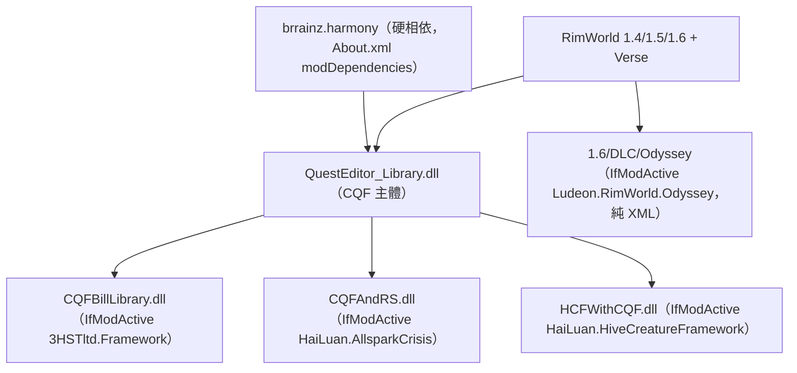
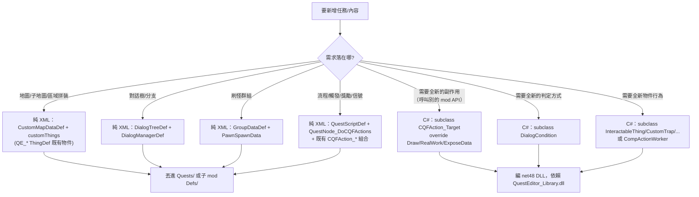

# CQF（Custom Quest Framework）架構總覽

> 目標 mod：`HaiLuan.CustomQuestFramework`（Steam workshop 2978572782）
> 安裝路徑：`/home/lorkhan/.local/share/Steam/steamapps/workshop/content/294100/2978572782`（以下簡稱 `<MOD>`）
> 反編譯產物：`/home/lorkhan/repo/pas/projects/rimworld_mods/custom-quest-framework/decompiled/`

## 一句話本質

**CQF 不是單一玩法 mod，而是一套「遊戲內視覺化任務 / 地圖 / 物件編輯器 + 領域腳本系統」**：作者在遊戲內用 QuestEditor 把任務、子地圖、交互物、對話樹編成 `QuestScriptDef` 與一系列自訂 `Def`（序列化成 XML 存回 mod 目錄的 `Quests/`），執行期透過 `QuestNode_DoCQFActions` 把 `CQFAction` 腳本掛進 RimWorld 原版任務系統。它的玩法來自「**物件 + 條件 + 動作 + 信號 + 資料庫**」的組合，而非單一 Def。

## 相依鏈



- 硬相依只有 **Harmony**（`<MOD>/About/About.xml` 的 `modDependencies`）。
- `<MOD>/LoadFolders.xml` 用 `IfModActive` 條件掛載：`3HSTltd.Framework`→`1.6/Bill`、`Ludeon.RimWorld.Odyssey`→`1.6/DLC/Odyssey`、`HaiLuan.AllsparkCrisis`→`1.6/Mod/AllsparkCrisis`、`HaiLuan.HiveCreatureFramework`→`1.6/Mod/HCF`。這些是「CQF × 其他框架」的橋接子模組，不是 CQF 主功能。

## 程式碼分佈表（哪個 DLL 放什麼）

| DLL（`<MOD>/1.6/...`） | 行數/類數 | 職責 | 反編譯路徑 |
|---|---|---|---|
| `Assemblies/net48/QuestEditor_Library.dll` | 36433 行 / 403 class | **CQF 全部核心**：編輯器 UI、CQFAction 腳本語言、DialogCondition、自訂 Def、自訂物件、地圖生成、QuestNode、Harmony patch | `decompiled/QuestEditor_Library/QuestEditor_Library.decompiled.cs` |
| `Bill/Assemblies/CQFBillLIbrary.dll` | 111 行 | 與 `3HSTltd.Framework`（生產線框架）橋接的小擴充 | `decompiled/CQFBillLibrary/` |
| `Mod/AllsparkCrisis/Assemblies/CQFAndRS.dll` | 46 行 | 範例橋接：新增 1 個 `CQFAction_InfectTarget`（感染建築） | `decompiled/CQFAndRS/` |
| `Mod/HCF/Assemblies/net48/HCFWithCQF.dll` | 216 行 | 範例橋接：新增數個 `CQFAction`（HiveGroup 加入/設定模式） | `decompiled/HCFWithCQF/` |

> 全部 namespace 都是 `QuestEditor_Library`（主 DLL）。「Custom Quest Framework」是顯示名，內部專案名是 `QuestEditor_Library`。
> **重要一手資料**：`<MOD>/.QuestEditor_Library/` 內含作者保留的原始碼樹與 4 份作者撰寫的 `Skill/*/SKILL.md`（`cqf-overview`、`cqf-def-catalog`、`cqf-action-condition-dev`、`cqf-map-dev`）。做擴充時這 4 份是最權威的 schema/defName 參考。

## 主要子系統（作者自述，見 `cqf-overview/SKILL.md`）

| 子系統 | 核心 class（`QuestEditor_Library.decompiled.cs:行`） | 一句話 |
|---|---|---|
| 行為系統 | `CQFAction`:93、`CQFAction_Target`:1416 | 「做事」：執行副作用、生成、發信號、改 Pawn |
| 條件系統 | `DialogCondition`:5439、`DialogCondition_Target`:6005 | 「能不能做」：純判定，不改世界狀態 |
| 自訂物件系統 | `InteractableThing`:14062、`LootBox`:14763、`CustomTrap`:13397、`CompActionWorker`:12616、`CustomDoor`:13314、`Spawner`:16144、`ZoneCore`:17010 | 地圖上的玩法節點 |
| 任務系統 | `QuestNode_DoCQFActions`:32791、`QuestNode_Root_CustomMap`:33215、`QuestNode_Root_MainMap`:33631 | 把 CQF 內容接進原版任務鏈 |
| 資料庫系統 | `GameComponent_Editor`:7336（quest/global/temporary base）、`CD`:7669、`QuestData`:7690 | CQF 流程共享上下文（記住「誰是誰」） |
| 信號系統 | `CQFAction_SentSignal`:447、`QuestPart_DoCQFActions`:32821 | CQF 事件總線（通知「下一步開始」） |
| 地圖系統 | `CustomMapDataDef`:18435、`GenStep_CustomMap`:27186、`MapParent_Custom`:30649、`MainMapDef`:30056 | 自訂地圖/子地圖的生產與切換 |

## 自訂 Def 型別清單（可資料驅動的入口）

全部繼承 `Verse.Def`，XML node 用全限定名 `QuestEditor_Library.<Class>`：

| Def（`...decompiled.cs:行`） | 用途 |
|---|---|
| `CustomMapDataDef`:18435 | 自訂地圖/子地圖藍圖（地形、建築、物件、刷怪、區域、屋頂…） |
| `MainMapDef`:30056 | 主地圖（多張 `MainMapAndCondition` 條件選圖） |
| `DialogTreeDef`:22474 | 正式多輪對話樹（節點/選項/結果） |
| `DialogManagerDef`:22279 | 對話管理器（掛載對話樹 + 條件） |
| `GroupDataDef`:20117 | 預製 Pawn 群組（Lord + PawnSpawnData + CQFAction_Lord） |
| `LootDataDef`:20109 | 戰利品模板 |
| `InteractionDataDef`:20113 | 交互操作模板 |
| `ReplacementDataDef`:20158 / `SpecialMapGenerationDef`:20162 | 地圖替換/特殊生成資料 |
| `SpecialPawnGenerateDef`:20234 | 特殊 Pawn 生成（commonality + `SpecialPawnGenerator`，見 `<MOD>/1.6/Defs/QuestEditor_Library.SpecialPawnGenerateDef/Quest.xml`） |
| `CaravanActionDef`:18412、`MetaLordEventDef`:29765 | 商隊世界行動、Lord 事件 |

> 另有兩個 RimWorld 原生 Def 被當作 CQF 內容入口：**`QuestScriptDef`**（原版任務腳本，裝 `QuestNode_DoCQFActions`）與大量 **`ThingDef`**（`QE_*`/`QF_*`/`CQF_*` 物件，定義在 `<MOD>/1.6/Defs/ThingDefs/`）。

## 內容存放位置（關鍵認知）

`Page_QuestEditor.Path`（`...decompiled.cs:24350`）= `<CQF mod RootDir>/Quests`。遊戲內編輯器把產物存進 **CQF 自己的 mod 資料夾**：

```
<MOD>/Quests/
├── Rule/        # QuestScriptDef 的 RuleText（任務名/描述/地名規則），見 Test_Site.xml
├── Map/         # CustomMapDataDef、MainMapDef
├── DialogTree/  # DialogTreeDef、DialogManagerDef
├── Group/       # GroupDataDef
└── Data/        # 其他 Def
```

`CQFQuestDefBootstrap`（`...decompiled.cs:8471`）在 static 建構時呼叫 `LoadAll()`，用 `DirectXmlToObject.ObjectFromXml<T>` 把這些 XML 動態載入 `DefDatabase`。**這代表：一個 CQF 子 mod 的「任務內容」本質就是一組 XML Def，丟進對應目錄即可被載入**——這正是純 XML 擴充可行的根本原因。

## 可資料驅動（純 XML） vs 需 C#



### 二分結論

- **純 XML 能做到的**（覆蓋絕大多數內容創作）：地圖/子地圖、交互物、戰利品箱、陷阱、門、容器、對話樹、刷怪群組、任務流程（用 100+ 個既有 `CQFAction_*` 與 `DialogCondition_*` 組合）。作者把整個動作/條件系統設計成 `DirectXmlToObject` 可反序列化的資料模型——XML 寫 `Class="QuestEditor_Library.CQFAction_*"` 即可。
- **一定要 C# 的**：只有當需要一個既有 `CQFAction`/`DialogCondition` 都做不到的**新副作用或新判定**（典型是呼叫第三方 mod 的 API，如 AllsparkCrisis 的感染、HCF 的 HiveGroup）。樣板極小：繼承 `CQFAction_Target`，override 三個方法即可（見下方範例與 tutorial）。

### C# 擴充最小實例（一手證據）

```csharp
// CQFAndRS.decompiled.cs:29  —— 整個子 mod 只有這一個 class
public class CQFAction_InfectTarget : CQFAction_Target {
    public override void RealWork(Dictionary<string, TargetInfo> targets, Quest quest) {
        foreach (var target in targets) {
            if (target.Value.Thing is Building b && BiometalUtitly.CanBeInfected(b))
                BiometalUtitly.Change(b);
        }
    }
}
```

```csharp
// HCFWithCQF.decompiled.cs:67  —— 帶編輯器 UI + 序列化的完整樣板
public class CQFAction_JoinHiveGroup : CQFAction_Target {
    public string hiveKey;
    public override void Draw(ref float y, Rect inRect, float x){ /* 編輯器欄位 */ }
    public override void RealWork(Dictionary<string,TargetInfo> targets, Quest quest){ /* 邏輯 */ }
    public override void ExposeData(){ base.ExposeData(); Scribe_Values.Look(ref hiveKey,"hiveKey"); }
}
```

> 詳細生命週期與 Def schema 見 `01_framework_lifecycle.md`；新增任務步驟見 `../tutorial/01_add_custom_quest.md`。
