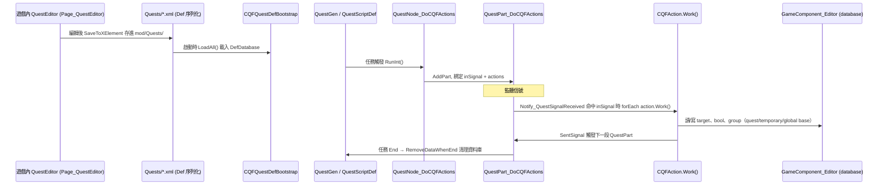
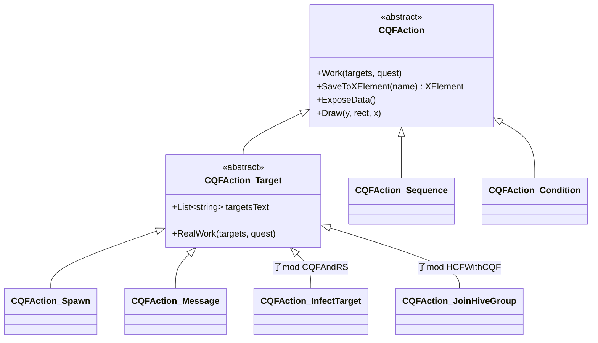

# CQF 任務生命週期與核心 Def Schema

> 所有行號指 `decompiled/QuestEditor_Library/QuestEditor_Library.decompiled.cs`，簡寫 `:行`。
> 一手 schema 來源：作者 `<MOD>/.QuestEditor_Library/Skill/cqf-action-condition-dev/SKILL.md`、`cqf-def-catalog/SKILL.md`。

## 一、生命週期：定義 → 觸發 → 執行 → 結算

### 1. 定義（Define）
- 作者在 RimWorld 主選單／開發者模式打開 **QuestEditor**（`Page_QuestEditor`:24312，由 `Patch_AddQuestEditor`:31011 注入）。
- 編輯出的內容由各 class 的 `SaveToXElement()`（CQFAction 為例 `:123`）序列化成 XML，存進 `Page_QuestEditor.Path`（`:24350`）= **`<CQF mod RootDir>/Quests/{Rule,Map,DialogTree,Group,Data}`**。
- 一個任務 = 一個原版 `QuestScriptDef`（其 `quest` 節點裝 `QuestNode_*`）+ 引用的自訂 Def（地圖/對話/群組）。

### 2. 載入（Load）
- `CQFQuestDefBootstrap`（`:8471`）static 建構 → `LoadAll()`（`:8503`）：用 `XmlDocument` + XPath 掃 `Quests/` 各子目錄，`DirectXmlToObject.ObjectFromXml<T>` 反序列化，`DefDatabase<T>.Add` 注入，最後 `DirectXmlCrossRefLoader.ResolveAllWantedCrossReferences`。
- 載入的型別：`QuestScriptDef`、`CustomMapDataDef`、`MainMapDef`、`DialogTreeDef`、`DialogManagerDef`（`:8508-8527`）。
- 另有 `HotLoad*`（`:8488-8501`）支援編輯器內熱替換 Def。
- **子 mod 也可走標準 RimWorld `Defs/` 載入**（不必放 `Quests/`）：因為這些都是合法 `Def`，放在子 mod 的 `Defs/*.xml` 一樣會被 `DefDatabase` 撿到（範例：`<MOD>/1.6/Defs/QuestEditor_Library.SpecialPawnGenerateDef/Quest.xml`）。

### 3. 觸發（Trigger）
- 任務生成時 `QuestNode_DoCQFActions.RunInt()`（`:32798`）：`QuestGen.quest.AddPart<QuestPart_DoCQFActions>()`，把 `inSignal`（SlateRef）與 `actions` 列表綁到 QuestPart 上。
- `QuestPart_DoCQFActions.Notify_QuestSignalReceived`（`:32827`）：收到的 `signal.tag == inSignal` 時，`foreach action.Work(...)`。**信號是觸發引擎**。
- 信號可由 `CQFAction_SentSignal`（`:447`）發出，`addQuestPrefix=true` 會自動拼 `Quest{id}.`，讓任務節點接得到。

### 4. 執行（Execute）
- `CQFAction.Work(targets, quest)`（抽象 `:134`）。`CQFAction_Target.Work`（`:1455`）先 `GameTools.GetTargets` 用 `targetsText` 解析目標，再呼叫 `RealWork`（抽象 `:1453`）。
- 目標解析順序（作者文件）：當前傳入 `targets` → quest database → temporary database → global database。
- 流程控制由 `CQFAction_Sequence`:271 / `_Random`:305 / `_Condition`:336 / `_Chance`:381 / `_Loop`:136 / `_DelayExecute`:188 組合。`_Condition` 的條件用 `DialogCondition`（`:5439`）。

### 5. 結算（Settle）
- 資料庫由 `GameComponent_Editor`（`:7336`）持有三層 base（quest/temporary/global），`AddExecutiveRequest`（延遲執行佇列，`CQFAction_DelayExecute` 用）。
- `QuestNode_RemoveDataWhenEnd`:33196 / `QuestPart_RemoveDataWhenEnd`:33208：任務結束時清理該任務的資料庫條目，避免殘留。

## 二、CQFAction 子類別擴充點（C# 接點）

擴充契約（三個 override）：
- `Draw(ref float y, Rect inRect, float x)`（`:105`）：編輯器 UI（用 `CQFEditorTools.DrawLabelAndText_Line` 等）。**選用**——若不在編輯器裡編，可省。
- `RealWork(targets, quest)`（`:1453`，繼承 `CQFAction_Target` 時）或 `Work`（直接繼承 `CQFAction` 時）：實際邏輯。**必填**。
- `ExposeData()`（`:132`）+ `SaveToXElement()`（`:123`）：序列化。若有自訂欄位**必填**（用 `Scribe_Values.Look` / `SaveToXElement` 加 `XElement`）。
- 字串欄位若是「目標 key / 信號名」要標 `[NoTranslate]`（如 `targetsText`:1418）。

## 三、核心 Def Schema（從反編譯欄位逆推）

> XML node 名 = 全限定 class 名，例 `<QuestEditor_Library.CustomMapDataDef>`。

### CustomMapDataDef（`:18435`）— 自訂地圖/子地圖藍圖
| 欄位 | 型別 | 說明 |
|---|---|---|
| `defName` | string | 必填 |
| `size` | IntVec3 | 地圖尺寸，例 `(47,1,47)` |
| `fogged` | bool | 是否初始迷霧 |
| `isPart` | bool | 是否為可拼裝的地圖部件 |
| `commonality` | float | 隨機選圖權重（預設 0.8） |
| `generationLimit` | int | 生成上限 |
| `faction` | string | 派系 key |
| `terrainsRect` | Dictionary<string,List<CellRect>> | 地形矩形，key=TerrainDef defName，格式 `(minX,minZ,maxX,maxZ)` |
| `roofRects` | Dictionary<RoofDef,List<CellRect>> | 屋頂矩形 |
| `thingDatas` | List<ThingData> | 預置建築/物品 |
| `customThings` | List<CustomThingData> | CQF 自訂物件（入口/箱子/陷阱…） |
| `zoneCores` | List<CustomThingData> | 區域核心 |
| `pawns` / `specialSpawnPawns` | Dictionary<IntVec3,List<PawnSpawnData>> | 刷怪 |
| `routes` | Dictionary<string,List<IntVec3>> | 巡邏/移動路徑 |
| `lordDatas` | List<LordData> | Lord 行為 |
| `generationActions` | List<GenerationAction> | 生成後動作 |
| `tags` | List<string> | 標籤（隨機選圖用） |

### ThingData（`:10644`）— 預置物件（`thingDatas` 的 `<li>`）
`def`(ThingDef), `stuff`(ThingDef), `style`(ThingStyleDef), `faction`(FactionDef), `rotation`(Rot4), `position`(IntVec3), `allPositions`(List<IntVec3>), `allRect`(List<CellRect>), `quality`, `count`, `hitPoint`, `color`/`colorDef`。

### DialogTreeDef（`:22474`）— 對話樹
`title`/`dialogReportKey`(string,翻譯 key), `requireNonHostile`(bool), `nodeMoulds`(Dictionary<int,DialogNode>), `idleNodes`。
- `DialogNode`（`:22618`）：`text`, `extraText`(List<string>), `index`/`parentIndex`(int?), `options`(List<DialogOption>), `subNodeIndexs`(List<int>), `images`(List<DialogImage>)。

### GroupDataDef（`:20117`）— 預製 Pawn 群組
`lord`(LordData), `pawns`(List<PawnSpawnData>)。`Generate()`（`:20121`）會建 Lord、刷 pawn、跑 `lord.actions`(List<CQFAction_Lord>)。

### PawnSpawnData（`:31460`，抽象基底；子類 `_Faction`:32242 / `_Group`:32403 / `_Random`:32455）
`dataName`, `generationChance`(float), `count`(IntRange), `timeToSpawn`(int), `enableLord`/`lordDataName`, `spawnMessage`, `routeName`/`roundTrip`, `rotation`(Rot4), `spawnType`(SpawnType enum), `faction`, `way`(ArrivingWay，例 `ArrivingWay_DropPod`:31445)。

### MainMapDef（`:30056`）
`maps`(List<MainMapAndCondition>:29966)——多張地圖各帶生成條件，主地圖場景用。

### SpecialPawnGenerateDef（`:20234`）
`commonality`(float) + `generator`(SpecialPawnGenerator，例 `_AddDialog`:20244)。實例見 `<MOD>/1.6/Defs/QuestEditor_Library.SpecialPawnGenerateDef/Quest.xml`（`QE_RandomDialog`，給隨機 Pawn 掛對話 tag）。

## 四、QuestScriptDef 接入方式

CQF 任務 = 原版 `QuestScriptDef`，其 `quest` 節點放 `QuestNode_*`：
- `QuestNode_DoCQFActions`（`:32791`）：`inSignal`(SlateRef<string>) + `actions`(List<CQFAction>)。核心入口，把 CQFAction 腳本掛進任務。
- `QuestNode_Root_CustomMap`（`:33215`，抽象）/ `QuestNode_RandomCustomMap`（`:33090`）：生成自訂地圖站點。
- `QuestNode_Root_MainMap`（`:33631`）：主地圖場景。
- `QuestNode_GenerateGroup`（`:33026`）/ `QuestNode_GenerateCustomWorldObject`（`:32946`）/ `QuestNode_FindTileOnCoast`（`:32849`）/ `QuestNode_GameUnique`（`:32923`，保證任務全域唯一）。

> 提醒（作者文件）：XML 可寫欄位以 `SaveToXElement()` / `ExposeData()` 為準，**不要憑類名直覺猜欄位**；`targetsText`/`recordKey`/`signal` 是內部 key 不翻譯，`message`/`label` 走翻譯體系。
