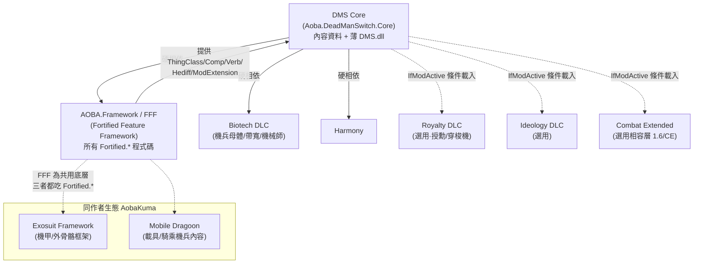

# The Dead Man's Switch (Core) — 架構總覽

## 一句話定位

**DMS 是一個「半自動戰爭機兵」主題的大型內容 mod（content pack），而非框架**：它提供約 40 種機兵（Automatroid）、無人機（Drone）、人形機（Synthroid）、配套武器/裝備/建築/勢力/開局/任務的**純資料 Def**，其行為邏輯幾乎全部外包給作者自己的程式碼框架 **Fortified Feature Framework（FFF，packageId `AOBA.Framework`，命名空間 `Fortified.*`）**。DMS 自帶的 `DMS.dll`（反編譯僅 ~1409 行）只做**極少數 FFF 沒涵蓋的劇情/任務膠水**。

> 來源：`About/About.xml`（packageId `Aoba.DeadManSwitch.Core`、`<description>` 機兵世界觀）、`1.6/計畫內容.txt`（作者企劃書：自然生成機兵殘骸/墳場、叛逃者開局、生產配方、機兵特化武器）。

## 相依鏈

1.6 版的硬相依與載入順序（**注意：1.6 已從 VFE Core 換成 AOBA.Framework／FFF**，與舊版任務簡報所述不同）：

- **真正的「框架」是 FFF/AOBA.Framework**，不是 DMS。DMS 把所有可重用機兵機制（機兵能持武器、空中支援、機兵平台、帶寬支援、武器烙印…）都委派給 FFF 的 `Fortified.*` 類別。
- 與同作者 **Exosuit Framework**、**Mobile Dragoon** 的關係：三者是同一作者（AobaKuma）機兵宇宙下的**平行內容包**，**共享 FFF 這個底層程式碼框架**（皆引用 `Fortified.*`）。DMS 不依賴 Exosuit/Dragoon，反之亦然；它們是兄弟內容，不是父子。（FFF 才是它們共同的父。）

## 內容 vs 程式碼比重

| 維度 | 數量 / 規模 | 說明 |
|---|---|---|
| 基礎 Defs（`1.6/Defs`） | 95 個 XML，約 28,273 行 | 機兵/武器/建築/勢力/任務/背景全在此 |
| DLC 條件式 Defs | Royalty 20、Ideology 11、Biotech 8 | `LoadFolders.xml` 以 `IfModActive` 掛載 |
| 跨 mod 相容補丁 | CE / GestaltEngine / VREA / SOS2 / VFEP… | `LoadFolders.xml` v1.6 共 9 個 `1.6/Mod/*` |
| **DMS.dll（mod 自有 C#）** | **反編譯 ~1409 行，僅 5 個自有 XML 引用點** | 詳見下節 |
| FFF（`Fortified.*`）被引用次數 | 100+ 處 `li Class="Fortified.…"` | **機兵行為的真正引擎** |

結論：**DMS 的「機兵/裝備/勢力/物品」全是純 XML 資料**；運行邏輯由 FFF 提供，DMS.dll 只補劇情膠水。內容:程式碼 ≈ 95%:5%。

## Defs 目錄分佈（`1.6/Defs/`）

| 子目錄 | XML 數 | 內容 |
|---|---|---|
| `Things_race` | 18 | **核心**：~40 種機兵/無人機/人形機 ThingDef（Automatroid 輕/中/重、Drone、Synthroid） |
| `Things_building` | 10 | 機兵平台、物流終端、容器、自動工作台等（用 FFF 建築 Comp） |
| `Things_Weapon` | 10 | 機兵特化武器與槍械 |
| `Misc` | 10 | 雜項（音樂/特效/規則包等） |
| `Abilities` | 10 | 機兵能力（自爆/自修/投放/跳躍，多走 FFF Ability Comp） |
| `Things_item` | 7 | 物品（石墨稀/鉭鎢合金/電池改裝件/機兵連結件…見企劃書） |
| `Pawnkinds` | 6 | Boss 群、先鋒駐軍、和平操作員、商隊種類 |
| `Faction` | 4 | `DMS_Army`（殖民艦隊）、`DMS_Mechanitor`（敵對古機師）、玩家陣營、可雇陣營 |
| `Backstory` | 4 | 背景故事 |
| `Things_Apparel` | 4 | EVA 服/戰術頭盔等裝備 |
| `Quests` | 5 | BossGroup、文件處理、授勳儀式 |
| `Things_Chunk` | 2 | 機兵殘骸碎塊（對應企劃書「機兵殘骸」） |
| `AirSupportDef / Hediffs / Story / Prefab / ConceptDef / Faction…` | 各 1 | 空中支援、機兵連結 Hediff、開局劇本規則、地標 Prefab |

DLC 專屬：`Biotech/`（機兵母體 gestator 配方 — 機兵的**生產入口**）、`Royalty/`（授勳許可 `DMS_Permits.xml` + 穿梭機獎勵）、`Ideology/`。

## DLL 職責（DMS.dll 在做的「少數關鍵事」）

DMS.dll 只有 5 個 XML 引用點，全是 **FFF 未涵蓋的劇情/任務系統膠水**，與機兵本體無關：

1. **Boss 群召喚（取代機械師需求）**
   - `CompUseEffect_SummonRaid` / `CompPropertiesUseable_SummonRaid`（`DMS.decompiled.cs:36`、`:75`）：用物品召喚 BossgroupDef。
   - Harmony `MechanitorPatch`（`:121`）：對帶 `NoMechanitorNeed`（`:146`）ModExtension 的 Boss 群，跳過原版「需有機械師」的限制。
   - `QuestNode_Root_BossgroupFactionExposed`（`:149`）+ `QuestPart_BossgroupArrivesWithMusic`（`:353`）+ `ModExtension_BossSong`（`:137`）：自製 Boss 群任務（含 BGM）。

2. **「文件處理」任務鏈**（叛逃者劇情的情報處理）
   - `CompQuestWorkable` / `CompProperties_QuestWorkable`（`:397`、`:577`）：可被研究台「處理」的文件物品（隨機程序生成名稱/工作量）。
   - `JobDriver_ProcessQuestWorkable`（`:586`）+ `WorkGiver_ProcessQuestWorkable`（`:659`）：殖民者搬文件到研究台處理的 Job。
   - `QuestNode_TrackDoc` / `QuestPart_TrackDoc`（`:702`、`:731`）：追蹤已處理文件數達標即完成任務。

3. **授勳儀式（Royalty 客製）**
   - Harmony `Patch_GenerateBestowingCeremonyQuest`（`:1122`）：玩家對 `DMS_Army` 陣營授勳時改跑 DMS 自製儀式。
   - `QuestNode_Root_PromotionCeremony`（`:1151`）：用 DMS 穿梭機 + 護衛兵的授勳劇情。

4. **穿梭機獎勵許可**
   - `RoyalTitlePermitWorker_RewardShuttle`（`:789`）：呼叫 `DMS_Ship_TransportShuttle_Player` 降落（落點合法性檢查 `ShuttleCanLandHere` `:948`）。

5. **DefOf 索引** `DMS_DefOf`（`:86`）：硬編 Faction/QuestScript/PawnKind/ThingDef 等引用。

**沒有任何「機兵 ThingClass / 機兵 Verb / 機兵 Hediff」由 DMS.dll 定義** —— 它們全部是 `Fortified.*`（FFF）或原版類別。詳見 `architecture/01_mech_data_model.md`。
