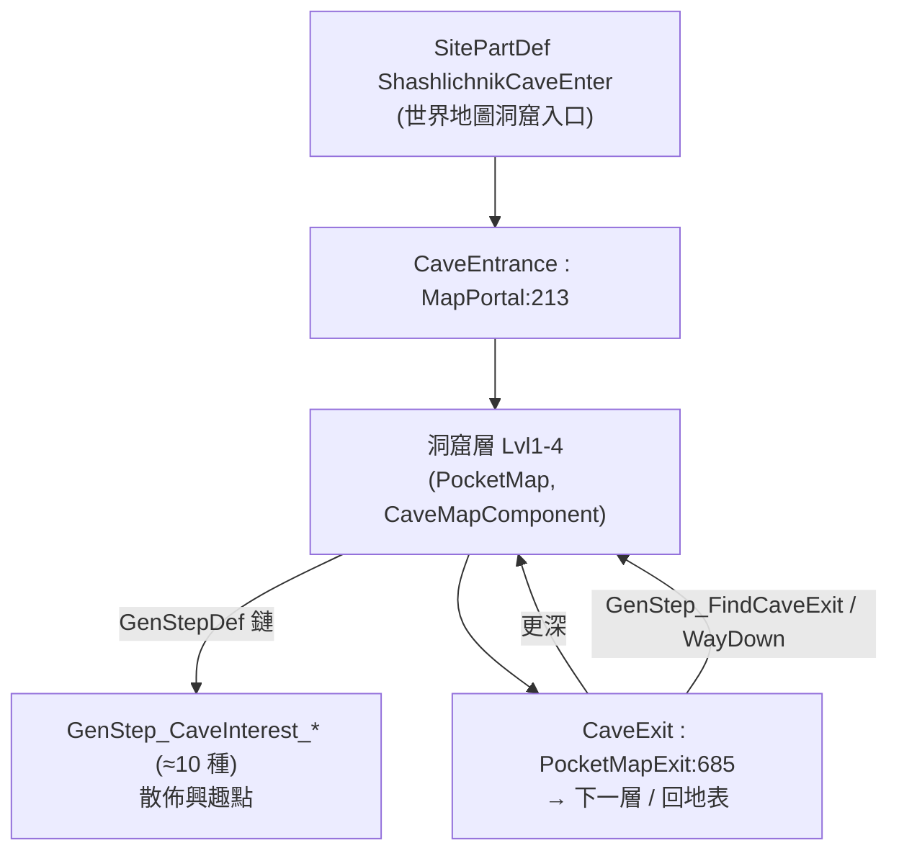

# Deep And Deeper 架構總覽（00_overview）

> 目標導向：analysis→create。核心釐清「純 XML 可做 vs 必須 C#」與擴充接點。

## 1. 一句話定位

`Shashlichnik.DeepAndDeeper`（workshop 3509420021，Deep Rock Galactic 風「Rock and Stone!」）是一個**地下採礦遠征 mod**：在世界地圖生成洞窟入口 Site，殖民者下到一層層**洞窟口袋地圖**（`CaveMapGenerator` Lvl1-4），邊挖礦邊應付危險（屍堆、蟲巢、菌類、變異體、低溫…），逐層深入找寶、再循通道回地表。不鼓勵在地下定居（地圖會崩）。

**技術上是 PocketMap / MapPortal 家族的又一員**（與 MultiFloors、RV-with-PD/SimplePortal 同機制）：`CaveEntrance : MapPortal`（`DeepAndDeeper.decompiled.cs:213`）、`CaveExit : PocketMapExit:685`、`CaveMapComponent : UndercaveMapComponent:882`（繼承 Anomaly 的地底洞窟基礎）。

版本佈局走 `LoadFolders.xml`：共用根目錄 `Defs/` ＋ 版本資料夾（`v1.6r2`／`v1.5`）。

## 2. 相依與組件

- 相依：Harmony；Anomaly DLC 內容用 `MayRequire="Ludeon.RimWorld.Anomaly"` 選用（如 Noctol/Fleshbeasts/Mutant interest）。
- 單命名空間 `Shashlichnik`（DLL 3820 行）＋豐富純資料 Defs。

## 3. 核心型別

| 型別（行號） | 角色 |
|---|---|
| `CaveEntrance : MapPortal:213` / `CaveExit : PocketMapExit:685` / `CaveExitSurfaceInterest:800` | 進出洞窟層（傳送門家族） |
| `CaveMapComponent : UndercaveMapComponent:882` / `CaveEntranceTracker:619` | 洞窟層地圖狀態（含崩塌等） |
| `GenStep_Caves:2104` / `GenStep_RocksFromGrid:2351` / `GenStep_UndergroundLakes:2457` / `GenStep_UndergroundTorches:2362` | 洞窟基底地形生成 |
| `GenStep_CaveInterest`（抽象 `:1589`）＋子類：`_Chemfuel/_CorpsePile/_CorpseGear/_Hive/_Mushrooms/_Mutant/_SingleCryptosleep/_LostPawn/_Fleshbeasts` | **興趣點生成器**（每種 = 一個 C# worker，參數由 GenStepDef 餵） |
| `GenStep_FindCaveExit:2215` / `GenStep_WayDown:2500` / `GenStep_LevelReward:2314` | 出口、往下通道、層獎勵 |
| `GenStep_DeepDiver:2148` | 生成 Deep Diver（地下遇到的 NPC/兵種） |
| `JobDriver_Dig:2583` / `JobGiver_DigClosestCluster:2662` / `JobGiver_LeaveCave:2846` / `JobGiver_ExitMapPortal:2750` | 挖掘與離洞 AI |
| `DefModExtension_CaveStabilizer:1516` | 建築掛此 ext（`effectiveRadius`）可穩定洞窟（延緩崩塌） |

## 4. 洞窟層如何組成（資料驅動）

`MapGeneratorDef`（`Defs/MapGenerator/CaveMapGeneratorLvl{1-4}.xml`，`ParentName="ShashlichnikUndergroundBase"`）的 `genSteps` 列出該層要跑的 `GenStepDef`；每個 `GenStepDef` 指定 `genStep Class="Shashlichnik.GenStep_CaveInterest_*"` 並餵參數（`mineableModifier`、`reward`、`countOfRewards`、`mutant`、`MinDistApart`、`countChances`…），DLC 內容用 `MayRequire` gate。

→ **新增/重排/調強度一層洞窟＝純 XML**（組合既有 GenStep）。只有「全新興趣點類型」要寫新的 `GenStep_CaveInterest` 子類（C#）。

詳見 `details/extension_points.md`。
