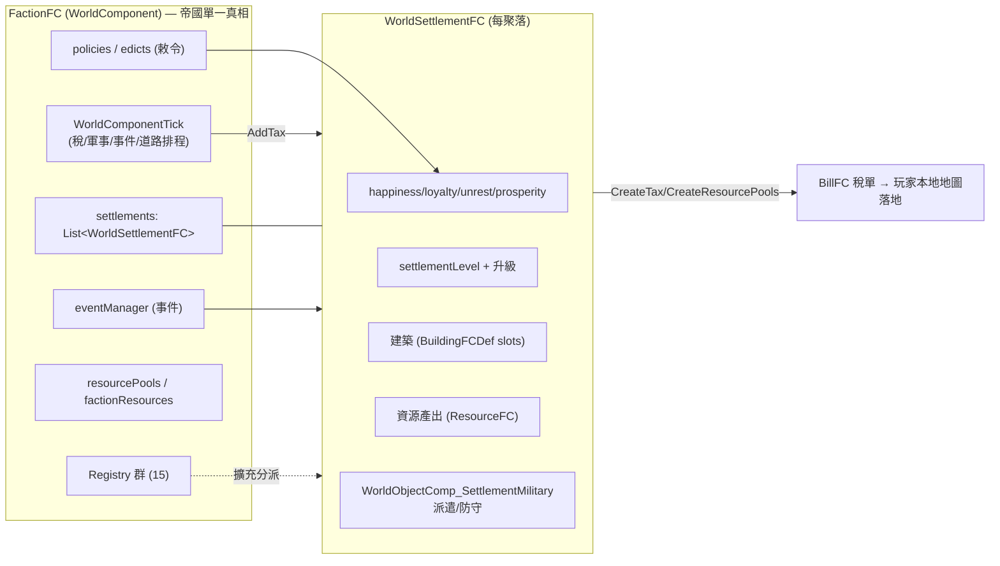

# Empire Refactored 架構總覽（00_overview）

> 目標導向：為了在此基礎上做 **create（擴充／衍生）**。本文釐清「是什麼／相依鏈／原始碼分佈／核心系統總圖」。
>
> 素材根：`/home/lorkhan/.local/share/Steam/steamapps/workshop/content/294100/3701480464`（下稱 `<root>`）。
> 源碼根：`<root>/1.6/Source/Core/`（→ `Empire.dll`）＋ `<root>/1.6/Source/Patch-XXX/`（各 compat → `Empire.XX.dll`）。
> 版本：`Matathias.Empire` v1.3.74，RimWorld **1.6 only**，唯一硬相依 `brrainz.harmony`（`<root>/About/About.xml:14-22`）。

## 1. 一句話定位

Empire Refactored 是一個**「世界地圖層的帝國經營」mod**：玩家把單一殖民地擴張成多個**自治附庸聚落（每個聚落＝一個世界地圖 WorldObject `WorldSettlementFC`）**，這些聚落自動產資源、**定期向玩家繳稅**（白銀或實物），玩家可**升級聚落／蓋據點建築／頒布派系敕令（Edicts）／派遣傭兵軍隊去打 NPC 聚落或防守**，並透過事件（Events）做抉擇。其重構重點是**把「聚落類型／資源類型／建築／敕令／事件」全面 def 化（XML 可擴充）**，並提供一整套 **Registry + Interface 擴充接點**，讓 submod 多數情況下「不必 Harmony patch」。

關鍵佐證：
- 帝國資料模型＝唯一 `WorldComponent`：`FactionFC : WorldComponent, ILifecycleParticipant`（`Core/FactionColonies/FactionFC.cs:12`），其 `public List<WorldSettlementFC> settlements`（`:81`）持有所有聚落。
- 聚落＝世界物件：`WorldSettlementFC : Settlement`（`Core/FactionColonies/Worldobjects/WorldSettlementFC.cs:19`）。
- 繳稅由 `WorldComponentTick` 排程：`FactionFC.TaxTick → AddTax`（`FactionFC.cs:651`、`:1635`）。
- Mod 入口：`FactionColoniesMod : Mod`（`Core/FactionColonies/FactionColonies.cs:811`）＋ Harmony 啟動 `HarmonyPatcher`（`Core/FactionColonies/HarmonyPatches/HarmonyPatcher.cs:11`）。
- XML 可擴充宣告（README）：「Settlement and resource types are defined by XML defs now; basic resources and settlements can be created in XML alone.」（`<root>/README.md`）

## 2. 相依／相容關係圖

核心 `Empire.dll`（Core）獨立運作；9 個 compat 子模組各自編成獨立 DLL，**靠 `LoadFolders.xml` 的 `IfModActive` 條件載入**（偵測對方 mod 是否啟用 → 才載入對應 `Compat/1.6/<X>/Assemblies/Empire.<XX>.dll`）。

```mermaid
graph TD
    Harmony["brrainz.harmony<br/>(唯一硬相依)"]
    Core["Empire.dll (Core)<br/>FactionFC + WorldSettlementFC<br/>稅/軍事/事件/敕令/Registry"]
    Harmony --> Core

    Core -. "IfModActive 條件載入" .-> VF["Empire.VF.dll<br/>VehicleFramework"]
    Core -. .-> RW["Empire.RW.dll<br/>RimWar (8 個 patch)"]
    Core -. .-> CE["Empire.CE.dll<br/>CombatExtended"]
    Core -. .-> HAR["Empire.HAR.dll<br/>HumanoidAlienRaces"]
    Core -. .-> KCSG["Empire.KCSG.dll<br/>VFE Core / KCSG"]
    Core -. .-> FTV["Empire.FTV.dll<br/>FactionTerritories"]
    Core -. .-> WD["Empire.WD.dll<br/>WorldDomination"]
    Core -. .-> WDExp["Empire.WDExp.dll<br/>WorldDominationExperimental"]
    Core -. .-> PRD["Empire.PRD.dll<br/>PawnkindRaceDiversification"]
```

> 連線為虛線，表示「對方 mod 存在時才載入」；核心不靜態相依任何 compat DLL（反向：compat DLL `ProjectReference` 依賴 `Empire.csproj`，見 `Patch-VF/*.csproj`）。

## 3. 原始碼／組件分佈表

| 區塊 | 路徑（相對 `<root>`） | 角色 | 產物 |
|---|---|---|---|
| 核心源碼 | `1.6/Source/Core/FactionColonies/`（279 個 .cs） | 帝國全部邏輯 | `Empire.dll` |
| Mod 入口 / 設定 | `…/FactionColonies.cs`（`FCSettings:11`、`FactionColoniesMod:811`） | `Mod` 子類 + `ModSettings` | — |
| 帝國資料模型 | `…/FactionFC.cs`（2485 行，`:12`） | `WorldComponent`，存所有聚落/稅/敕令/事件/資源池 | — |
| 聚落世界物件 | `…/Worldobjects/WorldSettlementFC.cs`（1923 行，`:19`） | 每聚落一個 `Settlement` WorldObject | — |
| Harmony 補丁 | `…/HarmonyPatches/`（18 檔） | `HarmonyPatcher` 啟動 + 各補丁 | — |
| Def 類別（C#） | `…/Defs/`（SettlementDef/ResourceTypeDef/BuildingFCDef/FCEventDef/FCPolicyDef/FCStatDef…） | XML def 的後端類別 | — |
| 擴充接點介面 | `…/Comps/Interfaces/FCInterfaces.cs` | 20+ 個 `interface`（擴充契約） | — |
| Registry（接點實作） | `…/Util/Registries/`（15 檔） | 靜態註冊表，分派給已註冊者 | — |
| DefModExtension | `…/Defs/ModExtensions/`（Settlements/Buildings/Resources/Policies） | XML 掛載的行為擴充點 | — |
| 軍事系統 | `…/Military/`（23 檔） | 傭兵/squad/戰鬥模擬/威脅縮放 | — |
| 視窗 UI | `…/Windows/`（含 `MainTabWindow_Colony` 等） | 帝國/聚落/軍事/建築 UI | — |
| 資料（Defs XML） | `1.6/Defs/`（WorldObjectDefs/FCBuildingDefs/FCResourceDefs/FCEventDefs/FCPoliciesDefs…） | 純資料，定義聚落/建築/資源/事件/敕令 | — |
| compat 源碼 | `1.6/Source/Patch-{VF,RW,CE,HAR,KCSG,FTV,WD,WDExp,PRD}/` | 各 1 檔（RW 為 8 檔） | `Empire.<XX>.dll` |
| compat 編譯產物 | `Compat/1.6/<X>/Assemblies/Empire.<XX>.dll` | 有源碼，不需反編譯 | — |
| 條件載入宣告 | `LoadFolders.xml` | `IfModActive` 閘門 | — |
| 內建 ModCompat 工具 | `…/Util/ModCompat/`（CombatExtendedUtil/GiddyUpUtil/HARUtil） | 核心 DLL 內以反射做的軟相容 | — |

> 註：Core 標稱 279 .cs，本次抓重點細讀約 15 檔，其餘（多數 Windows UI、DebugActions、各 PolicyBehavior）僅掃描定位，**未逐檔細讀**。

## 4. 核心系統總圖



詳見 `01_core_systems.md`（系統逐一）、`02_compat_modules.md`（compat 機制）、`../details/extension_points.md`（擴充接點 A 資料 / B 改碼）。
