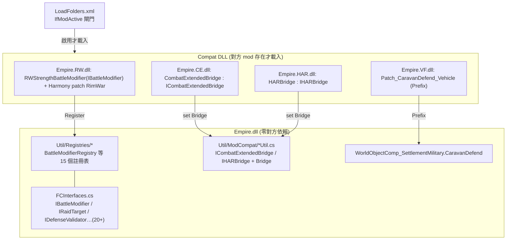

# Empire Refactored 相容子模組架構（02_compat_modules）

> 路徑相對 `<root>`。compat 源碼在 `1.6/Source/Patch-XXX/`，產物在 `Compat/1.6/<X>/Assemblies/Empire.<XX>.dll`。

## 1. 為何拆成 9 個獨立 DLL

每個相容對象（VehicleFramework、RimWar、CombatExtended、HAR、KCSG/VFE、FactionTerritories、WorldDomination、WDExp、PawnkindRaceDiversification）的 compat 程式碼，**直接引用對方 mod 的型別**（如 `using Vehicles;`、`using RimWar.Planet;`、`using CombatExtended;`）。若把這些 `using` 寫進核心 `Empire.dll`，則對方 mod 不在時，**整個 `Empire.dll` 會因為找不到型別而載入失敗（`TypeLoadException`）**。

解法：把每個對方型別的引用隔離成**獨立組件**，只有「對方 mod 真的啟用時」才載入該組件。這樣核心 DLL 永遠零硬相依、能單獨運作。

源碼分佈：

| compat | 源碼 | 檔數 | 產物 | 對方 packageId |
|---|---|---|---|---|
| VehicleFramework | `1.6/Source/Patch-VF/` | 1 | `Empire.VF.dll` | `SmashPhil.VehicleFramework` |
| RimWar | `1.6/Source/Patch-RW/` | 8 | `Empire.RW.dll` | `Torann.RimWar` |
| CombatExtended | `1.6/Source/Patch-CE/` | 1 | `Empire.CE.dll` | `CETeam.CombatExtended` |
| HumanoidAlienRaces | `1.6/Source/Patch-HAR/` | 1 | `Empire.HAR.dll` | `erdelf.HumanoidAlienRaces` |
| KCSG / VFE Core | `1.6/Source/Patch-KCSG/` | 1 | `Empire.KCSG.dll` | `OskarPotocki.VanillaFactionsExpanded.Core` |
| FactionTerritories | `1.6/Source/Patch-FTV/` | 1 | `Empire.FTV.dll` | `jaeger972.factionterritories` |
| WorldDomination | `1.6/Source/Patch-WD/` | 1 | `Empire.WD.dll` | `TSA.WorldDomination` |
| WDExperimental | `1.6/Source/Patch-WDExp/` | 1 | `Empire.WDExp.dll` | `TSA.WorldDominationExperimental` |
| PawnkindRaceDiversification | `1.6/Source/Patch-PRD/` | 1 | `Empire.PRD.dll` | `Mlie.PawnkindRaceDiversification` |

## 2. 條件載入機制：`LoadFolders.xml` 的 `IfModActive`

**核心機制不是反射、不是條件編譯，而是 RimWorld 原生的 `LoadFolders.xml` + `IfModActive`。** 只有對應 mod 啟用時，該 compat 資料夾（含其 `Assemblies/*.dll`）才被掛載：

```xml
<!-- LoadFolders.xml -->
<li IfModActive="CETeam.CombatExtended">Compat/1.6/CombatExtended</li>
<li IfModActive="Torann.RimWar">Compat/1.6/RimWar</li>
<li IfModActive="SmashPhil.VehicleFramework">Compat/1.6/VehicleFramework</li>
...（9 個 compat + Odyssey 條件層）
```
（`<root>/LoadFolders.xml`，每行對應一個 compat DLL 資料夾。）

DLL 自啟動：被載入後，各 compat DLL 用 `[StaticConstructorOnStartup]` 在遊戲啟動時自我註冊。

`About.xml` 的 `<loadAfter>`（`<root>/About/About.xml:23-32`）只確保**載入順序**（Empire 在這些 mod 之後載），並非載入條件——條件來自 `LoadFolders.xml`。

## 3. 兩種 compat 風格

### 風格 A：Harmony 補丁（修對方 / 修自己以彼此相容）

compat DLL 自己跑 `PatchAll`，補丁直接引用對方型別。

- **VF（VehicleFramework）**：`VehicleFrameworkCompatInit`（`Patch-VF/VehicleFrameworkCompat.cs:11`，`[StaticConstructorOnStartup]`）`new Harmony("com.Matathias.Empire.VF").PatchAll(...)`。核心補丁 `Patch_CaravanDefend_Vehicle`（`:30`）Prefix 攔截核心的 `WorldObjectComp_SettlementMilitary.CaravanDefend`，把 `VehicleCaravan` 內藏在 `VehicleRoleHandlers` 的乘員/載具正確 spawn 進防守地圖（原本不處理會漏 spawn）。接點＝**對核心自己的 method 做 Prefix**，再用對方型別 `VehiclePawn`/`VehicleCaravan` 解出乘員。

- **RW（RimWar）**：8 個檔。`RimWarCompatInit`（`Patch-RW/RimWarCompatInit.cs:24`）`PatchAll` + `BattleModifierRegistry.Register(new RWStrengthBattleModifier())`（`:28`）。它示範了**兩種接點並用**：
  - Harmony patch 對方（`Patch_IsValidSettlement`/`Patch_ConvertSettlement`/`Patch_EmpireColonyCheck` 等）——讓 RimWar 把 Empire 聚落視為合法、且不去捕獲/複製它們。
  - **走核心的擴充 Registry**（不必 patch）：`RWStrengthBattleModifier : IBattleModifier`（`Patch-RW/RimWarCompatInit.cs:43`）實作核心 `IBattleModifier` 介面（`Comps/Interfaces/FCInterfaces.cs:149`），註冊到 `BattleModifierRegistry`（`Util/Registries/BattleModifierRegistry.cs:6`）；Empire 結算戰鬥時呼叫 `InvokeModifyForce`，就會用目標的 RimWar 點數重算防守方戰力（sqrt 縮放，`RimWarCompatInit.cs:69-74`）。

### 風格 B：Bridge 介面（核心定義契約，gated DLL 提供實作）

核心在 `Util/ModCompat/` 定義一個 **bridge interface + 靜態 `Bridge` 屬性**；gated DLL 用對方型別實作該介面，啟動時把實例塞進 `Bridge`。核心呼叫前先判 `Bridge == null`（代表對方未啟用）。**核心對對方型別零引用**。

- **CE**：核心 `ICombatExtendedBridge`（`Util/ModCompat/CombatExtendedUtil.cs:11`）+ `public static ICombatExtendedBridge Bridge { get; set; }`（`:37`）。gated DLL `CombatExtendedInit`（`Patch-CE/*.cs:16`）在啟動時 `CombatExtendedUtil.Bridge = new CombatExtendedBridge()`（`:21`），`CombatExtendedBridge : ICombatExtendedBridge`（`:32`）以**直接型別引用**（`using CombatExtended;`、`CompInventory` 等）實作裝彈藥等行為，避免反射。
- **HAR**：同模式，`IHARBridge`（`Util/ModCompat/HARUtil.cs:9`）+ `HARUtil.Bridge`（`:26`），核心呼叫 `CanRaceWearApparel`/`CanRaceUseWeapon` 前判 `Bridge == null` 走預設（`:34-45`）。

> 風格 B 是 refactored 版的招牌：把「軟相容反射」升級成「強型別 bridge」——核心無對方依賴、gated DLL 有完整型別檢查與效能。

## 4. 接點全景



撰寫一個新 compat 子模組的最省力路徑：
1. 在 `LoadFolders.xml` 加一行 `<li IfModActive="對方packageId">Compat/1.6/MyX</li>`。
2. 新建 `Patch-MyX` 專案，`ProjectReference` 到 `Core/Empire.csproj`、`Reference` 到對方 DLL（HintPath，參 `Patch-VF/*.csproj`）。
3. 用 `[StaticConstructorOnStartup]` 啟動，**優先註冊核心既有 Registry / 實作 bridge 介面**（不必 Harmony）；只有核心沒提供接點時才 `PatchAll`。
