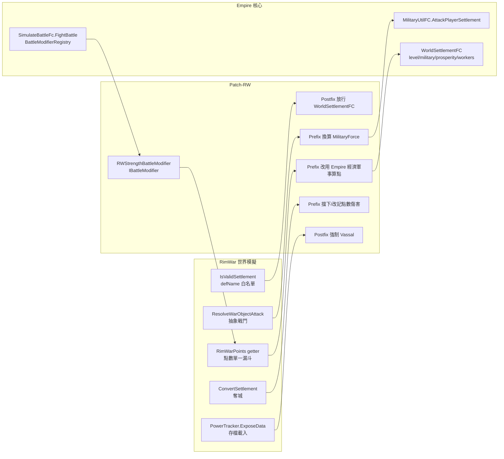

# Empire 官方橋接模組走讀（bridge_module_walkthrough）

> 目的：把 Empire Refactored（v1.3.74, RimWorld 1.6）的官方 compat 模組當成「第三方擴展 mod 範本」逐一拆解，重點走讀 **Patch-RW（Empire×Rim War 橋接）**，並完整列出 FCInterfaces / Registry API。
>
> **路徑基準聲明**：
> - `<mod>` ＝ `~/.local/share/Steam/steamapps/workshop/content/294100/3701480464/`（Empire Refactored 工作坊目錄）
> - 橋接模組源碼相對 `<mod>1.6/Source/`（如 `Patch-RW/RimWarCompatInit.cs`）
> - Empire 核心源碼相對 `<mod>1.6/Source/Core/FactionColonies/`（如 `Util/Registries/BattleModifierRegistry.cs`）
> - Rim War 反編譯源相對 `projects/rimworld_mods/rim-war/decompiled/`（單檔 `RimWar.decompiled.cs`）
>
> 相關文件：條件載入與 9 個 compat DLL 的高層架構見 `../architecture/02_compat_modules.md`；XML/介面接點總表見 `extension_points.md`；實作教學見 `../tutorial/01_writing_extension_module.md`。

## 1. 全景：一個橋接模組由三層手段組成

以 Patch-RW 為例，「橋接」不是單一技術，而是三層手段的組合，每層解決不同類型的整合問題：

| 層 | 手段 | Patch-RW 中的實例 | 適用問題 |
|---|---|---|---|
| 資料層 | 條件載入的 **XML PatchOperation** | `Compat/1.6/RimWar/Patches/RimWarSettlementComp.xml` | 對方的 comp 掛不上自己的自訂 Def |
| 行為層 | **Harmony patch 對方的方法** | `Patch-RW/Patch_*.cs` 共 6 個 patch 類 | 對方的硬編碼判斷看不見/誤傷自己的物件 |
| 契約層 | **實作 Empire 核心介面 + Registry 註冊** | `Patch-RW/RimWarCompatInit.cs:28`（`IBattleModifier`） | 要影響 Empire 自身流程——核心已預留回呼點，免 patch 自己 |

關鍵不對稱：**Patch-RW 對 Rim War 全用 Harmony（對方沒有擴展 API），對 Empire 自己全用介面註冊（自家核心有擴展 API）**。第三方擴展 mod 站在同樣位置：對 Empire 優先走契約層，只有 Empire 沒留接點時才 Harmony。

### 1.1 模組清單與規模

`<mod>1.6/Source/` 下共 9 個 Patch-* 專案（`Core` 之外）：Patch-CE、Patch-FTV、Patch-HAR、Patch-KCSG、Patch-PRD、Patch-RW、Patch-VF、Patch-WD、Patch-WDExp。每個編譯成獨立 DLL 放進 `Compat/1.6/<目標mod>/Assemblies/`，由 `<mod>LoadFolders.xml` 的 `IfModActive` 條件載入（詳見 §3.2）。

Patch-RW 本體極小：8 個 .cs 檔共 420 行（含 csproj 59 行），其中一半是註解。**橋接模組的本質是「薄」**——所有重活都委派回兩邊的既有系統。

## 2. Patch-RW 解決的整合問題（為什麼需要橋接）

Rim War 是世界層模擬：每個聚落掛 `RimWarSettlementComp` 累積點數（`RimWarPoints`），派出 warband/scout/trader 等 `WarObject` 在世界地圖移動，抵達後用點數做抽象戰鬥。Empire 的玩家聚落（`WorldSettlementFC`，屬 PColony 派系）不在 Rim War 設計範圍內，直接共存會出五類問題：

1. **隱形**：Rim War 的 `WorldUtility.IsValidSettlement` 用 defName 白名單（`"Settlement"`、`"City_Faction"`、`"City_Citadel"`、`"FactionBaseGenerator"`，見 `RimWar.decompiled.cs:16685-16696`），Empire 自訂 `WorldSettlementDef` 的 defName 全不在內 → Empire 聚落不被追蹤、不算進派系戰力。
2. **點數失真**：Rim War 對 Vassal（PColony 被硬編碼為 Vassal，`WorldUtility.IsVassalFaction` 只認 defName=="PColony"，`RimWar.decompiled.cs:16739-16746`）的點數夾在 100–10,000，且 getter 每次呼叫都跑一個壞掉的 `Empire.EmpireFaction_ColonyCheck`（`RimWar.decompiled.cs:9258-9261`）——該檢查迭代全部 world objects 找 defName=="Colony"（永不匹配 Empire 任何 def）。
3. **抽象戰鬥繞過 Empire 戰鬥系統**：warband 抵達後走 `IncidentUtility.ResolveWarObjectAttackOnSettlement`（`RimWar.decompiled.cs:10340`）純點數結算，Empire 的防衛事件、自動防守、手動戰鬥全被跳過。
4. **奪城會複製聚落**：攻方獲勝時 `WorldUtility.ConvertSettlement` 先 `Destroy()` 防方再於同格 `SettlementUtility.AddNewHome` 建新聚落（`RimWar.decompiled.cs:15289-15308`）。Empire 聚落的 Destroy 被自家 destroyFlag 擋下，但新的香草聚落仍會疊上去；若這是該派系最後一個可見聚落還會觸發 `RemoveRWDFaction` 把 PColony 整個從世界清掉（`RimWar.decompiled.cs:15310-15321`）。
5. **存檔行為漂移**：Rim War 只在初次註冊派系時決定 `RimWarData.behavior`，之後序列化保存、載入時不重推導 → 舊存檔的 PColony 可能以非 Vassal 行為載入，導致 Rim War 從玩家聚落派出商隊/斥候/warband 騷擾玩家（`Patch_ForceVassalBehavior.cs:10-32` 的註解完整記載了這條因果鏈）。

下節逐檔走讀如何各個擊破。

## 3. 工程樣板（csproj／LoadFolders／資料夾結構）

### 3.1 csproj：同時引用兩邊的標準寫法

`Patch-RW/Empire.RW.csproj`（全 59 行）是 SDK 風格專案，五個重點段落：

- **目標框架與輸出**（`Empire.RW.csproj:2-14`）：`net48`、`PlatformTarget x64`、`AssemblyName Empire.RW`、`RootNamespace FactionColonies.RW`；`OutputPath` 直接指向發佈位置 `..\..\..\Compat\1.6\RimWar\Assemblies`（編譯即部署）。
- **RimWorld 本體**：用 NuGet 套件 `Krafs.Rimworld.Ref Version="1.6.*-*"` + `Lib.Harmony 2.3.6`（`Empire.RW.csproj:15-20`）。注意它同時還引了本機 `Assembly-CSharp.dll`（`Empire.RW.csproj:28-31`）——Krafs 公開 ref 組件為主，本機 dll 補內部成員。
- **Empire 核心**：`<ProjectReference Include="..\Core\Empire.csproj"><Private>False</Private>`（`Empire.RW.csproj:22-26`）。第三方擴展沒有 Core 專案原始碼時，改成 `<Reference>` HintPath 指向 `<mod>1.6/Assemblies/Empire.dll` 即可。
- **Rim War**：`<Reference Include="RimWar"> HintPath ..\..\..\Common\References\RimWar.dll`（`Empire.RW.csproj:32-35`）——開發者自己維護一份參考用 dll（`Common/References/` 不隨 mod 發佈，工作坊版裡沒有這個目錄）。第三方可直接指向 Rim War 工作坊目錄的 dll。
- **所有 Reference 一律 `<Private>False</Private>`**：絕不把 RimWorld/Harmony/對方 mod 的 dll 複製進輸出資料夾——遊戲執行期由 mod 載入器提供這些組件，重複攜帶會造成型別衝突。

### 3.2 LoadFolders.xml：條件載入的接線

`<mod>LoadFolders.xml` 把每個 compat 目錄綁到目標 mod 的 packageId：

```xml
<li IfModActive="Torann.RimWar">Compat/1.6/RimWar</li>
```

（`LoadFolders.xml:9`）。Rim War 不在時整個 `Compat/1.6/RimWar/` 目錄（含 `Empire.RW.dll` 與 XML patch）對遊戲不存在——這就是為什麼 Patch-RW 可以放心在頂層 `using RimWar.Planet;`（`RimWarCompatInit.cs:2`）直接引用對方型別而不怕 TypeLoadException。

配套的 `About/About.xml:23-31` 把所有 compat 目標都列進 `<loadAfter>`（含 `Torann.RimWar`），保證載入順序使 patch 能命中。

**例外：目標 mod 的 packageId 帶後綴變體時 IfModActive 會失效**。Patch-FTV 為此採「延遲型別解析」防禦（`Patch-FTV/FactionTerritoriesCompat.cs:122-125` 註解：靜態建構子不直接觸碰 FTV 型別，所有 FTV 型別存取放在標記 `NoInlining` 的方法內，JIT 才不會在建構子編譯時就解析失敗）。對照之下 Patch-RW 不需要這招，因為 `Torann.RimWar` 的 packageId 穩定。

### 3.3 發佈資料夾結構

```
Compat/1.6/RimWar/
├── Assemblies/Empire.RW.dll      ← csproj OutputPath 直出
└── Patches/RimWarSettlementComp.xml  ← 條件載入的 XML patch
```

defs/patches 與 dll 同放在條件載入目錄下，**只在目標 mod 啟用時生效**——這是「XML patch 引用對方 comp 類」不炸的前提（XML 裡 `Class="RimWar.Planet.WorldObjectCompProperties_RimWarSettlement"` 需要 RimWar.dll 在場才能解析）。

### 3.4 XML patch：讓 RimWar 的 comp 掛上 Empire 的自訂 Def

`Compat/1.6/RimWar/Patches/RimWarSettlementComp.xml` 全文一個操作：

```xml
<Operation Class="PatchOperationAdd">
  <xpath>Defs/FactionColonies.WorldSettlementDef[@Name="WorldSettlementDefBase"]</xpath>
  <value><comps><li Class="RimWar.Planet.WorldObjectCompProperties_RimWarSettlement" /></comps></value>
</Operation>
```

檔頭註解說明動機：RimWar 自己的 patch 只對 `WorldObjectDef` 元素下手，而 Empire 聚落的 XML 元素名是 `FactionColonies.WorldSettlementDef`，xpath 撈不到 → 由 Empire 這邊補一刀，**打在抽象基底 `WorldSettlementDefBase` 上讓所有聚落型別繼承**。對方 comp 類 `WorldObjectCompProperties_RimWarSettlement` 確實存在於 `RimWar.decompiled.cs:10006`。

> 模式註記：「把對方的 comp 用 PatchOperationAdd 掛上自己的 Def 基底」是資料層橋接的標準解，零 C#。第三方擴展若要讓自己的 WorldObjectComp 掛上 Empire 聚落，同樣對 `Defs/FactionColonies.WorldSettlementDef[@Name="WorldSettlementDefBase"]` 打 PatchOperationAdd 即可。

## 4. Patch-RW 逐檔走讀

### 4.0 入口：RimWarCompatInit.cs

```csharp
[StaticConstructorOnStartup]
public static class RimWarCompatInit
{
    static RimWarCompatInit()
    {
        new Harmony("com.Matathias.Empire.RW").PatchAll(Assembly.GetExecutingAssembly());
        BattleModifierRegistry.Register(new RWStrengthBattleModifier());
        LogUtil.MessageForce("RimWar compatibility module loaded.");
    }
}
```

（`Patch-RW/RimWarCompatInit.cs:22-31`）三件事：
1. **獨立 Harmony ID**（`com.Matathias.Empire.RW`）——每個 compat 模組一個 ID，與核心（Core）及其他 compat 模組區隔，方便除錯時辨識 patch 來源。
2. **Registry 註冊**：把 `RWStrengthBattleModifier`（實作 Empire 核心介面 `IBattleModifier`，`Comps/Interfaces/FCInterfaces.cs:149-156`）註冊進 `BattleModifierRegistry`（`Util/Registries/BattleModifierRegistry.cs:10-13`）。
3. **強制 log 一行**（`LogUtil.MessageForce`，不受 verbose 設定抑制）——載入驗證的錨點字串。

檔頭註解（`RimWarCompatInit.cs:10-21`）逐條列出本模組修的 6 個問題——**官方範本連「模組級 docstring 寫什麼」都示範了**：每個 fix 一行。

#### RWStrengthBattleModifier：契約層的「攻防配對」技巧

（`RimWarCompatInit.cs:42-78`）這是整個模組唯一不靠 Harmony 的部分。問題：Empire 派兵打 NPC 聚落時，防方戰力本來只由科技等級推導；裝了 Rim War 後，聚落強弱應該反映其 RimWar 點數。

實作依賴 Empire 核心的呼叫順序契約——`SimulateBattleFc.FightBattle` 固定先後呼叫：

```csharp
BattleModifierRegistry.InvokeModifyForce(MFA, true);   // 攻方
BattleModifierRegistry.InvokeModifyForce(MFB, false);  // 防方
```

（`Military/SimulateBattleFC.cs:14-15`）。modifier 在攻方那次呼叫先把 `force` 存進欄位 `lastAttacker`（`RimWarCompatInit.cs:48-52`），防方那次再從 `lastAttacker.homeSettlement.MilitaryComp.militaryLocation` 反查目標聚落（`RimWarCompatInit.cs:60-64`），取其 `RimWarSettlementComp.RimWarPoints`，套換算公式覆寫防方戰力：

```
militaryLevel = max(sqrt(RimWarPoints) / 20, 1)        // 400pts→1級, 10000→5級, 32400→9級
forceRemaining = round(militaryLevel * militaryEfficiency)
```

（`RimWarCompatInit.cs:70-74`；對照註解 `RimWarCompatInit.cs:39-40` 的數值表）。Patch-WD 的 `WDStrengthBattleModifier` 用一模一樣的攻防配對結構（`Patch-WD/WorldDominationCompat.cs:82-117`，並在 `:77-81` 註解明文記載這個順序契約），證明這是官方認可的慣用法。

> 適合複製度：高。第三方要做「依某外部系統的強度調整 Empire 戰鬥」時，整段抄改 `GetComponent<...>` 與換算公式即可。

### 4.1 Patch_IsValidSettlement.cs — 可見性（鉤 RimWar）

**目標**：`RimWar.Planet.WorldUtility.IsValidSettlement(WorldObject)`（原始碼 `RimWar.decompiled.cs:16685`）。
**手法**：Postfix，原判 false 且物件是活的有派系 `WorldSettlementFC` 時改 true（`Patch_IsValidSettlement.cs:19-26`）。

效果：Empire 聚落進入 Rim War 的聚落追蹤、點數累積、戰鬥與派系總戰力（檔頭註解 `Patch_IsValidSettlement.cs:7-14`）。這是整個橋接的**地基**——其他 patch 處理的都是「被看見之後」的副作用。

> 模式：**可見性 postfix**——對方用 defName 白名單硬編碼判斷時，postfix 補上自己的型別。選 postfix 而非 prefix：只放寬、不收窄，對其他 mod 的同類 patch 最友善。

### 4.2 Patch_RimWarPoints.cs — 點數來源置換（鉤 RimWar 的屬性 getter）

**目標**：`RimWarSettlementComp.RimWarPoints` 的 **getter**（`[HarmonyPatch("RimWarPoints", MethodType.Getter)]`，`Patch_RimWarPoints.cs:19-20`；原始碼 `RimWar.decompiled.cs:9228-9261`）。
**手法**：Prefix，`__instance.parent` 是 `WorldSettlementFC` 時跳過原始實作，直接由 Empire 經濟/軍事狀態算點數：

```csharp
int points = 500
    + settlement.settlementLevel * 300            // 發展層級
    + settlement.settlementMilitaryLevel * 2500   // 駐軍
    + (int)(settlement.prosperity * 15)           // 繁榮
    + (int)(settlement.workers * 40)              // 人口
    + (int)Math.Max(settlement.GetDefenseBonus() * 5, 0);
__result = Mathf.Clamp(points, 500, 100000);
```

（`Patch_RimWarPoints.cs:30-37`）。檔頭註解點出選點原因：**這個 getter 是 RimWar 所有點數讀取的單一漏斗**——`PointsFromSettlements`、`TotalFactionPoints`、`EffectivePoints`、掃描範圍、首都選擇、戰鬥結算、目標選擇、UI 顯示全部經過它（`Patch_RimWarPoints.cs:14-17`）。順帶繞掉了原 getter 的 100–10,000 Vassal 夾值與壞掉的 `EmpireFaction_ColonyCheck`（`RimWar.decompiled.cs:9258-9261`）。

> 模式：**單一漏斗攔截**——patch 前先在對方源碼確認「最窄的必經之路」，patch 一個 getter 勝過 patch 十個呼叫端。這是讀反編譯源的最大回報點。

### 4.3 Patch_ResolveWarObjectAttack.cs — 行為導流（RimWar 攻擊 → Empire 戰鬥系統）

**目標**：`RimWar.IncidentUtility.ResolveWarObjectAttackOnSettlement`（原始簽名 `(WarObject attacker, Settlement parentSettlement, RimWarSettlementComp defender, RimWarData rwd)`，`RimWar.decompiled.cs:10340`）。
**手法**：Prefix 只宣告自己要用的參數子集 `(WarObject attacker, RimWarSettlementComp defender)`（`Patch_ResolveWarObjectAttack.cs:26`）——Harmony 按參數名配對，不必照抄全簽名。

流程（`Patch_ResolveWarObjectAttack.cs:26-57`）：
1. 防方 parent 非 `WorldSettlementFC` → return true 跑原版。
2. 把 RimWar 攻方點數換算成 Empire `MilitaryForce`：等級用同一條 `sqrt(points)/20` 公式，效率由攻方派系科技等級查 `MilitaryForce.GetMilitaryLevelAndEfficiencyFromTechLevel`（核心 `Military/MilitaryForce.cs:82`）。
3. 呼叫 **Empire 的公開入口** `MilitaryUtilFC.AttackPlayerSettlement(attackingForce, empireSettlement, attacker.Faction)`（核心 `Military/MilitaryUtilFC.cs:12`）→ 產生正規的 settlementBeingAttacked 事件：1 天倒數、自動防守派遣、戰況預報、尊重玩家手動/自動戰鬥設定（註解 `Patch_ResolveWarObjectAttack.cs:14-18`）。
4. return false 跳過 RimWar 的抽象結算；warband 由呼叫端原有流程自毀（註解 `:19-21` 預先回答了「那 warband 怎麼消失」）。

> 模式：**行為導流 prefix**——攔下對方的事件入口，翻譯參數後轉呼叫自家系統的公開 API。橋接的「翻譯官」本體。注意它呼叫的是 Empire 的**靜態工具方法**而非 Harmony 打自己——核心願意暴露的入口就直接用。

### 4.4 Patch_ConvertSettlement.cs — 主權防衛（防奪城複製）

**目標**：`RimWar.Planet.WorldUtility.ConvertSettlement`（原始簽名 5 參數，`RimWar.decompiled.cs:15289`；prefix 同樣只取 `(Settlement worldSettlement, int points)` 子集，`Patch_ConvertSettlement.cs:25`）。
**手法**：Prefix；Empire 聚落被「轉換」時跳過原版，改成把點數傷害的一半記到 `RimWarSettlementComp.PointDamage` 並清空 `AttackingUnits`（`Patch_ConvertSettlement.cs:32-37`）——戰敗在 RimWar 點數系統裡仍有後果，但聚落歸屬不變。

檔頭註解（`Patch_ConvertSettlement.cs:8-19`）精確記載了不擋會發生的三連鎖（對照 `RimWar.decompiled.cs:15295-15321` 可逐行驗證）：Destroy 被 Empire destroyFlag 擋下→同格疊出香草聚落→若是最後可見聚落觸發 `RemoveRWDFaction` 清掉整個 PColony。並標明這是 **belt-and-suspenders**：Vassal 行為已擋大多數奪城，這裡兜底。

> 模式：**主權防衛 prefix**——對方的「奪取/破壞/接管」流程一律對自家物件短路，但回填一個對方系統內的等價後果（點數傷害），不讓對方系統的因果鏈斷掉。

### 4.5 Patch_GetGizmos.cs — UI 抑制

**目標**：`RimWarSettlementComp.GetGizmos`。
**手法**：Prefix，parent 是 `WorldSettlementFC` 時 `__result = Enumerable.Empty<Gizmo>()` 並跳過原版（`Patch_GetGizmos.cs:20-28`）。

動機（註解 `:9-15`）：Vassal 聚落本來有手動派兵 gizmo（Send Trader/Scout/Warband），但因為 4.2 的 prefix 繞掉了原 getter，這些 gizmo 的點數扣費永遠扣不到 → 變免費漏洞。**一個 patch 的副作用由另一個 patch 收尾**——橋接模組內部也要互相對齊。

### 4.6 Patch_EmpireColonyCheck.cs — 死碼滅活

**目標**：`RimWar.ModCheck.Empire.EmpireFaction_ColonyCheck`。
**手法**：Prefix 恆 `__result = false; return false`（`Patch_EmpireColonyCheck.cs:15-19`）。

這是 RimWar 內建的「Empire 偵測」——迭代全部 world objects 找 defName=="Colony"，永不匹配 Empire Refactored 的任何 def（註解 `:5-9`；原始碼在 `RimWarPoints` getter 內被呼叫，`RimWar.decompiled.cs:9258`）。4.2 已讓 Empire 聚落不再走到這行，此 patch 是防禦性 no-op，消滅其他呼叫端殘留的 O(n) 迭代。

> 模式：**對方為舊版 Empire 寫的「相容碼」本身就是要修的對象**。對方 mod 內建的 ModCheck 類常基於過時假設。

### 4.7 Patch_ForceVassalBehavior.cs — 存檔修復（鉤 ExposeData）

**目標**：`RimWar.Planet.WorldComponent_PowerTracker.ExposeData`（類在 `RimWar.decompiled.cs:16850`）。
**手法**：Postfix，僅在 `Scribe.mode == LoadSaveMode.PostLoadInit` 時動作（`Patch_ForceVassalBehavior.cs:40`）；掃 `__instance.RimWarData`，用 **Empire 自家的 `FactionCache.IsPlayerColonyFaction`**（核心 `Util/FactionCache.cs:54`，而非 RimWar 較寬的 `IsVassalFaction`）找出 PColony 那筆，若 `behavior != RimWarBehavior.Vassal` 就強制改回並 MessageForce 記錄（`Patch_ForceVassalBehavior.cs:42-58`）。

檔頭 24 行註解（`:9-32`）是全模組最完整的因果鏈文件：行為只在初次註冊時隨機決定→序列化後永不重推導→漂移成 Expansionist 的存檔會讓 RimWar 從玩家聚落派商隊，且因 Empire 執行期重建 PColony 的 trader pawnGroupMaker 還會刷「no usable PawnGroupMakers for Trader」錯誤。也解釋了為何選 Vassal 而非 Excluded：Vassal（`RimWarBehavior` 枚舉值，`RimWar.decompiled.cs:1092-1104`）把派系排除出行動迴圈但保留 vassal 關係/熱度處理，Excluded 會把 PColony 從 RimWar 整個剔除，連其他 compat 依賴的機制一起斷。

> 模式：**存檔修復 postfix**——鉤對方 WorldComponent 的 ExposeData、限定 PostLoadInit、修正後資料隨下次存檔固化（「the repair is permanent for that save」，註解 `:30-31`）。處理「對方只在初始化時算一次、之後吃序列化值」的所有同型問題。

### 4.8 Patch-RW 整體資料流



雙向各鉤什麼，一句話總結：**鉤 RimWar 的五個點解決「RimWar 怎麼看待 Empire 聚落」；註冊 Empire 的一個 IBattleModifier 解決「Empire 怎麼看待 RimWar 聚落」**。

## 5. 對照其他 Patch-*：官方橋接的常用模式歸納

| 模式 | 定義 | 實例（檔:行） |
|---|---|---|
| 可見性 postfix | 對方 defName/派系白名單看不見自家物件 → postfix 放寬 | `Patch-RW/Patch_IsValidSettlement.cs:19`；反向（讓對方看不見）：`Patch-WD/WorldDominationCompat.cs:42-49`（`IsExcludedFaction` postfix 把 PColony 標為排除）、`:60-67`（`IsSettlementProtected`） |
| 單一漏斗攔截 | 找出對方所有讀取的必經 getter/方法，一刀置換 | `Patch-RW/Patch_RimWarPoints.cs:19-39` |
| 行為導流 prefix | 攔對方事件入口，翻譯參數轉呼叫自家公開 API | `Patch-RW/Patch_ResolveWarObjectAttack.cs:26-57` |
| 主權防衛 prefix | 對方的奪取/破壞流程對自家物件短路，回填等價後果 | `Patch-RW/Patch_ConvertSettlement.cs:25-39`；`Patch-FTV/FactionTerritoriesCompat.cs:175-187`（擋 FTV 對 Empire 聚落的附庸化，且是 **patch 對方的 patch**——目標是 FTV 的 `InterceptBaseDestroyedLetterPatch.Prefix`） |
| 存檔修復 postfix | 鉤 ExposeData 的 PostLoadInit 修正漂移的序列化值 | `Patch-RW/Patch_ForceVassalBehavior.cs:34-59` |
| 戰力換算 IBattleModifier | 攻防兩次呼叫配對，反查目標、依外部系統強度覆寫防方 | `Patch-RW/RimWarCompatInit.cs:42-78`；`Patch-WD/WorldDominationCompat.cs:82-117`（同構，含順序契約註解） |
| 同步 postfix | 對方改了世界狀態後，補一次自家狀態同步 | `Patch-WD/WorldDominationCompat.cs:124-146`（WD 外交變動後 `RelationsUtilFC.ResetPlayerColonyRelations()`） |
| 統計剔除 postfix | 從對方的全域統計結果中移除自家派系並修正總和 | `Patch-WD/WorldDominationCompat.cs:156-181`（`GetWorldPowerStats` 移除 PColony 並扣回 `GlobalTotalStr`） |
| 防衛式 transpiler | 對方的崩潰 bug 用 transpiler 換掉單一危險呼叫 | `Patch-KCSG/KCSGCompat.cs:31-57`（把 `GridsUtility.Roofed` 換成帶 InBounds 檢查的 `RoofedSafe`；找不到目標時 `LogUtil.Warning` 而非沉默，`:48-49`） |
| 載具/特殊 caravan 分流 prefix | 對方的子型別需要完全不同的處理 → prefix 認出子型別自行處理 | `Patch-VF/VehicleFrameworkCompat.cs:31-38`（`CaravanDefend` 遇 `VehicleCaravan` 走自製 spawn 流程，含 destroy 順序陷阱註解 `:72-74`） |
| 資料層 comp 注入 | PatchOperationAdd 把對方 comp 掛上自家 Def 基底 | `Compat/1.6/RimWar/Patches/RimWarSettlementComp.xml` |
| 延遲型別解析 | 目標 mod packageId 不穩時，型別存取移入 NoInlining 方法 + try/catch | `Patch-FTV/FactionTerritoriesCompat.cs:122-135` |

共通骨架（9 個模組全部一致）：
- 一個 `[StaticConstructorOnStartup]` Init 類：`new Harmony("com.Matathias.Empire.<縮寫>").PatchAll(Assembly.GetExecutingAssembly())` + （需要時）Registry 註冊 + `LogUtil.MessageForce("<目標> compatibility module loaded.")`。
- 每個 patch 一檔，檔頭 docstring 寫「不修會怎樣」的因果鏈。
- patch 類全 static，prefix 守則：**非自家物件一律 return true 跑原版**，把對其他 mod 的侵入面壓到最小。

## 6. FCInterfaces 完整 API 清單

定義全在核心 `Comps/Interfaces/FCInterfaces.cs`（單檔 414 行）。分兩種掛載方式：

- **R**＝Registry 註冊（static registry，程式碼呼叫 `XxxRegistry.Register(...)`）
- **C**＝WorldObjectComp 發現（把介面實作在掛於 `WorldSettlementFC` 的 `WorldObjectComp` 上，核心用 `comp is IXxx` 掃描；comp 本身可用 §3.4 的 XML patch 掛上）

| 介面（FCInterfaces.cs 行） | 掛載 | 方法簽名摘要 | 誰在何時呼叫 | 第三方適合度 |
|---|---|---|---|---|
| `IMainTabWindowOverview`（:11） | R `MainTableRegistry` | `PreOpenWindow(FactionFC)` / `OnTabSwitch()` / `DrawOverviewTab(Rect)` / `PostCloseWindow()` / `TabName()` | 帝國主視窗開啟/切頁/繪製（`Windows/MainTabWindow_EmpireExtensions.cs:27,86`；按鈕可見性 `Windows/MainButtonWorker_EmpireExtensions.cs:12`） | 高——加自己的主分頁 |
| `ISettlementWindowOverview`（:23） | C | `PreOpenWindow(WorldSettlementFC)` / `OnTabSwitch()` / `DrawOverviewTab(Rect)` / `PostCloseWindow()` / `OverviewTabName()` | 聚落視窗掃 comps（`Windows/SettlementWindowFC.cs:85,98,216`） | 高——每聚落加分頁 |
| `IStatModifierProvider`（:37） | C | `GetStatModifier(FCStatDef)` / `GetStatModifierDesc(FCStatDef)` | 聚落 stat 重算（`Worldobjects/WorldSettlementFC.cs:1570,1631`），結果進快取 | 高——comp 動態加 stat |
| `IResourceProductionModifier`（:51） | C | `GetResourceAdditiveModifier(ResourceFC)` / `GetResourceMultiplierModifier(ResourceFC)` ＋兩個 Desc | 資源產量計算（`Settlements/Resources/ResourceFC.cs:338,363,582,645`） | 高——按資源調產量 |
| `ITitheBudgetModifier`（:82） | C | `GetExternalTitheBudget(ResourceFC)` / `GetExternalTitheBudgetDesc(ResourceFC)` | 什一稅預算（`ResourceFC.cs:238`；UI `SettlementWindowFC.cs:506`） | 中 |
| `ISettlementPostLoadInit`（:103） | C | `PostSettlementLoadInit(WorldSettlementFC)` | 聚落 ExposeData 的 PostLoadInit、stat 重建後（`WorldSettlementFC.cs:591`） | 高——comp 載入後初始化的正確時機 |
| `ITaxTickParticipant`（:110） | R `TaxTickRegistry` | `PreTaxResolution(FactionFC)` / `PostTaxResolution(FactionFC)` / `PreSettlementCreateTax(WorldSettlementFC)` / `PostSettlementCreateTax(WorldSettlementFC, ref int silverAmount, List<Thing> titheThings)` | 稅期前後（`FactionFC.cs:1637,1692`）、每聚落造稅前後（`WorldSettlementFC.cs:1895,1917`）；**可 ref 改白銀、可動 tithe 清單** | 高 |
| `ILifecycleParticipant`（:128） | R `LifecycleRegistry` | 11 個事件：`OnSettlementCreated/Removed/Upgraded/TypeChanged`、`OnBuildingConstructed/Deconstructed`、`OnSquadDeployed/Recalled`、`OnBattleResolved`、`OnResearchCompleted`、`OnMercenaryDeath` | 呼叫點遍佈核心：`Util/ColonyUtil.cs:42,56`、`Comps/SettlementBuildings.cs:435,445`、`Comps/SettlementMilitary.cs:1207,1563,1594,1607`、`Worldobjects/WorldSettlementFC.cs:709,808`、`HarmonyPatches/ResearchPatches.cs:24`、`HarmonyPatches/PawnPatches.cs:35`、`Military/MilitaryUtil.cs:76` | **最高**——事件總線；用 `LifecycleParticipantBase`（`Comps/Interfaces/LifecycleParticipantBase.cs:9-23`，全空虛擬方法）只覆寫需要的 |
| `IBattleModifier`（:149） | R `BattleModifierRegistry` | `ModifyForce(MilitaryForce force, bool isAttacker)` | 每場模擬戰開頭，攻→防兩次（`Military/SimulateBattleFC.cs:14-15`） | 高——Patch-RW/WD 的選擇 |
| `IDefenseValidator`（:162） | R `DefenseValidatorRegistry` | `CanDefend(defender, target)` | 防守名單與自動防守（`Comps/SettlementMilitary.cs:324`、`Military/MilitaryUtilFC.cs:54`） | 中 |
| `ISquadAssignmentValidator`（:174） | R `SquadAssignmentRegistry` | `CanAssign(settlement, squad, out reason)` | 指派 loadout 前（`Military/MilitaryCustomizationUtil.cs:409`） | 中 |
| `ISettlementFoundingValidator`（:187） | R `FoundingValidatorRegistry` | `CanFoundSettlement(tile, type, out reason)` / `GetAdditionalCostDescription` / `OnSettlementFounded` | 建立聚落 UI 與結帳（`Windows/CreateColonyWindowFC.cs:130,406,451`）；注意 `OnSettlementFounded` 時聚落尚未真正生成（:205 註解） | 高——加建立條件/額外成本 |
| `IThreatScalingContributor`（:213） | R `ThreatScalingRegistry` | `GetAdditiveContribution(FactionFC)` / `GetMultiplicativeContribution(FactionFC)` | ETL 計算（`Military/ThreatScalingUtil.cs:83-84`） | 中 |
| `ISilverPaymentModifier`（:231） | R `SilverPaymentRegistry` | `ModifyPayment(SilverPaymentContext)`；context＝`{int Amount; string Reason; WorldSettlementFC Settlement}`（`Util/Registries/SilverPaymentRegistry.cs:6-22`） | 扣銀前（`Util/PaymentUtil.cs:180`） | 中——折扣/加價 |
| `IRaidWeightProvider`（:245） | R `RaidWeightRegistry` | `GetSettlementRaidWeight(settlement, attackingFaction)`，乘法疊加、0＝排除 | 敵方選目標（`FactionFC.cs:709,718`） | 高 |
| `IRaidTarget`（:261） | R `RaidTargetRegistry` | `WorldObject/Name/Tile/MilitaryLevel/IsUnderAttack{get;set}` + `OnRaidWon/OnRaidLost(BattleResult)` | 攻擊目標池混入（`FactionFC.cs:688-718`）、事件結算（`Settlements/Events/FCEventMaker.cs:789`、`Util/ColonyUtil.cs:109`） | **最高**——把自己的 world object 變成 Empire 襲擊體系的一等公民 |
| `IAutoDefender`（:280） | R `AutoDefenderRegistry` | `WorldObject/MilitaryLevel/Range/CanAutoDefend` + `CreateDefendingForce()` + `OnDefenseStarted/Complete/Replaced` + `GetDefendingPawns()/ReturnDefendingPawns(List<Pawn>)` | 自動防守選拔（`Military/MilitaryUtilFC.cs:62,150,206,264`、`Comps/SettlementMilitary.cs:343,969,1321,1464`、`FCEventMaker.cs:835`） | **最高**——外部單位（如載具、商隊）參與 Empire 防衛戰 |
| `IMilitaryTabEntry`（:309） | R `MilitaryTabRegistry` | `WorldObject/Name/MilitaryLevel/AutoDefend{get;set}/IsUnderAttack/IsBusy/StatusLabel/AccentColor` | 軍事分頁卡片（`Windows/MainTabWindow_Colony.cs:1584`） | 中——配合 IRaidTarget/IAutoDefender 給 UI 入口 |
| `IBuildingDetailSection`（:327） | DefModExtension（掛 `BuildingFCDef`，視窗用 `modExtensions.OfType<>` 發現，:325 註解） | `SectionLabel` / `GetSectionHeight` / `DrawSection` / `GetCardDescription` | FCBuildingWindow 建築詳情 | 中 |
| `ISettlementWindowButton`（:354） | R `SettlementButtonRegistry` | `Label/OnClick/IsEnabled/IsVisible(WorldSettlementFC)`，每幀呼叫 | 聚落視窗左欄按鈕（`Windows/SettlementWindowFC.cs:1002`） | 高——最便宜的 UI 入口 |
| `IProfitContributor`（:388） | C | `GetUpkeepContribution()/GetIncomeContribution()` ＋兩個 Desc | 收支重算（`WorldSettlementFC.cs:985`） | 高 |

另有非介面的 `BuildingFilter`（delegate，R `BuildingFilterRegistry`，呼叫點 `Comps/SettlementBuildings.cs:603`）。

## 7. Registry API 與生命週期（含一個關鍵陷阱）

### 7.1 統一形狀

15 個 registry 全在 `Util/Registries/`，形狀完全一致（以 `BattleModifierRegistry.cs:6-27` 為例）：

- `Register(T)`（防重複）、`Unregister(T)`、`ClearAll()`、`IReadOnlyList<T>` 唯讀曝光
- `Invoke...` 系列逐一回呼，**每個參與者單獨 try/catch**（如 `BattleModifierRegistry.cs:22-23`、`LifecycleRegistry.cs:25-26`）——你的實作拋例外只記 `LogUtil.Error`，不炸別人
- `LifecycleRegistry` 每個參與者回呼後自動 `settlement.InvalidateStatCache()`（`LifecycleRegistry.cs:27-30` 註解：刻意逐參與者失效，讓下一個參與者看到新快取）

純記憶體、不序列化——每次遊戲過程都要重新註冊。

### 7.2 陷阱：Game.ClearCaches 會清空全部 Registry

核心 `HarmonyPatches/CachePatches.cs` 在 **`Game.Dispose` 與 `Game.ClearCaches` 兩個 postfix** 呼叫 `EmpireCacheUtil.InvalidateAll()`（`CachePatches.cs:63-86`），其中對 **14 個 registry 逐一 ClearAll**（`CachePatches.cs:36-50`；15 個中唯獨 `SettlementButtonRegistry` 不在清單內——別依賴這個例外，視同全清）。而 `Game.ClearCaches` 在**每次開新局與每次讀檔開頭**都會跑（`CachePatches.cs:72-77` 註解明言）。

推論（以源碼為據）：
- **只在 `[StaticConstructorOnStartup]` 註冊一次是不夠的**——靜態建構子在主選單前跑一次，之後第一次讀檔/開新局就被 ClearAll 掃掉。
- 核心自己知道這件事：`FactionFC`（WorldComponent）在 `FinalizeInit` 註冊（`FactionFC.cs:479`）後，又在 `FirstTick` **重新註冊**，註解寫明「Re-register with LifecycleRegistry in case ClearCaches ran after FinalizeInit」（`FactionFC.cs:524-527`）。
- **官方修補通道**：`EmpireCacheUtil.RegisterCacheInvalidator(string key, Action callback)`（`CachePatches.cs:21-24`）。invalidator 字典本身**不會**被清，且回呼在所有 ClearAll **之後**執行（`CachePatches.cs:55-59`）——在 callback 裡重新 `Register` 自己的實例，即可在每次 wipe 後自動復活。docstring 也明示「Submods register their own cache-clearing callbacks via RegisterCacheInvalidator」（`CachePatches.cs:11`）。
- 值得注意：Patch-RW 與 Patch-WD 自己的 `IBattleModifier` 都只在靜態建構子註冊（`RimWarCompatInit.cs:28`、`WorldDominationCompat.cs:29`），照上述機制看**在第一次讀檔後即失效**——官方範本在這點上未必可靠，第三方擴展應採 §7.3 的穩健寫法（教學檔有完整範例）。

### 7.3 穩健註冊樣板（建議）

```csharp
[StaticConstructorOnStartup]
public static class MyCompatInit
{
    private static readonly MyBattleModifier modifier = new MyBattleModifier();
    static MyCompatInit()
    {
        new Harmony("yourname.Empire.MyExt").PatchAll(Assembly.GetExecutingAssembly());
        BattleModifierRegistry.Register(modifier);
        // ClearCaches 清掉後自動重註冊（invalidator 在 ClearAll 之後執行, CachePatches.cs:55-59）
        EmpireCacheUtil.RegisterCacheInvalidator("yourname.Empire.MyExt",
            () => BattleModifierRegistry.Register(modifier));
        LogUtil.MessageForce("MyExt compatibility module loaded.");
    }
}
```

涉及每局世界狀態的參與者（要讀 `Find.World`），則仿 `FactionFC.cs:479,527` 改在自己的 WorldComponent `FinalizeInit`/首 tick 註冊。

### 7.4 周邊工具 API（橋接常用）

| API | 位置 | 用途 |
|---|---|---|
| `FactionCache.PlayerColonyFaction` | `Util/FactionCache.cs:52` | PColony 派系（快取） |
| `FactionCache.IsPlayerColonyFaction(Faction)` | `Util/FactionCache.cs:54` | 嚴格判斷（比 RimWar 的 defName 判斷可靠，`Patch_ForceVassalBehavior.cs:47` 即用此） |
| `FactionCache.FactionComp` | `Util/FactionCache.cs:48` | `FactionFC` WorldComponent |
| `MilitaryForce(double level, double efficiency, WorldSettlementFC home, Faction homeFaction)` | `Military/MilitaryForce.cs:34` | 建戰力；欄位 `militaryLevel/militaryEfficiency/forceRemaining/homeSettlement`（:10-14） |
| `MilitaryForce.GetMilitaryLevelAndEfficiencyFromTechLevel(TechLevel, out double, out double)` | `Military/MilitaryForce.cs:82` | 科技等級→戰力換算 |
| `MilitaryUtilFC.AttackPlayerSettlement(MilitaryForce, WorldSettlementFC, Faction)` | `Military/MilitaryUtilFC.cs:12` | 對 Empire 聚落發動正規攻擊事件 |
| `SimulateBattleFc.FightBattle(MilitaryForce, MilitaryForce, IRandProvider)` | `Military/SimulateBattleFC.cs:10` | 抽象戰鬥結算（回傳 `BattleResult`，`Military/BattleResult.cs:13`） |
| `LogUtil.Message/MessageForce/Warning/Error/ErrorOnce` | `Util/LogUtil.cs:14-37` | Message 受 verbose 設定抑制；MessageForce 必出——載入驗證用後者 |
