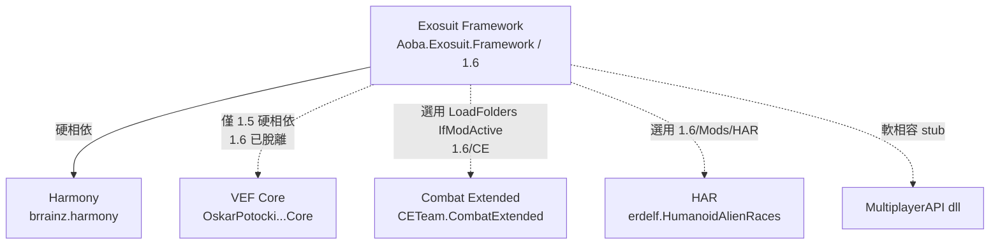
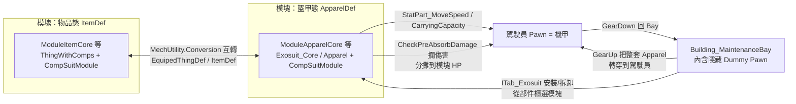

# Exosuit Framework — 架構總覽 (00_overview)

## 一句話定位
把「可駕駛機甲／動力外骨骼」實作成 **由駕駛員 Pawn 穿戴的一整套 Apparel 模塊**（核心模塊 `Exosuit_Core : Apparel` 當盔甲＋總血量主體，其餘模塊各佔一個 `SlotDef` 槽位），登機＝在維護坞（Maintenance Bay）把模塊從一隻隱藏 Dummy Pawn 轉穿到真實駕駛員身上；**框架本身不附任何具體機甲**，只提供 `Base*` 抽象範本與整備／維修建築鏈。

## 它「是」什麼（核心抉擇）
RimWorld 做機甲常見有四條路：① Apparel（穿在 Pawn 上）② 獨立 Pawn（如 Vehicle Framework 的 `VehiclePawn`）③ Building ④ 駕駛艙容器。**Exosuit Framework 選了 ①Apparel**：

- 機甲 = 駕駛員 Pawn 仍是那個 Pawn，只是身上多穿了一組特殊 Apparel（模塊）。移動、戰鬥、AI 全部沿用原版 Pawn 系統，靠 `StatPart` 改寫移速／負重，靠 render tree patch 把人畫成機甲。
- 「核心」`Exosuit_Core` 是其中一件 Apparel，**充當機甲的結構血量條（Structure Point）與護甲吸收層**（`CheckPreAbsorbDamage` 攔截傷害、把傷害分攤到各模塊 HP；歸零則 `ExosuitDestory` 變殘骸 `Building_Wreckage`）。
- 對比 Vehicle Framework（同群組已分析）：VF 機甲是**獨立 Pawn**、自帶尋路與座位；Exosuit 機甲**就是駕駛員本人**、無獨立尋路、不能多人同乘。兩者哲學相反。

## 相依鏈

> 1.6 框架本體**只硬依 Harmony**；VEF 在 1.6 的 `About.xml` 已從 `modDependenciesByVersion` 移除（仍保留 `loadAfter`）。CE/HAR 皆是 `LoadFolders` 的 `IfModActive` 條件載入。

## 原始碼 / 組件分佈
| 區塊 | 位置 | 職責 |
|---|---|---|
| 主組件 | `1.6/Assemblies/Exosuit.dll`（反編譯 11405 行）| 全部 C# 邏輯 |
| 核心 Def | `1.6/Defs/SlotDef.xml`、`ModuleApparelBase.xml`、`ModuleItemBase.xml`、`Dummy.xml`、`ApparelLayerDef.xml`、`PawnRenderNodeTagDef.xml` | 槽位定義 + 模塊抽象範本 + 渲染腳手架 |
| 建築鏈 | `1.6/Defs/BuildingDefs.xml` | 維護坞 / 部件櫃 / payload 櫃 / 腳手架 / 自動維修臂 / 停泊點 |
| Stat / 研究 / 配方 | `Stats.xml`、`StatCategoryDef.xml`、`ResearchProject.xml`（`WG_HeavyExoskeleton`）、`RecipeDef.xml` | 結構點 stat、移速覆寫掛點、研究前置 |
| 原版注入 | `1.6/Patches/` | PawnRenderTree（`PatchRenderNode.xml`）、`Stat_MoveSpeed`/`Stat_MassCarryCapacity` 掛 `StatPart`、回溯相容 |
| 相容層 | `1.6/CE/`、`1.6/Mods/HAR/` | CE 彈藥背包與 HAR 種族白名單（選用） |

## 核心機制總圖

### 兩種「形態」是同一模塊的雙身（關鍵概念）
每個模塊都有「物品態」（放在櫃子裡、可搬運修理，`ThingWithComps`）與「盔甲態」（穿在 Dummy/駕駛員身上，`Apparel`）。兩者透過 `CompProperties_ExosuitModule` 互指：
- `ItemDef`：盔甲態轉回物品態時 make 的 def。
- `EquipedThingDef`：（武器模塊用）轉成可裝備武器的 def。
- 互轉入口：`Exosuit.decompiled.cs::MechUtility.Conversion`（行 11022 起）；資料搬運 `MechData`（行 11075）保留品質/顏色/HP/彈藥。

### Dummy Pawn 是整備時的「展示與承載體」
維護坞 `Building_MaintenanceBay` 在內部 lazy-make 一隻 `Dummy`（`Human` 衍生、無頭無臉無基因，`Exosuit.decompiled.cs:8845` `Dummy` getter / `8863` MakeThing），玩家在 `ITab_Exosuit` 裡其實是替這隻 Dummy 穿脫模塊；`GearUp(pilot)` 才把整套 Apparel 從 Dummy 轉到真駕駛員。`Dummy.xml` 定義它的精簡 render tree。

## 入口與生命週期
1. `ExosuitMod : Mod`（`:3902`）建構時註冊 Harmony + 回溯相容轉換器。
2. 研究 `WG_HeavyExoskeleton` 解鎖維護坞與部件櫃。
3. 玩家造模塊（`RecipeDef`）→ 放部件櫃 → 在維護坞 `ITab_Exosuit` 組裝（先放一個 Core，再填各 Slot）→ 指派駕駛員（`CompAssignableToPawn_Parking`）→ 駕駛員 `GearUp` 登機。
4. 戰鬥中傷害經 `Exosuit_Core.CheckPreAbsorbDamage` 吸收、分攤模塊 HP；結構點歸零→爆炸＋殘骸。
5. 回維護坞 `GearDown` 下機，或在停泊點臨時下機（不可整備）。

## 延伸閱讀
- `architecture/01_module_apparel_and_boarding.md`：模塊/槽位/穿脫/Dummy/Bay 深入
- `details/extension_points.md`：純 XML vs 必須 C# 二分
- `tutorial/01_add_exosuit_xml.md`：純 XML 新增一台機甲
