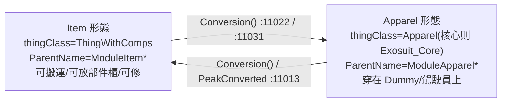

# 模組／插槽／穿脫／Dummy／維護坞 深入剖析 (01)

本檔深入框架最關鍵的子系統：**機甲＝一組 Apparel，插槽＝SlotDef，整備與登機全經由 Building_MaintenanceBay 與隱形 Dummy**。所有行號指 `projects/rimworld_mods/exosuit-framework/decompiled/Exosuit.decompiled.cs`，除非另註 XML 路徑。

---

## 1. 插槽系統 SlotDef

`SlotDef : Def`（`:3861`）欄位：

| 欄位 | 型別 | 意義 |
|---|---|---|
| `isCoreFrame` | bool | 此 SlotDef 是否為「核心框架」（只有 `Core` 為 true） |
| `isWeapon` | bool | 此插槽放的是否為武器模組 |
| `supportedSlots` | `List<SlotDef>` | （僅核心用）此核心支援哪些子插槽 |
| `uiPriority` | int | UI 排序；同一機甲內**不可重複**（`CompProperties_ExosuitModule.ConfigErrors` `:3615` 會擋重複 uiPriority） |

框架內建插槽（`Defs/SlotDef.xml`）：`Core`（`isCoreFrame=true`，`supportedSlots` 列出 Head/Attachment/ArmLeft/ArmRight/MountLeft/MountRight）＋ 6 個部位插槽。**插槽是純資料**：新增一個插槽只要再寫一個 `Exosuit.SlotDef`，並把它加進某核心的 `supportedSlots`。

---

## 2. 模組的「雙身」：Item 形態 ↔ Apparel 形態

每個模組都由**兩個 ThingDef** 構成，互相指向對方：

- 連結欄位都在 **`CompProperties_ExosuitModule`**（`:3598`，compClass = `CompSuitModule`）：
  - `ItemDef`：Apparel 態轉回物品時 make 的 def。
  - `EquipedThingDef`：item 態安裝後變成的 apparel def（武器模組則指向可裝備武器）。
  - `occupiedSlots`：`List<SlotDef>` 此模組占用的格子（**必填**，空會 ConfigError `:3617`）。
  - `disabledSlots`：（僅核心）禁用的格子。
  - `repairEfficiency`：作為物品被修理的效率（預設 0.01）。
- **兩個 Def 都要掛同一份 `CompProperties_ExosuitModule`**，且兩邊的 `EquipedThingDef`/`ItemDef` 互填。範例見 `Defs/FuelCellDefs.xml`：`MF_Module_FuelCell`(item) ↔ `MF_Apparel_FuelCell`(apparel)，兩邊 comp 完全鏡像。
- 互轉的資料保留靠 `MechData`（`:11075`）：搬運品質、顏色、HP、剩餘彈藥（`Init`/`GetDataFromMech`/`SetDataToMech`），所以「拆下來的模組」會記住它在機甲上掉了多少血。

### 抽象範本一覽（下游 mod 直接 `ParentName` 繼承）
- **Item 範本**（`Defs/ModuleItemBase.xml`）：`ModuleItemBase` →（按部位）`ModuleItemCore/Head/Attachment/MountRight/MountLeft/ArmLeft/ArmRight`。皆 `thingClass=ThingWithComps`、`category=Item`、`thingCategories=MF_Module`（吃 `WG_SmeltModule` 配方、可放部件櫃）。
- **Apparel 範本**（`Defs/ModuleApparelBase.xml`）：`ModuleApparelBase` →（按部位）`ModuleApparelCore/Head/Attachment/MountRight/MountLeft/ArmLeft/ArmRight`。
  - `ModuleApparelCore`（`:87`）特殊：`thingClass=Exosuit.Exosuit_Core`，自帶 `renderNodeProperties`（Mecha Root/Body/Head 節點）、`renderSkipFlags=Body`、layers `Shell`+`ExosuitLayer_Core`。**這是機甲外觀與血量的主體**。
  - 其餘部位範本只是預設了 `bodyPartGroups`、`layers`（`ExosuitLayer_Core/Utility/Attach`，定義在 `Defs/ApparelLayerDef.xml`）。
- 所有 Apparel 範本掛 `Exosuit.NoGenederApparelExt`（`:3995`）讓貼圖不分性別（透過 transpiler 強制走 RenderAsPack）。

---

## 3. 核心血量與承傷：Exosuit_Core

`Exosuit_Core : Apparel, IHealthParms`（`:10245`）：

- **結構點數（Structure Point）獨立血量**：`Health`/`HealthMax`（`:10284`/`:10296`），由「所有模組的 `CompSuitModule.HP/MaxHP` 加總」算出（`RefreshHP` `:10419`）。即機甲總血量 = Σ各模組 HP，**模組越多越耐打**。
- **承傷攔截** `CheckPreAbsorbDamage`（`:10345`）：先讓其它 Apparel 的 `CompShield` 有機會擋；再走 `GetPostArmorDamage`（`:10388`，用模組 ArmorRating stat 套甲）；扣 `Health`；低於 `ArmorBreakdownThreshold`（預設 0.25，可被 `ExosuitExt.minArmorBreakdownThreshold` 覆寫）時有機率裝甲擊穿。
- **傷害分攤** `OnHealthChanged`→`ApplyDamageToModules`（`:10435`/`:10450`）：把扣掉的血隨機分攤到 HP>1 的模組。
- **爆機** `ExosuitDestory`（`:10485`）：結構點歸零→`PreDestroy` 爆炸（`:10479`，5 格 Bomb）→生成 `Building_Wreckage`（可被 `ExosuitExt.wreckageOverride` 換）裝進駕駛員與部分掉落模組→脫掉全部機甲 Apparel→丟主武器。

---

## 4. 維護坞與 Dummy：整備與登機的總控

`Building_MaintenanceBay : Building`（`:8701`）是整個交互核心。

### Dummy（隱形承載體）
- `Dummy` ThingDef 是 `Human` 衍生但用精簡 render tree（`Defs/Dummy.xml`）。
- 維護坞 lazy-make 一隻 Dummy 作為 `cachePawn`（`:8863` `ThingMaker.MakeThing(ThingDefOf.Dummy)`）。
- `DummyApparels`（`:8897`）＝ Dummy 的 `Pawn_ApparelTracker`；`DummyModules`（`:8910`）＝Dummy 身上所有帶 `CompSuitModule` 的 Apparel。
- **玩家在 ITab 裡組裝的其實是這隻 Dummy**：安裝模組＝把 item 轉成 apparel 穿到 Dummy（`CompleteInstallModule` `:9889`）。
- 機甲停在格位上的畫面：`DynamicDrawPhaseAt`（`:9628`）借 Dummy 的 renderer 把它畫在維護坞位置（用 `ExosuitExt.bayRenderOffset/bayRenderScale` 微調）。
- `HasGearCore`（`:8841`）= `Core != null`；`Core`（`:8843`）是停放中的核心 ref。

### 登機 / 下機
- **GearUp(pilot)**（`:9556`）：把 `DummyModules` 整套從 Dummy 移到駕駛員（`pawn.apparel.Wear`）→`Core.ModuleRecache()`→清掉 Bay 的 Core ref→把 payload 櫃物品塞給駕駛員（`PlaceShelfItemToPilot`）→套用武器偏好（`ApplyWeaponPreferenceOnGearUp` `:10127`）。
- **GearDown(pilot)**（`:9578`）：`pawn.RemoveExosuit()`（`:10921`）把機甲 Apparel 脫下→穿回 Dummy→還原 Core ref→把駕駛員身上物品收回貨架。
- 登機 Job：`JobDriver_GetInWalkerCore`（`:4915`，含拖拽變體 `_Drafted :4890`），Toils＝走到 Bay→等待（時間受 `WorkTableWorkSpeedFactor` 影響）→`GearUp`。
- 下機 Job：`JobDriver_GetOffWalkerCore`（`:5025`）；全域便捷入口 `MechUtility.TryMakeJob_GearOn/Off`（`:11055`/`:11065`）。

### 登機資格門檻（純資料，定義在核心的 ExosuitExt）
`JobDriver_GetInWalkerCore.TryMakePreToilReservations`（`:4951`）讀 `Bay.Core.Extesnsion`（`ExosuitExt`）逐項檢查：
- `RequireAdult`（預設 true）→ 必須成年。
- `BodySize > BodySizeCap`（預設 1.25）→ 體型過大不能駕駛。
- `RequiredApparelTag` → 駕駛員須穿著帶該 apparel tag 的衣服（如駕駛服）。
- `RequiredHediff` → 駕駛員須帶該 Hediff（如神經連結植入物）。
- 無 `ExosuitExt` 時 fallback：BodySize≤1.25 且成年（`:4986`）。

### 模組整備工作鏈（WorkGiver/JobDriver）
維護坞透過 `pendingModuleWork`（`ModuleWorkRequest` `:8703`）排程；對應：
- `WorkGiver_ModuleAtGantry`（`:5695`）→`JobDriver_InstallModuleAtGantry`（`:5072`）／`JobDriver_RemoveModuleAtGantry`（`:5252`）
- `WorkGiver_RepairAtGantry`（`:5781`）→`JobDriver_RepairAtGantry`（`:5329`）；`WorkGiver_ModuleMaintenance`（`:5755`）修部件櫃上的模組（`JobDriver_RepairThing :5394`）
- 裝彈：`JobDriver_LoadAmmoAtGantry`（`:5165`）
- `Building_AutoRepairArm`（`:8430`）：通電後自動修對面 Bay 上的機甲，無需殖民者。

---

## 5. 模組可掛的功能 Comp（決定模組「能做什麼」）

| Comp | 位置 | 功能 | 純 XML 可用？ |
|---|---|---|---|
| `CompSuitModule` | `:3343` | **每個模組必掛**（由 `CompProperties_ExosuitModule` 自動帶）：HP/插槽/裝彈 | 是 |
| `CompFuelCell` | `:2786` | 燃料電池：吃燃料給移速/工速 buff Hediff | 是（見 FuelCellDefs.xml） |
| `CompModuleWeapon` | `:2548` | 武器模組：給駕駛員一把強制武器 | 是（填 `CompProperties_ModuleWeapon.weapon`） |
| `CompModuleStorage` | `:3307` | 部件櫃儲存邏輯 | 是（建築用） |
| `CompTurretGun`（`Mechsuit` ns） | `:108` | 肩砲/自動砲塔模組 | 是（純 CompProperties） |
| `CompLaunchExhaust` / `CompProjectileFleckEmitter` | `:3257` / `:3629` | 視覺特效 | 是 |
| `Comp_MeleeSweep` | `:7559` | 近戰橫掃攻擊 | 是 |

> 這些 Comp 全部走標準 `CompProperties` XML 配置，**新模組要加功能基本是「挑 Comp + 填欄位」**，不需寫碼。
