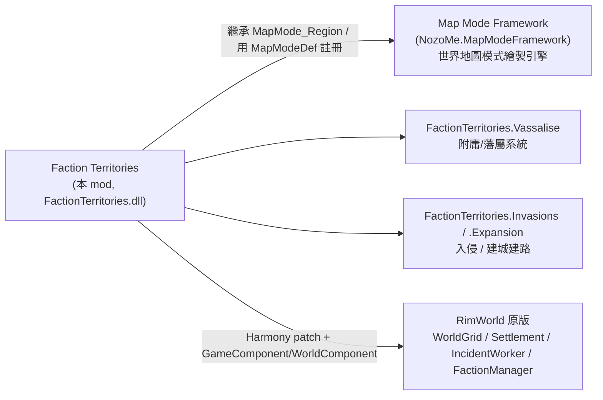

# Faction Territories and Vassalage 架構總覽（00_overview）

> 目標導向：analysis→create。核心釐清「純 XML 可做 vs 必須 C#」與擴充接點。

## 1. 一句話定位

`jaeger972.factionterritories`（workshop 3626725895）在世界地圖上**為每個派系的聚落周圍畫出確定性（deterministic）的領土區域**，並在領土框架上疊加一整套**附庸/藩屬（Vassalage）外交經營系統**：可把聚落附庸化、收編成藩屬前哨（vassal outpost）、割讓聚落給他派、發動入侵（Invasion）、興建聚落與道路（Expansion）、用領土歸屬過濾商隊途中事件。**重 C# mod**（單 DLL 16317 行），版本無分層（`Assemblies/`、`Defs/` 直接置頂）。

繪圖層**外包給依賴的 Map Mode Framework**（`NozoMe.MapModeFramework`）：本 mod 的領土模式 `MapMode_FactionTerritories : MapMode_Region`（`FactionTerritories.decompiled.cs:1967`）繼承框架的 region 地圖模式，`Defs/Regions.xml` 用框架的 `MapModeFramework.MapModeDef` 註冊。

## 2. 相依鏈

> Map Mode Framework 是使用者明確指示**不特別分析的依賴項**；本文僅標明它是繪圖引擎、本 mod 透過繼承 `MapMode_Region` 與 `MapModeDef` 接入。

## 3. 兩大命名空間 / 子系統分佈

| 命名空間 | 角色 | 關鍵型別（行號） |
|---|---|---|
| `FactionTerritories` | 領土計算＋繪製＋商隊事件過濾＋設定 | `MapMode_FactionTerritories:1967`、`TerritoryOwnershipCache:4384`、`FactionTerritoriesUtility:4936`、`CaravanTerritoryIncidents:1456`、`GameComponent_FactionTerritories:722`、`worldcomponent:6569` |
| `FactionTerritories.Vassalise` | 附庸化／藩屬前哨／藩屬點數／交易 | `VassaliseComponent:10242`、`VassaliseUtility:10628`、`FactionTerritories_VassalOutpost : WorldObject:11070`、`VassalagePointsComponent:8496`、`Dialog_Vassalage:8815` |
| `FactionTerritories.Invasions` | 入侵 WorldObject（`FT_BaseInvasion`） | `Invasions.Invasion`（`Defs/Invasions.xml`） |
| `FactionTerritories.Expansion` | 派系建新聚落／鋪路（`FT_SettlementConstruction`） | `Expansion.SettlementConstruction`、`StartOrReplaceProject:11913`、`NotifyRoadBuilt:7073` |

## 4. 領土計算機制（確定性 region 成長）

領土**不是固定半徑圓**，而是從聚落錨點出發、以「移動難度」為權重的成長式劃分（近似加權 Voronoi），可快取：

- 錨點判定：`IsValidTerritorySource` / `IsTerritoryAnchorWorldObject`（`:5380` / `:5414`）——哪些 WorldObject 會放射領土（聚落、藩屬前哨等）。
- 邊權重：`TileBaseMovementDifficulty:5808` ＋ `HillinessMovementDifficultyOffset:5788` ＋ `RoadMultiplier:5840`（**有路的格更易被併入領土** → 鋪路會擴張領土，故有 `NotifyRoadBuilt`）。
- 每格歸屬：`TerritoryOwnershipCache.TryGetClaimingFactions(tile, …):4537`；無爭議單一歸屬 `TryGetSingleFactionIfUncontested:4566`；爭議格用 `GetContestedVoronoiMaterial:6152` 畫混色。
- 確定性來源：`GetDeterministicSeed(settings):5232`——同種子→同領土，故稱 deterministic、可 `canCache=true`。
- 標籤層：`WorldLayer_MapMode_OnGUI_FactionTerritoriesLabels:6719` 在領土上印派系名。

## 5. 附庸 / 藩屬（Vassalage）機制摘要

- 入口：選中聚落的 gizmo（`Settlement_GetGizmos_Vassalise:7742`）開 `Dialog_Vassalise`／`Dialog_Vassalage`。
- 資源：`VassalagePointsComponent:8496`（藩屬點數，類似外交貨幣）。
- 三種動作（皆 C#）：`ExecuteVassalisationAtTile:10817`（附庸化）、`ExecuteCedeToFactionAtTile:10878`（割讓給他派）、`ExecuteCedeDestroyedSettlementToFaction:10986`（把被摧毀聚落轉交）。
- 產物：`FactionTerritories_VassalOutpost : WorldObject:11070`（藩屬前哨，亦為領土錨點）；攔截原版「基地被毀」信件改提供附庸選項（`InterceptBaseDestroyedLetterPatch:7982`）。

詳見 `details/extension_points.md`（純 XML vs C# 二分與接點）。
