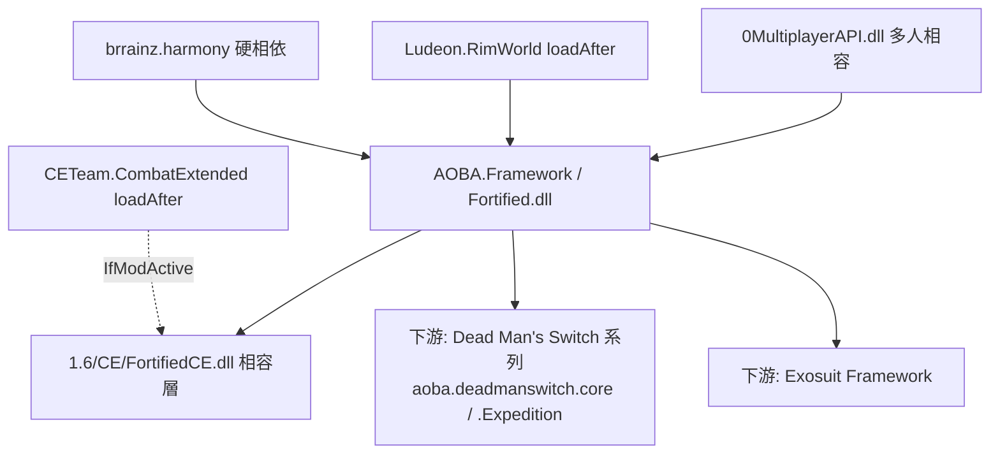

# Fortified Features Framework (AOBA.Framework) — 架構總覽

## 一句話定位

**Fortified Features Framework（FFF）是作者 AOBA 為自家「機兵 / 動力裝甲 / 防禦工事」系列 mod 打造的共用後端函式庫（utility / backbone library）**，把數十個常用但難以純 XML 實作的功能（機兵掛載武器、塗裝、無人機、空中支援、自動工作台、資料驅動的基地結構生成…）封裝成一包可重用的 `ThingComp` / `DefModExtension` / 自訂 `Def` / Harmony patch，供 DMS（Dead Man's Switch）、Exosuit 等下游 mod 依賴。它本身**幾乎不直接提供可玩內容**，而是「零件倉庫」。

> 名稱中的「Fortified / Features」是雙關：既指防禦工事（turret/trap/structure），也指「強化的功能集」。`description`（`About/About.xml`）原文：*"A unified and integrated set of commonly used features for rimworld mod."*——一組統一整合的常用功能。

## 相依鏈 (Dependency Chain)



- **硬相依**：僅 `brrainz.harmony`（`About/About.xml:11-17`）。
- **loadAfter**：`brrainz.harmony`、`Ludeon.RimWorld`、`CETeam.CombatExtended`（`About/About.xml:19-23`）。
- **CE 相容層**：`LoadFolders.xml` 在 `IfModActive="CETeam.CombatExtended..."` 時才載入 `1.6/CE`，內含 `FortifiedCE.dll`（`FortifiedCE.Building_TurretCapacityCE`、`CompExplosiveWithCompositeCE` 等 CE 版子類）。**本分析不深入 CE 層。**
- **多人相容**：`1.6/Assemblies/0MultiplayerAPI.dll` + 原始碼 `namespace Fortified.MultiplayerCompatibility`（可略）。
- **下游依賴證據**：FFF 內建 Defs 用 `MayRequire="aoba.deadmanswitch.core"`、`MayRequire="Aoba.DeadManSwitch.Expedition"` 軟參照下游 mod 的衣物/仿生（`1.6/Defs/HeavyEquippableDef/FFF_EquippableDef.xml:17-31`）。

## 工程特徵：去中心化、無單一進入點

FFF **沒有**單一 `Verse.Mod` 子類或 `ModSettings`。它由 **20+ 個各自獨立的 `[StaticConstructorOnStartup]`** 啟動類觸發 Harmony patch（共 **74 個 `[HarmonyPatch]`**），其中一個總開關位於 `Fortified.decompiled.cs:13027-13033`：

```csharp
[StaticConstructorOnStartup]
... new Harmony("Fortified").PatchAll();
```

另有一個可動態開關的子 Harmony 實例 `Fortified.CovertOps`（`FFF_CovertOpsPatchManager`，`Fortified.decompiled.cs:12937` 起）。設計上「每個子系統自帶啟動與 patch」，彼此低耦合——這也是 38k 行 DLL 卻能逐子系統獨立理解的原因。

## 子系統分類表

DLL 約 38,881 行、約 280+ 個型別，可歸納為以下子系統群。打星號者為**最具特色、最核心**者，深入見 `01_*.md`。

| # | 子系統群 | 代表型別（`Fortified.decompiled.cs` 行號） | 主要交付物型態 |
|---|---|---|---|
| 1★ | **資料驅動結構生成**（基地/聚落/世界物件佈局，含遊戲內匯出工具） | `FFF_StructureDef`(34112) `StructureLayoutDef`(36915) `SymbolDef`(37031) `FFF_Element_*`(34274+) `IFFF_GenerationTask`+`Task_*`(37769+) `GenStep_FFFStructure*`(36555/36617) `Dialog_ExportStructure`(35107) | 自訂 `Def` + 元素樹 + GenStep |
| 2★ | **機兵裝備平台**（掛載重武器、體型門檻、機兵可用武器過濾、武器更換 UI） | `HeavyEquippableDef`(17684) `HeavyEquippableExtension`(17696) `MechWeaponExtension`(12649) `StatWorker_HeavyGear`(30701) `StatWorker_MechWeapon`(30776) `IWeaponUsable`(12643) `HumanlikeMech`(7930) `ITab_Mech_Gear`(12035) | 自訂 `Def` + `DefModExtension` + StatWorker + Harmony |
| 3 | **塗裝 / 偽裝 / 外觀** | `CompPaintable`(10643) `FFF_PaintDef`(12898) `FFF_CamoDef`(12823) `FFF_OverlayDef`(12842) `FFF_FactionPaintDef`(10980) `CompCamouflage`(3234) `Dialog_PaintConfig`(28646) | 自訂 `Def` + Comp + 對話框（含著色器 `fortified_shaders`） |
| 4 | **空中支援**（轟炸/掃射/照明彈/呼叫支援） | `AirSupportDef`(15067) `AirSupportComp_*`(14141+) `AirSupportData_*`(14589+) `CompAirSupportSummoner`(15204) `WorldObjectComp_PeriodicAirSupport`(31880) | 自訂 `Def` + 可組合的 Comp/Data 樹 |
| 5 | **無人機 / 機兵平台 / 部署物** | `CompDrone`(6354) `CompMechPlatform`(6896) `CompMechApparel`(7825) `MinifiedThingDeployable`(25079) `Verb_Deploy`(7785) `Building_MechCapsule`(26228) | ThingComp + JobDriver/JobGiver |
| 6 | **武器 / 投射物 / Verb** | `CompMultipleTurretGun`(18419) `CompAmmoSwitch`(16074) `Projectile_ClusterBomb`(28204) `Projectile_Parabola`(27432) `Verb_MultiShoot`(31516) `Verb_MeleeSweep`(31341) `Verb_ArcSprayProjectile`(31136) | ThingComp + Projectile/Verb 子類 |
| 7 | **防禦工事 / 建築** | `Building_TurretCapacity`(24335) `Building_SpikeTrap`(24286) `Building_RollingDoor`(24255) `CompPerimeterScanner`(16954) `CompShieldingDevice`(23090) `CompBulletproofPlate`(19463) `PlaceWorker_*`(13471+) | Building/Comp 子類 + PlaceWorker |
| 8 | **自動化生產 / 容器 / 物流** | `Building_WorkTableAutonomous`(23451) `WorkGiver_DoAutonomousBill`(24120) `Bill_Production_Environmental`(17190) `Building_LogisticTerminal`(25464) `Building_ListedContainer`(24750) | Building + WorkGiver + DefModExtension |
| 9 | **任務 / 事件 / 派系**（偵察突襲、隱蔽行動、好感操作） | `IncidentWorker_FFF_ScoutedRaid`(20956) `QuestNode_FFF_*`(13739+) `FFF_FactionGoodwillManager`(4561) `RoyalTitlePermitWorker_*`(15921/32536+) `ScenPart_*`(19903+) | IncidentWorker/QuestNode/PermitWorker |
| 10 | **Hediff / 基因 / 能力 / 通用 Comp** | `CompAbilityEffect_*`(76+) `HediffComp_ProtectiveShield`(18045) `Gene_Wetware`(5218) `CompEffector`(1943) `CompIncidentMaker`(2695) `DamageWorker_CountByBodysize`(4243) | AbilityComp/HediffComp/通用 ThingComp |
| 11 | **XML 工具 / 基礎建設** | `PatchOperationAddCompIfNeeded`(12909) `FFF_DefOf`(4521) Multiplayer 相容(`Fortified.MultiplayerCompatibility`) | 自訂 PatchOperation + DefOf |

> 子系統間共通模式：**「自訂 `Def` 或 `DefModExtension` 攜帶資料 + ThingComp/Worker 執行邏輯 + Harmony patch 嵌入原版流程」**。

## 原始碼 / 組件分佈

| 位置 | 內容 |
|---|---|
| `1.6/Assemblies/Fortified.dll`（671 KB） | 主程式集，反編譯為 `projects/.../decompiled/Fortified.decompiled.cs`（38,881 行），namespace：`Fortified`、`Fortified.Structures`、`Fortified.MultiplayerCompatibility` |
| `1.6/CE/Assemblies/FortifiedCE.dll`（50 KB） | CE 相容子類（`FortifiedCE.*`），僅 CE 啟用時載入 |
| `1.6/Assemblies/0MultiplayerAPI.dll`（23 KB） | 第三方多人 API 殼，供相容層呼叫 |
| `1.6/Defs/*.xml`（~26 檔） | 框架自帶的少量 Def：StatDef(`FFF_*`)、DamageDef、JobDef、ThinkTree、HeavyEquippableDef 範本、Projectiles、ScenPartDef、WorldGenStepDef、`FFF_DevCategory` 設計分類等。**多為「給下游引用的零件/範本」而非成品內容** |
| `1.6/AssetBundles/fortified_shaders` | 自訂著色器（塗裝/偽裝/疊圖用） |
| `Languages/.../Keyed/*.xml`（12 檔） | 按子系統命名：`HeavyWeapon`、`Structure`、`Drone`、`Deployable`、`Modification`、`FFF_Painting`、`Autofacturer`、`MechCapsule`、`Broadcast`、`StealthDevice`、`EnvironmentalBill` — 反向印證子系統劃分 |
| `Textures/` | 共用貼圖 |

## 與同作者其他 mod 的關係

- **DMS（Dead Man's Switch，`aoba.deadmanswitch.core` / `Aoba.DeadManSwitch.Expedition`）**：FFF 是其後端。FFF 自帶的機兵裝備範本直接點名 DMS 的衣物/仿生（`HeavyEquippableDef/FFF_EquippableDef.xml`），且原始碼出現 31 處 `DeadManSwitch` 字串、`GameComponent_DMS`(`Fortified.decompiled.cs:4923`)、`FFF_IntelProcessor`(4614) 等 DMS 專用元件直接放在框架裡。
- **Exosuit Framework**：同為 AOBA 系列、同享機兵/動力裝甲主題；本工作區 `analysis/rimworld_mods/exosuit-framework/` 已建目錄但尚無內容，故無法交叉比對細節，僅能從主題判定為「同生態系、共用 FFF 後端」的姊妹框架。

詳見 `01_structure_generation.md`（子系統 #1 深入）與 `details/extension_points.md`（純 XML vs C# 二分）。
