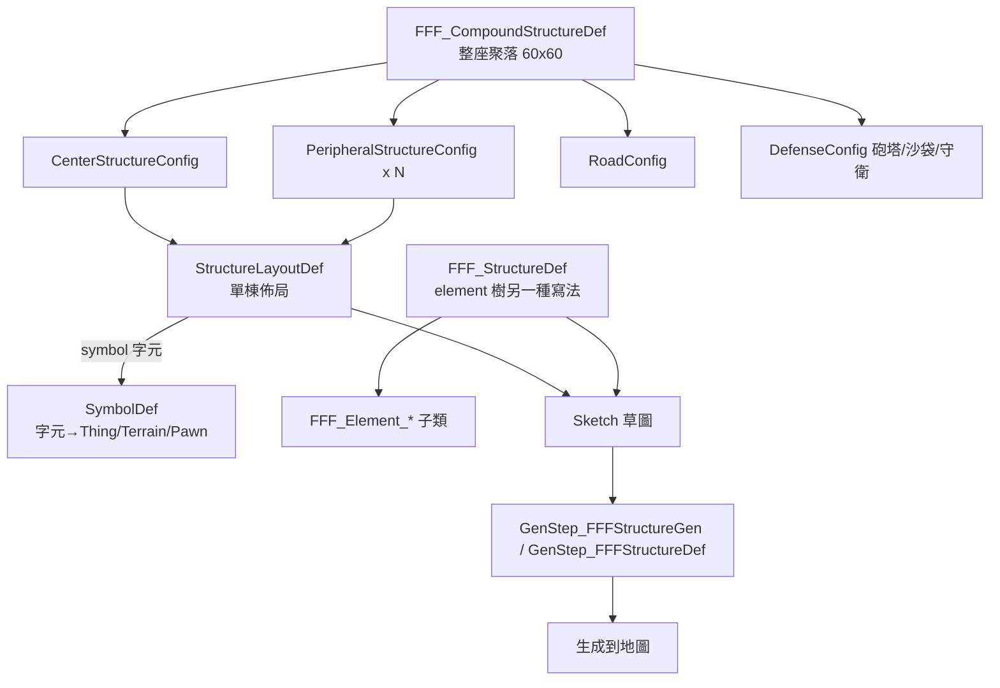

# 子系統深入：結構/聚落程序生成（Fortified.Structures）

選此子系統深入的原因：它是 FFF 中**最大、最資料驅動、最值得純 XML 擴充**的一塊（命名空間獨立為 `Fortified.Structures`，反編譯 33498 起），等同 AOBA 自製的 KCSG（Custom Structures Generation）替代品。其他子系統多是「掛一個 Comp 就好」，而本系統是一整套可用 XML 描述完整敵營/聚落佈局的 DSL。

## 三層 Def 模型

## 兩種「單棟」寫法（二選一，都實作 IFFF_Structure）

FFF 提供**兩條平行的 XML 路徑**描述一棟建物，最後都收斂成 `Verse.Sketch`：

### 路徑 A：`StructureLayoutDef`（ASCII 符號網格，KCSG 風格）
- 反編譯 `FFF_StructureDef`→實為 `StructureLayoutDef`（36915）。
- 欄位是多張平行字元網格：`layouts`（建物層）、`terrainGrid`、`foundationGrid`、`underGrid`、`tempGrid`、`roofGrid`、`terrainColorGrid`（皆 `List<string>`，每個 string 是一列，空白分隔的符號）。
- 每個符號字元由 **`SymbolDef`**（37031）解析：`thing` / `terrain` / `stuff` / `rotation` / `pawnKindDef` / `faction` / `defendSpawnPoint` / `thingSetMakerDef` / `fuelPercent` / `powerPercent` / `chanceToContainPawn` …
- 解析器：`LegacyParser.ParseToSketch(def, sketch, pawns, tasks)`（37184，由 `StructureLayoutDef.GetSketch()` 36975 呼叫並快取）。
- 結論：**只要寫 `SymbolDef` + `StructureLayoutDef` XML，就能用純文字畫出一棟含家具/地板/屋頂/守衛 pawn 的建物**，零 C#。

### 路徑 B：`FFF_StructureDef`（顯式 element 清單）
- `FFF_StructureDef`（34112）持有 `List<FFF_Element> elements`，每個 element 是一個帶座標的放置指令。
- `FFF_Element` 子類（34258 起，全部可在 XML 以 `<li Class="Fortified.FFF_Element_Thing">` 指定）：
  - 單點：`FFF_Element_Thing`（34274，`def/pos/rot/stuff/targetTemperature`）、`_Terrain`、`_TerrainColor`、`_Roof`、`_Pawn`（34673，提供 `IFFF_PawnProvider`）
  - 矩形：`_ThingRect`、`_TerrainRect`、`_RoofRect`、`_TerrainColorRect`
  - 散佈：`_ThingScatter`、`_TerrainScatter`、`_RoofScatter`、`_Scatter`、`_TerrainColorScatter`
  - 巢狀：`_SubStructure`（34707）、`_RandomSubStructure`（34835）、`_PawnGroup`（34987）
- 每個 element 透過 `AddToSketch(sketch)`（抽象方法 34264）寫進草圖；實作了 `IFFF_TaskProvider` 的 element 還能附帶生成後任務。

## 生成任務（IFFF_GenerationTask）

Sketch 只放靜態 thing/terrain；「放置後要做的事」抽象成 `IFFF_GenerationTask`（37769），子類皆可由 element/symbol 產生：
- `Task_FillContainer`（37775）、`Task_ManMortar`（37821，自動配置砲手）、`Task_SetThingState`（37888）、`Task_ApplyTerrainColor`、`Task_ApplyTerrainLayer`、`Task_ScatterFilth`、`Task_SpawnConduit`、`Task_ApplyRoof`、`Task_SetTempControl`、`Task_SpawnPawnGroupInRoom`（38255）。
- 每個 task 都有 `Transformed(rot, offset)`，支援旋轉/平移整棟結構。

## 整座聚落：`FFF_CompoundStructureDef`

- 反編譯 33982。把多棟 `StructureLayoutDef` 組成一個 60×60（`settlementSize`）的聚落：
  - `centerStructure`（`CenterStructureConfig`：中央主結構＋四周淨空）
  - `peripheralStructures`（`PeripheralStructureConfig` 清單：每種數量 `IntRange`、距中心距離、是否朝向中心、權重）
  - `roadConfig`（主幹道＋連接道路的地形與寬度）
  - `defenseConfig`（`DefenseConfig` 34090：邊緣防禦、沙袋、砲塔 `allowedTurrets` 每 N 格一座、迫擊砲、守衛 `PawnGroupKindDef`）
- 全部欄位皆 XML 可填，無需 C#。

## 觸發/落地（GenStep 與 World）

- `GenStep_FFFStructureDef`（36555）、`GenStep_FFFStructureGen`（36617）：在地圖生成階段把結構鋪到地圖（繼承 `GenStep`，掛在 `MapGeneratorDef`/`GenStepDef` 上，純 XML）。
- `WorldGenStep_FFFSpawnWorldObjects`（36821，對應 `Defs/WorldGenStepDef.xml`）：在世界生成時撒下世界物件。
- `FFF_SettlementDef`（37732）：可作為陣營聚落的佈局來源。
- `ScenPart_AddStartingStructure`（37575）、`SpawnAtWorldGen`（37720）：開局劇本與世界生成掛點。
- 匯出工具：`Dialog_ExportStructure`（35107）、`DebugActions_Export`（35040）、`FFF_ExportUtility`（35860）——可在遊戲內框選現有建物**反向匯出成 StructureLayoutDef XML**，這是作者自製內容的工作流核心。

## 擴充結論

做一座新敵營/聚落 = **純 XML**：寫 `SymbolDef`（字元字典）→ `StructureLayoutDef`（畫網格）→（選用）`FFF_CompoundStructureDef`（組裝多棟＋防禦）→ 掛 `GenStepDef`/`FFF_SettlementDef`。完全不需要 C#，且有遊戲內匯出工具加速。需要自訂「放置後行為」時才考慮新增 `IFFF_GenerationTask` 子類（C#）。
