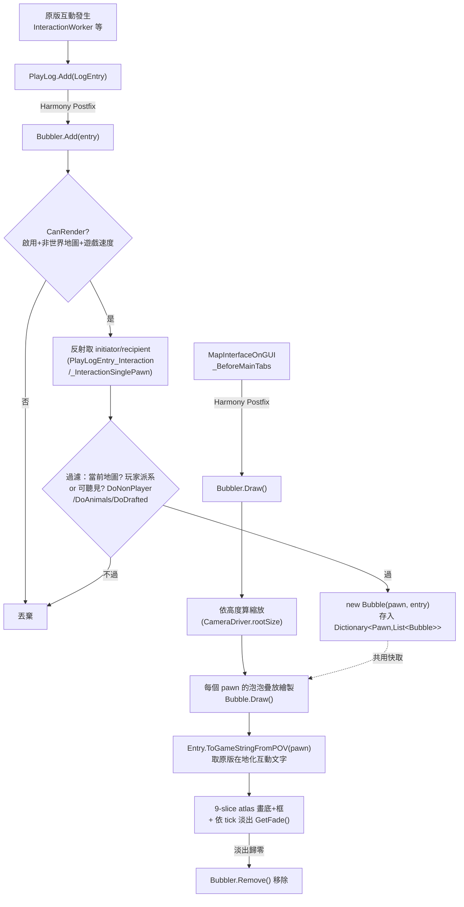

# Interaction Bubbles 架構總覽

- **packageId / workshop**：`Jaxe.Bubbles` / 1516158345（作者 © Jaxe，組件名 `Bubbles`，版本 4.2，.NET Framework 4.7.2）
- **本質**：把殖民地小人之間的「社交互動對話」即時以**漫畫對話泡泡**形式畫在小人頭上的純 UI mod。**零 Def、零 XML 資料層**（只有 3 張貼圖 `Bubbles/{Icon,Inner,Outer}`），全機制＝C# + 反射 + 4 個 Harmony patch，單一反編譯檔 1116 行。
- **與 SpeakUp 的關係**：兩者經**原版 `PlayLog` / `LogEntry` 解耦**——SpeakUp 負責「生成更豐富的互動文字並寫進 PlayLog」，Bubbles 只負責「把 PlayLog 裡的互動畫成泡泡」，彼此不知道對方存在。

## 兩個切入點（捕獲 + 繪製）

整個 mod 就是「在原版互動日誌新增條目時記下泡泡，在地圖 GUI 繪製階段畫出來」。靠四個 Harmony patch（`Bubbles.decompiled.cs:1048-1116` `Bubbles.Access` 命名空間）接上原版：

| Patch 目標 | 類型 | 作用 | 原始碼 |
|---|---|---|---|
| `Verse.PlayLog::Add(LogEntry)` | Postfix | **唯一資料捕獲點**：每筆新日誌 → `Bubbler.Add(entry)` | `:1100` |
| `RimWorld.MapInterface::MapInterfaceOnGUI_BeforeMainTabs` | Postfix | 每 GUI frame → `Bubbler.Draw()`；包 try/catch，繪製出錯即 `Settings.Activated=false` 自我停用（防刷屏） | `:1060` |
| `RimWorld.PlaySettings::DoPlaySettingsGlobalControls` | Postfix | 右下角播放設定列加開關 icon；shift+點擊開設定視窗 | `:1076` |
| `Verse.Profile.MemoryUtility::ClearAllMapsAndWorld` | Prefix | 載入/新遊戲前 `Bubbler.Clear()` 清空泡泡快取 | `:1108` |

## 資料流

## 實裝目錄結構（已對 Workshop 安裝核對）

> 安裝路徑：`…/steamapps/workshop/content/294100/1516158345/`。反編譯的 `Bubbles.decompiled.cs` 即主 `Assemblies/Bubbles.dll`（1.6 版，v4.2，29KB）。

- `About/About.xml`：唯一硬相依 `brrainz.harmony`（`loadAfter` 同），`supportedVersions` 1.3–1.6。
- `Assemblies/Bubbles.dll`（1.6 主）＋`Legacy/{1.3,1.4,1.5}/Assemblies/Bubbles.dll`（舊版各一），靠 `LoadFolders.xml` 按版本路由（`v1.x → [/, Legacy/1.x]`，1.6 只載根）。
- `Textures/Bubbles/{Icon,Inner,Outer}.png`：3 張貼圖（Inner/Outer 為 9-slice atlas）。
- `Languages/English/Keyed/Bubbles.xml`：**31 個 `Bubbles.*` 鍵**＝整個翻譯/純 XML 可動面（`Bubbles.Toggle`/`Bubbles.DoTextColors`/各設定標籤…）。其中 `Bubbles.OffsetDirections = "Down|Left|Up|Right"` 對應 `SettingsEditor` 用 `.Split('|')` 顯示方向名（`:1021`）。
- **無 `Defs/`、無 `Patches/`**——再次印證零 Def 資料層；純 XML 擴充面僅「換 3 張貼圖 + 覆蓋這 31 個 Keyed 鍵」。

## 核心型別（`Bubbles.Core`，`:255-761`）

- **`Bubble(Pawn, LogEntry)`**（`:257`）：單個泡泡。
  - 文字＝`Entry.ToGameStringFromPOV((Thing)pawn, false)`（`:444`）——**直接複用原版日誌的在地化字串**，`DoTextColors` 關閉時用 regex 去掉 `<color>` 標籤。
  - `Draw()`（`:367`）：依縮放算字級/維度/padding；`GetFade()`（`:452`）依 `TicksAbs - Entry.Tick - FadeStart` 線性淡出；hover 時更透明（`OpacityHover`）；shift+hover 反而拉回清晰。
  - `DrawAtlas()`（`:323`）：用 `Inner`/`Outer` 兩張貼圖做 **9-slice（四角不縮放、邊/中拉伸）** 圓角泡泡，底色用 `Inner`、框色用 `Outer`。
- **`Bubbler`（static，`:471`）**：泡泡管理器。
  - `Dictionary<Pawn, List<Bubble>>`（`:475`）為唯一狀態。
  - `Add()`（`:529`）：型別判斷雙路——`PlayLogEntry_Interaction`（雙方）或 `PlayLogEntry_InteractionSinglePawn`（單方），皆**用反射讀私有欄位** `initiator`/`recipient`（見 `Reflection`）；一連串設定過濾後入庫。
  - `CanRender()`（`:477`）：總開關 + 非世界地圖視圖 + `AutoHideSpeed`（遊戲速度超過設定值就隱藏）。
  - `CanBeHeard()`（`:504`）：實驗性「聽覺檢查」——非玩家派系小人要有在範圍內、聽力>0 的自由殖民者才顯示。
  - `Draw()`（`:638`）/`DrawBubble()`（`:660`）：選中小人優先、依 `Position.y` 排序；`PawnMax` 限制同一小人最多顯示幾個泡泡；霧區/離開地圖不畫。
- **`Compatibility`（static，`:725`）**：兩處版本/相容處理——
  - `BeginGroup`/`EndGroup` 在 `Widgets` 或 `GUI` 上以反射擇一（RimWorld 版本間 API 搬家）。
  - CameraPlus（`brrainz.cameraplus`）載入時，用 `CameraPlus.Tools:LerpRootSize` 修正高度→縮放。
- **`Textures`（`[StaticConstructorOnStartup]`，`:752`）**：`ContentFinder` 載入 3 張貼圖。

## 設定系統（`Bubbles` + `Bubbles.Configuration`）

- **`Setting<T> where T:struct`**（`:879`）＋抽象基底 `Setting`（`:871`）：每個設定一個泛型物件，自帶 `Scribe()`/`ToDefault()`。
- **`Settings : ModSettings`**（`:146`）：~25 個 `static readonly Setting<T>` 欄位（視覺調校：高度/縮放/字級/padding/寬度上限/淡出時機/偏移方向/透明度/四種顏色/三個過濾開關/聽覺檢查）。
  - `AllSettings`（`:208`）用**反射列舉自身所有 `Setting` 欄位**，`ExposeData()`（`:231`）逐一 Scribe；版本不符（非 `SameConfigVersions`）時設 `_resetRequired` 下次啟動強制重置。
- **`SettingsEditor` / `Listing_Settings`**（`:924` / `:764`）：滑桿 + 顏色 hex 輸入 + checkbox 的設定 UI；可在 mod 設定頁或 shift+點開關 的獨立視窗中呈現。

## 反射接點（`Bubbles.Access.Reflection`，`:1050`）

| 欄位 | 用途 |
|---|---|
| `PlayLogEntry_Interaction.initiator` / `.recipient` | 取雙方互動的發起者/接收者 |
| `PlayLogEntry_InteractionSinglePawn.initiator` | 取單方互動的發起者 |
| `CameraDriver.rootSize` | 取攝影機縮放 → 換算泡泡大小 |

> 全是原版**私有欄位**，靠 Harmony `AccessTools.Field` 反射讀取，因此跨版本只要欄位改名就會壞——是這個 mod 最脆弱的相依點。
