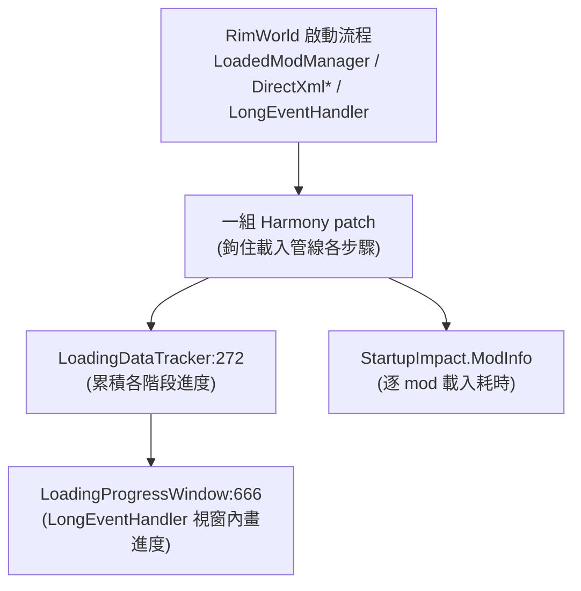

# Loading Progress 架構總覽（00_overview）

> 目標導向：analysis→create。核心釐清「純 XML 可做 vs 必須 C#」與擴充接點。

## 1. 一句話定位

`ilyvion.LoadingProgress`（workshop 3535481557，作者 ilyvion，MIT/Apache 雙授權、GitHub 開源 `ilyvion/loading-progress`）是一個**開發者體驗（UX/工具）型 mod**：用 Harmony 鉤住 RimWorld 的**啟動載入管線**，即時顯示「現在跑到哪個階段」的詳細進度視窗，並附帶一個**每個 mod 載入耗時的影響量測（StartupImpact）**子系統。對大型 modlist 的玩家特別有用。**無自訂 Def、無 Patches XML、單 DLL**（7056 行，含編譯器產物）。

## 2. 相依與組件

- 相依：僅 Harmony。
- 命名空間：`ilyvion.LoadingProgress`（主體）＋ `ilyvion.LoadingProgress.StartupImpact`（逐 mod 耗時量測）。

## 3. 它鉤住哪些啟動步驟（核心：對載入管線的 instrument）

| Harmony 目標（行號） | 對應載入階段 |
|---|---|
| `LoadedModManager.CombineIntoUnifiedXML:289` | 合併所有 mod 的 XML |
| `ModContentPack.ReloadContentInt:341` / `LoadPatches:352` | 載入 mod 內容 / PatchOperation |
| `XmlInheritance.TryRegister:366` / `ResolveXmlNodes:377` | XML 繼承（ParentName）解析 |
| `DirectXmlToObjectNew.DefFromNodeNew:417` | XML → Def 物件 |
| `DirectXmlCrossRefLoader.ResolveAllWantedCrossReferences:486`（含並行版） | 跨引用解析 |
| `LoadedLanguage.LoadMetadata:539` | 語言載入 |
| `DeepProfiler.Start:518` | 借原版剖析器標記 |
| `LongEventHandler.ExecuteToExecuteWhenFinished:1405` / `DrawLongEventWindowContents:2597` / `LongEventsOnGUI:2677` | 長事件佇列（進度視窗繪製時機） |
| `MainMenuDrawer.DrawInfoInCorner:1638` / `VersionControl.DrawInfoInCorner:2746` | 主選單角落顯示 |

進度階段以 `LoadingStage` enum（`:1364`）表示；視窗位置等少數選項在 `Settings:1730`（`LoadingWindowPlacement`）。

## 4. 結論

這是**對 RimWorld 啟動流程做 instrument 的純技術 mod**，沒有資料層、不提供可被 XML 擴充的內容。它的價值不在「被擴充」，而在作為**參考範例**：如何 Harmony 鉤住原版內部載入器、如何量測各 mod 載入耗時。詳見 `details/extension_points.md`。
