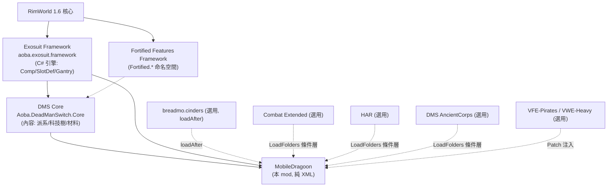

# MobileDragoon 架構總覽 (Level 1-2)

## 一句話定位
**The Dead Man's Switch - MobileDragoon**（`Aoba.DeadManSwitch.MobileDragoon`，作者 AobaKuma，Workshop 3377130226）是一個**純內容包（content pack）**：它**不含任何 .dll / Assemblies**，完全用 XML 在 **Exosuit Framework** 的 C# 引擎之上，定義出一台叫「Mobile Dragoon（移動龍騎兵）」的超重型機甲，包含 5 個機體框架（AT-34 / PV-4 / PV-8 / F/A-47 / PF-3）與數十個可換裝模塊（頭/核心/背包/肩/手）。

> 證實了核心結論：**「在 Exosuit Framework 上做一台全新機甲＝純 XML」**。所有行為（換裝、武器掛載、跳躍、護盾、APS 攔截）都由上游 framework 的 Comp / DefModExtension / Verb 驅動；本 mod 只是「填資料」。

## 相依鏈

- **硬相依**（About.xml:10-21）：`aoba.exosuit.framework` ＋ `Aoba.DeadManSwitch.Core`。
- **loadAfter**（About.xml:22-26）：上述兩者 ＋ `breadmo.cinders`。
- **隱性相依**：大量引用 `Fortified.*` 型別（HeavyEquippable / Projectile_Parabola / AfterBurner），來自 Fortified Features Framework（DMS 系列共用底座，DMS Core 應已帶入）。
- 支援版本 1.5 與 1.6（About.xml:5-8）；分析以 1.6 目錄為準。

## LoadFolders（條件式載入分層）
`LoadFolders.xml` 用 `IfModActive` 把不同相容層拆成獨立資料夾，**無 C# 也能做相容性開關**：

| 載入層 | 觸發條件 | 內容 |
|---|---|---|
| `/` ＋ `1.6` | 永遠 | 主體 Defs / Patches / Textures |
| `1.6/CE` | Combat Extended 啟用 | CE 彈藥、CE 武器 patch |
| `1.6/MOD/HAR` | HAR 啟用 | 種族外觀白名單 patch |
| `1.6/MOD/Cinders` | breadmo.cinders 啟用 | Cinder 兵種與 pawnGroup patch |
| `1.6/MOD/DMSAC` | DMS AncientCorps 啟用 | 額外左肩模塊 |

## Defs / Patches 檔案分佈

| 區 | 檔案 | 職責 |
|---|---|---|
| `Defs/Base_Defs/Base.xml` | 抽象 ParentName 樹（**最關鍵**） | 定義 `DMS_ModuleItemX` / `DMS_ModuleApparelX` 七種槽位的抽象基底，繼承上游 `ModuleItemBase` / `ModuleApparelBase` |
| `Defs/Base_Defs/ThingCategoryDef.xml` | 模塊分類樹 | 物品欄分類（`DMS_Module_Core/Helmet/Pack/...`） |
| `Defs/ThingDef_Frames/*.xml` | 5 個機體框架 | AT34 / FA47 / PF3 / PV4 / PV8 各自的 Core+Helmet 配對；Helmets.xml 為共用頭盔 |
| `Defs/ThingDef_Modules/*.xml` | 模塊群 | Pack（背包）、ShoulderLeft/Right（肩掛武器/護盾）、ArmsLeft/Right（手臂）、ModuleWeapon(_Melee)（手持龍騎武器） |
| `Defs/Pawnkinds.xml` (891 行) | 敵我兵種 | 飛行員、各派系龍騎兵 squad（DMS_Army / Pirate / Outlander） |
| `Defs/PlayerFaction.xml` / `ResearchProject.xml` / `Building.xml` / `Structure.xml` | 場景/科技/彈射建築 | 科技樹 4 節點、彈射艙等 |
| `Patches/PatchHeavyEquippable.xml` | 注入 | 把 5 個框架登記進 `Fortified.HeavyEquippableDef` 的可裝備清單 |
| `Patches/PatchHeavyWeapon.xml` / `VWEH.xml` | 條件注入 | 讓 VFE-Pirates Warcasket 武器、VWE-Heavy 重武器把 DMS 框架列入 `supportedArmors` |
| `Patches/VFEP.xml` | 條件注入 | VFE-Pirates 武器相容 ＋ 給海盜龍騎加 `WarcasketAll` weaponTag |
| `Patches/PatchPawnGroup.xml` | 注入 | 把龍騎兵 squad 塞進 Pirate / Outlander / DMS_Army 的 `pawnGroupMakers` |
| `CE/*` | 條件層 | CE 彈藥與框架/武器的 CE 數值 patch |

## 它引用了哪些上游型別（接點清單）

### 來自 Exosuit Framework（`Exosuit.*`）
| 型別 | 用途 | 出現位置 |
|---|---|---|
| `ParentName="ModuleItemBase"` | 物品形態模塊抽象基底 | Base.xml:5 |
| `ParentName="ModuleApparelBase"` / `ModuleApparelCore` | 穿戴形態模塊抽象基底 | Base.xml:101,131 |
| `Exosuit.CompProperties_ExosuitModule` | **核心 Comp**：把「物品⇄穿戴」雙向綁定，並宣告 `occupiedSlots` | 幾乎每個 ThingDef（Base.xml 之外全部模塊） |
| `EquipedThingDef` / `ItemDef` | Comp 內欄位：物品指向穿戴、穿戴指回物品 | AT34.xml:20,87 |
| `occupiedSlots` + `SlotDef`（Core/Head/MountLeft/MountRight/Attachment/...） | 槽位佔用宣告（SlotDef 是 framework 的 `Def`） | 全模塊 comps 內 |
| `Exosuit.ApparelRenderOffsets`（DefModExtension） | 穿戴時各方向貼圖位移/隱藏頭部 | AT34.xml:93-132 |
| `Exosuit.CompApparelForcedWeapon` | 框架專屬「強制武器」（手持龍騎武器） | ModuleWeapon.xml:47 |
| `Exosuit.CompProperties_LaunchExhaust` | 發射尾焰特效 | ModuleWeapon.xml:222 |
| `Exosuit.ModExtension_NoIdeoApparel` | 龍騎兵兵種忽略 ideo 服裝需求 | Pawnkinds.xml:70 |
| Apparel layer `WG_WalkerGearLayer*` / parentTag `WGApparelHead` | framework 自訂的穿戴層 | Base.xml:117,177,206,220 |

### 來自 Fortified Features Framework（`Fortified.*`）
| 型別 | 用途 | 出現位置 |
|---|---|---|
| `Fortified.HeavyEquippableExtension`（DefModExtension） | 標記重型武器需要的承載等級 | ModuleWeapon.xml:200 |
| `Fortified.HeavyEquippableDef`（被 Patch 注入） | 重武器⇄框架相容矩陣 | PatchHeavyEquippable.xml:4 |
| `Fortified.Projectile_Parabola` / `Fortified.CompProperties_AfterBurner` | 拋物線火箭 / 加力燃燒 | ModuleWeapon.xml:230,254 |
| `Fortified.DefaultTilteFactionExtension` | 兵種預設頭銜派系 | Pawnkinds.xml:57 |

### 來自 DMS Core（`DMS_*`，純 defName 引用）
- ParentName：`DMS_BaseTech`（科技基底）、`DMS_SoldierBase`（兵種基底）、`DMS_TableMachinePrinter`（製造台 recipeUser）。
- 材料：`Tungsteel`、`DMS_Ceramics`；科技 prereq `WG_HeavyExoskeleton`、`DMS_Prosthetic`；派系 `DMS_Army`。

> 詳細「純 XML vs 必須 C#」拆解見 `../details/extension_points.md`；複製成新機甲的步驟見 `../tutorial/01_clone_a_new_mecha_xml.md`。
