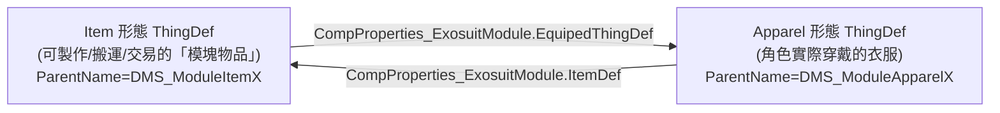

# MobileDragoon — 擴充接點：純 XML vs 必須 C#

本文件以 MobileDragoon 為範本，拆解「在 Exosuit Framework 上做新機甲」的接點，並標出**哪些純 XML 可做、哪些一旦想改行為就得回 C#（回上游 framework）**。

來源檔案以 `1.6/` 為準。所有 C# 型別位置標註於上游反編譯源
`projects/rimworld_mods/exosuit-framework/decompiled/Exosuit.decompiled.cs`。

---

## 1. 核心心智模型：模塊 = 一對 ThingDef（Item ⇄ Apparel）

Exosuit Framework 的機甲不是單一 ThingDef，而是把每個部件拆成**雙生 def**：

- **黏合劑**：`Exosuit.CompProperties_ExosuitModule`（`Exosuit.decompiled.cs:3598`）。
  - 欄位：`EquipedThingDef`（物品→衣服）、`ItemDef`（衣服→物品）、`occupiedSlots`（`List<SlotDef>`）、`disabledSlots`、`repairEfficiency`。
  - 物品 def 填 `EquipedThingDef`；衣服 def 填 `ItemDef`。兩者 `occupiedSlots` 必須一致。
- 範例：`ThingDef_Frames/PV8.xml:16-21`（物品態）對應 `:88-93`（衣服態）。
- **純 XML**：要做新模塊，只需新增這一對 def + 一個 `CompProperties_ExosuitModule`，**無需任何 C#**。

### 槽位 SlotDef
- `occupiedSlots` 內填 SlotDef 的 defName：`Core` / `Head` / `MountLeft` / `MountRight` / `Attachment` / `Equipment` / `Pack`（本 mod 用到的）。
- `Core` 是「核心框架」槽（`SlotDef.isCoreFrame`，見 `Exosuit.decompiled.cs:6686,9297`）；裝上 Core 衣服才算「穿上一台機甲」。
- **純 XML 可用既有 SlotDef**；**新增一個全新槽位種類** 需要在某個 mod 定義 `SlotDef`（仍是 XML Def，但通常屬於 framework / Core 層；本 mod 直接複用既有槽位）。

---

## 2. 抽象 ParentName 樹（本 mod 自建的「模板層」）

`Defs/Base_Defs/Base.xml` 把上游兩個基底 def 再包一層 DMS 風味，**所有實體模塊都繼承這層**：

| 本 mod 抽象 def | ParentName（上游） | 形態 | 對應槽位/分類 |
|---|---|---|---|
| `DMS_ModuleItemBase` | `ModuleItemBase` | 物品 | （含製作配方 recipeMaker、上色 colorGenerator） |
| `DMS_ModuleItemCore/Head/Attachment/MountLeft/MountRight/ArmLeft/ArmRight` | `DMS_ModuleItemBase` | 物品 | 各自 thingCategory + 物品貼圖 |
| `DMS_ModuleApparelBase` | `ModuleApparelBase` | 衣服 | 加 `CompProperties_Styleable`（可上色）|
| `DMS_ModuleApparelCore` | `ModuleApparelCore` | 衣服 | 機甲本體：護甲、近戰拳/腿 tools、`DMS_DragoonArmour` tag |
| `DMS_ModuleApparelHead` | `ModuleApparelHead` | 衣服 | 頭盔層 `WG_WalkerGearLayer_Core` |
| `DMS_ModuleApparelAttachment/MountLeft/MountRight/ArmLeft/ArmRight` | `DMS_ModuleApparelBase` | 衣服 | bodyPartGroups + `WG_WalkerGearLayer*` |

- **純 XML**：新機甲只要 `ParentName="DMS_ModuleApparelCore"` / `DMS_ModuleItemCore` 即可繼承全部行為與外觀層設定。
- 重點：`ModuleItemBase`/`ModuleApparelBase`/`ModuleApparelCore`/`ModuleApparelHead` 這些**上游母 def 本身不在本 mod**，由 Exosuit Framework / DMS Core 提供（本 mod Defs 內找不到它們的定義）。

---

## 3. 各擴充項目：純 XML / 須 C# 對照表

| 想做的事 | 接點 | 純 XML？ | 說明 |
|---|---|---|---|
| 新增一台機甲框架（Core+Helmet） | 一對 `DMS_ModuleApparelCore`/`...ItemCore` + `CompProperties_ExosuitModule` | ✅ 純 XML | 見 `PV8.xml` 全檔即一個完整範例 |
| 新增肩/手/背包模塊 | `ParentName=DMS_Module{Item,Apparel}{MountLeft,...}` 一對 | ✅ 純 XML | 見 `Modules_ShoulderLeft.xml` |
| 模塊帶主動技能（發射煙幕/飛彈） | 衣服 def 加 `<verbs>` + `CompProperties_ApparelReloadable`（原版 Comp） | ✅ 純 XML | `Modules_ShoulderLeft.xml:167-210`（煙幕）、`:280-324`（飛彈） |
| 內建手持武器（龍騎槍） | `ParentName=BaseGun` + `Exosuit.CompApparelForcedWeapon` | ✅ 純 XML | `ModuleWeapon.xml:45-49` |
| 新投射物（拋物線火箭/加力尾焰） | `BaseBullet` + `Fortified.Projectile_Parabola` + `CompProperties_AfterBurner` | ✅ 純 XML | `ModuleWeapon.xml:228-276` |
| 機甲護甲/移速/負重數值 | `statBases` / `equippedStatOffsets` | ✅ 純 XML | `PV8.xml:62-77` |
| 巨大化貼圖對位（頭/裝備偏移） | `Exosuit.ApparelRenderOffsets`（DefModExtension） | ✅ 純 XML | `PV8.xml:95-134` |
| 研究樹節點 | `ResearchProjectDef ParentName=DMS_BaseTech` | ✅ 純 XML | `ResearchProject.xml` |
| 製作配方 | `recipeMaker` + `recipeUsers=DMS_TableMachinePrinter` | ✅ 純 XML | `Base.xml:6-15` |
| 敵我兵種穿整套機甲 | PawnKindDef + `Exosuit.ModExtForceApparelGen` | ✅ 純 XML | `Pawnkinds.xml:118-150` |
| 兵種免 ideo 服裝/不可剝除 | `Exosuit.ModExtension_NoIdeoApparel` / `canStrip=false` | ✅ 純 XML | `Pawnkinds.xml:68,70` |
| 把兵種塞進既有派系生成 | `PatchOperationAdd` 到 `pawnGroupMakers` | ✅ 純 XML（Patch） | `PatchPawnGroup.xml` |
| 與其他 mod 聯動（VFEP/CE/HAR） | `PatchOperationFindMod` + `LoadFolders` IfModActive | ✅ 純 XML | `VFEP.xml`、`LoadFolders.xml` |
| 彈射塢建築 | `thingClass=Exosuit.Building_EjectorBay` + JobDef `driverClass=Exosuit.JobDriver_GetInEjector` | ✅ 純 XML（**復用既有 class**） | `Building.xml:8,83` |
| **改裝面板能改上色**（TODO 機制項） | 需要 framework 的 styling UI 支援該功能 | ⚠️ 視情況 | 若 framework 已有 `CompProperties_Styleable` + styling station 流程即純 XML；若要新交互行為則**須回 framework C#** |
| **新的槽位種類 / 新的換裝規則** | 新 `SlotDef` + framework 的 `CompSuitModule` 邏輯 | ⚠️ 半 | 新 SlotDef 是 XML，但若要新「槽位互斥/相依行為」須改 framework C#（`CompSuitModule`，`Exosuit.decompiled.cs:9297` 一帶） |
| **全新的機甲機制**（如自訂能量系統、過熱、踩踏 AOE） | 新 ThingComp / Verb / Hediff C# | ❌ 必須 C# | 本 mod 完全沒做這類事——這正是它能「零 DLL」的原因 |

---

## 4. 結論：邊界在哪裡

- **純 XML 的天花板**＝「組合 framework 已提供的 Comp / DefModExtension / Verb / Building class」。MobileDragoon 整包都落在這條線以下，所以**零 DLL**。
- **越線（必須回 C#，且通常是改 Exosuit Framework 而非本 mod）的徵兆**：
  1. 需要一個 framework 沒提供的 `ThingComp` / `Verb_*` / `Hediff` / `JobDriver`。
  2. 需要改變「換裝/槽位佔用」的判定邏輯（`CompSuitModule`）。
  3. 需要新的 UI 交互（改裝面板的新功能）。
- 對「Create 模式」的啟示：**做一台你自己的新機甲，預設都應在純 XML 範圍內完成**；只有當你想引入 framework 沒有的全新機制時，才需要 fork / 擴充 Exosuit Framework 的 C#。
