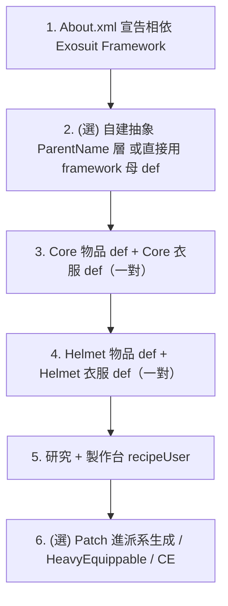

# 教學：以 MobileDragoon 為藍本，純 XML 複製出一台你自己的新機甲

目標：在 Exosuit Framework 上，**完全不寫 C#**，做出一台最小可玩的新機甲框架「MYMECHA」。
參照範本：MobileDragoon 的 `1.6/Defs/ThingDef_Frames/PV8.xml`（一台框架的完整最小集合）。

> 前置：你的 mod 必須在 `About.xml` 把 `aoba.exosuit.framework` 與 `Aoba.DeadManSwitch.Core`（或你自己的等價內容母 def）列為 `modDependencies`，並 `loadAfter` 之。

---

## 步驟總覽（最小機甲 = 一對 Core + 一對 Helmet）



---

## 步驟 1：相依宣告（About.xml）
```xml
<modDependencies>
  <li><packageId>aoba.exosuit.framework</packageId></li>
</modDependencies>
<loadAfter>
  <li>aoba.exosuit.framework</li>
</loadAfter>
```

## 步驟 2：抽象基底（可省略，直接用上游母 def）
最簡單做法：你的實體 def 直接 `ParentName="ModuleApparelCore"` / `ParentName="ModuleApparelHead"` /
`ParentName="ModuleItemBase"`（這些由 framework / Core 提供）。
若想統一風味（配方、上色、貼圖路徑），可仿 `Base.xml:5-58` 自建一層 `MY_ModuleItemCore` 等抽象 def。本教學直接用上游母 def 以求最少檔案。

## 步驟 3：Core（核心框架）—— 一對 def
**這是「一台機甲」的本體。** 完整對照 `PV8.xml:4-135`。

```xml
<!-- 物品形態：玩家製作/搬運的「核心模塊」 -->
<ThingDef ParentName="ModuleItemBase">
  <defName>MYMECHA_Module_Core</defName>
  <label>MYMECHA frame module</label>
  <description>...</description>
  <statBases>
    <MaxHitPoints>259</MaxHitPoints>
    <Mass>80</Mass>
  </statBases>
  <comps>
    <li Class="Exosuit.CompProperties_ExosuitModule">
      <EquipedThingDef>MYMECHA_Apparel_Core</EquipedThingDef>   <!-- 指向衣服態 -->
      <occupiedSlots><li>Core</li></occupiedSlots>
    </li>
  </comps>
  <recipeMaker>
    <researchPrerequisite>MYMECHA_Research</researchPrerequisite>
    <recipeUsers><li>DMS_TableMachinePrinter</li></recipeUsers>
    <workAmount>80000</workAmount>
  </recipeMaker>
  <costList>
    <Tungsteel>375</Tungsteel>
    <Steel>125</Steel>
    <ComponentIndustrial>10</ComponentIndustrial>
  </costList>
</ThingDef>

<!-- 衣服形態：角色實際穿上、決定機甲屬性與外觀 -->
<ThingDef ParentName="ModuleApparelCore">
  <defName>MYMECHA_Apparel_Core</defName>
  <label>MYMECHA frame</label>
  <description>...</description>
  <graphicData><texPath>Things/MyMecha/Core/apparel_south</texPath></graphicData>
  <statBases>
    <Mass>80</Mass>
    <MoveSpeed>6.2</MoveSpeed>
    <ArmorRating_Sharp>1.20</ArmorRating_Sharp>
    <ArmorRating_Blunt>0.90</ArmorRating_Blunt>
  </statBases>
  <equippedStatOffsets>
    <CarryingCapacity>320</CarryingCapacity>
    <WorkSpeedGlobal>-0.35</WorkSpeedGlobal>
  </equippedStatOffsets>
  <apparel>
    <wornGraphicPath>Things/MyMecha/Core/apparel</wornGraphicPath>
    <drawData><scale>1.5</scale></drawData>   <!-- 機甲巨大化 -->
  </apparel>
  <comps>
    <li Class="Exosuit.CompProperties_ExosuitModule">
      <ItemDef>MYMECHA_Module_Core</ItemDef>   <!-- 指回物品態 -->
      <occupiedSlots><li>Core</li></occupiedSlots>
    </li>
  </comps>
  <modExtensions>
    <li Class="Exosuit.ApparelRenderOffsets">    <!-- 巨大貼圖的對位/隱頭 -->
      <headHideFor><li>0</li></headHideFor>
      <rootData><defaultData><offset>(0,0,0.26)</offset></defaultData></rootData>
    </li>
  </modExtensions>
</ThingDef>
```

**配對紀律（最常見的錯）**：
- 物品 def 的 `EquipedThingDef` 必須等於衣服 def 的 `defName`；
- 衣服 def 的 `ItemDef` 必須等於物品 def 的 `defName`；
- 兩邊 `occupiedSlots` 必須一致（這裡都是 `Core`）。

## 步驟 4：Helmet（頭盔）—— 一對 def
照搬 `PV8.xml:136-216`，把 ParentName 換成 `ModuleItemBase` / `ModuleApparelHead`，
`occupiedSlots` 換成 `Head`，`EquipedThingDef`/`ItemDef` 指向 `MYMECHA_Apparel_Helmet` / `MYMECHA_Module_Helmet`。

## 步驟 5：研究 + 製作台
```xml
<ResearchProjectDef ParentName="DMS_BaseTech">
  <defName>MYMECHA_Research</defName>
  <label>my mecha</label>
  <baseCost>2000</baseCost>
  <prerequisites><li>WG_HeavyExoskeleton</li></prerequisites>
</ResearchProjectDef>
```
製作台直接複用 DMS Core 的 `DMS_TableMachinePrinter`（步驟 3 的 `recipeUsers` 已指定）。

## 步驟 6（選用）：加掛件、敵人、相容
- **新增肩/背包模塊**：複製 `Modules_ShoulderLeft.xml` 的任一對 def，改 `occupiedSlots`（`MountLeft` 等）即可掛上你的 Core。
- **讓敵人穿你的機甲**：在 PawnKindDef 加 `Exosuit.ModExtForceApparelGen`，`apparels` 填 `MYMECHA_Apparel_Core` 等（仿 `Pawnkinds.xml:118-150`）。
- **塞進派系生成**：`PatchOperationAdd` 到目標 FactionDef 的 `pawnGroupMakers`（仿 `PatchPawnGroup.xml`）。
- **讓機甲能持重武器**：`PatchOperationAdd` 把 `MYMECHA_Apparel_Core` 加進 `Fortified.HeavyEquippableDef/.../EquippableWithApparel`（仿 `PatchHeavyEquippable.xml`）。
- **CE / HAR 相容**：用 `LoadFolders.xml` 的 `IfModActive` 條件資料夾放對應 patch（仿本 mod `1.6/CE`、`1.6/MOD/HAR`）。

---

## 完成定義（最小可玩）
1. 研究完成後可在 `DMS_TableMachinePrinter` 製作 `MYMECHA_Module_Core` 與 `MYMECHA_Module_Helmet`。
2. 殖民者裝備後變成穿戴 `MYMECHA_Apparel_Core` 的「機甲」，套用護甲/移速/負重。
3. **整包不需任何 .dll**——你只是在 framework 的型別上填了資料。

> 何時會被迫寫 C#：見 `../details/extension_points.md` §3-4。簡言之，只要你想要的機制 framework 還沒提供（新 Comp/Verb/槽位邏輯/改裝面板新功能），才需要回 Exosuit Framework 的 C# 層。
