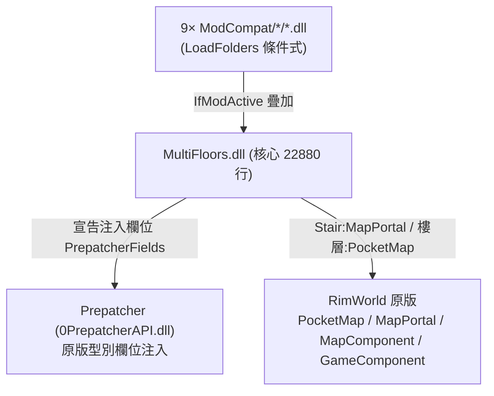

# MultiFloors 架構總覽（00_overview）

> 目標導向：analysis→create。核心釐清「純 XML 可做 vs 必須 C#」與擴充接點。

## 1. 一句話定位

`telardo.MultiFloors`（workshop 3384660931）為 RimWorld 地圖加上**垂直樓層（Z-levels）**：每個樓層（地上層／地下室）都是一張 **PocketMap**，殖民者經**樓梯（Stair）／電梯（Elevator）**上下移動，並可跨層傳輸物品、電力、配方。技術型大 mod（核心 `MultiFloors.dll` 22880 行），**依賴 Prepatcher**（`0PrepatcherAPI.dll`，用欄位注入加速）＋9 個 gated `ModCompat` 子 DLL。

關鍵實作選擇：**樓層復用原版 PocketMap／MapPortal 機制**（同 SimplePortal、RV-with-PD 那條傳送門家族）——`Stair : MapPortal`（`MultiFloors.decompiled.cs:2408`），上下層各是 `MF_PocketMapComp` 衍生的口袋地圖。

## 2. 相依鏈與三層 DLL

9 個相容子模組（皆 `1.6/ModCompat/<mod>/Assemblies/`，經 LoadFolders 條件載入）：ProjectRimFactory、Vehicle（載具框架）、DubsCentralHeating、DubsBadHygiene、VEF、Rimefeller、ResearchReinvented、Hospitality、SmarterConstruction——各自處理「該 mod 的系統如何跨樓層運作」。**與 Empire/Ariandel 同屬「核心＋gated 相容子模組」模式。**

## 3. 核心子系統

| 子系統 | 關鍵型別（行號） | 角色 |
|---|---|---|
| 樓層地圖 | `MF_PocketMapComp:4817`、`MF_UpperLevelMapComp:4825`、`MF_BasementMapComp:4424`、`MF_LevelMapComp:4443` | 每層＝PocketMap；`MF_LevelMapComp` 管一張母圖的層堆疊 |
| 全域管理 | `MultiFloorManager : GameComponent:4876`、`LevelSetting:4236`、`Pawn_LevelSettings:5551` | 跨地圖樓層登記、玩家層級偏好 |
| 垂直通行 | `Stair : MapPortal:2408`（`StairEntrance:2760`/`StairExit:2927`）、`Elevator : Stair:481`（`Wooden:1412`/`Modern:1225`/`Freight:1162`）、`ElevatorNet:941` | 樓梯／電梯＝原版 MapPortal 傳送 |
| 跨層傳輸 | `TransferPolicy:3286`、`AutoTransferWorker:1543`、`ITab_ThingsToTransfer:2328`、`ITab_PowerTransmission:1714`、`ITab_BillGiverLinkSetting:3798` | 物品自動運送、跨層輸電、配方台連動 |
| 欄位注入 | `PrepatcherFields:5704` | 用 Prepatcher 在原版型別上掛新欄位（免每次字典查找） |
| 資料設定 | `UpperLevelSettingsDef : Def:3379`、`TutorDef : Def:5862`、`StairsModExtension : DefModExtension:3206` | 見擴充接點 |

## 4. 上層地圖如何生成（資料驅動部分）

`UpperLevelSettingsDef`（`Defs/MultiFloors.UpperLevelSettingsDef/UpperLevelSetting.xml`）把**每個 PlanetLayerDef → 一組地形＋MapGenerator**對應起來，用 `MayRequire` gate 不同星球層 mod：

- `layers`：Surface／`Orbit`(Odyssey)／`Orbit2`(DeepOrbit)／`Avatar_SkyIslandsLayer`(SkyIslands)…
- 每層 `settings`：`mapGenerator`（如 `MF_SurfaceUpperLevel`）、`defaultTerrain`（地基地形）、`deckTerrain`、`voidTerrain`（樓層外的虛空）。

→ 這是本 mod **最主要的純 XML 擴充點**：要支援新的星球層 mod，加一組 `layers`+`settings` 配對即可（地形與 MapGeneratorDef 也是 XML）。

詳見 `details/extension_points.md`。
