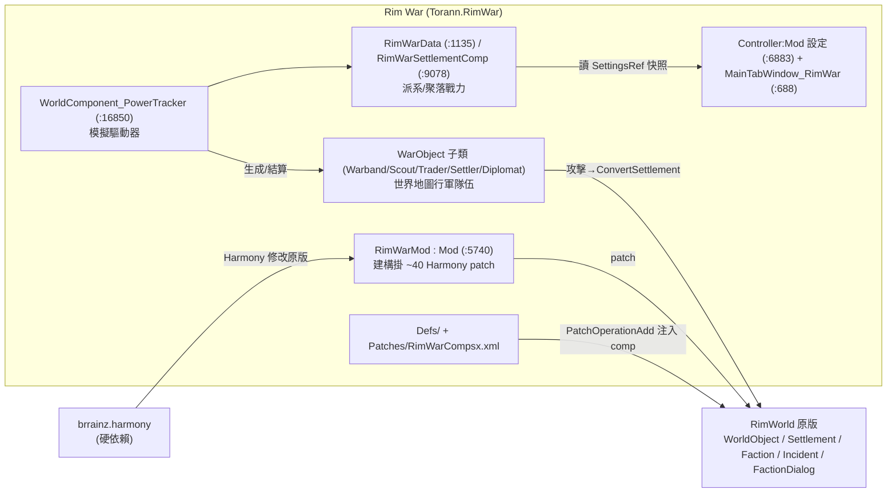
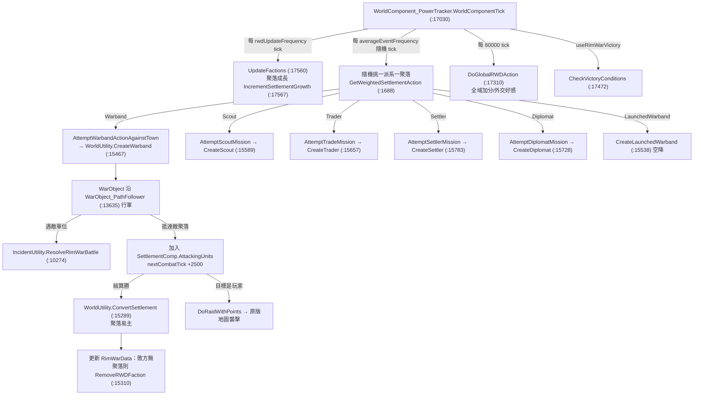

# Rim War 架構總覽（00_overview）

> 目標導向：在此基礎上做 **create（擴充/衍生）**。本文釐清「是什麼／相依鏈／組件分佈／世界模擬總圖」。所有行號指 `projects/rimworld_mods/rim-war/decompiled/RimWar.decompiled.cs`。

## 1. 一句話定位

Rim War 是一個**世界地圖層的派系大戰略（grand-strategy）模擬層**：它在地圖上為每個 vanilla 派系建立一份戰力資料（`RimWarData`），由**單一 `WorldComponent_PowerTracker` 每 tick 驅動**，依各派系的「行為傾向（behavior）＋戰力 points」週期性產生可見的世界物件（戰團 Warband／斥候 Scout／商隊 Trader／殖民隊 Settler／外交官 Diplomat），讓它們行軍、交戰、佔領聚落，並把原版的襲擊/商隊/事件改由這套 AI 決策生成。**玩家殖民地是其中一個派系節點**，會被捲入；新增「擊敗指定對手派系」的勝利條件。

關鍵佐證：
- 唯一驅動器：`WorldComponent_PowerTracker.WorldComponentTick`（`:17030`）排程所有動作。
- 派系實力＝聚落＋單位＋世界物件 points 總和：`RimWarData.TotalFactionPoints`（`:1510`）。
- 聚落易主：`WorldUtility.ConvertSettlement`（`:15289`）— 摧毀原聚落、用新派系重建。
- 行為傾向資料化於 `RimWarDef.xml`（每派系 → behavior + 三係數）。

## 2. 相依鏈

要點：
- v1.6 **不再依賴 HugsLib**（DLL 全檔無 HugsLib 引用；設定改用 vanilla `Mod`/`ModSettings`，圖表用 vanilla `HistoryAutoRecorderWorker`）。About 的 HugsLib 僅殘留在 1.2–1.5 區塊。
- 與原版解耦方式有二：(a) `Patches/RimWarCompsx.xml` 用 `PatchOperationAdd` 把 `RimWarSettlementComp` **掛到所有 Settlement WorldObjectDef**（不需改原版 class）；(b) `RimWarMod` ctor 用 Harmony 攔截原版交涉/襲擊/防禦/商隊路徑等 ~40 個方法。

## 3. 組件分佈表

| 區塊 | 位置 | 角色 | XML/C# |
|---|---|---|---|
| 模擬驅動 | `WorldComponent_PowerTracker`（`:16850`） | 每 tick 排程派系決策、戰鬥結算、勝利檢查 | C#（硬編） |
| 派系戰力資料 | `RimWarData`（`:1135`） | 每派系一份；behavior + 6 種 action 機率 + 三係數 + 戰力 getter | C# 結構，behavior/係數**由 XML 餵入** |
| 聚落戰力 | `RimWarSettlementComp`（`:9078`） | `RimWarPoints`/`PointDamage`/`isCapitol`/`PlayerHeat`；掛在每個 Settlement | C#，靠 XML patch 掛載 |
| 行軍隊伍 | `WarObject` 子類（`:11658`–`:13236`） | 地圖上可見的移動單位，含交戰邏輯 | C# class ↔ `RW_WorldObjects.xml` 的 `worldObjectClass` |
| 生成/戰鬥函式庫 | `WorldUtility`（`:15095`）、`IncidentUtility`（`:10233`） | Create*/Calculate*/Convert/ResolveBattle | C#（硬編公式） |
| 行為資料 | `Defs/RimWarDefs/RimWarDef.xml` | 派系→behavior + movement/combat/growth bonus | **純 XML（可調）** |
| comp 掛載 | `Patches/RimWarCompsx.xml` | 把 RimWar comp 加進原版 Settlement/Caravan | **純 XML（PatchOperation）** |
| 設定 | `Controller:Mod`/`Settings`/`SettingsRef`（`:6883`/`:7603`/`:7537`） | 事件頻率、成長率、最大聚落數、勝利、威脅熱度、執行緒 | C# ModSettings（玩家滑桿，非 Def） |
| 玩家面板 | `MainTabWindow_RimWar`（`:688`）+ `RW_MainButton.xml` | Relations/Events/Performance 三分頁 | C# + Def |
| 玩家互動 | `FactionDialogReMaker`（`:2530`）+ `CommsConsole_RimWarOptions_Patch`（`:5876`） | 通訊台請求商隊/軍援（斥候/戰團/空降戰團） | C# Harmony patch |

## 4. 世界模擬總圖

細節見 `01_world_simulation.md`；擴充接點見 `../details/extension_points.md`。
