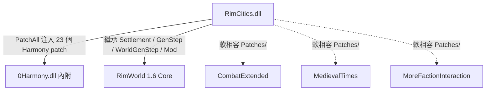
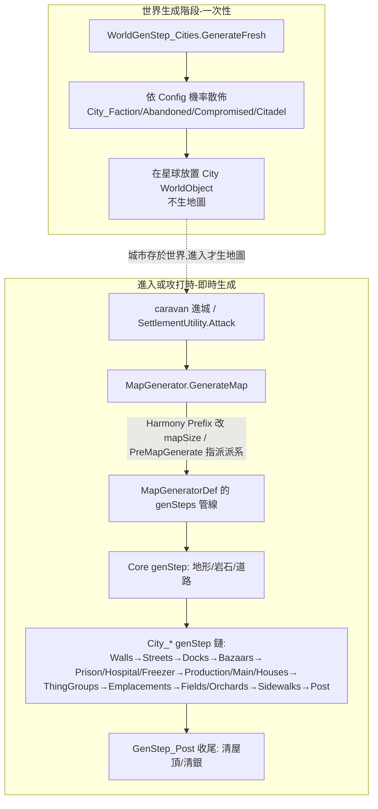

# RimCities 架構總覽

> 來源版本：1.6（`Cabbage.RimCities`，workshop 1775170117，作者 Cabbage）
> 反編譯源：`projects/rimworld_mods/rimcities/decompiled/RimCities.decompiled.cs`（5749 行，單一組件 `RimCities.dll`）
> mod 安裝目錄：`/home/lorkhan/.local/share/Steam/steamapps/workshop/content/294100/1775170117/1.6/`

## 一句話定位

RimCities 在世界地圖上**程序化生成大型「城市」聚落**（自訂 `Cities.City : Settlement` WorldObject），玩家可進入或攻打；進入時透過一條**自訂 GenStep 管線**即時程序生成完整城市地圖（街道網、圍牆、各類功能建築、田地、防禦工事、居民），並附帶一套**自製的舊式任務系統**（assassinate / assault / defend / hostages / prison break / sabotage）。

## 相依鏈

- **硬相依**：僅 RimWorld Core（+ 內附 Harmony）。`About/About.xml` 無 `<modDependencies>`。
- **軟相容**：`1.6/Patches/{CombatExtended,MedievalTimes,MoreFactionInteraction}/` 內各一個 PatchOperation，僅在對應 mod 存在時調整 genStep / incident（非硬需求）。

## 原始碼 / 組件分佈

| 層 | 內容 | 位置 |
|---|---|---|
| WorldObject | `City : Settlement`、`Citadel : City` | `RimCities.decompiled.cs:5445`、`:5422` |
| 世界生成 | `WorldGenStep_Cities`（散佈城市到星球） | `:5682` |
| 地圖生成管線 | 18+ 個 `GenStep_*`（C# 演算法，XML 餵參數） | `:837`–`:2068` |
| 佈局引擎 | `Stencil` struct（座標/矩形/旋轉/填地形/生 Thing 的核心 DSL） | `:4796` |
| 裝飾器 | `BuildingDecorator_*`、`RoomDecorator_*`（房間內容填充） | `:38`–`:385` |
| 共用工具 | `GenCity`（隨機派系/材質/品質/生居民）、`TerrainUtility`、`QueryUtility` | `:4614`、`:5389`、`:4779` |
| 任務系統（自製） | `Quest_*`、`QuestDef : IncidentDef`、`QuestListener_*`、`IncidentWorker_Quest` | `:2578`–`:4051`、`:475` |
| Lord/AI | `LordJob_LiveInCity/Citadel/AbandonedCity`、`LordJob_Captor/Hostage`、`JobGiver_*` | `:586`–`:835`、`:524`–`:584` |
| MapComponent | `MapComponent_City`（城市持有物追蹤）、`MapComponent_QuestTracker` | `:2070`、`:2115` |
| 設定 | `Mod_Cities`、`Config_Cities`、`ModSettings_Cities` | `:4284`、`:4224`、`:4369` |
| Harmony patch | 23 個 `internal static class` patch | `:2146`–`:2576`（`Patches_RimCities` 靜態建構子 `:4217` 執行 `PatchAll`）|
| 場景 | `ScenPart_StartCity/StartCitadel/Allies/Elite/Equipment/RescuePrisoners` | `:4389`–`:4613` |

## 城市生成機制總圖（兩階段）

關鍵：城市地圖**不預先存在**，是玩家進入或攻打的當下，由 `MapGeneratorDef`（XML 定義的 genStep 清單）+ 一連串 C# `GenStep` 即時程序生成。詳見 `architecture/01_city_map_generation.md`。

## 五種城市型別（皆 `WorldObjectDef ParentName="CityCommon"`）

| defName | worldObjectClass | mapGenerator | 說明 |
|---|---|---|---|
| `City_Faction` | `Cities.City` | `City_Faction` | 有居民的派系城市（可交易/攻打） |
| `City_Abandoned` | `Cities.City` | `City_Abandoned` | 廢墟（`inhabitantFaction==null` → `Abandoned`） |
| `City_Ghost` | `Cities.City` | `City_Ghost` | 神秘空城 |
| `City_Citadel` | `Cities.Citadel` | `City_Citadel` | 星球首都（狹長 120×625 攻城地圖） |
| `City_Compromised` | `Cities.City` | `City_Compromised` | 幫派控制的無法城市 |

定義於 `1.6/Defs/WorldObjects.xml`；型別差異主要靠 `worldObjectClass`（C#）與 `mapGenerator`（不同 genStep 組合）。

## 結論預告

- **本質**：程序化城市聚落生成 + 自製任務系統，靠 23 個 Harmony patch 把「城市」融進原版 Settlement 行為。
- **城市生成 = 程序化演算法（C#）為主、XML 為輔的資料驅動參數**：佈局演算法寫死在 `GenStep_*` / `Stencil` 的 C#，但「放哪些建築、密度、面積、房間裝飾器、傢俱清單、地形清單」全部由 `1.6/Defs/MapGeneration.xml` 的欄位驅動。沒有「整張城市佈局藍圖」式的純資料定義。
- 詳細的純 XML vs 必須 C# 二分見 `details/extension_points.md`。
