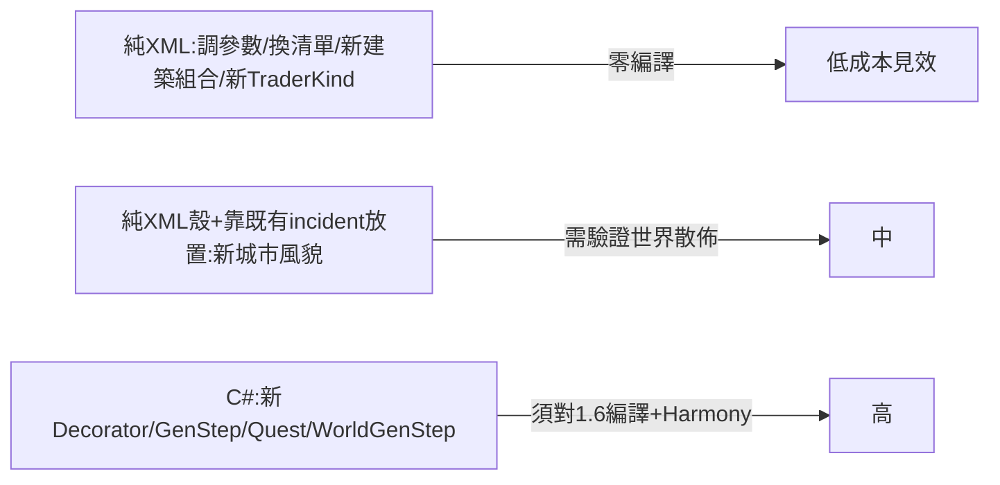

# RimCities 擴充接點：純 XML vs 必須 C#

> 導向：使用者要在 RimCities 基礎上做衍生 mod（新城市類型、調生成參數、加城市內容）。
> 程式碼位置一律標於 `RimCities.decompiled.cs:行號`；XML 一律 `1.6/Defs/...`。

## 核心二分表

| 想做的事 | 純 XML 可達？ | 必須 C#？ | 接點 / 說明 |
|---|---|---|---|
| **調生成數量/密度/面積** | ✅ 完全 | — | `MapGeneration.xml` 的 `count`/`countPer10kCellsRange`/`areaConstraints`/`maxRatio`；世界層密度則走 mod 設定（見下）非 XML |
| **換建築傢俱/砲塔/作物清單** | ✅ 完全 | — | `RoomDecorator_Centerpiece.options`、`Emplacements.options`、`Fields.excludePlants` 等皆 def 欄位 |
| **換街道/地板/人行道地形** | ✅ 完全 | — | `GenStep_Streets.roadTerrains/divTerrains/sidewalkTerrains`、各 `floorOptions` |
| **新增一種「建築類型」**（既有裝飾器的新組合） | ✅ 完全 | — | 新增一個 `GenStepDef Class="Cities.GenStep_Buildings"`，組合既有 `RoomDecorator_*`/`BuildingDecorator_*`，再 PatchOperationAdd 進某 MapGeneratorDef 的 genSteps |
| **重排/增刪生成步驟** | ✅ 大致 | — | 改/Patch `MapGeneratorDef.genSteps` 清單（注意原版 def 不可直接改，需 PatchOperation） |
| **新城市型別（外觀/名稱/管線差異）** | ✅ 多數 | ⚠️ 行為差異需 C# | 新 `WorldObjectDef ParentName="CityCommon"` + 新 `MapGeneratorDef`，沿用 `worldObjectClass=Cities.City`；但若要新行為（如 Citadel 的攻城地圖、特殊 RaidPointIncrease）須新 C# 子類 |
| **改世界上城市數量/廢墟比例/城市尺寸** | ❌（非 XML） | — | 走 **mod 設定 UI**：`Config_Cities`（`:4224`）的 `citiesPer100kTiles`/`abandonedPer100kTiles`/`compromisedPer100kTiles`/`minCitadelsPerWorld`/`citySizeScale`，存於 player config 非 def |
| **新房間內容規則**（新 RoomDecorator） | ❌ | ✅ 必須 | 繼承 `Cities.RoomDecorator`（`:116`）實作 `Decorate(Stencil s)`；XML 只能用既有的（Storage/Bedroom/Centerpiece/Batteries/PrisonCell/HospitalBed/FrozenStorage） |
| **新建築外觀規則**（新 BuildingDecorator） | ❌ | ✅ 必須 | 繼承 `Cities.BuildingDecorator`（`:38`）；既有：None/Patio/Sandbags |
| **新佈局演算法**（新街道法、新建築結構） | ❌ | ✅ 必須 | 繼承 `GenStep`/`GenStep_Scatterer`/`GenStep_RectScatterer`（`:1447`），用 `Stencil`（`:4796`）API |
| **新任務類型** | ❌ | ✅ 必須 | 繼承 `Cities.Quest`（`:3571`），新 `IncidentDef Class="Cities.QuestDef"` 指 `questClass`；任務 reward 可用既有 `QuestListener_GiveThings`（純 XML 設值） |
| **新交易商品池** | ✅ 完全 | — | `TraderKinds.xml` 的 `Base_City`（標準 `TraderKindDef`，可 Patch/新增） |
| **新城市 AI 行為（Lord）** | ❌ | ✅ 必須 | `LordJob_LiveInCity` 等（`:586`+），DutyDef 部分在 `Duties.xml` 可調 think node 參數 |
| **本地化** | ✅ | — | `Languages/<lang>/Keyed` + `DefInjected` |

## 純 XML 擴充的「黃金接點」（最划算）

1. **MapGeneration.xml 的 GenStepDef 參數**——最大的純 XML 操作空間。`GenStep_Buildings` 是高度泛用的：你只要組合 `roomDecorators`（含 `weight`/`maxArea`）+ `buildingDecorators` + `floorOptions` + `count`/`areaConstraints`，就能定義出全新風格的建築群，**完全不寫 C#**。例：想要「武器庫」只需一個新 GenStepDef 用 `RoomDecorator_Storage` 餵武器類 `StockGenerator`。
2. **Centerpiece/ThingGroups 的 options 清單**——直接決定城市裡擺什麼大型物件，換 modded ThingDef 即可。
3. **TraderKinds.xml**——城市買賣清單，標準原版 def，零障礙。
4. **新增城市型別的「殼」**——新 `WorldObjectDef`（沿用 `Cities.City`）+ 新 `MapGeneratorDef` 組不同 genStep，可做出「同 C# 類別、不同風貌」的城市；但**世界生成不會自動散佈它**——`WorldGenStep_Cities.GenerateFresh`（`:5686`）只硬寫生成 `City_Faction/Abandoned/Compromised/Citadel` 四種 defName，新 defName 不寫 C# 不會出現在世界上（除非靠別的 incident/quest 放置）。

## 必須 C# 的硬門檻（衍生時要先評估）

- **世界散佈邏輯寫死**：`WorldGenStep_Cities.GenerateFresh`（`:5686`）的城市 defName 是字串常量，新城市型別要進世界生成必須改 C#（或自寫 WorldGenStep/incident）。
- **裝飾器與 GenStep 是 class 引用**：XML 的 `<li Class="Cities.RoomDecorator_X">` 只能引用 dll 內已存在的型別；新規則 = 新型別 = 新 dll。
- **城市行為靠 Harmony**：城市的「可訪問/可攻打/不被視為已擊敗/交易/失竊好感懲罰」等都在 23 個 patch 內（`:2146`–`:2576`），衍生若要改這些行為需另寫 patch。
- **任務系統是自製舊框架**：`Quest : IExposable`（`:3571`）+ `WorldComponent_QuestTracker`（`:5652`）自管 tick/過期，不是原版 1.x QuestScriptDef（`Script_CityQuest.xml` 內僅 TODO 佔位）。新任務必須吃這套 C#。

## 建議的衍生路線（依成本排序）

- 想「換皮、調平衡、加內容」→ 走 A，純 XML（PatchOperation 改原版/本 mod 的 def）。
- 想「新行為、新規則、新任務、讓新城市型別自動出現在世界」→ 走 E，必須建 C# 專案對 RimCities.dll + RimWorld 1.6 編譯。
