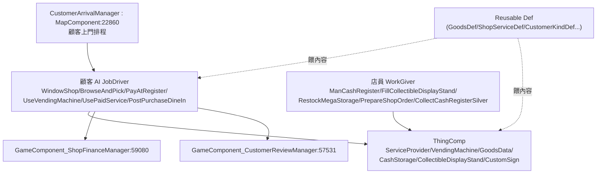

# RimSim Management Framework 架構總覽（00_overview）

> 目標導向：analysis→create。核心釐清「純 XML 可做 vs 必須 C#」與擴充接點。

## 1. 一句話定位

`chezhou.Framework.RimSimManagementFramework`（边缘模拟经营框架，workshop 3736621496，作者 追踪虫 + Migua）是一個**商店/經營模擬框架**：讓玩家在殖民地蓋店（收銀台、貨架、自動販賣機、招牌、廁所、收藏品展示櫃…），中立派系的**顧客**會自動上門逛街、挑貨、結帳、用付費服務、堂食；殖民者擔任**店員角色**（補貨、顧收銀台、備單）。框架本身提供「開店做生意」的完整骨架，**具體商品/服務/顧客類型由資料 Def 餵入**，並建議排序載入在各種族 mod 之下（顧客可用各種族）。

單 DLL `SimManagementLib.dll`（反編譯 64541 行），唯一硬相依 Harmony。

## 2. Defs 的 Required / Reusable 分層（最重要的 create 訊號）

作者把 Defs 明確分兩層，且在 XML 內用中文註解標示擴充方式（如 `GoodsDef`：「**新增分类时复制一个 GoodsDef 改 defName 即可**」）：

| 層 | 角色 | 內容 |
|---|---|---|
| `Defs/Required/` | **核心骨架，勿動** | JobDef（補貨/收銀/顧客行為）、WorkType/WorkGiver、MainButtonDef（經營管理分頁）、ThingDef（CashRegister/SignBoard/Cheque/CollectibleDisplayStand/Toilet/MegaStorageBox…）、FactionDef（CustomerNeutralFaction 顧客派系）、DutyDef（CustomerBehavior）、ShopStaffRoleDef、ShopUiPageDef |
| `Defs/Reusable/` | **資料驅動擴充點，照抄改 defName** | `GoodsDef`、`ShopServiceDef`、`CustomerKindDef`、`CollectibleExchangeListDef`、`PurchaseOutcomeDef`、`ShopTuningDef`、`CustomerExpressionSetDef`、`BusinessExtensionRecommendationDef` |

## 3. 核心子系統（命名空間 `SimManagementLib.*`）

| 型別（行號） | 角色 |
|---|---|
| `CustomerArrivalManager : MapComponent:22860` | 顧客（中立派系）上門排程 |
| `JobDriver_WindowShop/BrowseAndPick/PayAtRegister/UseVendingMachine/UsePaidService/UseVending/PostPurchaseDineInShop:48996` 等 | 顧客逛街→挑貨→付款→用服務→堂食 AI |
| `WorkGiver_ManCashRegister/FillCollectibleDisplayStand/RestockMegaStorage/PrepareShopOrder:18910` 等 | 店員補貨/顧收銀/備單 |
| `ThingComp_ServiceProvider/VendingMachine/GoodsData/CashStorage/CollectibleDisplayStand/CustomSign` | 店內設施行為 |
| `GameComponent_ShopFinanceManager:59080` / `GameComponent_CustomerReviewManager:57531` | 財務帳本 / 顧客評價 |
| `ShopStaffRoleDef:46518` / `ShopUiPageDef:46781` | 店員角色 / 經營 UI 分頁（皆可資料定義） |
| `ShopServiceDef:44698`（`workerClass` 預設 `ShopServiceWorker`）| 付費服務（價格/時長/計費模式/可換 worker） |
| `GoodsDef`（`GoodsList : List<ThingDef>`） | 商品分類＝一串 ThingDef |
| `CustomerActionDef:45463` / `PurchaseOutcomeDef:45860` / `CustomerExpressionSetDef:45715` | 顧客行為 / 購買結果 / 顧客表情台詞 |

## 4. 結論

這是**典型「核心骨架 C# ＋ 內容資料化」框架**，且作者刻意把可擴充 Def 收進 `Reusable/` 並附註解教學。開新商品、服務、顧客類型、收藏品兌換、調平衡大多是純 XML；新顧客行為/新設施 Comp/新服務行為才需 C#。詳見 `details/extension_points.md`。
