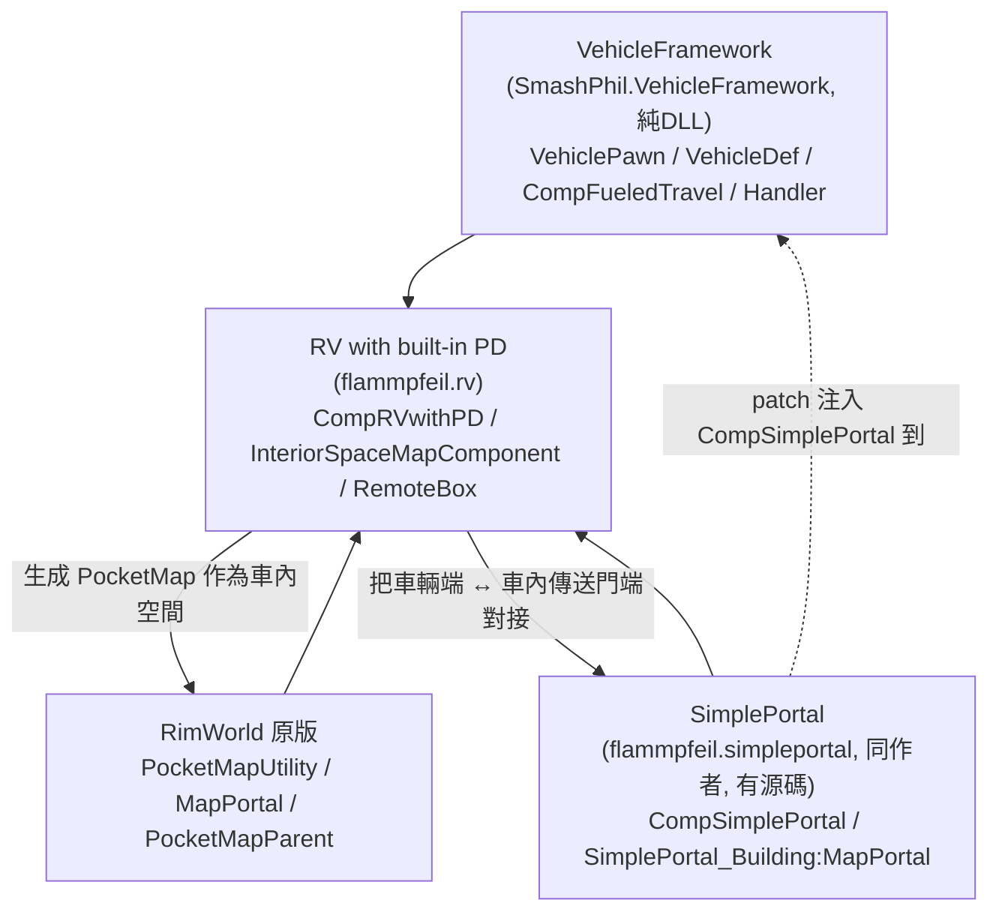
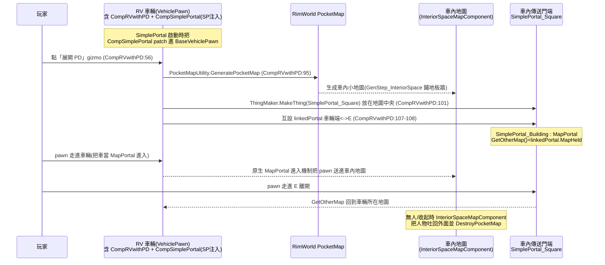

# RV with built-in PD 架構總覽（00_overview）

> 目標導向：在此基礎上做 **create（衍生／擴充）**。本文釐清「是什麼／相依鏈／原始碼分佈／運作機制總圖」。
> 原始碼位置一律標 `path/to/file.cs:行號`；本 mod 根目錄為
> `~/.local/share/Steam/steamapps/workshop/content/294100/3342334887`，下文以 `<mod>` 代稱。
> 兩個相依框架 **VehicleFramework（無源碼，純 DLL）** 與 **SimplePortal（同作者 Furia，有源碼）**，引用其內部 API 時標明「相依框架」。

## 1. 一句話定位

RV with built-in PD 是一台 **VehicleFramework 載具**，作者用 **SimplePortal 的傳送門 + RimWorld 原生 PocketMap（口袋地圖）** 把一塊「車內異次元空間（Personal Dimension / InteriorSpace）」**膠合**到車上。它本身幾乎不發明新機制：**「行駛」全靠 VehicleFramework、「車內空間是一張獨立小地圖」靠原生 PocketMap、「人/貨進出車內」靠 SimplePortal 把車輛當成一個傳送門端點**。RV 的 C# 只做三件事：(a) 用 `PocketMapUtility` 生成並掛載一張車內小地圖、(b) 把「車輛的 SimplePortal 端」與「車內地圖中央的傳送門端」對接、(c) 一堆 Harmony 補丁讓「口袋地圖 + 載具 + 沒有殖民地」這些原生不相容的情境不報錯。

關鍵佐證：
- 車內空間＝原生 PocketMap：`<mod>/1.6/Src_PocketMapLibBased/src/CompRVwithPD.cs:95`（`PocketMapUtility.GeneratePocketMap(...)`）。
- 進出靠 SimplePortal 對接：`CompRVwithPD.cs:101-109`（在車內放一個 `SimplePortal_Square`，與車輛的 `CompSimplePortal` 互設 `linkedPortal`）。
- 車輛本身的 `CompSimplePortal` **不是 RV 加的**，是 SimplePortal 對 `BaseVehiclePawn` 的 patch 注入的（見 §5）。

## 2. 相依鏈

要點：
- **硬相依**（`<mod>/About/About.xml:13-26`）：`SmashPhil.VehicleFramework` + `flammpfeil.simpleportal`，兩者缺一不可。
- RV **不直接 patch VehicleFramework 來取得傳送門能力**；是 SimplePortal 先把 `CompSimplePortal` patch 進所有 `BaseVehiclePawn`，RV 再呼叫端使用它。SimplePortal 與 RV 同作者，等於是一條「框架 + 應用」的自家組合。
- 載入順序（`About.xml:28-33`）：RimWorld → VehicleFramework → SimplePortal → VVE → RV。

## 3. 原始碼 / 組件分佈表

### 兩份源碼樹（皆編譯成 `<mod>/1.6/Assemblies/` 的 DLL）

| 源碼樹 | 路徑 | 編譯產物 | 角色 |
|---|---|---|---|
| **主源碼（PocketMap 版）** | `<mod>/1.6/Src_PocketMapLibBased/src/` | `RVwithPD.dll` | mod 全部正式邏輯：車內空間生成、傳送門對接、RemoteBox/RemoteSeat 遠端貨艙/座位、口袋地圖相容補丁 |
| **VEF 修正獨立 DLL** | `<mod>/1.6/Src_VEFFixOnly/src/` | `VehicleFrameworkFix.dll` | **只含一個 Harmony patch**，修 VehicleFramework 的口袋地圖 bug（見 §4 與 04 問題）。獨立成 DLL 是為了能單獨掛載/排序，與主邏輯解耦 |
| Geological Landforms 相容（選用） | `<mod>/1.6/Compat/GeologicalLadndforms/Src_Geological/src/` | `RVforGLPatch.dll` | 只在啟用 Geological Landforms 時載入（`LoadFolders.xml`），讓地形 mod 跳過車內地圖 |

> **PocketMapLibBased vs VEFFixOnly 不是「兩套互斥實作」**，而是「主邏輯」與「一個必須先於/獨立於主邏輯運作的 VEF 熱修」拆成兩個組件，兩者**同時**編譯出兩個 DLL 一起載入。命名 `Src_PocketMapLibBased` 暗示作者曾有過非 PocketMap 的舊實作（1.5 也存在對 tile 取負值的註解殘留，見 `CompRVwithPD.cs:148-157`），現行 1.6 一律走原生 PocketMap。

### 主源碼檔案職責（`Src_PocketMapLibBased/src/`）

| 檔案 | 角色 |
|---|---|
| `EntryPoint.cs::Core`（`:10`） | `Mod` 入口；建構時 `Harmony(...).PatchAll()`、載入 `Settings` |
| `CompRVwithPD.cs::CompRVwithPD`（`:39`） | **核心**：掛在車輛上的 comp，提供「展開／收起車內空間」gizmo、生成 PocketMap、對接傳送門、隨車同步世界座標 |
| `CompRVwithPD.cs::CompProperties_RVwitPD`（`:13`） | XML 設定：`mapWidth/mapHeight/stuffDef`，算出車內地圖尺寸 |
| `InteriorSpaceMapComponent.cs`（`:12`） | 車內地圖的 `MapComponent`：持有 `ownerThing`（車）、無人時自動拆地圖、收起時把人/物傳送回外面 |
| `GenStep_InteriorSpace.cs`（`:6`） | 車內地圖生成步驟：鋪地板/屋頂、邊緣放牆、清空肥沃度/高程 |
| `InteriorSpaceDefOf.cs`（`:12`） | DefOf：`SimplePortal_Square`、`Furia_InteriorSpace`(地圖生成器/biome)、地板/屋頂/牆 def |
| `Settings.cs`（`:7`） | mod 設定：地圖尺寸偏移、`wealthReflects`、`timeMode` |
| `CompLinkedFueld.cs`（`:27`） | 掛在「車內那個傳送門端（SimplePortal_Square）」上的 comp：把車的 Chemfuel 轉成電力（隔空充電）、提供建立 RemoteBox/RemoteSeat 的 gizmo |
| `Patch_Fixer.cs`（`:11`） | 口袋地圖相容補丁群（屋頂不塌、可貼邊建造、世界地圖不顯示此地圖、無殖民地時影子計算不崩、車內地圖威脅點歸零） |
| `Patch_FixerVEF.cs`（`:14`） | patch VehicleFramework 的 `PathingHelper.VehicleImpassableInCell`：沒有 `VehiclePositionManager` 的地圖（如車內）直接放行 |
| `RemoteBox/`（10 檔） | **遠端貨艙/座位子系統**：在外部地圖放一個「箱子/座位」當代理，透過傳送門連動讀寫車輛的 cargo / 駕駛座（含定時換班排程）|

### RemoteBox 子系統檔案

| 檔案 | 角色 |
|---|---|
| `RemoteBox/RemoteBox_Building.cs`（`:14`） | 遠端貨艙建築：`IThingHolder`，把存取轉發到遠端車輛 inventory，復用原生 `CompTransporter` 裝載 UI |
| `RemoteBox/RemoteSeat_Building.cs`（`:20`） | 繼承 RemoteBox，遠端「上車座位」：把 pawn 裝進 VehicleFramework 的 `VehicleRoleHandler`，含**定時自動換駕駛**排程 |
| `RemoteBox/RemoteThingOwner.cs`（`:15`） | 自訂 `ThingOwner`：實際不存物，所有操作透過 `holderList` 索引轉發到遠端車輛某層 holder |
| `RemoteBox/Verb_LinkTheThing.cs` / `CommandLinkThePortals.cs` | 連結用 verb / gizmo（多數已註解停用） |
| `RemoteBox/Dialog_RemoteBox.cs` / `Dialog_RemoteSeat.cs` | 裝載對話框（繼承原生 `Dialog_LoadTransporters`）|
| `RemoteBox/ITab_ContentsRemoteBox.cs` / `ITab_ContentsRemoteSeat.cs` | 內容物檢視 ITab |
| `RemoteBox/RemoteBoxDefOf.cs` | DefOf：`Furia_RemoteBox`、`Furia_RemoteSeat` |

### Defs / Patches

| 檔案 | 角色 |
|---|---|
| `<mod>/1.6/Defs/RVwithPD/VehicleDefs/RV_VehiclePawn.xml`（`:5`） | `Vehicles.VehicleDef`：車輛本體（components/roles/stats），掛 `CompProperties_RVwitPD`（`:507`）+ `CompProperties_FueledTravel`（`:513`）。**注意：此處無 SimplePortal comp**（由 SimplePortal patch 注入）|
| `Defs/.../VehicleDefs/RV_Buildable.xml`（`:4`） | `Vehicles.VehicleBuildDef`：藍圖（造價/研究需求/工作量）|
| `Defs/.../MapGeneration/InteriorSpaceMapGenerator.xml`（`:4`） | `MapGeneratorDef Furia_InteriorSpace` + `GenStepDef` + 專屬 `BiomeDef` |
| `Defs/.../ThingDef_Building_RemoteBox.xml`（`:30,104`） | `Furia_RemoteBox` / `Furia_RemoteSeat` 兩個建築 def |
| `<mod>/1.6/Patches/Portal_Patch.xml`（`:4`） | 對 `SimplePortal_Square` **加上** `CompLinkedFueld` + `CompProperties_Battery`（隔空充電的電池端）|
| `<mod>/1.6/Patches/RVwithPD_VVE_Patches.xml` | VVE 啟用時移除自帶研究（改用 VVE 研究）|
| `<mod>/1.6/Compat/VVE/.../RV_VehiclePawn.xml` | VVE 版車輛 def（多 `CompProperties_VehicleMovementController` + `VVE_VehicleTier`），由 `LoadFolders.xml` 條件覆蓋 |

## 4. VehicleFrameworkFix.dll 修了什麼

`Src_VEFFixOnly/src/Patch_Fixer.cs:7` — patch `MapGenerator.GenerateContentsIntoMap`（Prefix, 高優先）：
每當生成新地圖時，**清除該地圖在 `MapComponentCache<VehiclePathingSystem>` 的舊快取**（`Patch_Fixer.cs:21`）。原因：`Map.Index` 會被回收複用，VehicleFramework 用 `Map.Index` 當 cache key，生成口袋地圖（會占用 index）後若不清快取，新地圖會錯誤命中舊車輛的 pathing 系統 → 路徑/碰撞錯亂。獨立成一個小 DLL 是為了讓這個熱修能在純框架層面套用，不綁主 mod 邏輯。

> 另一條相關修正在主 DLL 的 `Patch_FixerVEF.cs:14`：`PathingHelper.VehicleImpassableInCell` 對「沒有 `VehiclePositionManager` 的地圖」（車內小地圖就是這種）直接判定可通行，避免車內地圖被當成載具地圖計算。

## 5. 運作機制總圖

進出機制詳解見 `01_vehicle_pocketmap_glue.md`；擴充接點見 `../details/extension_points.md`。
