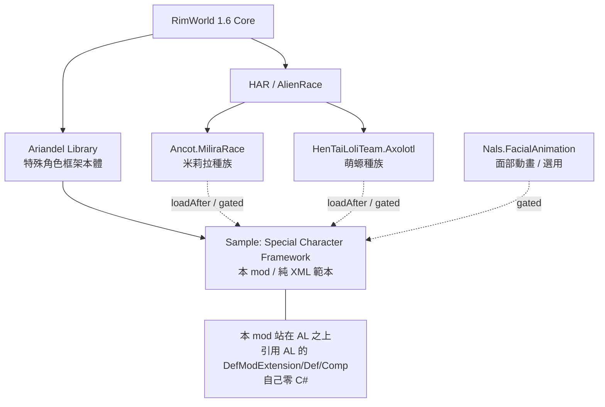

# SCMF Sample — 架構總覽

## 一句話定位

**Ariandel 官方親手寫的「純 XML 教學範本」**：在不寫任何一行 C# 的前提下，示範如何站在 **Ariandel Library（特殊角色框架）** 之上，把既有種族（米莉拉 Milira／萌螈 Moelotl）的一隻普通 pawn，包裝成一個會被「特殊角色管理器（SCM / Special Character Manager）」接管的**具名、不死、可召回的固定角色**。

- packageId：`Ariandel.UserGuideSCMF`（workshop 3668177055，作者 Ariandel）
- **經確認：整個 mod 零 .dll**（`find ... -name "*.dll"` 無結果），純資料 + 貼圖。
- 它本身不是框架，而是框架的「使用說明書」——所有 XML 都帶大量中英雙語註解，作者在 About.xml 直言：「these thoroughly annotated XML files are your best reference」（`About/About.xml:8`）。
- 範例做出兩個角色：**Ingifríðr Nyström（米莉拉女武神）** 與 **GuanJu YuLinLing（萌螈劍修）**，分別展示「灵体/boss 級」與「普通可繁衍」兩種配置取捨。

## 相依鏈

- **硬相依（modDependencies）**：僅 `Ariandel.AriandelLibrary`（`About/About.xml:10-16`）。
- **軟相依（loadAfter）**：米莉拉三件套、萌螈、萌螈面部動畫（`About/About.xml:17-28`）。
- **Gated 載入**：`LoadFolders.xml` 用 `IfModActive` 把種族專屬內容放進 `1.6/Mods/<packageId>/`，只有對應種族 mod 啟用時才載入（`LoadFolders.xml:8-12`）。這是「範例同時支援多種族、缺哪個都不報錯」的關鍵手法。

## 檔案分佈

| 路徑 | 型別 | 角色 | 說明 |
|---|---|---|---|
| `1.6/Defs/BackStoryDef/Backstory_Milira_Sample.xml` | `AlienRace.AlienBackstoryDef` ×2 | 共用 | 幼年/成年背景故事，掛 `spawnCategories` tag 供篩選 |
| `1.6/Defs/TraitDef/Traits_Sample.xml` | `TraitDef` ×1 | 共用 | 自訂特質 `Milira_Valkyrie_Sample`，內嵌 4 個 AL trait 級 modExtension |
| `1.6/Mods/Ancot.MiliraRace/Defs/PawnkindDef/PawnKinds_Milira_Sample.xml` | `PawnKindDef` | Ingefrid | **核心範本**，~325 行全註解，米莉拉角色完整定義 |
| `1.6/Mods/Ancot.MiliraRace/Defs/.../ShroudOutcomeDef_Milira.xml` | `AriandelLibrary.ShroudOutcomeDef` | Ingefrid | 把角色綁進「虛境（Shroud）儀式」結果，作為入手途徑 |
| `1.6/Mods/Ancot.MiliraRace/Patches/Patch_Alien_Milira.xml` | `PatchOperationAdd` ×4 | Ingefrid | 用 backstory 條件**隱藏**種族原本的 halo/ahoge/hair addon |
| `1.6/Mods/Ancot.MiliraRace/Patches/Patch_Ingefrid.xml` | `PatchOperationAdd` ×5 | Ingefrid | 用 backstory 條件**新增**該角色專屬的頭髮/光環/髮色通道 |
| `1.6/Mods/HenTaiLoliTeam.Axolotl/Defs/PawnkindDef/PawnKinds_Moelotl_Sample.xml` | `PawnKindDef` | GuanJu | 第二範本，示範「不掛死亡管理、可繁衍」的對照配置 |
| `1.6/Mods/HenTaiLoliTeam.Axolotl/Defs/.../ShroudOutcomeDef_Moelotl.xml` | `AriandelLibrary.ShroudOutcomeDef` | GuanJu | 同上，萌螈版 |
| `1.6/Mods/HenTaiLoliTeam.Axolotl/Defs/Hediff_GuanJu.xml` | `HediffDef`（含 `AriandelLibrary.HediffCompProperties_WearApparel`） | GuanJu | 「生成後延遲穿衣」工具，繞過某些 mod 衝突導致脫衣 |
| `1.6/Mods/Nals.FacialAnimation/Defs/Unique*.xml` | `FacialAnimation.*TypeDef` ×6 | 雙角色 | 面部動畫專屬眼/眼瞼/嘴/膚，用 `AriandelLibrary.FA.ModExtension_NPCFA` 的 `forNPC` 綁定 |
| `1.6/Languages/*/Keyed/Name.xml` | `LanguageData` | 雙角色 | 角色姓名與 SCM 描述的實際文字（key→顯示名） |
| `1.6/Languages/*/DefInjected/...` | 翻譯 | — | 多為 `TODO` 佔位，示範翻譯檔放置位置 |

## 它引用了上游 Ariandel Library 的哪些型別（接點清單）

下列皆已對照 `projects/rimworld_mods/ariandel-library/decompiled/AriandelLibrary.decompiled.cs` 確認存在。

**Def 型別（直接當 Def 寫）**
- `AriandelLibrary.ShroudOutcomeDef`（決議在 decompiled `ShroudOutcomeDef`）＋ workerClass `AriandelLibrary.ShroudOutcome_Generator`

**DefModExtension（掛在 PawnKindDef.modExtensions 上 — 框架的主入口）**
- 必填三件套：`FixedIdentityExtension`（decompiled:16210）、`NPCKindTag`（:13990）、`SpecialPawnExtension`（:17406）
- 選用工具：`AL_Kill_Manager_Extension`、`AL_RefuseMentalBreak_Extension`、`AL_FloatMenuBlocker_Extension`、`AL_AzzyPregnancy_Extension`、`AL_SubcoreScannerBlocker_Extension`、`AL_SurgeryBlocker_Extension`、`AL_LockConsciousness_Extension`、`AL_AgeFreeze_Extension`、`AL_TraitLock_Extension`
- Anomaly 子命名空間（`MayRequire="Ludeon.RimWorld.Anomaly"`）：`Anomaly.AL_RitualRoleRestriction_Extension`、`Anomaly.AL_ObeliskDuplicationBlocker_Extension`、`Anomaly.AL_FleshbeastReflect_Extension`、`Anomaly.AL_PsychicSlaughterReflect_Extension`
- 第三方協作（`MayRequire="rjw.menstruation"`）：`rjw.menstruation.AL_RJW_Menstruation_Pregnancy_Extension`

**DefModExtension（掛在 TraitDef.modExtensions 上）**
- `AL_NoSkillDecay_Extension`、`AL_IgnoreGenePenalty_Extension`、`AL_LockSkill_Extension`、`AL_PsychicShockReflect_Extension`（皆見 `Traits_Sample.xml:24-42`）

**ThingComp / HediffComp**
- `AriandelLibrary.HediffCompProperties_WearApparel`（生成後穿衣，`Hediff_GuanJu.xml:15`）

**面部動畫橋接**
- `AriandelLibrary.FA.ModExtension_NPCFA`（`forNPC` 對應 `NPCKindTag.npcTag`，把面部資源綁到具名角色）

詳細「必填 vs 選用」與純 XML 邊界見 `../details/extension_points.md`。
