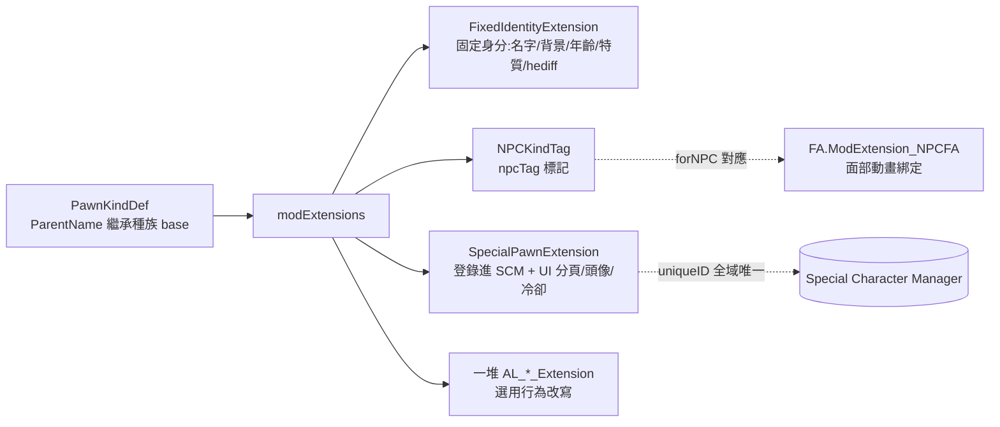

# 在 Ariandel Library 上「純 XML 做特殊角色」的接點與邊界

本文以 SCMF Sample 為藍本，逐層拆「要做一個特殊角色，框架要求你填哪些欄位、能填到哪、何時得回 C#」。

## 整體心智模型

特殊角色 = **一隻既有種族的 `PawnKindDef`** + **掛在它 `modExtensions` 上的一組 Ariandel DefModExtension**。框架不發明新的「角色 Def 型別」，而是劫持原版的 PawnKind 生成流程，靠 modExtension 在生成時注入固定身分、登錄進管理器、改寫死亡/手術/精神等行為。

## 三件「絕對必填」的 modExtension

作者在 `PawnKinds_Milira_Sample.xml:126-127` 與 `:233-234` 用粗體分隔線框出：「以下 class 必須全部填寫，絕對不能漏任何一個」。

### 1. `AriandelLibrary.FixedIdentityExtension` — 固定身分產生器
讓 pawn「絕對非隨機」。欄位（對照 decompiled `FixedIdentityExtension`:16210）：

| 欄位 | 範例值 | 說明 |
|---|---|---|
| `firstNameKey` / `lastNameKey` / `nickNameKey` | `AL_Name_Ingefrid_First` 等 | **填的是 key**，實際文字寫在 `Languages/*/Keyed/Name.xml`（`PawnKinds_Milira_Sample.xml:131-138`） |
| `childhoodBackstoryDef` / `adulthoodBackstoryDef` | `Milira_BackstoryChild_01_Sample` | 填 backstory **defName**（非 tag） |
| `forcedAgeYears` / `forcedChronologicalAgeYears` | `120` / `672` | 生理/曆法年齡 |
| `forcedHeadTypeDef` | `MiliraHead4` | 無面部動畫時換頭貼圖 |
| `disableRandomTraits` | `true` | 關掉隨機特質，只用下面固定的 |
| `extraForcedTraits` | `<li><def>Bloodlust</def></li>` | 可帶 `<degree>`（如 Beauty degree 2） |
| `extraForcedHediffs` | `PsychicAmplifier` 等 | 帶 `severity`/`level`、`partDef`、`overwriteIfExists`，**含仿生植入物** |

### 2. `AriandelLibrary.NPCKindTag` — 角色標籤
只有一個欄位 `npcTag`（`:195-197`）。它是「具名角色」的字串身分證，供面部動畫等外部資源用 `forNPC` 回指。

### 3. `AriandelLibrary.SpecialPawnExtension` — 登錄進管理器（框架核心）
把這個 pawn 註冊進 SCM，提供「召回/復活/UI 分頁/頭像」。欄位（對照 decompiled `SpecialPawnExtension`:17406）：

| 欄位 | 說明 |
|---|---|
| `uniqueID` | **全域唯一靜態 ID**，作者反覆強調「永遠不要讓兩個角色重複」（`:202-203`） |
| `tabDef` | 放進哪個 SCM 頂部分頁（如 `MI_Milira_Tab`）。**分頁 Def 由種族 mod 提供**，不是本 mod 定義 |
| `iconPathRecruited` / `iconBGPath` | 頭像/背景貼圖路徑（256 或 128px） |
| `labelKey` / `descKey` | SCM 內顯示名與描述的 key |
| `normalCooldownTicks` / `resurrectCooldownTicks` | 召回/復活冷卻 |
| `order` | 分頁內排序 |

## 選用行為改寫 modExtension（純 XML 即可全開關）

全部只靠加/不加一個 `<li Class="...">` 就生效，**無一需要 C#**。Ingefrid 全開、GuanJu 用註解示範「哪些可關」——兩者對照即是最好的取捨教材。

| Class | 作用 | Ingefrid | GuanJu |
|---|---|---|---|
| `AL_Kill_Manager_Extension` | 禁用原版死亡，改為召回+復活等待 | 開 | **關**（要能煉飛僵，留原版死亡） |
| `AL_RefuseMentalBreak_Extension` | `blockMentalBreak` 禁一切精神崩潰 | 開 | 關 |
| `AL_FloatMenuBlocker_Extension` | `blockRescue`/`blockCapture`/`blockArrest` | 開 | 開 |
| `AL_AzzyPregnancy_Extension` | `replaceWithKind` 改寫懷孕結果（否則生複製人） | `Milira_Colonist` | `Axolotl_Colonist` |
| `AL_SubcoreScannerBlocker_Extension` | 禁次核掃描 | 開 | 關 |
| `AL_SurgeryBlocker_Extension` | `blockLowTech`/`blockHarvest` 禁降級換件/摘器官 | 開 | 開 |
| `AL_LockConsciousness_Extension` | 意識鎖 100%（作者警告：僅 boss/灵体用） | 開 | 關 |
| `AL_AgeFreeze_Extension` | `freezeBiologicalAge` 凍生理年齡 | 開 | 關 |
| `AL_TraitLock_Extension` | `requiredTraits` 讓某特質專屬此角色（別人拿到會被移除） | 鎖 `Milira_Valkyrie_Sample` | 空 |
| `Anomaly.AL_RitualRoleRestriction_Extension` | 禁當心靈儀式祭品 | 開 | 開 |
| `Anomaly.AL_ObeliskDuplicationBlocker_Extension` | 禁方尖碑複製 | 開 | 開 |
| `Anomaly.AL_FleshbeastReflect_Extension` | 反彈血肉突變槍 | 開 | 開 |
| `Anomaly.AL_PsychicSlaughterReflect_Extension` | 反彈心靈宰殺 | 開 | 開 |
| `rjw.menstruation.AL_RJW_Menstruation_Pregnancy_Extension` | RJW 月經版懷孕改寫 | 開 | 開 |

要點：Anomaly/RJW 類用 `MayRequire="..."`，DLC/mod 不在時自動略過——這讓單一範本能同時相容有/無 DLC 環境。

## 掛在 TraitDef 上的 modExtension（特質級增益）

`Traits_Sample.xml:24-42`：自訂 `TraitDef` 也能掛 AL extension，把「框架能力」綁進特質本身。

| Class | 作用 | 欄位 |
|---|---|---|
| `AL_NoSkillDecay_Extension` | 完全無技能遺忘（等同博聞強記） | — |
| `AL_IgnoreGenePenalty_Extension` | 忽略基因對技能的減益 | `<skill>Melee</skill>` |
| `AL_LockSkill_Extension` | 生成時鎖定技能等級且不遺忘 | `skill` / `level` / `preventDecay` |
| `AL_PsychicShockReflect_Extension` | 反彈心靈衝擊槍 | — |

## 入手途徑：`AriandelLibrary.ShroudOutcomeDef`

把角色綁進框架的「虛境儀式」。關鍵欄位（`ShroudOutcomeDef_Milira.xml`）：
- `workerClass` = `AriandelLibrary.ShroudOutcome_Generator`（用框架內建 worker，**不需自寫 C#**）
- `pawnList/li/pawnkindDefName` 指向上面的特殊角色 PawnKind
- `shouldBeRegistered=true`：生成時自動登錄 SCM、強制玩家派系（`factionDefName` 失效）
- `isUnique` / `weight` / `qualityRange` / `minRefireDays`：控制是否唯一、抽中權重、需要的儀式質量、冷卻

## 純 XML 邊界 — 何時必須回 C#

**這個範例證明：一個「具名、固定外觀、不死、可召回、行為受限」的特殊角色，可 100% 純 XML 完成**，因為框架已把所有行為改寫做成 data-driven 的 DefModExtension + 內建 workerClass/Comp。純 XML 涵蓋：
- 身分（名字/背景/年齡/特質/hediff/外觀）
- 登錄 SCM + UI 呈現
- 死亡/復活/精神/手術/懷孕/年齡/Anomaly 互動的開關式改寫
- 入手途徑（Shroud 儀式結果）
- 種族外觀差異（HAR bodyAddon patch + 面部動畫 def）

**必須回 C# 的情況**（皆超出本範例範圍）：
1. **新的能力/行為邏輯**：範例只能「引用既有 Ability」（如 `Axolotl_SkillMove`）。要寫前所未有的主動技能 verb/效果，需 C#。
2. **新的 modExtension/Comp 行為**：所有可用的 `AL_*_Extension` 都是框架預先寫好的；想要框架沒提供的行為改寫（例：自訂「受傷時觸發某事件」），得自己寫 DefModExtension+Patch/Comp（C#）。
3. **新的 ShroudOutcome worker**：`ShroudOutcome_Generator` 以外的結果邏輯需自寫 workerClass。
4. **新的 SCM 分頁背後邏輯**：`tabDef`（如 `MI_Milira_Tab`）由種族擴充 mod 用 C#/特殊 Def 提供；純做角色時是「借用」既有分頁。
5. **跨 mod 深度整合**：如 `MiliraImperium.UniqueRecruitExtension`（範例中註解掉）需該擴充 mod 的 C#。

換言之：**「組裝既有積木」純 XML；「造新積木」才需 C#**。SCMF Sample 正是把 Ariandel Library 提供的全部積木攤開示範一遍。
