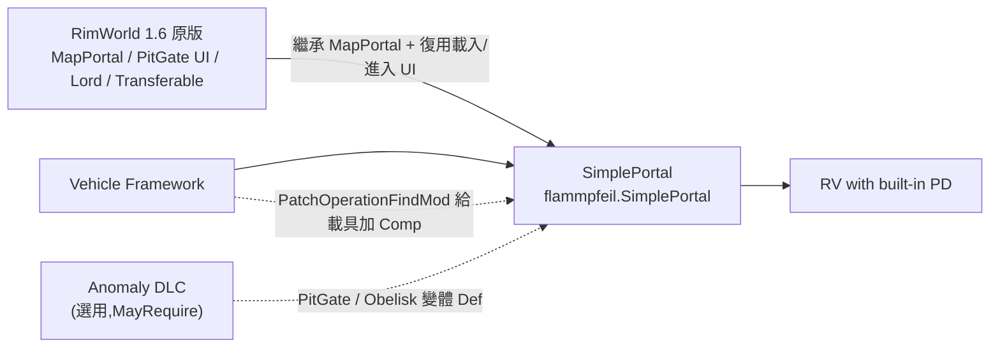
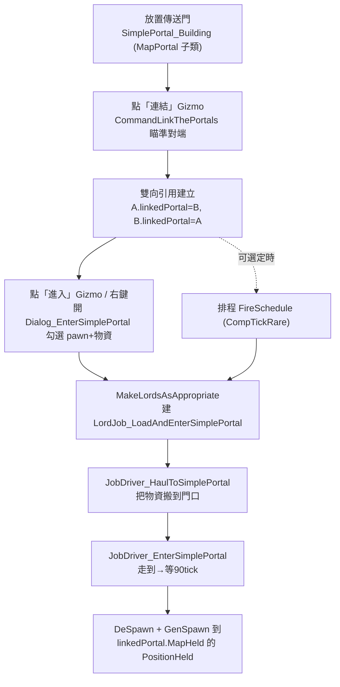

# SimplePortal 架構總覽（00_overview）

> 目標導向：在此基礎上做 **create（擴充／衍生）**。本文釐清「是什麼／相依鏈／原始碼分佈／運作機制總圖」。所有行號皆為實際讀過 `1.6/Src/src/` 自帶源碼後標註。

## 1. 一句話定位

SimplePortal 是一個**站在 RimWorld 1.6 原版 `MapPortal`（深淵之門 PitGate 的基底類別）之上、用一對 1:1 引用把「兩張早已存在的地圖」打通的雙向傳送門 mod**。

它**不自建地圖機制、也不主動產生 PocketMap**：傳送門只是把 pawn／物品從自己所在的 `MapHeld` 直接 `DeSpawn` 後 `GenSpawn.Spawn` 到「另一端傳送門所在地圖」的位置。「pit gate-like interface」＝它讓建築類別繼承原版 `MapPortal`，**復用原版深淵之門那一整套 ITab 內容清單／載入排程／進入 toil UI**，再用 Harmony 把原版那顆會開 PocketMap 的進入按鈕「換掉」成自己的版本。

關鍵佐證：
- 建築即 `MapPortal` 子類：`SimplePortal_Building : MapPortal, IRenameable`（`1.6/Src/src/SimplePortal_Building.cs:18`）。
- 目的地＝對端傳送門的真實地圖，非 PocketMap：`GetOtherMap() => Portal?.linkedPortal?.MapHeld`（`SimplePortal_Building.cs:187-192`）、`GetDestinationLocation() => linkedPortal?.PositionHeld`（`:194-199`）。
- 傳送＝同一隻 pawn 跨地圖搬移，非進入新生地圖：`pawn.DeSpawnOrDeselect(); GenSpawn.Spawn(pawn, intVec, otherMap, ...)`（`1.6/Src/src/LoaderToil/JobDriver_EnterSimplePortal.cs:89-90`）。
- 配對是雙向物件引用：`selected.linkedPortal = this.portal; current.linkedPortal = thing`（`1.6/Src/src/CommandLinkThePortals.cs:44-45`）。
- 程式碼**反而要特別判斷目的地「不是」PocketMap**才卸物資：`if (!otherMap.IsPocketMap) pawn.inventory.UnloadEverything = true;`（`JobDriver_EnterSimplePortal.cs:99-101`）——顯示常態目的地是真實地圖（聚落／哨站／另一個地圖物件），PocketMap 只是邊角情況。

> 待驗證：`ExposeData` 內 `this.exit = new PocketMapExit()`（`SimplePortal_Building.cs:352`）。這是 `MapPortal` 父類別要求的 `exit` 欄位佔位，避免原版邏輯 NRE；它並未用來真的開 PocketMap（進入邏輯走自己的 `JobDriver`）。詳見 `01_portal_mechanism.md` §存檔。

## 2. 相依鏈

要點：
- 對 **Vehicle Framework** 是軟相依：用 XML `PatchOperationFindMod` 給 `BaseVehiclePawn` 注入 `CompProperties_SimplePortal`，讓載具本身能當「會動的傳送門端點」（`1.6/Patches/Patch_Vehicles.xml:21-28`）。源碼中對載具的特判：`pawn.GetType().FullName == "Vehicles.VehiclePawn"`（`EnterSimplePortalUtility.cs:54`），以反射字串判斷避免硬編譯相依。
- 對 **Anomaly DLC** 是選用：三個變體 Def 標 `MayRequire="Ludeon.RimWorld.Anomaly"`（`ThingDef_Building.xml:196,273,357`）。
- **RV with built-in PD** 在下游，本 mod 不引用它。

## 3. 原始碼／組件分佈表

| 區塊 | 路徑 | 角色 |
|---|---|---|
| Mod 入口／設定 | `Core.cs::Core`（`1.6/Src/src/Core.cs:14`） | `Mod` 子類，存 `PackageId`、Dev log、設定視窗 |
| Harmony 啟動 | `HarmonyEntryPoint.cs:10` | `PatchAll(GetExecutingAssembly())` 套用所有 patch |
| **傳送門建築（核心 Thing）** | `SimplePortal_Building.cs:18`（`: MapPortal`） | 繼承原版 MapPortal；override `GetOtherMap/GetDestinationLocation/IsEnterable/OnEntered/GetGizmos/Graphic`；橋接能量/燃料/開關/EMP/溫度 |
| **傳送門核心 Comp** | `CompSimplePortal.cs:37` | 存 `linkedPortal` 引用、載入清單 `leftToLoad`、排程、所有 Gizmo（連結/進入/請求/排程/檢視對面地圖）、`PostExposeData` |
| Comp Properties（XML 入口） | `CompSimplePortal.cs:19`（`CompProperties_SimplePortal`） | XML 可調：`activeGraphicData/openGraphicData/replaceCount/syncTemperature/needEnergy/allowConnnectThing/canUninstall/canManualLink` |
| 連結 Gizmo | `CommandLinkThePortals.cs:8`（`: Command_VerbTarget`） | 玩家點「連結」後進入瞄準模式，建立雙向 `linkedPortal` |
| 連結 Verb（空殼） | `Verb_LinkThePortals.cs:6` | 只為借用原版 target 瞄準框；`TryCastShot()=>true`、不真的開火 |
| 進入 JobDriver（**真正傳送**） | `LoaderToil/JobDriver_EnterSimplePortal.cs:16` | 走到→等 90 tick→`DeSpawn`＋`GenSpawn` 到對面地圖 |
| 搬運入口 JobDriver | `LoaderToil/JobDriver_HaulToSimplePortal.cs` | pawn 把待送物資搬到傳送門 |
| 載入排程 / Lord | `LoaderToil/LordJob_LoadAndEnterPortal.cs`、`LordToil_LoadAndEnterSimplePortal.cs`、`EnterSimplePortalUtility.cs:327`（`MakeLordsAsAppropriate`） | 仿原版運輸艙「集合→載入→進入」群體流程 |
| 進入/排程對話框（復用 PitGate UI） | `LoaderToil/Dialog_EnterSimplePortal.cs`、`Dialog_ScheduleSimplePortal.cs` | 物資/pawn 勾選清單；定時自動發送 |
| WorkGiver/JobGiver | `LoaderToil/WorkGiver_HaulToSimplePortal.cs`、`JobGiver_*` | 把搬運/進入掛進工作系統與 Lord duty |
| DefOf | `LoaderToil/SimplePortalDefOf.cs:13` | `HaulToSimplePortal`、`EnterSimplePortal` JobDef；`LoadAndEnterSimplePortal` DutyDef |
| 改名對話框 | `Dialog_RenamePortal.cs` | 給傳送門命名（`IRenameable`） |
| PitGate 變體填埋 Comp | `CompFillInAble.cs:20` | `SimplePortal_PitGate` 填埋自毀（仿原版崩塌音效） |
| **Harmony Patch ×4**（見下表） | `Patch_*.cs`、`LoaderToil/Patch_FloatMenuMakerMap.cs`、`Patch_Minified.cs` | 接管原版進入按鈕、保護地圖不被清、放行連結瞄準 |
| Def（資料層） | `1.6/Defs/SimplePortalDefs/*.xml` | 4 種傳送門 ThingDef + Job + 研究 |
| XML Patch（外部 mod/DLC 接合） | `1.6/Patches/Patch_Vehicles.xml`、`Patch_EntityCodexEntryDef.xml` | 給載具加 Comp、把研究塞進異象圖鑑 |
| 編譯產物 | `1.6/Assemblies/SimplePortalLib.dll` | 有源碼，不需用 |

### Harmony Patch 一覽

| 檔案:行 | 目標 | 類型 | 職責 |
|---|---|---|---|
| `LoaderToil/Patch_FloatMenuMakerMap.cs:11`（`Suppress_OriginalFloatMenu`） | `FloatMenuOptionProvider_EnterMapPortal.GetSingleOptionFor` | Prefix | **抑制原版「進入地圖傳送門」右鍵選項**（會開 PocketMap），對 `SimplePortal_Building` 回傳 null |
| `LoaderToil/Patch_FloatMenuMakerMap.cs:30`（`Minified_FloatMenuProvider`） | （新 Provider） | 新增 | 給「被搬起/可微縮」的傳送門補上自己的進入右鍵選項 |
| `Patch_BlockingMapRemoval.cs:12` | `MapPawns.AnyPawnBlockingMapRemoval`（getter） | Prefix | 地圖上有玩家已連結傳送門時，**阻止該地圖被當作空地圖回收清除** |
| `Patch_ConfirmStillValid_Through.cs:7` | `Targeter.ConfirmStillValid` | Prefix | 連結瞄準（`Verb_LinkThePortals`）時跳過原版有效性檢查，允許跨地圖選目標 |
| `LoaderToil/Patch_Minified.cs` | （微縮相關） | — | 處理傳送門被微縮/搬運狀態下的進入判斷（待逐行細讀） |
| `Patch_Job_FillIn.cs` | （PitGate 填埋 Job） | — | 連到 `CompFillInAble.fillIn`（待逐行細讀） |

## 4. 運作機制總圖

詳細管線、PocketMap 使用方式、存檔處理見 `01_portal_mechanism.md`；擴充接點見 `../details/extension_points.md`。
