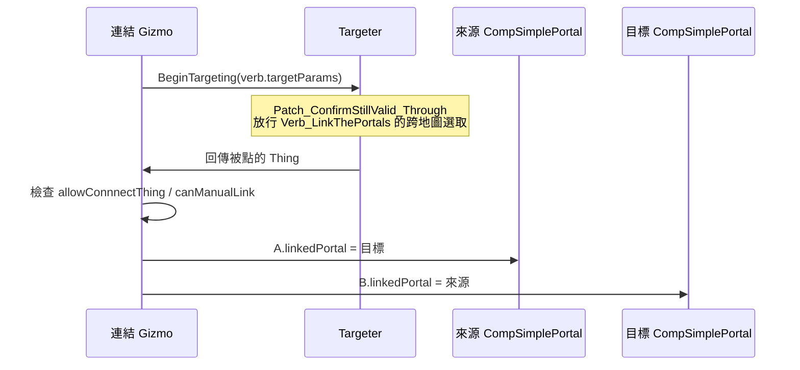
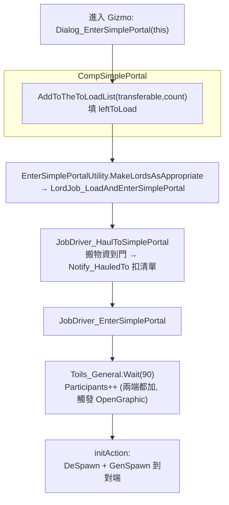

# 傳送門機制：配對與跨地圖傳送完整管線（01_portal_mechanism）

> 從「放置 → 連結 → pawn 進入 → 抵達對端」逐段拆解。含關鍵 class/method 行號與 PocketMap 使用方式、存檔處理。

## 0. 結論先講（回答四個重點問題）

1. **連結兩張地圖**：兩端都是**早已存在的真實 `Map`**（聚落、哨站、地圖物件、甚至載具所在地圖）。不是 PocketMap、不自建地圖。配對靠 `CompSimplePortal.linkedPortal`（`ThingWithComps` 引用，雙向）。
2. **pit gate-like interface**：靠**繼承原版 `MapPortal`**（深淵之門 PitGate 的共同基底）取得整套「ITab 內容清單 + Lord 集合載入 + 進入 toil」UI/流程，再用 Harmony 把原版那顆「進入會開 PocketMap」的按鈕換掉。
3. **PocketMap**：**幾乎不用**。唯一觸碰是 `ExposeData` 給父類別 `exit` 欄位塞一個 `PocketMapExit()` 佔位（`SimplePortal_Building.cs:352`），以及進入時特判「目的地不是 PocketMap 才卸貨」（`JobDriver_EnterSimplePortal.cs:99`）。傳送本身完全不經 PocketMap。
4. **存檔**：`linkedPortal` 以 `Scribe_References` 存（跨地圖引用安全）；建築自己的 `name` 以 `Scribe_Values`；載入/排程清單以 `Scribe_Collections` Deep + PostLoad 清除失效項。

## 1. 放置與類型

四種傳送門都是 `SimplePortal_Building`（`thingClass`，見 `ThingDef_Building.xml:11`），抽象父 `SimplePortal_PortalBase`（`:8`）統一掛：
- `verbs > Verb_LinkThePortals`（`:16-28`）——連結用的空殼 Verb，`range=50`、`canTargetBuildings=true`。
- `inspectorTabs > ITab_ContentsMapPortal`（`:29-31`）——**直接借用原版地圖傳送門的內容物 ITab**（pit gate-like 的一部分）。
- `<portal></portal>`（`:34`）——`MapPortal` 父類別要的 def 區塊（留空）。

| Def | 特色 | 限制 |
|---|---|---|
| `SimplePortal_Portal`（`:38`） | 標準款，吃電（Battery+Glower+Stunnable+Flickable），`syncTemperature` | 可微縮搬移 |
| `SimplePortal_PitGate`（`:196`，需 Anomaly） | 仿深淵之門外觀，吃 Bioferrite，`Impassable`，含 `CompFillInAble` | `replaceCount=1`、不可拆 |
| `SimplePortal_PitGateExit`（`:273`，需 Anomaly） | 仿洞穴出口，吃 Bioferrite | `replaceCount=1`（只能搬一次） |
| `SimplePortal_Obelisk`（`:357`，需 Anomaly） | 仿扭曲方尖碑，附冥想焦點(Void) | `Impassable` |

## 2. 配對（Linking）

### 手動連結（玩家操作）


- Gizmo 產生：`CompSimplePortal.CompGetGizmosExtra`（`CompSimplePortal.cs:428`），第 436-443 行產生 `CommandLinkThePortals`（需 `Props.canManualLink || Prefs.DevMode`）。
- 連結邏輯：`CommandLinkThePortals.ProcessInput`（`CommandLinkThePortals.cs:17-47`）。雙向賦值在 `:44-45`。
- 連結白名單：`Props.allowConnnectThing`（型別全名字串清單）在 `:33-39` 過濾。
- 跨地圖瞄準能成立，靠 `Patch_ConfirmStillValid_Through`（`Patch_ConfirmStillValid_Through.cs:10-13`）對 `Verb_LinkThePortals` 回傳放行。
- Verb 本體 `Verb_LinkThePortals` 故意不開火（`TryStartCastOn=>false`、`TryCastShot=>true`，`Verb_LinkThePortals.cs:8-19`），只是借原版瞄準框。

### Dev 連結（除錯用，跨存檔/座標）
`CompGetGizmosExtra` 內 `Prefs.DevMode` 區塊（`CompSimplePortal.cs:603-651`）：複製 `mapUniqueID:position` 字串，另一端貼上即配對——說明配對的本質就是「定位到某地圖某格的傳送門物件，互填引用」。

## 3. pawn 進入 → 跨地圖傳送（核心管線）



### 進入按鈕
`CompGetGizmosExtra`（`CompSimplePortal.cs:449-481`）：`gizmoEnter.action = () => Find.WindowStack.Add(new Dialog_EnterSimplePortal(this))`（`:450`），`Disabled = !IsEnterable(out reason)`（`:467`）。另有「請求對面把人送過來」`gizmoRequest`（`:499-530`）與「檢視對面地圖」`gizmoViewMap`（用 `CameraJumper.TryJumpAndSelect`，`:551`）。

### 可進入判斷（兩層）
- Comp 層 `CompSimplePortal.IsEnterable`（`CompSimplePortal.cs:143-158`）：`linkedPortal != null` 且 `GetOtherMap() != null`。
- 建築層 `SimplePortal_Building.IsEnterable`（`SimplePortal_Building.cs:205-265`）：再疊上能量（`needEnergy` 時要 Battery>0）、EMP 暈眩、燃料、開關（Flickable）、對端同樣條件。

### 群體載入（仿運輸艙/PitGate）
`MakeLordsAsAppropriate`（`EnterSimplePortalUtility.cs:327-377`）：把要走的 colonist 收進一個 `LordJob_LoadAndEnterSimplePortal`，由 `LordToil_LoadAndEnterSimplePortal` 指派 duty。搬運由 `WorkGiver_HaulToSimplePortal` → `JobDriver_HaulToSimplePortal` 完成，搬到後 `CompSimplePortal.Notify_HauledTo`（`CompSimplePortal.cs:197`）扣 `leftToLoad`。

### 真正傳送（最關鍵 ~30 行）
`JobDriver_EnterSimplePortal.MakeNewToils`（`JobDriver_EnterSimplePortal.cs:41-118`）：
1. FailOn：傳送門消失/不可進入/pawn 跟門不同地圖（`:43-45`）。
2. `Toils_Goto.GotoThing` 走到門（`:47`）。
3. `Wait(90)` 等待動畫，期間兩端 `Participants++`（觸發 `OpenGraphic` 開啟視覺）（`:49-67`）。
4. `toil2.initAction`（`:71-116`）＝傳送本體：
   - 取對端 `otherMap = portal.linkedPortal.MapHeld`、目的地格 `intVec = linkedPortal.PositionHeld`，不可站立時 `CellFinder.StandableCellNear`（`:75-80`）。
   - `pawn.DeSpawnOrDeselect(); GenSpawn.Spawn(pawn, intVec, otherMap, Rot4.Random);`（`:89-90`）← **跨地圖搬移的本質**。
   - 從兩端 `leftToLoad` 扣除（`:93-97`）。
   - **`if (!otherMap.IsPocketMap) pawn.inventory.UnloadEverything = true;`（`:99-101`）**——僅在目的地是真實地圖時自動卸庫存（直接證明常態目的地非 PocketMap）。
   - 還原 drafted 狀態、丟下搬運物、`Notify_PawnLost(ExitedMap)`（`:104-114`）。

物品（非 pawn）的抵達同樣靠搬運 pawn 進門時被 `OnEntered`/`SubtractFromToLoadList` 處理，並由 `JobDriver_HaulToSimplePortal` 在門口投放後傳送。

### 原版進入按鈕的抑制
因為 `SimplePortal_Building` 是 `MapPortal`，原版會掛一顆「進入地圖傳送門（開 PocketMap）」的選項——被 `Suppress_OriginalFloatMenu`（`Patch_FloatMenuMakerMap.cs:11-28`）對 `SimplePortal_Building` 回傳 null 抑制，並由 `Minified_FloatMenuProvider`（`:30`）補上自家選項。`SimplePortal_Building.GetGizmos`（`SimplePortal_Building.cs:300-342`）也手動濾掉 `icon == EnterTex` 的原版進入 gizmo（`:311`）與 `ActivityGizmo`（`:315`）。

## 4. 跨地圖橋接的附帶效果（建築層 Tick）

`SimplePortal_Building.TickInterval`（`SimplePortal_Building.cs:292-298`）每隔一段呼叫：
- `FlatteningEnergy()`（`:147-164`）：兩端 Battery 能量「拉平」，多的一端送一半過去。
- `FlatteningFuel()`（`:99-121`）：同燃料種類時拉平。
- 溫度同步在 Comp：`SyncTemperature`（`CompSimplePortal.cs:378-414`），依房間格數做 lerp，兩端房間趨近平均溫。需兩端 `Props.syncTemperature` 都為 true。

## 5. 存檔處理（save/load）

### Comp 端 `PostExposeData`（`CompSimplePortal.cs:667-681`）
| 欄位 | 方式 | 備註 |
|---|---|---|
| `linkedPortal`（對端引用） | `Scribe_References.Look<ThingWithComps>`（`:670`） | **跨地圖引用安全**：以 loadID 重新解析；對端在另一張地圖也能還原。`ILoadReferenceable`（class 宣告 `:37`）+ `GetUniqueLoadID`（`:708-711`）撐起這條引用 |
| `leftToLoad` | `Scribe_Collections` Deep（`:672`） | PostLoadInit 移除 `AnyThing==null`（`:673-674`） |
| `allowScheduleRequest` / `scheduleTime` | `Scribe_Values`（`:676-677`） | 定時排程狀態 |
| `requestToLoad` | `Scribe_Collections` Deep（`:678`） | 同上清失效 |

### 建築端 `ExposeData`（`SimplePortal_Building.cs:344-353`）
```csharp
this.exit = null;          // 存檔前清空父類別 PocketMapExit，避免序列化髒引用
base.ExposeData();
Scribe_Values.Look<string>(ref this.name, "Portal_Name");
this.exit = new PocketMapExit();   // 載入後補回佔位，滿足 MapPortal 父類別欄位需求
```
> 待驗證：`exit` 佔位是否在某些原版路徑被讀取。就傳送邏輯而言它不參與（進入走 `JobDriver_EnterSimplePortal`，目的地由 `GetOtherMap()` 決定），可視為「滿足父類別不 NRE 的填充」。

### 地圖不被回收
跨地圖傳送門最大的存檔/執行期風險＝某張地圖沒人時被 RimWorld 清掉導致對端引用懸空。`Patch_BlockingMapRemoval`（`Patch_BlockingMapRemoval.cs:14-32`）攔 `MapPawns.AnyPawnBlockingMapRemoval`：只要該地圖上存在「已連結且屬於玩家（或主機為玩家）」的傳送門，就回報 `true` 不准回收。
